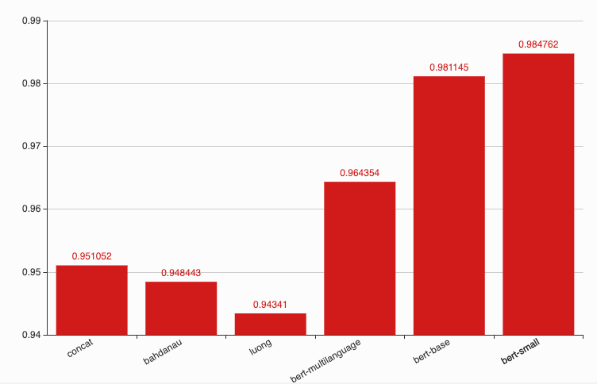
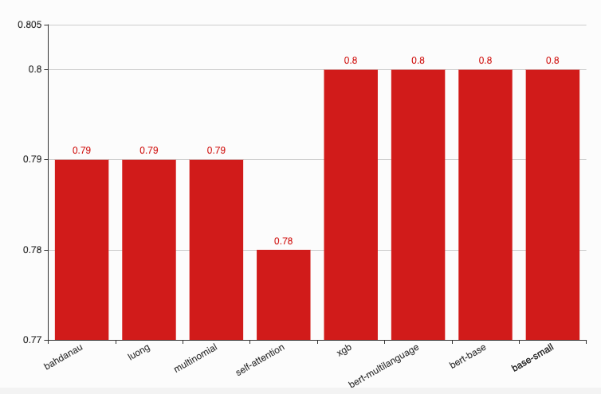
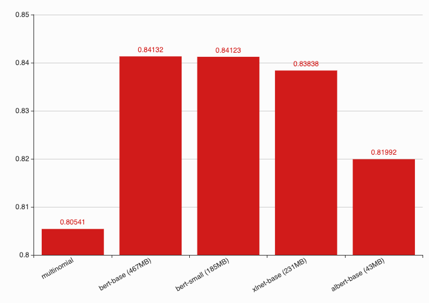
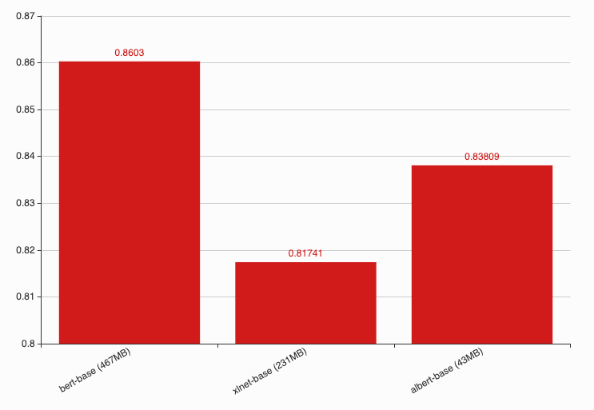

Dependency parsing
------------------

Trained on 80% of dataset, tested on 20% of dataset. Link to download
dataset available inside the notebooks. All training sessions stored in
`session/dependency <https://github.com/huseinzol05/Malaya/tree/master/session/dependency>`__

**Below chart is F1 accuracy for dependency tagging.**

.. code:: ipython3

    from IPython.core.display import Image, display
    
    display(Image('dependency-accuracy.png', width=500))

.. image:: models-accuracy_files/models-accuracy_1_0.png
   :width: 500px

bert-bahasa-base
^^^^^^^^^^^^^^^^

.. code:: text

   arc accuracy: 0.849296829484373
   types accuracy: 0.8413393854963266
   root accuracy: 0.9214722222222222

                  precision    recall  f1-score   support

             PAD    0.99998   1.00000   0.99999    925808
               X    0.99999   0.99987   0.99993    155449
             acl    0.95880   0.95327   0.95603      6078
           advcl    0.94197   0.92524   0.93353      2421
          advmod    0.96066   0.97033   0.96547      9538
            amod    0.95217   0.93538   0.94370      8279
           appos    0.95024   0.95816   0.95418      4923
             aux    1.00000   1.00000   1.00000         7
            case    0.98474   0.98719   0.98597     21707
              cc    0.98337   0.98033   0.98185      6456
           ccomp    0.95352   0.90681   0.92958       837
        compound    0.94585   0.95337   0.94959     13338
   compound:plur    0.96429   0.97878   0.97148      1131
            conj    0.96874   0.96504   0.96689      8639
             cop    0.97760   0.98582   0.98169      1904
           csubj    0.95122   0.84783   0.89655        46
      csubj:pass    0.93750   0.75000   0.83333        20
             dep    0.92559   0.90528   0.91532      1003
             det    0.97356   0.95704   0.96523      8194
           fixed    0.95936   0.92525   0.94200      1097
            flat    0.97521   0.97473   0.97497     20660
            iobj    0.92308   0.68571   0.78689        35
            mark    0.95677   0.95951   0.95814      2791
            nmod    0.95451   0.94421   0.94933      8156
           nsubj    0.96610   0.96329   0.96469     12750
      nsubj:pass    0.93547   0.96120   0.94816      4072
          nummod    0.97423   0.98608   0.98012      7975
             obj    0.96661   0.96129   0.96394     10540
             obl    0.96263   0.96778   0.96520     11420
       parataxis    0.91954   0.89510   0.90716       715
           punct    0.99653   0.99769   0.99711     33381
            root    0.97442   0.97955   0.97698     10073
           xcomp    0.92390   0.94021   0.93198      2492

        accuracy                        0.99491   1301935
       macro avg    0.96116   0.94247   0.95082   1301935
    weighted avg    0.99491   0.99491   0.99490   1301935

xlnet-bahasa-base
^^^^^^^^^^^^^^^^^

.. code:: text

   arc accuracy: 0.929225039681087
   types accuracy: 0.9236558875163555
   root accuracy: 0.9467261904761904

                  precision    recall  f1-score   support

             PAD    0.99999   1.00000   1.00000    678576
               X    0.99999   0.99998   0.99999    168979
             acl    0.97833   0.96736   0.97281      6066
           advcl    0.96546   0.95408   0.95974      2461
          advmod    0.98121   0.97411   0.97765      9542
            amod    0.95723   0.96440   0.96080      8146
           appos    0.97907   0.98380   0.98143      4754
             aux    1.00000   1.00000   1.00000         8
            case    0.99254   0.98906   0.99080     21390
              cc    0.98717   0.99115   0.98916      6442
           ccomp    0.94539   0.92738   0.93630       840
        compound    0.96723   0.97201   0.96962     13362
   compound:plur    0.98157   0.99351   0.98751      1233
            conj    0.98292   0.98832   0.98561      8735
             cop    0.97863   0.99565   0.98707      1840
           csubj    1.00000   0.93182   0.96471        44
      csubj:pass    0.94737   0.90000   0.92308        20
             dep    0.95876   0.96875   0.96373       960
             det    0.98030   0.96707   0.97364      8077
           fixed    0.98174   0.94797   0.96456      1134
            flat    0.98401   0.98920   0.98660     20096
            iobj    1.00000   0.84848   0.91803        33
            mark    0.96202   0.98326   0.97253      2808
            nmod    0.96866   0.97038   0.96952      7867
           nsubj    0.98233   0.97675   0.97953     12689
      nsubj:pass    0.95407   0.97905   0.96640      4010
          nummod    0.98587   0.99263   0.98923      7730
             obj    0.98107   0.97622   0.97864     10512
             obl    0.98344   0.97984   0.98164     11456
       parataxis    0.94509   0.96035   0.95266       681
           punct    0.99964   0.99949   0.99956     33118
            root    0.98685   0.98312   0.98498     10073
           xcomp    0.96063   0.95602   0.95832      2501

        accuracy                        0.99636   1066183
       macro avg    0.97753   0.97004   0.97351   1066183
    weighted avg    0.99637   0.99636   0.99636   1066183

albert-bahasa-base
^^^^^^^^^^^^^^^^^^

.. code:: text

   arc accuracy: 0.7974828611806026
   types accuracy: 0.784127773549449
   root accuracy: 0.8793373015873015

                  precision    recall  f1-score   support

             PAD    0.99994   1.00000   0.99997   1038963
               X    0.99994   0.99980   0.99987    196107
             acl    0.89394   0.91141   0.90259      6039
           advcl    0.86349   0.80405   0.83271      2368
          advmod    0.94060   0.91095   0.92554      9422
            amod    0.86990   0.89181   0.88072      8217
           appos    0.90128   0.90034   0.90081      4766
             aux    0.88889   0.88889   0.88889         9
            case    0.95841   0.97824   0.96822     21274
              cc    0.96729   0.95993   0.96359      6438
           ccomp    0.81659   0.80809   0.81232       865
        compound    0.90899   0.90737   0.90818     13473
   compound:plur    0.92714   0.95513   0.94093      1159
            conj    0.94037   0.92424   0.93223      8566
             cop    0.94305   0.95779   0.95036      1919
           csubj    0.86667   0.68421   0.76471        38
      csubj:pass    0.71429   0.71429   0.71429        14
             dep    0.85821   0.78004   0.81726      1032
             det    0.93597   0.90688   0.92120      8108
           fixed    0.91759   0.81228   0.86173      1124
            flat    0.95904   0.94476   0.95184     20744
            iobj    1.00000   0.53191   0.69444        47
            mark    0.91366   0.89960   0.90657      2729
            nmod    0.89832   0.88939   0.89383      8046
           nsubj    0.91077   0.93174   0.92114     12730
      nsubj:pass    0.89668   0.88184   0.88920      3986
          nummod    0.95178   0.95529   0.95353      7851
             obj    0.91365   0.92349   0.91854     10495
             obl    0.91312   0.93081   0.92188     11201
       parataxis    0.74352   0.75589   0.74966       721
           punct    0.99166   0.99655   0.99410     33040
            root    0.93833   0.94262   0.94047     10073
           xcomp    0.86927   0.85462   0.86189      2552

        accuracy                        0.99023   1454116
       macro avg    0.90946   0.88286   0.89343   1454116
    weighted avg    0.99022   0.99023   0.99021   1454116

Emotion Analysis
----------------

Trained on 80% of dataset, tested on 20% of dataset. All training
sessions stored in
`session/emotion <https://github.com/huseinzol05/Malaya/tree/master/session/emotion>`__

**Graph based on F1-score.**

.. code:: ipython3

    from IPython.core.display import Image, display
    
    display(Image('emotion-accuracy.png', width=500))

.. image:: models-accuracy_files/models-accuracy_6_0.png
   :width: 500px

multinomial
^^^^^^^^^^^

.. code:: text

                 precision    recall  f1-score   support

          anger    0.87563   0.88483   0.88021     14092
           fear    0.75967   0.86772   0.81011      7628
            joy    0.83213   0.87847   0.85467     13610
           love    0.87938   0.87004   0.87469     14882
        sadness    0.72419   0.65285   0.68667     19208
       surprise    0.50147   0.50461   0.50303      9445

       accuracy                        0.77725     78865
      macro avg    0.76208   0.77642   0.76823     78865
   weighted avg    0.77592   0.77725   0.77567     78865

bert-bahasa-base
^^^^^^^^^^^^^^^^

.. code:: text

                 precision    recall  f1-score   support

          anger    0.92970   0.92983   0.92976     14094
           fear    0.91783   0.84544   0.88015      7518
          happy    0.91390   0.94365   0.92854     13914
           love    0.94439   0.94087   0.94263     14765
        sadness    0.92728   0.68775   0.78975     18985
       surprise    0.62770   0.96131   0.75948      9590

       accuracy                        0.87185     78866
      macro avg    0.87680   0.88481   0.87172     78866
   weighted avg    0.89123   0.87185   0.87282     78866

bert-bahasa-small
^^^^^^^^^^^^^^^^^

.. code:: text

                 precision    recall  f1-score   support

          anger    0.92893   0.92926   0.92909     14065
           fear    0.82324   0.93199   0.87425      7616
          happy    0.92466   0.91592   0.92027     13641
           love    0.93434   0.94386   0.93907     14926
        sadness    0.77547   0.88596   0.82704     19187
       surprise    0.81459   0.48913   0.61124      9431

       accuracy                        0.86681     78866
      macro avg    0.86687   0.84935   0.85016     78866
   weighted avg    0.86800   0.86681   0.86132     78866

xlnet-bahasa-base
^^^^^^^^^^^^^^^^^

.. code:: text

                 precision    recall  f1-score   support

          anger    0.91827   0.94797   0.93288     14164
           fear    0.86772   0.88987   0.87865      7482
          happy    0.91894   0.93049   0.92468     13768
           love    0.92884   0.94967   0.93914     14940
        sadness    0.96163   0.66883   0.78893     18996
       surprise    0.63289   0.94063   0.75667      9516

       accuracy                        0.87161     78866
      macro avg    0.87138   0.88791   0.87016     78866
   weighted avg    0.89160   0.87161   0.87156     78866

albert-bahasa-base
^^^^^^^^^^^^^^^^^^

.. code:: text

                 precision    recall  f1-score   support

          anger    0.90896   0.93591   0.92224     14370
           fear    0.86102   0.86502   0.86301      7527
          happy    0.92940   0.90445   0.91675     13710
           love    0.94295   0.92313   0.93294     14701
        sadness    0.85928   0.72104   0.78412     19114
       surprise    0.63000   0.84953   0.72348      9444

       accuracy                        0.85887     78866
      macro avg    0.85527   0.86651   0.85709     78866
   weighted avg    0.86883   0.85887   0.86035     78866

Entities Recognition
--------------------

Trained on 80% of dataset, tested on 20% of dataset. Link to download
dataset available inside the notebooks. All training sessions stored in
`session/entities <https://github.com/huseinzol05/Malaya/tree/master/session/entities>`__

**Graph based on F1-score.**

.. code:: ipython3

    from IPython.core.display import Image, display
    
    display(Image('ner-accuracy.png', width=500))

bert-bahasa-base
^^^^^^^^^^^^^^^^

.. code:: text

                 precision    recall  f1-score   support

          OTHER    0.95875   0.99758   0.97778   5160854
            PAD    0.99819   1.00000   0.99910    817609
              X    0.99980   0.99981   0.99980   2744716
          event    0.00000   0.00000   0.00000    143787
            law    0.99814   0.87596   0.93307    146950
       location    0.84847   0.96940   0.90491    428869
   organization    0.99131   0.74086   0.84798    694150
         person    0.85493   0.96896   0.90838    507960
       quantity    0.99338   0.97925   0.98626     88200
           time    0.98514   0.97960   0.98236    179880

       accuracy                        0.96433  10912975
      macro avg    0.86281   0.85114   0.85396  10912975
   weighted avg    0.95354   0.96433   0.95722  10912975

bert-bahasa-small
^^^^^^^^^^^^^^^^^

.. code:: text

                 precision    recall  f1-score   support

          OTHER    0.96120   0.99734   0.97893   5160854
            PAD    0.99819   1.00000   0.99910    817609
              X    0.99989   0.99981   0.99985   2744716
          event    1.00000   0.00285   0.00569    143787
            law    0.99630   0.91865   0.95590    146950
       location    0.88747   0.96854   0.92623    428869
   organization    0.99103   0.79324   0.88118    694150
         person    0.86779   0.97160   0.91677    507960
       quantity    0.98761   0.99141   0.98950     88200
           time    0.99219   0.97997   0.98604    179880

       accuracy                        0.96835  10912975
      macro avg    0.96817   0.86234   0.86392  10912975
   weighted avg    0.97006   0.96835   0.96159  10912975

xlnet-bahasa-base
^^^^^^^^^^^^^^^^^

.. code:: text

                 precision    recall  f1-score   support

          OTHER    0.97309   0.99732   0.98506   5160854
            PAD    0.99957   1.00000   0.99978   1394994
              X    1.00000   0.99992   0.99996   3003425
          event    1.00000   0.05114   0.09730    143787
            law    0.99859   0.95089   0.97416    146950
       location    0.91452   0.99333   0.95230    428869
   organization    0.99014   0.91186   0.94939    694150
         person    0.92191   0.98265   0.95131    507960
       quantity    0.98374   0.99266   0.98818     88200
           time    0.99380   0.98426   0.98901    179880

       accuracy                        0.98008  11749069
      macro avg    0.97754   0.88640   0.88865  11749069
   weighted avg    0.98082   0.98008   0.97494  11749069

albert-bahasa-base
^^^^^^^^^^^^^^^^^^

.. code:: text

                 precision    recall  f1-score   support

          OTHER    0.93555   0.99377   0.96378   5160854
            PAD    1.00000   1.00000   1.00000   1000356
              X    0.99997   1.00000   0.99998   4397539
          event    0.99247   0.02751   0.05354    143787
            law    0.99062   0.72384   0.83648    146950
       location    0.74938   0.96113   0.84215    428869
   organization    0.98696   0.54544   0.70259    694150
         person    0.83895   0.93301   0.88348    507960
       quantity    0.98635   0.96909   0.97764     88200
           time    0.96563   0.92264   0.94364    179880

       accuracy                        0.95329  12748545
      macro avg    0.94459   0.80764   0.82033  12748545
   weighted avg    0.95757   0.95329   0.94568  12748545

Language Detection
------------------

Trained on 80% of dataset, tested on 20% of dataset. All training
sessions stored in
`session/language-detection <https://github.com/huseinzol05/Malaya/tree/master/session/language-detection>`__

**Graph based on F1-score.**

.. code:: ipython3

    display(Image('language-detection-accuracy.png', width=500))

.. image:: models-accuracy_files/models-accuracy_19_0.png
   :width: 500px

fast-text
^^^^^^^^^

.. code:: text

                 precision    recall  f1-score   support

            eng    0.97885   0.90067   0.93814    110129
            ind    0.99524   0.97450   0.98476    354327
          malay    0.95929   0.99686   0.97771   1405848
       manglish    0.99082   0.92965   0.95926    182420
          other    0.96867   0.71465   0.82249     78259
          rojak    0.97184   0.92336   0.94698    142231

       accuracy                        0.96901   2273214
      macro avg    0.97745   0.90662   0.93822   2273214
   weighted avg    0.96948   0.96901   0.96815   2273214

Deep learning
^^^^^^^^^^^^^

.. code:: text

                 precision    recall  f1-score   support

            eng    0.97730   0.98195   0.97962    110129
            ind    0.97384   0.95950   0.96662    354327
          malay    0.97534   0.98862   0.98194   1405848
       manglish    0.98968   0.98971   0.98969    182420
          other    0.98128   0.97775   0.97951     78259
          rojak    0.95718   0.86179   0.90698    142231

       accuracy                        0.97554   2273214
      macro avg    0.97577   0.95989   0.96739   2273214
   weighted avg    0.97542   0.97554   0.97529   2273214

POS Recognition
---------------

Trained on 80% of dataset, tested on 20% of dataset. Link to download
dataset available inside the notebooks. All training sessions stored in
`session/pos <https://github.com/huseinzol05/Malaya/tree/master/session/pos>`__

**Graph based on F1-score.**

.. code:: ipython3

    display(Image('pos-accuracy.png', width=500))

bert-bahasa-base
^^^^^^^^^^^^^^^^

.. code:: text

                 precision    recall  f1-score   support

            ADJ    0.86210   0.71916   0.78417     45666
            ADP    0.96119   0.95565   0.95841    119589
            ADV    0.86670   0.80498   0.83470     47760
            AUX    0.99048   0.99830   0.99437     10000
          CCONJ    0.96073   0.92806   0.94411     37171
            DET    0.94468   0.91233   0.92822     38839
           NOUN    0.89341   0.90842   0.90085    268329
            NUM    0.93258   0.91267   0.92252     41211
            PAD    0.98801   1.00000   0.99397    150331
           PART    0.83045   0.94309   0.88319      5500
           PRON    0.96061   0.94223   0.95133     48835
          PROPN    0.91972   0.92962   0.92464    227608
          PUNCT    0.99724   0.99863   0.99793    182824
          SCONJ    0.66382   0.87314   0.75423     15150
            SYM    0.98408   0.92722   0.95481      3600
           VERB    0.93339   0.95044   0.94184    124518
              X    0.99984   0.99857   0.99920    501714

       accuracy                        0.95174   1868645
      macro avg    0.92288   0.92368   0.92168   1868645
   weighted avg    0.95218   0.95174   0.95161   1868645

bert-bahasa-small
^^^^^^^^^^^^^^^^^

.. code:: text

                 precision    recall  f1-score   support

            ADJ    0.78068   0.77441   0.77753     45666
            ADP    0.96979   0.94450   0.95698    119589
            ADV    0.84482   0.80980   0.82694     47760
            AUX    0.99442   0.99830   0.99636     10000
          CCONJ    0.95610   0.93046   0.94310     37171
            DET    0.91002   0.94263   0.92604     38839
           NOUN    0.89615   0.89397   0.89506    268329
            NUM    0.93547   0.90692   0.92097     41211
            PAD    0.98801   1.00000   0.99397    150331
           PART    0.88135   0.93327   0.90657      5500
           PRON    0.96430   0.93761   0.95077     48835
          PROPN    0.90880   0.94060   0.92443    227608
          PUNCT    0.99784   0.99834   0.99809    182824
          SCONJ    0.68205   0.87617   0.76702     15150
            SYM    0.96822   0.91389   0.94027      3600
           VERB    0.96111   0.91939   0.93979    124518
              X    0.99979   0.99856   0.99918    501714

       accuracy                        0.95006   1868645
      macro avg    0.91994   0.92464   0.92136   1868645
   weighted avg    0.95078   0.95006   0.95021   1868645

xlnet-bahasa-base
^^^^^^^^^^^^^^^^^

.. code:: text

                 precision    recall  f1-score   support

            ADJ    0.85134   0.76284   0.80467     45666
            ADP    0.96919   0.95234   0.96069    119589
            ADV    0.84419   0.83520   0.83967     47760
            AUX    0.99502   0.99930   0.99716     10000
          CCONJ    0.95966   0.92860   0.94387     37171
            DET    0.94171   0.93254   0.93710     38839
           NOUN    0.90569   0.90462   0.90516    268329
            NUM    0.94990   0.91369   0.93144     41211
            PAD    0.99741   1.00000   0.99871    154308
           PART    0.90704   0.93491   0.92076      5500
           PRON    0.97384   0.93777   0.95547     48835
          PROPN    0.90716   0.95069   0.92841    227608
          PUNCT    0.99810   0.99918   0.99864    182824
          SCONJ    0.66913   0.87393   0.75794     15150
            SYM    0.99347   0.92944   0.96039      3600
           VERB    0.95918   0.93351   0.94617    124518
              X    0.99990   0.99955   0.99972    536393

       accuracy                        0.95581   1907301
      macro avg    0.93070   0.92871   0.92859   1907301
   weighted avg    0.95652   0.95581   0.95589   1907301

albert-base-bahasa
^^^^^^^^^^^^^^^^^^

.. code:: text

                 precision    recall  f1-score   support

            ADJ    0.81972   0.73361   0.77428     45666
            ADP    0.97440   0.94106   0.95744    119589
            ADV    0.84503   0.80928   0.82677     47760
            AUX    0.99502   0.99830   0.99666     10000
          CCONJ    0.96896   0.92475   0.94634     37171
            DET    0.92684   0.94261   0.93466     38839
           NOUN    0.89857   0.88888   0.89370    268329
            NUM    0.94593   0.89027   0.91726     41211
            PAD    0.98892   1.00000   0.99443    162922
           PART    0.83716   0.92909   0.88073      5500
           PRON    0.96200   0.94148   0.95163     48835
          PROPN    0.89059   0.95483   0.92159    227608
          PUNCT    0.99693   0.99889   0.99791    182824
          SCONJ    0.65652   0.91670   0.76509     15150
            SYM    0.98240   0.88361   0.93039      3600
           VERB    0.95949   0.91441   0.93641    124518
              X    0.99984   0.99867   0.99925    624816

       accuracy                        0.95280   2004338
      macro avg    0.92049   0.92156   0.91909   2004338
   weighted avg    0.95379   0.95280   0.95284   2004338

Relevancy
---------

Trained on 80% of dataset, tested on 20% of dataset. All training
sessions stored in
`session/relevancy <https://github.com/huseinzol05/Malaya/tree/master/session/relevancy>`__

**Graph based on F1-score.**

.. code:: ipython3

    display(Image('relevancy-accuracy.png', width=500))

.. image:: models-accuracy_files/models-accuracy_29_0.png
   :width: 500px

bert-bahasa-base
^^^^^^^^^^^^^^^^

.. code:: text

                 precision    recall  f1-score   support

   not relevant    0.86398   0.83633   0.84993      3000
       relevant    0.91074   0.92692   0.91876      5405

       accuracy                        0.89459      8405
      macro avg    0.88736   0.88163   0.88435      8405
   weighted avg    0.89405   0.89459   0.89419      8405

xlnet-bahasa-base
^^^^^^^^^^^^^^^^^

.. code:: text

                 precision    recall  f1-score   support

   not relevant    0.89978   0.81400   0.85474      3000
       relevant    0.90195   0.94968   0.92520      5405

       accuracy                        0.90125      8405
      macro avg    0.90086   0.88184   0.88997      8405
   weighted avg    0.90118   0.90125   0.90005      8405

albert-bahasa-base
^^^^^^^^^^^^^^^^^^

.. code:: text

                 precision    recall  f1-score   support

   not relevant    0.88735   0.81400   0.84910      3000
       relevant    0.90129   0.94265   0.92150      5405

       accuracy                        0.89673      8405
      macro avg    0.89432   0.87832   0.88530      8405
   weighted avg    0.89632   0.89673   0.89566      8405

Sentiment Analysis
------------------

Trained on 80% of dataset, tested on 20% of dataset. All training
sessions stored in
`session/sentiment <https://github.com/huseinzol05/Malaya/tree/master/session/sentiment>`__

**Graph based on F1-score.**

.. code:: ipython3

    display(Image('sentiment-accuracy.png', width=500))

multinomial
^^^^^^^^^^^

.. code:: text

                 precision    recall  f1-score   support

       negative    0.80689   0.82413   0.81542     80911
       positive    0.80372   0.78500   0.79425     74228

       accuracy                        0.80541    155139
      macro avg    0.80530   0.80456   0.80483    155139
   weighted avg    0.80537   0.80541   0.80529    155139

bert-bahasa-base
^^^^^^^^^^^^^^^^

.. code:: text

                 precision    recall  f1-score   support

       negative    0.82923   0.87643   0.85218     80965
       positive    0.85618   0.80299   0.82873     74174

       accuracy                        0.84132    155139
      macro avg    0.84271   0.83971   0.84046    155139
   weighted avg    0.84212   0.84132   0.84097    155139

bert-bahasa-small
^^^^^^^^^^^^^^^^^

.. code:: text

                 precision    recall  f1-score   support

       negative    0.86186   0.82708   0.84411     80632
       positive    0.82069   0.85654   0.83823     74507

       accuracy                        0.84123    155139
      macro avg    0.84128   0.84181   0.84117    155139
   weighted avg    0.84209   0.84123   0.84129    155139

xlnet-bahasa-base
^^^^^^^^^^^^^^^^^

.. code:: text

                 precision    recall  f1-score   support

       negative    0.80365   0.91349   0.85506     80959
       positive    0.88903   0.75642   0.81738     74180

       accuracy                        0.83838    155139
      macro avg    0.84634   0.83495   0.83622    155139
   weighted avg    0.84447   0.83838   0.83704    155139

albert-bahasa-base
^^^^^^^^^^^^^^^^^^

.. code:: text

                 precision    recall  f1-score   support

       negative    0.84067   0.80939   0.82473     81213
       positive    0.79883   0.83148   0.81483     73926

       accuracy                        0.81992    155139
      macro avg    0.81975   0.82044   0.81978    155139
   weighted avg    0.82073   0.81992   0.82001    155139

Similarity
----------

Trained on 80% of dataset, tested on 20% of dataset. All training
sessions stored in
`session/similarity <https://github.com/huseinzol05/Malaya/tree/master/session/similarity>`__

**Graph based on F1-score.**

.. code:: ipython3

    display(Image('similarity-accuracy.png', width=500))

bert-bahasa-base
^^^^^^^^^^^^^^^^

.. code:: text

                 precision    recall  f1-score   support

    not similar    0.89808   0.87787   0.88786     50881
        similar    0.79975   0.83039   0.81478     29886

       accuracy                        0.86030     80767
      macro avg    0.84892   0.85413   0.85132     80767
   weighted avg    0.86170   0.86030   0.86082     80767

xlnet-bahasa-base
^^^^^^^^^^^^^^^^^

.. code:: text

                 precision    recall  f1-score   support

    not similar    0.80774   0.93228   0.86556     50919
        similar    0.84325   0.62145   0.71556     29848

       accuracy                        0.81741     80767
      macro avg    0.82550   0.77687   0.79056     80767
   weighted avg    0.82086   0.81741   0.81012     80767

albert-bahasa-base
^^^^^^^^^^^^^^^^^^

.. code:: text

                 precision    recall  f1-score   support

    not similar    0.88273   0.85781   0.87009     51052
        similar    0.76701   0.80421   0.78517     29715

       accuracy                        0.83809     80767
      macro avg    0.82487   0.83101   0.82763     80767
   weighted avg    0.84015   0.83809   0.83885     80767

Subjectivity Analysis
---------------------

Trained on 80% of dataset, tested on 20% of dataset. All training
sessions stored in
`session/subjectivity <https://github.com/huseinzol05/Malaya/tree/master/session/subjectivity>`__

**Graph based on F1-score.**

.. code:: ipython3

    display(Image('subjectivity-accuracy.png', width=500))

.. image:: models-accuracy_files/models-accuracy_46_0.png
   :width: 500px

multinomial
^^^^^^^^^^^

.. code:: text

                 precision    recall  f1-score   support

       negative       0.91      0.85      0.88       999
       positive       0.86      0.92      0.89       994

      micro avg       0.89      0.89      0.89      1993
      macro avg       0.89      0.89      0.89      1993
   weighted avg       0.89      0.89      0.89      1993

bert-bahasa-base
^^^^^^^^^^^^^^^^

.. code:: text

                 precision    recall  f1-score   support

       negative    0.91856   0.90733   0.91291       982
       positive    0.91105   0.92186   0.91642      1011

       accuracy                        0.91470      1993
      macro avg    0.91480   0.91460   0.91467      1993
   weighted avg    0.91475   0.91470   0.91469      1993

bert-bahasa-small
^^^^^^^^^^^^^^^^^

.. code:: text

                 precision    recall  f1-score   support

       negative    0.89731   0.92402   0.91047       974
       positive    0.92525   0.89892   0.91190      1019

       accuracy                        0.91119      1993
      macro avg    0.91128   0.91147   0.91118      1993
   weighted avg    0.91160   0.91119   0.91120      1993

xlnet-bahasa-base
^^^^^^^^^^^^^^^^^

.. code:: text

                 precision    recall  f1-score   support

       negative    0.89741   0.91317   0.90522      1025
       positive    0.90632   0.88946   0.89781       968

       accuracy                        0.90166      1993
      macro avg    0.90186   0.90132   0.90152      1993
   weighted avg    0.90174   0.90166   0.90162      1993

albert-bahasa-base
^^^^^^^^^^^^^^^^^^

.. code:: text

                 precision    recall  f1-score   support

       negative    0.89970   0.89432   0.89700      1003
       positive    0.89357   0.89899   0.89627       990

       accuracy                        0.89664      1993
      macro avg    0.89664   0.89665   0.89664      1993
   weighted avg    0.89666   0.89664   0.89664      1993

Toxicity Analysis
-----------------

Trained on 80% of dataset, tested on 20% of dataset. All training
sessions stored in
`session/toxic <https://github.com/huseinzol05/Malaya/tree/master/session/toxic>`__

**Graph based on F1-score.**

.. code:: ipython3

    display(Image('toxic-accuracy.png', width=500))

.. image:: models-accuracy_files/models-accuracy_53_0.png
   :width: 500px

multinomial
^^^^^^^^^^^

.. code:: text

                  precision    recall  f1-score   support

           toxic    0.83711   0.33008   0.47347      3690
    severe_toxic    0.35664   0.13636   0.19729       374
         obscene    0.79276   0.31265   0.44845      2031
          threat    0.16667   0.05172   0.07895       116
          insult    0.70725   0.26941   0.39019      1919
   identity_hate    0.28571   0.06077   0.10023       362

       micro avg    0.75516   0.28839   0.41738      8492
       macro avg    0.52436   0.19350   0.28143      8492
    weighted avg    0.74334   0.28839   0.41520      8492
     samples avg    0.02951   0.02374   0.02466      8492
     

bert-bahasa-base
^^^^^^^^^^^^^^^^

.. code:: text

                  precision    recall  f1-score   support

           toxic    0.77604   0.73972   0.75745      3696
    severe_toxic    0.46594   0.44531   0.45539       384
         obscene    0.70845   0.75122   0.72921      2054
          threat    0.52525   0.50000   0.51232       104
          insult    0.72469   0.64050   0.68000      1911
   identity_hate    0.56610   0.51385   0.53871       325

       micro avg    0.72273   0.69519   0.70869      8474
       macro avg    0.62775   0.59843   0.61218      8474
    weighted avg    0.72290   0.69519   0.70805      8474
     samples avg    0.06576   0.06529   0.06289      8474
     

bert-bahasa-small
^^^^^^^^^^^^^^^^^

.. code:: text

                  precision    recall  f1-score   support

           toxic    0.76917   0.77332   0.77124      3710
    severe_toxic    0.56126   0.36410   0.44168       390
         obscene    0.78999   0.70588   0.74557      2057
          threat    0.61842   0.41593   0.49735       113
          insult    0.71568   0.67955   0.69715      1941
   identity_hate    0.66368   0.43402   0.52482       341

       micro avg    0.75060   0.69890   0.72383      8552
       macro avg    0.68637   0.56213   0.61297      8552
    weighted avg    0.74636   0.69890   0.71977      8552
     samples avg    0.06782   0.06616   0.06420      8552
     

xlnet-bahasa-base
^^^^^^^^^^^^^^^^^

.. code:: text

                  precision    recall  f1-score   support

           toxic    0.77923   0.76371   0.77139      3665
    severe_toxic    0.37925   0.55497   0.45058       382
         obscene    0.77055   0.76058   0.76553      2009
          threat    0.59036   0.40496   0.48039       121
          insult    0.68254   0.72612   0.70366      1895
   identity_hate    0.52620   0.62432   0.57108       370

       micro avg    0.71437   0.73383   0.72397      8442
       macro avg    0.62135   0.63911   0.62377      8442
    weighted avg    0.72356   0.73383   0.72733      8442
     samples avg    0.06329   0.06815   0.06304      8442
     

albert-bahasa-base
^^^^^^^^^^^^^^^^^^

.. code:: text

                  precision    recall  f1-score   support

           toxic    0.70172   0.75169   0.72585      3693
    severe_toxic    0.46209   0.33420   0.38788       383
         obscene    0.76764   0.74951   0.75847      2032
          threat    0.49296   0.34314   0.40462       102
          insult    0.67535   0.67606   0.67570      1880
   identity_hate    0.67879   0.33333   0.44711       336

       micro avg    0.70126   0.69369   0.69745      8426
       macro avg    0.62976   0.53132   0.56660      8426
    weighted avg    0.69740   0.69369   0.69216      8426
     samples avg    0.06495   0.06556   0.06256      8426
     

