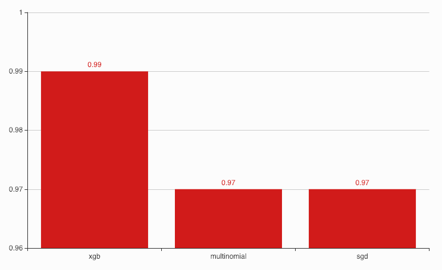
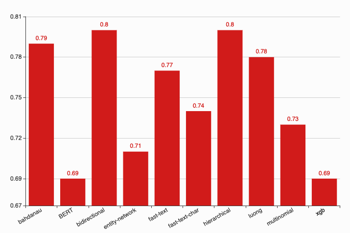
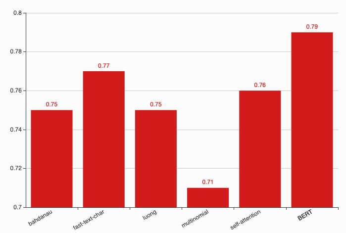

Entities Recognition
--------------------

Trained on 80% of dataset, tested on 20% of dataset. All training
sessions stored in
`session/entities <https://github.com/huseinzol05/Malaya/tree/master/session/entities>`__

.. code:: ipython3

    from IPython.core.display import Image, display
    
    display(Image('ner-accuracy.png', width=500))

.. image:: models-accuracy_files/models-accuracy_1_0.png
   :width: 500px

Concat
^^^^^^

.. code:: text

                 precision    recall  f1-score   support

          OTHER       1.00      1.00      1.00    498279
          event       0.98      0.99      0.99      2217
            law       0.99      0.99      0.99      1610
       location       0.99      1.00      1.00     20194
   organization       0.99      0.99      0.99     26093
         person       1.00      0.99      1.00     43377
       quantity       1.00      1.00      1.00     13180
           time       0.99      1.00      0.99     12750

    avg / total       1.00      1.00      1.00    617700

Bahdanau
^^^^^^^^

.. code:: text

                 precision    recall  f1-score   support

          OTHER       1.00      1.00      1.00    498587
          event       0.98      0.99      0.98      2212
            law       1.00      0.99      0.99      1746
       location       0.99      1.00      1.00     20387
   organization       0.99      1.00      1.00     25376
         person       1.00      1.00      1.00     43158
       quantity       1.00      1.00      1.00     13581
           time       0.99      1.00      0.99     12653

    avg / total       1.00      1.00      1.00    617700

Luong
^^^^^

.. code:: text

                 precision    recall  f1-score   support

          OTHER       1.00      1.00      1.00    497138
          event       0.99      0.99      0.99      2331
            law       0.99      0.99      0.99      1872
       location       0.99      1.00      1.00     20671
   organization       0.99      1.00      0.99     25942
         person       0.99      1.00      1.00     43511
       quantity       1.00      1.00      1.00     13376
           time       1.00      1.00      1.00     12859

    avg / total       1.00      1.00      1.00    617700

Entity-Network
^^^^^^^^^^^^^^

.. code:: text

                 precision    recall  f1-score   support

          OTHER       1.00      1.00      1.00    497198
          event       0.98      0.95      0.96      2381
            law       0.99      0.97      0.98      1881
       location       0.99      0.99      0.99     20305
   organization       0.99      0.98      0.98     26036
         person       0.99      0.99      0.99     43470
       quantity       0.99      0.99      0.99     13608
           time       0.98      0.99      0.98     12821

    avg / total       1.00      1.00      1.00    617700

CRF
^^^

.. code:: text

                 precision    recall  f1-score   support

       quantity      0.991     0.991     0.991     13891
       location      0.987     0.989     0.988     20798
           time      0.987     0.977     0.982     13264
         person      0.993     0.987     0.990     43590
   organization      0.974     0.973     0.973     25426
          event      0.995     0.983     0.989      2417
            law      0.994     0.988     0.991      1686

    avg / total      0.987     0.983     0.985    121072

Attention
^^^^^^^^^

.. code:: text

                 precision    recall  f1-score   support

          OTHER       1.00      1.00      1.00    497073
          event       0.99      0.97      0.98      2426
            law       1.00      0.99      0.99      1806
       location       1.00      1.00      1.00     20176
   organization       1.00      1.00      1.00     26044
         person       1.00      1.00      1.00     44346
       quantity       1.00      1.00      1.00     13155
           time       0.99      1.00      1.00     12674

    avg / total       1.00      1.00      1.00    617700

Language Detection
------------------

Trained on 80% of dataset, tested on 20% of dataset. All training
sessions stored in
`session/language-detection <https://github.com/huseinzol05/Malaya/tree/master/session/language-detection>`__

.. code:: ipython3

    display(Image('language-detection-accuracy.png', width=500))

XGB
^^^

.. code:: text

                 precision    recall  f1-score   support

          OTHER       0.98      0.99      0.99      9424
            eng       1.00      0.99      0.99      9972
            ind       1.00      0.99      0.99     11511
            zlm       1.00      1.00      1.00     10679

      micro avg       0.99      0.99      0.99     41586
      macro avg       0.99      0.99      0.99     41586
   weighted avg       0.99      0.99      0.99     41586

Multinomial
^^^^^^^^^^^

.. code:: text

                 precision    recall  f1-score   support

          OTHER       1.00      0.97      0.99      9424
            eng       0.99      1.00      0.99      9972
            ind       1.00      1.00      1.00     11511
            zlm       0.99      1.00      0.99     10679

      micro avg       0.99      0.99      0.99     41586
      macro avg       0.99      0.99      0.99     41586
   weighted avg       0.99      0.99      0.99     41586

SGD
^^^

.. code:: text

                 precision    recall  f1-score   support

          OTHER       0.97      0.99      0.98      9424
            eng       0.99      0.99      0.99      9972
            ind       1.00      0.99      0.99     11511
            zlm       1.00      1.00      1.00     10679

      micro avg       0.99      0.99      0.99     41586
      macro avg       0.99      0.99      0.99     41586
   weighted avg       0.99      0.99      0.99     41586

Deep learning
^^^^^^^^^^^^^

.. code:: text

                 precision    recall  f1-score   support

          other       1.00      0.99      0.99      9445
        english       1.00      1.00      1.00      9987
     indonesian       1.00      1.00      1.00     11518
          malay       1.00      1.00      1.00     10636

      micro avg       1.00      1.00      1.00     41586
      macro avg       1.00      1.00      1.00     41586
   weighted avg       1.00      1.00      1.00     41586

POS Recognition
---------------

Trained on 80% of dataset, tested on 20% of dataset. All training
sessions stored in
`session/pos <https://github.com/huseinzol05/Malaya/tree/master/session/pos>`__

.. code:: ipython3

    display(Image('pos-accuracy.png', width=500))

.. image:: models-accuracy_files/models-accuracy_15_0.png
   :width: 500px

Concat
^^^^^^

.. code:: text

                precision    recall  f1-score   support

           ADJ       0.99      1.00      1.00     22663
           ADP       1.00      1.00      1.00     60199
           ADV       1.00      1.00      1.00     23633
           AUX       1.00      1.00      1.00      5249
         CCONJ       1.00      1.00      1.00     18485
           DET       1.00      1.00      1.00     19849
          NOUN       1.00      1.00      1.00    135031
           NUM       1.00      1.00      1.00     21842
          PART       1.00      1.00      1.00      2900
          PRON       1.00      1.00      1.00     23908
         PROPN       1.00      1.00      1.00    113206
         SCONJ       1.00      0.99      1.00      7304
           SYM       1.00      1.00      1.00      1205
          VERB       1.00      1.00      1.00     61222
             X       0.97      0.99      0.98       154

   avg / total       1.00      1.00      1.00    516850

Bahdanau
^^^^^^^^

.. code:: text

                precision    recall  f1-score   support

           ADJ       0.99      0.99      0.99     22879
           ADP       1.00      1.00      1.00     60063
           ADV       1.00      0.99      1.00     23653
           AUX       1.00      1.00      1.00      5295
         CCONJ       1.00      1.00      1.00     18395
           DET       1.00      1.00      1.00     20088
          NOUN       1.00      1.00      1.00    134736
           NUM       1.00      1.00      1.00     21938
          PART       0.99      1.00      0.99      3093
          PRON       1.00      1.00      1.00     24060
         PROPN       1.00      1.00      1.00    112859
         SCONJ       0.99      0.99      0.99      7445
           SYM       0.99      0.99      0.99      1219
          VERB       1.00      1.00      1.00     60937
             X       0.98      0.97      0.98       190

   avg / total       1.00      1.00      1.00    516850

Luong
^^^^^

.. code:: text

                precision    recall  f1-score   support

           ADJ       0.99      0.99      0.99     22649
           ADP       1.00      1.00      1.00     60088
           ADV       0.99      1.00      0.99     24031
           AUX       1.00      1.00      1.00      5279
         CCONJ       1.00      1.00      1.00     18469
           DET       1.00      1.00      1.00     20053
          NOUN       1.00      1.00      1.00    134614
           NUM       1.00      1.00      1.00     21703
          PART       1.00      0.99      0.99      2956
          PRON       1.00      1.00      1.00     23786
         PROPN       1.00      1.00      1.00    113689
         SCONJ       0.99      0.99      0.99      7315
           SYM       1.00      1.00      1.00      1189
          VERB       1.00      1.00      1.00     60827
             X       0.97      0.99      0.98       202

   avg / total       1.00      1.00      1.00    516850

CRF
^^^

.. code:: text

                 precision    recall  f1-score   support

           PRON      0.998     0.997     0.998     47911
            DET      0.990     0.993     0.991     39932
           NOUN      0.988     0.988     0.988    270045
           VERB      0.997     0.997     0.997    122015
          PROPN      0.989     0.988     0.988    225893
            ADP      0.997     0.998     0.997    120358
            ADV      0.992     0.991     0.991     47753
          CCONJ      0.997     0.998     0.997     36696
            NUM      0.993     0.995     0.994     43748
            ADJ      0.985     0.988     0.986     45244
           PART      0.992     0.995     0.993      5975
            AUX      1.000     1.000     1.000     10505
          SCONJ      0.994     0.987     0.990     14798
            SYM      0.998     0.997     0.998      2483

      micro avg      0.992     0.992     0.992   1033356
      macro avg      0.994     0.994     0.994   1033356
   weighted avg      0.992     0.992     0.992   1033356

Entity-network
^^^^^^^^^^^^^^

.. code:: text

                precision    recall  f1-score   support

           ADJ       0.98      0.98      0.98     22626
           ADP       0.99      0.99      0.99     60045
           ADV       0.97      0.98      0.98     23537
           AUX       0.99      0.99      0.99      5195
         CCONJ       0.99      0.99      0.99     18357
           DET       0.99      0.99      0.99     19762
          NOUN       0.99      0.99      0.99    134505
           NUM       0.99      0.99      0.99     22083
          PART       0.97      0.97      0.97      2924
          PRON       0.99      0.99      0.99     23783
         PROPN       0.99      0.99      0.99    114144
         SCONJ       0.96      0.95      0.95      7534
           SYM       0.97      0.98      0.97      1335
          VERB       0.99      0.99      0.99     60834
             X       0.93      0.68      0.79       186

   avg / total       0.99      0.99      0.99    516850

Sentiment Analysis
------------------

Trained on 80% of dataset, tested on 20% of dataset. All training
sessions stored in
`session/sentiment <https://github.com/huseinzol05/Malaya/tree/master/session/sentiment>`__

.. code:: ipython3

    display(Image('sentiment-accuracy.png', width=500))

Bahdanau
^^^^^^^^

.. code:: text

                precision    recall  f1-score   support

      negative       0.79      0.82      0.80     70381
      positive       0.79      0.76      0.78     64624

   avg / total       0.79      0.79      0.79    135005

Fast-text-char
^^^^^^^^^^^^^^

.. code:: text

                precision    recall  f1-score   support

      negative       0.78      0.80      0.79     70256
      positive       0.77      0.75      0.76     63766

   avg / total       0.77      0.77      0.77    134022

Luong
^^^^^

.. code:: text

                precision    recall  f1-score   support

      negative       0.79      0.80      0.80     70329
      positive       0.78      0.77      0.78     64676

   avg / total       0.79      0.79      0.79    135005

Multinomial
^^^^^^^^^^^

.. code:: text

                 precision    recall  f1-score   support

       negative       0.78      0.84      0.81     70720
       positive       0.80      0.74      0.77     64129

      micro avg       0.79      0.79      0.79    134849
      macro avg       0.79      0.79      0.79    134849
   weighted avg       0.79      0.79      0.79    134849

Self-Attention
^^^^^^^^^^^^^^

.. code:: text

                precision    recall  f1-score   support

      negative       0.77      0.82      0.80     70708
      positive       0.79      0.74      0.76     64297

   avg / total       0.78      0.78      0.78    135005

XGB
^^^

.. code:: text

                 precision    recall  f1-score   support

       negative       0.81      0.80      0.81     70356
       positive       0.79      0.80      0.79     64493

      micro avg       0.80      0.80      0.80    134849
      macro avg       0.80      0.80      0.80    134849
   weighted avg       0.80      0.80      0.80    134849

BERT
^^^^

.. code:: text

                precision    recall  f1-score   support

      negative       0.85      0.79      0.82     69590
      positive       0.79      0.85      0.82     63296

   avg / total       0.82      0.82      0.82    132886

Toxicity Analysis
-----------------

Trained on 80% of dataset, tested on 20% of dataset. All training
sessions stored in
`session/toxic <https://github.com/huseinzol05/Malaya/tree/master/session/toxic>`__

Labels are,

.. code:: python

   {0: 'toxic', 1: 'severe_toxic', 2: 'obscene', 3: 'threat', 4: 'insult', 5: 'identity_hate'}

.. code:: ipython3

    display(Image('toxic-accuracy.png', width=500))

Bahdanau
^^^^^^^^

.. code:: text

                  precision    recall  f1-score   support

           toxic       0.77      0.67      0.72      3650
    severe_toxic       0.45      0.40      0.43       395
         obscene       0.82      0.65      0.73      1985
          threat       0.54      0.30      0.38       142
          insult       0.71      0.62      0.66      1856
   identity_hate       0.65      0.35      0.45       357

     avg / total       0.75      0.62      0.68      8385

Fast-text-char
^^^^^^^^^^^^^^

.. code:: text

                  precision    recall  f1-score   support

           toxic       0.83      0.56      0.67      3654
    severe_toxic       0.47      0.22      0.30       387
         obscene       0.84      0.54      0.65      1985
          threat       0.48      0.17      0.25       120
          insult       0.73      0.44      0.55      1862
   identity_hate       0.44      0.18      0.26       326

     avg / total       0.77      0.49      0.60      8334

Logistic Regression
^^^^^^^^^^^^^^^^^^^

.. code:: text

                precision    recall  f1-score   support

             0       0.98      0.27      0.43       805
             1       0.50      0.02      0.04        88
             2       0.99      0.30      0.46       460
             3       0.00      0.00      0.00        32
             4       0.87      0.22      0.35       420
             5       0.00      0.00      0.00        68

   avg / total       0.88      0.24      0.38      1873

Multinomial
^^^^^^^^^^^

.. code:: text

                precision    recall  f1-score   support

             0       0.81      0.52      0.63       805
             1       0.44      0.35      0.39        88
             2       0.76      0.49      0.59       460
             3       0.00      0.00      0.00        32
             4       0.68      0.47      0.56       420
             5       0.15      0.09      0.11        68

   avg / total       0.71      0.47      0.56      1873

Luong
^^^^^

.. code:: text

                  precision    recall  f1-score   support

           toxic       0.77      0.70      0.74      3678
    severe_toxic       0.58      0.14      0.23       430
         obscene       0.80      0.66      0.72      2014
          threat       0.53      0.21      0.30       127
          insult       0.72      0.60      0.65      1905
   identity_hate       0.67      0.27      0.38       338

     avg / total       0.75      0.62      0.67      8492

Self-Attention
^^^^^^^^^^^^^^

.. code:: text

                  precision    recall  f1-score   support

           toxic       0.80      0.53      0.64      3806
    severe_toxic       0.55      0.17      0.26       417
         obscene       0.80      0.55      0.65      2106
          threat       0.43      0.02      0.05       122
          insult       0.73      0.46      0.56      1989
   identity_hate       0.54      0.12      0.20       343

     avg / total       0.76      0.48      0.58      8783

BERT
^^^^

.. code:: text

                  precision    recall  f1-score   support

           toxic       0.81      0.71      0.76      3744
    severe_toxic       0.55      0.17      0.26       413
         obscene       0.84      0.69      0.76      2101
          threat       0.68      0.43      0.53       120
          insult       0.78      0.62      0.69      1964
   identity_hate       0.71      0.41      0.52       359

     avg / total       0.79      0.64      0.71      8701

Subjectivity Analysis
---------------------

Trained on 80% of dataset, tested on 20% of dataset. All training
sessions stored in
`session/subjectivity <https://github.com/huseinzol05/Malaya/tree/master/session/subjectivity>`__

.. code:: ipython3

    display(Image('subjectivity-accuracy.png', width=500))

.. image:: models-accuracy_files/models-accuracy_40_0.png
   :width: 500px

Bahdanau
^^^^^^^^

.. code:: text

                precision    recall  f1-score   support

      negative       0.90      0.68      0.77       975
      positive       0.75      0.93      0.83      1018

   avg / total       0.82      0.81      0.80      1993

Fast-text-char
^^^^^^^^^^^^^^

.. code:: text

                precision    recall  f1-score   support

      negative       0.89      0.88      0.88       992
      positive       0.88      0.90      0.89      1001

   avg / total       0.89      0.89      0.89      1993

Luong
^^^^^

.. code:: text

                precision    recall  f1-score   support

      negative       0.79      0.84      0.82       998
      positive       0.83      0.78      0.80       995

   avg / total       0.81      0.81      0.81      1993

Multinomial
^^^^^^^^^^^

.. code:: text

                precision    recall  f1-score   support

       negative       0.91      0.85      0.88       999
       positive       0.86      0.92      0.89       994

      micro avg       0.89      0.89      0.89      1993
      macro avg       0.89      0.89      0.89      1993
   weighted avg       0.89      0.89      0.89      1993

Self-Attention
^^^^^^^^^^^^^^

.. code:: text

                precision    recall  f1-score   support

      negative       0.84      0.70      0.76      1023
      positive       0.73      0.86      0.79       970

   avg / total       0.79      0.78      0.77      1993

Xgboost
^^^^^^^

.. code:: text

                 precision    recall  f1-score   support

       negative       0.86      0.85      0.85      1003
       positive       0.85      0.86      0.85       990

      micro avg       0.85      0.85      0.85      1993
      macro avg       0.85      0.85      0.85      1993
   weighted avg       0.85      0.85      0.85      1993

BERT
^^^^

.. code:: text

                precision    recall  f1-score   support

      negative       0.94      0.91      0.92       983
      positive       0.91      0.94      0.93      1010

   avg / total       0.93      0.93      0.93      1993

Emotion Analysis
----------------

Trained on 80% of dataset, tested on 20% of dataset. All training
sessions stored in
`session/emotion <https://github.com/huseinzol05/Malaya/tree/master/session/emotion>`__

.. code:: ipython3

    display(Image('emotion-accuracy.png', width=500))

.. image:: models-accuracy_files/models-accuracy_49_0.png
   :width: 500px

Bahdanau
^^^^^^^^

.. code:: text

                precision    recall  f1-score   support

         anger       0.91      0.92      0.92     14943
          fear       0.87      0.86      0.87      7630
           joy       0.94      0.89      0.92     16570
          love       0.94      0.92      0.93     15729
       sadness       0.73      0.91      0.81     19849
      surprise       0.77      0.47      0.58      9383

   avg / total       0.86      0.86      0.85     84104

Fast-text-char
^^^^^^^^^^^^^^

.. code:: text

                precision    recall  f1-score   support

         anger       0.89      0.90      0.90     15061
          fear       0.83      0.83      0.83      7552
           joy       0.87      0.89      0.88     16575
          love       0.89      0.90      0.90     15635
       sadness       0.72      0.78      0.75     19640
      surprise       0.67      0.53      0.59      9592

   avg / total       0.82      0.82      0.82     84055

Luong
^^^^^

.. code:: text

                precision    recall  f1-score   support

         anger       0.93      0.90      0.91     14883
          fear       0.89      0.83      0.86      7680
           joy       0.93      0.89      0.91     16640
          love       0.91      0.94      0.92     15621
       sadness       0.78      0.79      0.78     19766
      surprise       0.66      0.72      0.69      9514

   avg / total       0.86      0.85      0.85     84104

Multinomial
^^^^^^^^^^^

.. code:: text

                precision    recall  f1-score   support

         anger       0.84      0.83      0.83     14746
          fear       0.83      0.44      0.58      7661
           joy       0.74      0.87      0.80     16560
          love       0.87      0.79      0.83     15829
       sadness       0.61      0.86      0.71     19839
      surprise       0.77      0.27      0.39      9467

   avg / total       0.76      0.74      0.72     84102

Self-attention
^^^^^^^^^^^^^^

.. code:: text

                precision    recall  f1-score   support

         anger       0.90      0.90      0.90     14869
          fear       0.83      0.85      0.84      7682
           joy       0.87      0.90      0.89     16658
          love       0.92      0.90      0.91     15767
       sadness       0.77      0.74      0.76     19866
      surprise       0.64      0.67      0.66      9262

   avg / total       0.83      0.83      0.83     84104

Xgboost
^^^^^^^

.. code:: text

                precision    recall  f1-score   support

         anger       0.91      0.90      0.91     14898
          fear       0.86      0.84      0.85      7589
           joy       0.89      0.91      0.90     16554
          love       0.91      0.92      0.91     15694
       sadness       0.73      0.73      0.73     19869
      surprise       0.57      0.57      0.57      9498

   avg / total       0.82      0.82      0.82     84102

BERT
^^^^

.. code:: text

                precision    recall  f1-score   support

         anger       0.94      0.92      0.93     14790
          fear       0.88      0.87      0.87      7527
           joy       0.92      0.93      0.92     16669
          love       0.96      0.91      0.94     15651
       sadness       0.74      0.95      0.83     20004
      surprise       0.86      0.44      0.58      9463

   avg / total       0.88      0.87      0.86     84104

Similarity
----------

Trained on 80% of dataset, tested on 20% of dataset. All training
sessions stored in
`session/similarity <https://github.com/huseinzol05/Malaya/tree/master/session/similarity>`__

.. code:: ipython3

    display(Image('similarity-accuracy.png', width=500))

.. image:: models-accuracy_files/models-accuracy_58_0.png
   :width: 500px

bahdanau
^^^^^^^^

.. code:: text

                precision    recall  f1-score   support

   not similar       0.83      0.83      0.83     31524
       similar       0.71      0.71      0.71     18476

   avg / total       0.79      0.79      0.79     50000

self-attention
^^^^^^^^^^^^^^

.. code:: text

                precision    recall  f1-score   support

   not similar       0.81      0.83      0.82     31524
       similar       0.70      0.67      0.68     18476

   avg / total       0.77      0.77      0.77     50000

dilated-cnn
^^^^^^^^^^^

.. code:: text

                precision    recall  f1-score   support

   not similar       0.82      0.82      0.82     31524
       similar       0.69      0.69      0.69     18476

   avg / total       0.77      0.77      0.77     50000

bert
^^^^

.. code:: text

                precision    recall  f1-score   support

   not similar       0.86      0.86      0.86     50757
       similar       0.77      0.76      0.76     30010

   avg / total       0.83      0.83      0.83     80767

Dependency parsing
------------------

Trained on 90% of dataset, tested on 10% of dataset. All training
sessions stored in
`session/dependency <https://github.com/huseinzol05/Malaya/tree/master/session/dependency>`__

.. code:: ipython3

    display(Image('dependency-accuracy.png', width=500))

.. image:: models-accuracy_files/models-accuracy_64_0.png
   :width: 500px

Bahdanau
^^^^^^^^

.. code:: text

                  precision    recall  f1-score   support

             PAD     1.0000    1.0000    1.0000    843055
             acl     0.9406    0.9296    0.9351      2983
           advcl     0.8924    0.8613    0.8766      1175
          advmod     0.9549    0.9482    0.9515      4712
            amod     0.9296    0.9100    0.9197      4135
           appos     0.9312    0.9570    0.9439      2488
             aux     1.0000    1.0000    1.0000         5
            case     0.9809    0.9823    0.9816     10557
              cc     0.9676    0.9795    0.9735      3170
           ccomp     0.8598    0.8045    0.8312       404
        compound     0.9201    0.9464    0.9331      6605
   compound:plur     0.9597    0.9630    0.9613       594
            conj     0.9600    0.9572    0.9586      4158
             cop     0.9670    0.9720    0.9695       966
           csubj     0.8929    0.8333    0.8621        30
      csubj:pass     0.8000    0.6667    0.7273        12
             dep     0.8189    0.9259    0.8691       459
             det     0.9558    0.9369    0.9463      4041
           fixed     0.9337    0.8953    0.9141       535
            flat     0.9724    0.9714    0.9719     10479
            iobj     0.9286    0.7222    0.8125        18
            mark     0.9210    0.9491    0.9349      1376
            nmod     0.9355    0.9324    0.9340      3921
           nsubj     0.9430    0.9538    0.9484      6345
      nsubj:pass     0.9458    0.9053    0.9251      1985
          nummod     0.9762    0.9787    0.9775      3854
             obj     0.9495    0.9465    0.9480      5162
             obl     0.9458    0.9543    0.9500      5599
       parataxis     0.9268    0.8283    0.8748       367
           punct     0.9978    0.9968    0.9973     16549
            root     0.9743    0.9643    0.9693      5037
           xcomp     0.8878    0.9039    0.8958      1217

     avg / total     0.9953    0.9953    0.9953    951993
     
                precision    recall  f1-score   support

             0     1.0000    1.0000    1.0000    843055
             1     0.9718    0.9633    0.9675      5037
             2     0.9604    0.9459    0.9531      4285
             3     0.9474    0.9557    0.9515      4971
             4     0.9575    0.9647    0.9611      6594
             5     0.9534    0.9665    0.9599      5880
             6     0.9648    0.9632    0.9640      6037
             7     0.9512    0.9654    0.9582      5548
             8     0.9611    0.9623    0.9617      5542
             9     0.9729    0.9498    0.9612      4877
            10     0.9614    0.9621    0.9617      4559
            11     0.9495    0.9588    0.9541      4316
            12     0.9547    0.9573    0.9560      3698
            13     0.9664    0.9506    0.9584      3600
            14     0.9652    0.9590    0.9621      3294
            15     0.9619    0.9541    0.9580      3179
            16     0.9604    0.9573    0.9589      3117
            17     0.9634    0.9587    0.9610      2831
            18     0.9406    0.9594    0.9499      2392
            19     0.9657    0.9582    0.9619      2176
            20     0.9656    0.9615    0.9635      2102
            21     0.9523    0.9577    0.9550      1960
            22     0.9519    0.9586    0.9552      1859
            23     0.9605    0.9555    0.9580      1732
            24     0.9649    0.9474    0.9561      1540
            25     0.9399    0.9503    0.9451      1349
            26     0.9680    0.9333    0.9503      1199
            27     0.9246    0.9604    0.9422      1111
            28     0.9491    0.9561    0.9526       956
            29     0.9578    0.9646    0.9612       989
            30     0.9365    0.9513    0.9438      1007
            31     0.9483    0.9592    0.9537       784
            32     0.9352    0.9545    0.9448       726
            33     0.9468    0.9290    0.9378       690
            34     0.9575    0.9464    0.9519       690
            35     0.9480    0.9231    0.9354       533
            36     0.9532    0.9432    0.9481       475
            37     0.9511    0.9340    0.9425       500
            38     0.9455    0.9139    0.9294       418
            39     0.9326    0.9708    0.9513       342
            40     0.9361    0.9338    0.9350       408
            41     0.9260    0.9602    0.9428       352
            42     0.9649    0.9615    0.9632       286
            43     0.9418    0.9487    0.9453       273
            44     0.9125    0.9389    0.9255       311
            45     0.9406    0.9556    0.9480       315
            46     0.9703    0.9655    0.9679       203
            47     0.9662    0.9542    0.9602       240
            48     0.9065    0.9065    0.9065       214
            49     0.9455    0.9720    0.9585       214
            50     0.9315    0.9189    0.9252       148
            51     0.9356    0.9265    0.9310       204
            52     0.9257    0.9580    0.9416       143
            53     0.9496    0.9231    0.9362       143
            54     0.9381    0.9430    0.9406       193
            55     0.9837    0.9237    0.9528       131
            56     0.8532    0.9688    0.9073        96
            57     0.9604    0.9510    0.9557       102
            58     0.9633    0.9459    0.9545       111
            59     0.9870    0.8837    0.9325        86
            60     1.0000    0.9559    0.9774        68
            61     0.9429    0.9519    0.9474       104
            62     0.9726    0.8875    0.9281        80
            63     0.9459    0.9589    0.9524        73
            64     0.9385    0.9531    0.9457        64
            65     1.0000    0.8833    0.9381        60
            66     0.8676    0.9516    0.9077        62
            67     0.9020    0.8519    0.8762        54
            68     0.9683    0.9242    0.9457        66
            69     0.9474    0.9351    0.9412        77
            70     0.8406    0.8923    0.8657        65
            71     0.9474    0.9818    0.9643        55
            72     0.9722    0.9459    0.9589        37
            73     0.9796    0.9600    0.9697        50
            74     0.9630    0.9630    0.9630        27
            75     0.9750    1.0000    0.9873        39
            76     0.9655    1.0000    0.9825        28
            77     0.9655    0.9333    0.9492        30
            78     1.0000    1.0000    1.0000        24
            79     0.9677    1.0000    0.9836        30
            80     0.9608    0.9074    0.9333        54
            81     0.9167    1.0000    0.9565        11
            82     0.9074    0.9423    0.9245        52
            83     0.9259    1.0000    0.9615        25
            84     0.9677    1.0000    0.9836        30
            85     1.0000    1.0000    1.0000        14
            86     1.0000    0.9412    0.9697        34
            87     1.0000    1.0000    1.0000        22
            88     1.0000    1.0000    1.0000         8
            89     1.0000    1.0000    1.0000        14
            90     1.0000    1.0000    1.0000        18
            91     0.9677    0.8824    0.9231        34
            92     0.8182    1.0000    0.9000         9
            93     0.9444    0.9444    0.9444        18
            94     1.0000    0.9444    0.9714        18
            95     0.9259    0.9615    0.9434        26
            96     1.0000    1.0000    1.0000         8
            97     1.0000    1.0000    1.0000         2
            98     1.0000    1.0000    1.0000        16
            99     0.9697    0.8649    0.9143        37
           100     1.0000    1.0000    1.0000         2
           101     1.0000    1.0000    1.0000        44
           102     1.0000    1.0000    1.0000        15
           103     0.8889    1.0000    0.9412         8
           104     0.8269    0.9773    0.8958        44
           105     1.0000    1.0000    1.0000         6
           106     1.0000    1.0000    1.0000         7
           107     1.0000    1.0000    1.0000        10
           108     0.9412    1.0000    0.9697        32
           109     1.0000    1.0000    1.0000        13
           110     1.0000    1.0000    1.0000         9
           111     1.0000    1.0000    1.0000         1
           112     1.0000    0.7826    0.8780        23
           113     1.0000    1.0000    1.0000        16
           114     0.8333    1.0000    0.9091         5
           115     1.0000    1.0000    1.0000         1
           116     0.9130    0.9545    0.9333        22
           117     1.0000    1.0000    1.0000         5
           118     0.0000    0.0000    0.0000         0
           119     1.0000    1.0000    1.0000         3
           120     1.0000    1.0000    1.0000        15
           122     1.0000    1.0000    1.0000         8
           123     1.0000    1.0000    1.0000         4
           125     1.0000    1.0000    1.0000        10
           126     1.0000    1.0000    1.0000         2
           129     1.0000    1.0000    1.0000         8
           133     1.0000    1.0000    1.0000         4
           135     1.0000    1.0000    1.0000         3
           136     1.0000    1.0000    1.0000         2
           139     1.0000    1.0000    1.0000         1
           142     1.0000    1.0000    1.0000         2
           146     1.0000    1.0000    1.0000         1
           151     1.0000    1.0000    1.0000         1

   avg / total     0.9951    0.9951    0.9951    951993

Luong
^^^^^

.. code:: text

                  precision    recall  f1-score   support

             PAD     1.0000    1.0000    1.0000    840905
             acl     0.9249    0.9392    0.9320      3094
           advcl     0.8952    0.8478    0.8709      1209
          advmod     0.9629    0.9475    0.9551      4952
            amod     0.9288    0.9246    0.9267      4218
           appos     0.9535    0.9204    0.9367      2426
             aux     1.0000    1.0000    1.0000         1
            case     0.9796    0.9795    0.9796     10991
              cc     0.9686    0.9739    0.9713      3298
           ccomp     0.8426    0.8501    0.8463       447
        compound     0.9170    0.9477    0.9321      6787
   compound:plur     0.9428    0.9744    0.9584       626
            conj     0.9539    0.9581    0.9560      4251
             cop     0.9625    0.9809    0.9716       993
           csubj     0.9655    0.8750    0.9180        32
      csubj:pass     1.0000    0.9167    0.9565        12
             dep     0.8905    0.8320    0.8603       518
             det     0.9503    0.9364    0.9433      4088
           fixed     0.9113    0.8899    0.9005       554
            flat     0.9596    0.9792    0.9693     10272
            iobj     1.0000    0.6000    0.7500        15
            mark     0.9396    0.9217    0.9305      1417
            nmod     0.9086    0.9475    0.9277      4155
           nsubj     0.9524    0.9547    0.9535      6483
      nsubj:pass     0.9402    0.9108    0.9252      1916
          nummod     0.9747    0.9761    0.9754      4022
             obj     0.9559    0.9468    0.9513      5337
             obl     0.9622    0.9242    0.9428      5727
       parataxis     0.8072    0.8910    0.8470       376
           punct     0.9972    0.9984    0.9978     16581
            root     0.9646    0.9688    0.9667      5037
           xcomp     0.9225    0.8364    0.8774      1253

     avg / total     0.9950    0.9950    0.9950    951993
     
                precision    recall  f1-score   support

             0     1.0000    1.0000    1.0000    840905
             1     0.9709    0.9726    0.9717      5037
             2     0.9310    0.9534    0.9420      4271
             3     0.9543    0.9485    0.9514      5148
             4     0.9587    0.9514    0.9551      6220
             5     0.9471    0.9631    0.9550      5984
             6     0.9593    0.9585    0.9589      5827
             7     0.9597    0.9554    0.9576      5789
             8     0.9657    0.9527    0.9592      5559
             9     0.9548    0.9517    0.9532      5088
            10     0.9565    0.9492    0.9528      4427
            11     0.9458    0.9631    0.9544      4280
            12     0.9584    0.9540    0.9562      3910
            13     0.9481    0.9586    0.9533      3791
            14     0.9385    0.9563    0.9473      3272
            15     0.9577    0.9389    0.9482      3306
            16     0.9383    0.9560    0.9471      3023
            17     0.9629    0.9417    0.9522      2815
            18     0.9384    0.9548    0.9465      2409
            19     0.9463    0.9391    0.9427      2103
            20     0.9349    0.9617    0.9481      2166
            21     0.9712    0.9354    0.9530      2090
            22     0.9525    0.9450    0.9487      1763
            23     0.9512    0.9512    0.9512      1742
            24     0.9624    0.9475    0.9549      1619
            25     0.9439    0.9460    0.9449      1333
            26     0.9584    0.9333    0.9457      1260
            27     0.9443    0.9231    0.9336      1158
            28     0.9384    0.9414    0.9399       955
            29     0.9313    0.9417    0.9365      1080
            30     0.9332    0.9323    0.9327      1004
            31     0.9240    0.9404    0.9322       789
            32     0.9500    0.9226    0.9361       762
            33     0.9292    0.9502    0.9396       843
            34     0.9553    0.9468    0.9510       677
            35     0.9284    0.9396    0.9339       662
            36     0.9238    0.9287    0.9262       561
            37     0.9213    0.9152    0.9183       448
            38     0.8978    0.9114    0.9045       395
            39     0.8991    0.9114    0.9052       440
            40     0.9262    0.9446    0.9353       505
            41     0.9289    0.9098    0.9193       388
            42     0.9544    0.9181    0.9359       342
            43     0.9119    0.9308    0.9212       289
            44     0.9106    0.9006    0.9056       362
            45     0.8525    0.9091    0.8799       286
            46     0.9283    0.8859    0.9066       263
            47     0.9068    0.8924    0.8995       316
            48     0.9282    0.9095    0.9188       199
            49     0.9648    0.9202    0.9419       238
            50     0.9274    0.9583    0.9426       120
            51     0.9167    0.9585    0.9371       241
            52     0.9507    0.9415    0.9461       205
            53     0.9248    0.9179    0.9213       134
            54     0.9200    0.9306    0.9253       173
            55     0.9329    0.8910    0.9115       156
            56     0.9073    0.8954    0.9013       153
            57     0.9304    0.9469    0.9386       113
            58     0.9417    0.9576    0.9496       118
            59     0.8947    0.8500    0.8718       100
            60     0.9770    0.8095    0.8854       105
            61     0.8020    0.9576    0.8729       165
            62     0.8767    0.8889    0.8828        72
            63     0.9355    0.8365    0.8832       104
            64     0.8852    0.8308    0.8571        65
            65     0.9375    0.8955    0.9160        67
            66     0.8690    0.8588    0.8639        85
            67     0.9839    0.8472    0.9104        72
            68     0.9223    0.9500    0.9360       100
            69     0.9367    0.9250    0.9308        80
            70     0.8442    0.9701    0.9028        67
            71     0.8462    0.8462    0.8462        65
            72     0.9200    0.8734    0.8961        79
            73     0.8909    0.8596    0.8750        57
            74     0.9487    0.8810    0.9136        42
            75     0.9296    0.8919    0.9103        74
            76     0.8333    0.9677    0.8955        31
            77     0.8056    0.9062    0.8529        32
            78     0.8750    0.8077    0.8400        26
            79     0.7636    0.9333    0.8400        45
            80     0.9180    0.8889    0.9032        63
            81     0.7188    0.8214    0.7667        28
            82     0.8983    0.9298    0.9138        57
            83     1.0000    0.8571    0.9231        28
            84     0.8605    0.9487    0.9024        39
            85     0.9474    0.9474    0.9474        19
            86     0.8919    0.9706    0.9296        34
            87     0.9231    0.8571    0.8889        14
            88     0.9474    0.7826    0.8571        23
            89     1.0000    0.8571    0.9231        14
            90     0.8929    0.8621    0.8772        29
            91     0.8462    0.9429    0.8919        35
            92     0.9333    0.7568    0.8358        37
            93     0.7895    0.8333    0.8108        18
            94     1.0000    0.8000    0.8889        20
            95     0.9048    0.9500    0.9268        20
            96     0.9412    0.9412    0.9412        17
            97     0.9583    1.0000    0.9787        23
            98     0.9000    1.0000    0.9474         9
            99     1.0000    0.9643    0.9818        28
           100     0.8333    1.0000    0.9091         5
           101     1.0000    0.9231    0.9600        13
           102     1.0000    1.0000    1.0000        13
           103     0.8750    1.0000    0.9333        14
           104     1.0000    0.9231    0.9600        26
           105     1.0000    0.9167    0.9565        12
           106     0.9444    0.8500    0.8947        20
           107     1.0000    0.8571    0.9231        21
           108     1.0000    1.0000    1.0000        20
           109     1.0000    1.0000    1.0000         6
           110     0.8750    1.0000    0.9333         7
           111     1.0000    1.0000    1.0000         4
           112     0.9200    0.9583    0.9388        24
           113     0.8889    1.0000    0.9412         8
           114     1.0000    0.6667    0.8000         3
           115     1.0000    1.0000    1.0000         5
           116     0.9474    0.8571    0.9000        21
           117     0.6667    1.0000    0.8000         2
           119     1.0000    1.0000    1.0000         3
           120     0.8824    0.9375    0.9091        16
           121     1.0000    0.8000    0.8889         5
           122     0.8889    1.0000    0.9412         8
           123     0.0000    0.0000    0.0000         2
           124     1.0000    0.6667    0.8000         3
           125     1.0000    1.0000    1.0000         8
           126     1.0000    0.8000    0.8889        10
           127     1.0000    1.0000    1.0000         3
           128     1.0000    1.0000    1.0000         1
           129     1.0000    1.0000    1.0000         5
           130     1.0000    0.8333    0.9091        12
           131     1.0000    1.0000    1.0000         2
           132     1.0000    1.0000    1.0000         1
           133     1.0000    1.0000    1.0000         9
           134     1.0000    1.0000    1.0000         6
           136     1.0000    1.0000    1.0000         3
           137     1.0000    1.0000    1.0000        10
           138     1.0000    1.0000    1.0000        10
           140     1.0000    1.0000    1.0000         4
           141     1.0000    1.0000    1.0000         2
           142     0.4000    0.5000    0.4444         4
           144     0.5714    1.0000    0.7273         4
           146     0.7500    0.7500    0.7500         4
           147     1.0000    0.6000    0.7500         5
           149     1.0000    1.0000    1.0000         2
           150     0.6667    0.6667    0.6667         3
           151     0.5000    0.5000    0.5000         2
           152     0.5000    0.5000    0.5000         2
           153     1.0000    0.5000    0.6667         2
           156     1.0000    1.0000    1.0000         2
           158     0.8889    1.0000    0.9412         8
           160     0.8000    1.0000    0.8889         4
           164     1.0000    1.0000    1.0000         4

   avg / total     0.9941    0.9941    0.9941    951993

Concat
^^^^^^

.. code:: text

                  precision    recall  f1-score   support

             PAD     1.0000    1.0000    1.0000    841717
             acl     0.9501    0.9110    0.9301      2965
           advcl     0.8127    0.8719    0.8413      1249
          advmod     0.9423    0.9329    0.9376      4846
            amod     0.9141    0.9104    0.9123      4208
           appos     0.9282    0.9266    0.9274      2412
            case     0.9757    0.9756    0.9756     10896
              cc     0.9613    0.9726    0.9669      3171
           ccomp     0.8115    0.7094    0.7570       437
        compound     0.9176    0.9350    0.9263      6804
   compound:plur     0.9172    0.9767    0.9460       601
            conj     0.9504    0.9493    0.9498      4119
             cop     0.9621    0.9761    0.9690       962
           csubj     0.8095    0.7083    0.7556        24
      csubj:pass     0.7500    0.6000    0.6667        10
             dep     0.8712    0.8333    0.8519       552
             det     0.9288    0.9339    0.9313      4082
           fixed     0.9229    0.8288    0.8733       549
            flat     0.9619    0.9712    0.9666     10328
            iobj     0.7273    0.8000    0.7619        10
            mark     0.9059    0.9260    0.9159      1487
            nmod     0.9159    0.9318    0.9238      4105
           nsubj     0.9284    0.9550    0.9415      6316
      nsubj:pass     0.9367    0.8999    0.9179      2007
          nummod     0.9743    0.9617    0.9680      4024
             obj     0.9428    0.9340    0.9384      5184
             obl     0.9598    0.9292    0.9442      5776
       parataxis     0.8301    0.7537    0.7900       337
           punct     0.9957    0.9984    0.9971     16529
            root     0.9654    0.9694    0.9674      5037
           xcomp     0.8955    0.8575    0.8761      1249

     avg / total     0.9943    0.9943    0.9943    951993

                precision    recall  f1-score   support

             0     1.0000    1.0000    1.0000    841717
             1     0.9638    0.9676    0.9657      5037
             2     0.9526    0.9295    0.9409      4367
             3     0.9410    0.9395    0.9403      4942
             4     0.9544    0.9516    0.9530      6440
             5     0.9453    0.9514    0.9484      6035
             6     0.9376    0.9633    0.9503      6024
             7     0.9456    0.9491    0.9473      5398
             8     0.9506    0.9438    0.9472      5482
             9     0.9488    0.9455    0.9472      4977
            10     0.9331    0.9578    0.9453      4430
            11     0.9453    0.9468    0.9460      4583
            12     0.9364    0.9420    0.9392      3673
            13     0.9495    0.9298    0.9395      3719
            14     0.9425    0.9343    0.9384      3316
            15     0.9460    0.9197    0.9327      3065
            16     0.9125    0.9443    0.9281      3071
            17     0.9350    0.9228    0.9289      2667
            18     0.9377    0.9198    0.9286      2469
            19     0.9167    0.9267    0.9217      2197
            20     0.9076    0.9286    0.9180      2031
            21     0.9355    0.8701    0.9016      1917
            22     0.8985    0.8980    0.8983      1834
            23     0.9038    0.9011    0.9025      1689
            24     0.9066    0.8968    0.9017      1667
            25     0.8782    0.9227    0.8999      1320
            26     0.8769    0.9204    0.8982      1169
            27     0.9041    0.9049    0.9045      1094
            28     0.9054    0.8825    0.8938       987
            29     0.9352    0.8799    0.9067      1099
            30     0.8952    0.9110    0.9031       910
            31     0.8745    0.8951    0.8847       810
            32     0.8978    0.8772    0.8874       741
            33     0.8782    0.9206    0.8989       705
            34     0.9467    0.8692    0.9063       818
            35     0.8893    0.8745    0.8819       542
            36     0.9258    0.8794    0.9020       539
            37     0.8603    0.9259    0.8919       459
            38     0.9019    0.8458    0.8729       402
            39     0.8577    0.9035    0.8800       487
            40     0.8374    0.9071    0.8709       420
            41     0.9148    0.8496    0.8810       379
            42     0.8424    0.9393    0.8882       313
            43     0.8852    0.8415    0.8628       284
            44     0.9130    0.8571    0.8842       245
            45     0.8829    0.9009    0.8918       343
            46     0.8036    0.8654    0.8333       208
            47     0.8803    0.8834    0.8818       283
            48     0.9158    0.7699    0.8365       226
            49     0.9074    0.8376    0.8711       234
            50     0.7014    0.9136    0.7936       162
            51     0.8268    0.9080    0.8655       163
            52     0.8539    0.8889    0.8711       171
            53     0.9136    0.8457    0.8783       175
            54     0.8881    0.8581    0.8729       148
            55     0.9073    0.8354    0.8698       164
            56     0.8456    0.9200    0.8812       125
            57     0.9000    0.8250    0.8609       120
            58     0.9027    0.8430    0.8718       121
            59     0.7947    0.9231    0.8541       130
            60     0.7705    0.7833    0.7769        60
            61     0.9315    0.8774    0.9037       155
            62     0.8611    0.8493    0.8552        73
            63     0.8172    0.9048    0.8588        84
            64     0.8571    0.7273    0.7869        66
            65     0.9130    0.8750    0.8936        72
            66     0.7500    0.9398    0.8342        83
            67     0.8409    0.8315    0.8362        89
            68     0.9545    0.7590    0.8456        83
            69     0.8916    0.8810    0.8862        84
            70     0.7727    0.8644    0.8160        59
            71     0.8679    0.8846    0.8762        52
            72     0.8876    0.8404    0.8634        94
            73     0.9298    0.8833    0.9060        60
            74     0.9273    0.8226    0.8718        62
            75     0.9070    0.8298    0.8667        47
            76     0.7885    0.8723    0.8283        47
            77     0.8000    0.8780    0.8372        41
            78     0.8542    1.0000    0.9213        41
            79     0.8696    0.9091    0.8889        44
            80     0.9375    0.8571    0.8955        70
            81     0.8667    0.7222    0.7879        36
            82     0.8514    0.9130    0.8811        69
            83     0.9024    0.9250    0.9136        40
            84     0.9444    1.0000    0.9714        34
            85     0.9189    0.9444    0.9315        36
            86     0.8810    0.9487    0.9136        39
            87     0.9310    0.8710    0.9000        31
            88     0.8857    1.0000    0.9394        31
            89     0.9200    0.9200    0.9200        25
            90     0.8667    0.8125    0.8387        32
            91     0.8519    0.9200    0.8846        25
            92     0.8913    0.9535    0.9213        43
            93     0.8500    0.9444    0.8947        18
            94     0.9231    0.8571    0.8889        28
            95     0.7500    0.8571    0.8000         7
            96     0.9375    0.7143    0.8108        21
            97     0.9688    0.8158    0.8857        38
            98     0.9091    0.8696    0.8889        23
            99     0.8462    1.0000    0.9167        33
           100     1.0000    0.7778    0.8750         9
           101     0.9744    0.9744    0.9744        39
           102     0.8636    0.8636    0.8636        22
           103     0.9677    0.9677    0.9677        31
           104     1.0000    1.0000    1.0000         7
           105     1.0000    0.6471    0.7857        17
           106     0.9600    1.0000    0.9796        24
           107     0.9750    1.0000    0.9873        39
           108     0.8947    1.0000    0.9444        17
           109     1.0000    1.0000    1.0000        14
           110     0.9524    1.0000    0.9756        20
           111     0.9091    0.8333    0.8696        12
           112     0.9259    0.9259    0.9259        27
           113     0.8889    1.0000    0.9412        16
           114     0.8000    0.9231    0.8571        13
           115     0.8235    1.0000    0.9032        14
           116     1.0000    0.8095    0.8947        21
           117     1.0000    0.8571    0.9231         7
           118     0.7692    0.8333    0.8000        12
           119     1.0000    1.0000    1.0000         4
           120     0.9500    1.0000    0.9744        19
           121     1.0000    1.0000    1.0000         7
           122     0.8235    0.9333    0.8750        15
           123     1.0000    1.0000    1.0000         6
           124     1.0000    0.3333    0.5000         3
           125     1.0000    0.8889    0.9412        18
           126     1.0000    0.9667    0.9831        30
           127     0.8750    1.0000    0.9333         7
           128     0.8333    0.8333    0.8333         6
           129     0.9412    0.9412    0.9412        17
           130     0.9333    1.0000    0.9655        14
           131     1.0000    1.0000    1.0000         9
           132     1.0000    1.0000    1.0000         3
           133     1.0000    1.0000    1.0000        11
           134     0.9412    1.0000    0.9697        16
           135     1.0000    1.0000    1.0000         6
           136     1.0000    0.8000    0.8889        10
           137     1.0000    0.8000    0.8889        10
           138     1.0000    1.0000    1.0000        22
           139     0.0000    0.0000    0.0000         1
           140     1.0000    1.0000    1.0000         2
           141     1.0000    1.0000    1.0000         2
           142     1.0000    1.0000    1.0000         4
           144     1.0000    1.0000    1.0000         4
           146     1.0000    1.0000    1.0000         3
           147     0.8889    1.0000    0.9412         8
           149     1.0000    1.0000    1.0000         4
           150     0.7500    1.0000    0.8571         3
           151     1.0000    1.0000    1.0000         2
           152     1.0000    1.0000    1.0000         1
           153     1.0000    1.0000    1.0000         1
           154     1.0000    1.0000    1.0000         2
           156     1.0000    0.8333    0.9091         6
           157     1.0000    1.0000    1.0000         1
           158     1.0000    1.0000    1.0000         5
           159     1.0000    1.0000    1.0000         1
           160     1.0000    1.0000    1.0000         2
           162     1.0000    1.0000    1.0000         3
           163     0.0000    0.0000    0.0000         2
           164     1.0000    1.0000    1.0000         2
           167     0.6667    1.0000    0.8000         4
           174     1.0000    1.0000    1.0000         2
           176     1.0000    0.7500    0.8571         4
           177     1.0000    1.0000    1.0000         2
           178     1.0000    1.0000    1.0000         1
           179     1.0000    1.0000    1.0000         1
           182     1.0000    1.0000    1.0000         4
           183     1.0000    1.0000    1.0000         4

   avg / total     0.9921    0.9920    0.9920    951993

Attention is all you need
^^^^^^^^^^^^^^^^^^^^^^^^^

.. code:: text

                  precision    recall  f1-score   support

             PAD     1.0000    1.0000    1.0000    841796
             acl     0.8768    0.8849    0.8809      3016
           advcl     0.8290    0.7943    0.8113      1196
          advmod     0.9043    0.9163    0.9102      4754
            amod     0.9121    0.8773    0.8943      4149
           appos     0.8934    0.8983    0.8958      2547
             aux     1.0000    1.0000    1.0000         6
            case     0.9593    0.9670    0.9631     10888
              cc     0.9523    0.9606    0.9564      3198
           ccomp     0.7984    0.7385    0.7673       413
        compound     0.8677    0.8956    0.8815      6679
   compound:plur     0.9073    0.9255    0.9163       550
            conj     0.8625    0.9330    0.8964      4162
             cop     0.9296    0.9679    0.9484       996
           csubj     0.9000    0.4091    0.5625        22
      csubj:pass     0.8462    0.8462    0.8462        13
             dep     0.8274    0.7377    0.7800       507
             det     0.8897    0.9196    0.9044      4094
           fixed     0.8851    0.7966    0.8385       580
            flat     0.9468    0.9198    0.9331     10333
            iobj     1.0000    0.6000    0.7500        20
            mark     0.8535    0.8447    0.8491      1359
            nmod     0.8749    0.8907    0.8827      4107
           nsubj     0.8746    0.8881    0.8813      6471
      nsubj:pass     0.8478    0.7116    0.7738      1949
          nummod     0.9568    0.9524    0.9546      3884
             obj     0.9082    0.8946    0.9013      5274
             obl     0.9203    0.8854    0.9025      5740
       parataxis     0.7980    0.7980    0.7980       391
           punct     0.9933    0.9957    0.9945     16561
            root     0.8974    0.9200    0.9085      5037
           xcomp     0.8580    0.8593    0.8587      1301

     avg / total     0.9906    0.9906    0.9906    951993
     
                precision    recall  f1-score   support

             0     1.0000    1.0000    1.0000    841796
             1     0.9486    0.9277    0.9381      5037
             2     0.9157    0.9547    0.9348      4325
             3     0.9505    0.9137    0.9318      4856
             4     0.9439    0.9311    0.9374      6309
             5     0.9422    0.9396    0.9409      6540
             6     0.9314    0.9516    0.9414      5697
             7     0.9468    0.9461    0.9464      5414
             8     0.9524    0.9394    0.9458      5559
             9     0.9432    0.9421    0.9427      5028
            10     0.9308    0.9544    0.9425      4300
            11     0.9623    0.9323    0.9471      4358
            12     0.9449    0.9493    0.9471      3903
            13     0.9338    0.9442    0.9390      3497
            14     0.9444    0.9475    0.9459      3445
            15     0.9445    0.9487    0.9466      3177
            16     0.9411    0.9589    0.9500      3068
            17     0.9350    0.9589    0.9468      2774
            18     0.9527    0.9352    0.9439      2499
            19     0.9767    0.9207    0.9478      2319
            20     0.9445    0.9558    0.9501      2013
            21     0.9321    0.9374    0.9347      2124
            22     0.9337    0.9423    0.9380      1749
            23     0.9508    0.9175    0.9339      1685
            24     0.9608    0.9240    0.9421      1540
            25     0.8654    0.9661    0.9130      1358
            26     0.9511    0.9245    0.9376      1179
            27     0.9416    0.9367    0.9392      1154
            28     0.8961    0.9549    0.9245       975
            29     0.9260    0.9383    0.9321      1054
            30     0.9342    0.9551    0.9445      1025
            31     0.9482    0.9146    0.9311       761
            32     0.9549    0.9126    0.9333       835
            33     0.9235    0.9506    0.9368       749
            34     0.9492    0.9465    0.9478       710
            35     0.9323    0.9649    0.9483       599
            36     0.9750    0.9458    0.9602       535
            37     0.9363    0.9620    0.9490       474
            38     0.9099    0.9815    0.9443       432
            39     0.9462    0.9342    0.9401       395
            40     0.9170    0.9535    0.9349       452
            41     0.9446    0.9214    0.9328       407
            42     0.9452    0.9452    0.9452       292
            43     0.9731    0.9031    0.9368       320
            44     0.9030    0.9767    0.9384       343
            45     0.9343    0.9812    0.9572       319
            46     0.9943    0.7955    0.8838       220
            47     0.9420    0.9684    0.9550       285
            48     0.9160    0.9745    0.9443       235
            49     0.9113    0.9893    0.9487       187
            50     0.9568    0.8636    0.9078       154
            51     0.9706    0.9538    0.9621       173
            52     0.9554    0.9934    0.9740       151
            53     0.9116    0.9515    0.9311       206
            54     0.9008    0.9833    0.9402       120
            55     0.9371    0.9371    0.9371       159
            56     0.9179    0.9535    0.9354       129
            57     0.9091    0.8824    0.8955       102
            58     0.9350    0.9127    0.9237       126
            59     0.9725    0.7910    0.8724       134
            60     0.9576    0.9826    0.9700       115
            61     0.9200    0.9485    0.9340        97
            62     0.9200    0.9079    0.9139        76
            63     0.9551    0.9770    0.9659        87
            64     0.9878    0.9310    0.9586        87
            65     0.9103    0.9861    0.9467        72
            66     0.9474    0.9863    0.9664        73
            67     1.0000    0.9667    0.9831        60
            68     0.9855    0.8831    0.9315        77
            69     0.8889    0.9231    0.9057        52
            70     0.9524    1.0000    0.9756        80
            71     0.9241    0.9605    0.9419        76
            72     0.9870    0.9870    0.9870        77
            73     0.9531    1.0000    0.9760        61
            74     1.0000    0.9667    0.9831        30
            75     0.9412    1.0000    0.9697        64
            76     1.0000    0.8571    0.9231        28
            77     0.9487    1.0000    0.9737        37
            78     0.9677    0.9677    0.9677        31
            79     1.0000    1.0000    1.0000        25
            80     1.0000    0.9348    0.9663        46
            81     1.0000    0.9756    0.9877        41
            82     1.0000    0.9302    0.9639        43
            83     0.9474    1.0000    0.9730        18
            84     0.8846    1.0000    0.9388        23
            85     0.9583    1.0000    0.9787        23
            86     1.0000    0.8636    0.9268        44
            87     1.0000    1.0000    1.0000        10
            88     0.9412    0.9412    0.9412        17
            89     1.0000    0.8750    0.9333         8
            90     0.9167    0.9565    0.9362        23
            91     1.0000    1.0000    1.0000        15
            92     1.0000    1.0000    1.0000        34
            93     0.8571    1.0000    0.9231         6
            94     0.9231    1.0000    0.9600        12
            95     1.0000    1.0000    1.0000         9
            96     1.0000    0.9333    0.9655        15
            97     1.0000    1.0000    1.0000        30
            98     1.0000    1.0000    1.0000         8
            99     1.0000    0.9200    0.9583        25
           100     0.8571    1.0000    0.9231         6
           101     1.0000    0.9744    0.9870        39
           102     1.0000    1.0000    1.0000         7
           103     0.8889    1.0000    0.9412        16
           104     1.0000    0.9500    0.9744        20
           105     1.0000    0.9000    0.9474        10
           106     0.9500    1.0000    0.9744        19
           107     0.7500    1.0000    0.8571        27
           108     1.0000    1.0000    1.0000        15
           109     1.0000    1.0000    1.0000         3
           110     1.0000    1.0000    1.0000        14
           111     1.0000    1.0000    1.0000         9
           112     0.9474    1.0000    0.9730        18
           113     0.8571    1.0000    0.9231         6
           114     1.0000    1.0000    1.0000        10
           115     1.0000    1.0000    1.0000         7
           116     1.0000    0.9375    0.9677        16
           117     1.0000    0.5000    0.6667         2
           118     1.0000    1.0000    1.0000        12
           119     1.0000    1.0000    1.0000         4
           120     1.0000    0.9231    0.9600        13
           121     1.0000    1.0000    1.0000         6
           122     1.0000    1.0000    1.0000         3
           123     1.0000    0.8333    0.9091         6
           124     1.0000    1.0000    1.0000         2
           125     1.0000    1.0000    1.0000         2
           126     0.8846    1.0000    0.9388        23
           127     1.0000    1.0000    1.0000         6
           128     1.0000    1.0000    1.0000         5
           129     1.0000    0.8333    0.9091         6
           130     1.0000    1.0000    1.0000        12
           131     1.0000    0.7143    0.8333         7
           132     1.0000    1.0000    1.0000         2
           133     1.0000    1.0000    1.0000         4
           134     0.9000    0.9000    0.9000        10
           135     0.8571    1.0000    0.9231         6
           136     1.0000    1.0000    1.0000         7
           137     1.0000    1.0000    1.0000         8
           138     1.0000    1.0000    1.0000        12
           139     1.0000    1.0000    1.0000         1
           140     1.0000    1.0000    1.0000         2
           141     1.0000    1.0000    1.0000         2
           142     1.0000    1.0000    1.0000         4
           144     1.0000    1.0000    1.0000         4
           146     1.0000    1.0000    1.0000         3
           147     1.0000    1.0000    1.0000         7
           149     1.0000    1.0000    1.0000         2
           150     1.0000    1.0000    1.0000         2
           151     1.0000    1.0000    1.0000         2
           152     1.0000    1.0000    1.0000         1
           153     1.0000    1.0000    1.0000         1
           154     1.0000    1.0000    1.0000         2
           156     1.0000    1.0000    1.0000         6
           157     1.0000    1.0000    1.0000         1
           158     1.0000    1.0000    1.0000         5
           159     1.0000    1.0000    1.0000         1
           160     1.0000    1.0000    1.0000         2
           162     0.6667    0.6667    0.6667         3
           163     0.6667    1.0000    0.8000         2
           164     1.0000    1.0000    1.0000         2
           167     1.0000    0.7500    0.8571         4
           174     1.0000    1.0000    1.0000         2
           176     1.0000    1.0000    1.0000         4
           177     1.0000    1.0000    1.0000         2
           178     1.0000    1.0000    1.0000         1
           179     1.0000    1.0000    1.0000         1
           182     1.0000    1.0000    1.0000         4
           183     1.0000    1.0000    1.0000         4

   avg / total     0.9933    0.9932    0.9932    951993

CRF
^^^

.. code:: text

                  precision    recall  f1-score   support

            case     0.9584    0.9687    0.9635     11014
             obl     0.8045    0.8274    0.8158      5810
            flat     0.9469    0.9551    0.9510     10648
              cc     0.9538    0.9652    0.9595      3336
            conj     0.8684    0.8482    0.8582      4560
           punct     0.9848    0.9963    0.9905     17017
      nsubj:pass     0.8336    0.7640    0.7973      2059
            root     0.7960    0.8453    0.8199      5037
          nummod     0.9334    0.9359    0.9347      4088
            mark     0.8739    0.8865    0.8802      1392
           advcl     0.7649    0.6508    0.7033      1200
          advmod     0.8932    0.8924    0.8928      4769
            nmod     0.7762    0.7355    0.7553      4215
           nsubj     0.8600    0.8835    0.8716      6388
             det     0.9020    0.8868    0.8943      4142
        compound     0.8776    0.8974    0.8874      6869
            amod     0.8677    0.8530    0.8602      4128
             obj     0.8749    0.8765    0.8757      5256
             acl     0.8375    0.8094    0.8232      3075
           xcomp     0.8082    0.8070    0.8076      1264
       parataxis     0.7636    0.6208    0.6848       385
           appos     0.8221    0.8177    0.8199      2425
             cop     0.9350    0.9498    0.9423      1015
           fixed     0.8569    0.8056    0.8305       602
           ccomp     0.7516    0.5576    0.6402       434
   compound:plur     0.9154    0.9498    0.9323       638
             dep     0.7820    0.5275    0.6300       510
           csubj     0.8750    0.8400    0.8571        25
            iobj     0.9375    0.6818    0.7895        22
      csubj:pass     1.0000    0.8000    0.8889         5
             aux     0.5000    0.2500    0.3333         4

     avg / total     0.8953    0.8961    0.8953    112332
     
                precision    recall  f1-score   support

             5     0.5452    0.5875    0.5656      5964
             2     0.6193    0.7164    0.6643      4365
             1     0.8839    0.9031    0.8934      4942
             7     0.5181    0.5460    0.5317      5505
             9     0.5569    0.5504    0.5536      4804
            12     0.5421    0.5309    0.5364      3760
            15     0.5556    0.5105    0.5321      3181
             4     0.5195    0.6219    0.5661      6241
             6     0.5346    0.5571    0.5456      5942
            11     0.5350    0.5581    0.5463      4150
            14     0.5425    0.5109    0.5262      3251
             8     0.5463    0.5414    0.5438      5395
            10     0.5705    0.5252    0.5469      4682
            13     0.5506    0.5199    0.5348      3537
             3     0.5871    0.6077    0.5972      5068
            18     0.5613    0.5232    0.5415      2504
            20     0.5772    0.5315    0.5534      2109
            23     0.6065    0.5814    0.5937      1689
            26     0.5820    0.5861    0.5841      1138
            29     0.6089    0.5874    0.5980      1047
            32     0.6459    0.6241    0.6348       798
            35     0.6659    0.5931    0.6274       521
            36     0.6312    0.6406    0.6359       537
            40     0.6039    0.6620    0.6316       426
            17     0.5513    0.5303    0.5406      2674
            22     0.5889    0.5238    0.5545      1827
            25     0.5898    0.5967    0.5932      1381
            27     0.5802    0.5588    0.5693      1088
            28     0.6101    0.6082    0.6092       970
            34     0.6011    0.6029    0.6020       695
            39     0.6711    0.5884    0.6270       430
            37     0.6675    0.5876    0.6250       468
            42     0.6975    0.6323    0.6633       310
            43     0.6504    0.6584    0.6544       243
            44     0.7205    0.6221    0.6677       344
            47     0.6667    0.7077    0.6866       260
            49     0.6903    0.7290    0.7091       214
            51     0.6829    0.7368    0.7089       190
            53     0.7483    0.6730    0.7086       159
            55     0.7143    0.6936    0.7038       173
            57     0.7093    0.6224    0.6630        98
            59     0.7652    0.6779    0.7189       149
            60     0.7253    0.7174    0.7213        92
            61     0.7658    0.7516    0.7586       161
            62     0.6500    0.5571    0.6000        70
            63     0.7257    0.7736    0.7489       106
            64     0.8730    0.7971    0.8333        69
            65     0.8533    0.6667    0.7485        96
            66     0.7097    0.8354    0.7674        79
            67     0.5965    0.6415    0.6182        53
            72     0.9362    0.6769    0.7857        65
            70     0.9024    0.5968    0.7184        62
            75     0.9348    0.7414    0.8269        58
            77     0.7838    0.8286    0.8056        35
            78     0.8750    0.8750    0.8750        16
            80     0.7200    0.8000    0.7579        45
            82     0.7027    0.7222    0.7123        36
            83     0.6923    0.7200    0.7059        25
            84     0.7407    0.5000    0.5970        40
            85     0.6923    0.8571    0.7660        21
            86     0.9091    0.6061    0.7273        33
            87     0.5833    0.5000    0.5385        28
            88     0.8333    0.4412    0.5769        34
            89     0.7619    0.9412    0.8421        17
            90     0.9143    0.7805    0.8421        41
            91     0.6923    0.8182    0.7500        22
            92     1.0000    0.8519    0.9200        27
            93     1.0000    0.7273    0.8421        22
            94     0.9333    0.6364    0.7568        22
            95     1.0000    0.6250    0.7692        16
            96     0.8000    0.6857    0.7385        35
            97     0.9500    0.8261    0.8837        23
           100     1.0000    0.6667    0.8000         6
           103     1.0000    0.7857    0.8800        14
           104     1.0000    0.6000    0.7500        15
           101     0.9574    0.8491    0.9000        53
           107     0.8846    0.8214    0.8519        28
           112     0.8000    0.8000    0.8000        10
           115     1.0000    0.5556    0.7143         9
           120     0.6667    0.6667    0.6667         6
           122     0.5556    0.7143    0.6250         7
           124     1.0000    0.2857    0.4444         7
           125     0.2857    0.4000    0.3333         5
           126     0.5455    0.3529    0.4286        17
           127     0.6667    1.0000    0.8000         4
           128     1.0000    0.3500    0.5185        20
           129     0.7000    0.7778    0.7368         9
           130     0.8667    0.9286    0.8966        14
           132     1.0000    0.7143    0.8333         7
           133     0.5714    1.0000    0.7273         4
           134     1.0000    1.0000    1.0000         2
           138     0.9091    0.7692    0.8333        13
           147     1.0000    0.5789    0.7333        19
           149     0.6667    1.0000    0.8000         2
           150     0.6667    1.0000    0.8000         2
            21     0.5698    0.5552    0.5624      1940
            24     0.5665    0.5503    0.5583      1501
            30     0.6101    0.5757    0.5924       905
            19     0.5310    0.5163    0.5236      2142
            16     0.5312    0.5369    0.5340      2917
            38     0.6839    0.6005    0.6395       418
            33     0.6255    0.5951    0.6100       741
            41     0.6913    0.6341    0.6614       399
             0     0.4083    0.0926    0.1510       529
            31     0.5924    0.5625    0.5771       752
            48     0.6432    0.6010    0.6214       198
            50     0.7320    0.6222    0.6727       180
            52     0.6685    0.6538    0.6611       182
            54     0.7024    0.6705    0.6860       176
            68     0.7791    0.6262    0.6943       107
            79     0.9020    0.8214    0.8598        56
            46     0.8037    0.6187    0.6992       278
            56     0.7721    0.7095    0.7394       148
            98     0.8000    0.5926    0.6809        27
            45     0.6513    0.6804    0.6655       291
            73     0.8261    0.7451    0.7835        51
           105     0.8571    0.7500    0.8000         8
           108     0.9091    0.8333    0.8696        12
           110     0.8462    0.7857    0.8148        14
           114     0.7778    0.4375    0.5600        16
           123     0.7500    0.5000    0.6000         6
           135     1.0000    0.5625    0.7200        16
           139     0.0000    0.0000    0.0000         1
           142     1.0000    0.7500    0.8571         4
           146     1.0000    1.0000    1.0000         3
           151     1.0000    0.5000    0.6667         2
            76     0.8400    0.7000    0.7636        30
            58     0.6838    0.7207    0.7018       111
            69     0.6824    0.7838    0.7296        74
            74     0.8605    0.8043    0.8315        46
            71     0.8077    0.7778    0.7925        81
           109     0.8889    0.7273    0.8000        11
            99     0.8889    0.6667    0.7619        12
           117     1.0000    0.1429    0.2500         7
           116     0.6000    0.6667    0.6316         9
           113     0.5833    0.2917    0.3889        24
           121     0.7500    0.5000    0.6000         6
           131     0.8333    1.0000    0.9091         5
           137     1.0000    0.7500    0.8571         4
            81     0.9375    0.6522    0.7692        46
           118     0.5000    0.5000    0.5000         6
           111     0.6000    0.6000    0.6000         5
           102     1.0000    0.7143    0.8333         7
           106     1.0000    0.7727    0.8718        22
           136     0.7778    0.2800    0.4118        25
           140     1.0000    0.5000    0.6667         2
           141     0.0000    0.0000    0.0000         5
           144     1.0000    0.3000    0.4615        10
           152     0.0000    0.0000    0.0000         1
           153     0.0000    0.0000    0.0000         1
           158     1.0000    0.6250    0.7692         8
           156     0.9091    0.4762    0.6250        21
           160     1.0000    1.0000    1.0000         2
           164     1.0000    1.0000    1.0000         2
           143     0.0000    0.0000    0.0000         0
           155     0.0000    0.0000    0.0000         0
           157     0.5000    0.2500    0.3333         4
           161     0.0000    0.0000    0.0000         0
           162     1.0000    0.2500    0.4000        12
           166     0.0000    0.0000    0.0000         0
           175     0.0000    0.0000    0.0000         0
           173     0.0000    0.0000    0.0000         0
           176     1.0000    1.0000    1.0000        16
           177     1.0000    1.0000    1.0000         8
           178     1.0000    1.0000    1.0000         4
           181     0.0000    0.0000    0.0000         0
           182     1.0000    1.0000    1.0000        16
           119     1.0000    0.7143    0.8333        21
           148     0.0000    0.0000    0.0000         0
           154     1.0000    0.7500    0.8571         8
           159     1.0000    0.2500    0.4000         4
           163     0.0000    0.0000    0.0000         8
           167     1.0000    1.0000    1.0000        16
           174     1.0000    1.0000    1.0000         8
           179     1.0000    1.0000    1.0000         4
           183     1.0000    1.0000    1.0000        16
           145     0.0000    0.0000    0.0000         0

   avg / total     0.5859    0.5847    0.5836    109699
