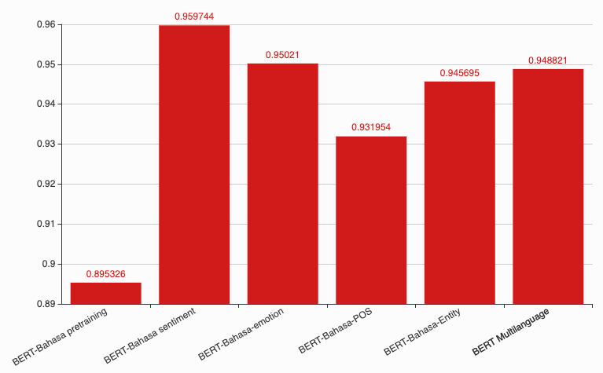

# BERT-Bahasa

Thanks to Google for opensourcing most of the source code to develop BERT, https://github.com/google-research/bert

## Table of contents
  * [Objective](https://github.com/huseinzol05/Malaya#objective)
  * [How-to](https://github.com/huseinzol05/Malaya#how-to)
  * [Comparison using Subjectivity Dataset](https://github.com/huseinzol05/Malaya#objective)
    * [Accuracy graph](https://github.com/huseinzol05/Malaya-Dataset#)
  * [Comparison using Malaysia topics](https://github.com/huseinzol05/Malaya#objective)
    * [Accuracy graph](https://github.com/huseinzol05/Malaya-Dataset#)
  * [Improvement](https://github.com/huseinzol05/Malaya#improvement)
  * [Conclusion](https://github.com/huseinzol05/Malaya#conclusion)
  * [Warning](https://github.com/huseinzol05/Malaya#warning)

## Objective

1. I saw tokenization process from original BERT Multilanguage is not really targeted to Malaysia language landscape, and pretrained provided only trained on Wikipedia dataset, no social media texts (bahasa pasar). So I decided to train BERT from scratch and finetune using available dataset I have. I believe, with limited dataset but really focus on specific language domain, we can get almost perfect or beat the original checkpoint (BERT Multilanguage).

2. Reduce model size, BERT Multilanguage is around 714MB, BERT-Bahasa is around 623MB.

## How-to

1. Git clone [Malaya-Dataset](https://github.com/huseinzol05/Malaya-Dataset),

```bash
git clone https://github.com/huseinzol05/Malaya-Dataset.git
```

2. Run [tokenization.ipynb](tokenization.ipynb) to create dictionary for tokenizer and text dataset for pretraining.

You can check definition of tokenizer use for BERT-Malaya in [tokenizer.ipynb](tokenizer.ipynb). You need to download [dictionary.json](https://huseinhouse-storage.s3-ap-southeast-1.amazonaws.com/bert-bahasa/dictionary.json)

**_We implemented our own tokenizer because Google not open source WordPiece tokenizer, [stated here](https://github.com/google-research/bert#learning-a-new-wordpiece-vocabulary)_**

3. Execute pretraining,
```bash
python3 run_pretraining.py --input_file=texts_output.tfrecord --output_dir=pretraining_output --do_train=True --do_eval=True --bert_config_file=$BERT_BASE_DIR/bert_config.json --train_batch_size=8 --max_seq_length=128 --max_predictions_per_seq=20 --num_train_steps=200000 --num_warmup_steps=10 --learning_rate=2e-5 --save_checkpoints_steps=10000
```

This is [config.json](config.json) I use,

```json
{
  "attention_probs_dropout_prob": 0.1,
  "directionality": "bidi",
  "hidden_act": "gelu",
  "hidden_dropout_prob": 0.1,
  "hidden_size": 480,
  "initializer_range": 0.02,
  "intermediate_size": 1024,
  "max_position_embeddings": 512,
  "num_attention_heads": 12,
  "num_hidden_layers": 12,
  "pooler_fc_size": 480,
  "pooler_num_attention_heads": 12,
  "pooler_num_fc_layers": 3,
  "pooler_size_per_head": 480,
  "pooler_type": "first_token_transform",
  "type_vocab_size": 2,
  "vocab_size": 275641
}
```

It took me around 47 hours to complete 200k of steps on Tesla K80 with accuracy 95% predict next words. Can done faster using Tesla V100

You can download [checkpoint from here](https://huseinhouse-storage.s3-ap-southeast-1.amazonaws.com/bert-bahasa/bert-bahasa.tar.gz).

4. Fine tuning using subjectivity dataset, [finetuning-bert-subjective.ipynb](finetuning-bert-subjective.ipynb), load checkpoint from pretraining.

You can download [checkpoint from here](https://huseinhouse-storage.s3-ap-southeast-1.amazonaws.com/bert-bahasa/bert-subjectivity.tar.gz).

5. Fine tuning using sentiment dataset, [finetuning-bert-sentiment.ipynb](finetuning-bert-sentiment.ipynb), load checkpoint from subjectivity finetuning.

You can download [checkpoint from here](https://huseinhouse-storage.s3-ap-southeast-1.amazonaws.com/bert-bahasa/bert-sentiment.tar.gz)

6. Fine tuning using emotion dataset, [finetuning-bert-emotion.ipynb](finetuning-bert-emotion.ipynb), load checkpoint from sentiment finetuning.

You can download [checkpoint from here](https://huseinhouse-storage.s3-ap-southeast-1.amazonaws.com/bert-bahasa/bert-emotion.tar.gz)

7. Fine tuning using Part-Of-Speech dataset, [finetuning-bert-pos.ipynb](finetuning-bert-pos.ipynb), load checkpoint from emotion finetuning.

You can download checkpoint from [here](https://huseinhouse-storage.s3-ap-southeast-1.amazonaws.com/bert-bahasa/bert-pos.tar.gz)

8. Fine tuning using Entity Tagging dataset, [finetuning-bert-entities.ipynb](finetuning-bert-entities.ipynb), load checkpoint from POS tagging finetuning.

You can download [checkpoint from here](https://huseinhouse-storage.s3-ap-southeast-1.amazonaws.com/bert-bahasa/bert-entities.tar.gz)

## Comparison using Subjectivity Dataset

BERT Multilanguage can get up to 94% accuracy on 20% testing data from [Malaya-Dataset/subjectivity dataset](https://github.com/huseinzol05/Malaya-Dataset/tree/master/subjectivity), can check the [notebook here](https://github.com/huseinzol05/Bahasa-NLP-Tensorflow/blob/master/normal-text-classification/3.bert.ipynb).

**Now, we are going to test on the same dataset for every each checkpoints we have. We are going to do early stopping with 3 times patient. I don't reload back to most accurate after early stopping, so we might find the model accuracy dropped during precision / recall / f1-score calculations.**

**_[TLDR, skip to graph](#)_**

1. Checkpoint from pretraining, [finetuning-bert-subjective-pretraining.ipynb](test-subjectivity/finetuning-bert-subjective-pretraining.ipynb),

Highest accuracy,

```text
epoch: 6, pass acc: 0.894824, current acc: 0.895326
```

```text

precision    recall  f1-score   support

negative       0.88      0.87      0.87       991
positive       0.87      0.88      0.87      1002

avg / total       0.87      0.87      0.87      1993

```

2. Checkpoint from sentiment, [finetuning-bert-subjective-sentiment.ipynb](test-subjectivity/finetuning-bert-subjective-sentiment.ipynb),

Highest accuracy,

```text
epoch: 4, pass acc: 0.953414, current acc: 0.959744
```

```text

precision    recall  f1-score   support

negative       0.94      0.94      0.94       969
positive       0.94      0.95      0.94      1024

avg / total       0.94      0.94      0.94      1993

```

3. Checkpoint from emotion, [finetuning-bert-subjective-emotion.ipynb](test-subjectivity/finetuning-bert-subjective-emotion.ipynb)

Highest accuracy,

```text
epoch: 7, pass acc: 0.948512, current acc: 0.950210
```

```text

precision    recall  f1-score   support

negative       0.94      0.92      0.93      1011
positive       0.92      0.94      0.93       982

avg / total       0.93      0.93      0.93      1993

```

4. Checkpoint from POS tagging, [finetuning-bert-subjective-pos.ipynb](test-subjectivity/finetuning-bert-subjective-pos.ipynb)

Highest accuracy,

```text
epoch: 2, pass acc: 0.926628, current acc: 0.931954
```

```text

precision    recall  f1-score   support

negative       0.87      0.94      0.90      1003
positive       0.94      0.85      0.89       990

avg / total       0.90      0.90      0.90      1993

```

5. Checkpoint from Entity tagging, [finetuning-bert-subjective-entities.ipynb](test-subjectivity/finetuning-bert-subjective-entities.ipynb)

Highest accuracy,

```text
epoch: 7, pass acc: 0.939480, current acc: 0.945695
```

```text

precision    recall  f1-score   support

negative       0.93      0.90      0.91       998
positive       0.90      0.93      0.92       995

avg / total       0.92      0.92      0.92      1993

```

#### Accuracy graph



## Comparison using Malaysia topics

Get the dataset,

```bash
wget https://malaya-dataset.s3-ap-southeast-1.amazonaws.com/malaysia-topics.zip
mkdir malaysia-topics
unzip malaysia-topics.zip -d malaysia-topics
```

I am going to use these topics only,

```python
accept = ['kesihatan.json', 'kes lemas.json', 'kes pecah rumah.json',
          'kes tangkap basah.json', 'kewangan dan perniagaan.json',
         'kos sara hidup.json', 'suruhanjaya pilihan raya malaysia.json',
         'tentera malaysia.json', 'nilai ringgit jatuh.json', 'kes buang bayi.json',
         'isu kemiskinan.json', 'infrastruktur.json', 'harga minyak.json']
```

Every each topics took 5k random samples, so total size 65000 texts.

You can check [tokenize-topics.ipynb](test-topics/tokenize-topics.ipynb) how I load and save to JSON for easy use onwards.

**_[TLDR, skip to graph](#)_**

1. Checkpoint from BERT Multilanguage, [bert-multilanguage-topics.ipynb](test-topics/bert-multilanguage-topics.ipynb),

Highest accuracy,

```text
epoch: 3, pass acc: 0.954231, current acc: 0.956846
```

```text

precision    recall  f1-score   support

kesihatan    0.97542   0.98805   0.98169      1004
kes lemas    0.98827   0.97068   0.97940       955
kes pecah rumah    0.94521   0.95549   0.95032      1011
kes tangkap basah    0.95064   0.97568   0.96300       987
kewangan dan perniagaan    0.94614   0.96178   0.95389       968
kos sara hidup    0.95679   0.94801   0.95238       981
suruhanjaya pilihan raya malaysia    0.93681   0.93214   0.93447      1002
tentera malaysia    0.97431   0.96422   0.96924      1062
nilai ringgit jatuh    0.91910   0.97505   0.94625      1002
kes buang bayi    0.95591   0.95400   0.95495      1000
isu kemiskinan    0.94271   0.90541   0.92368      1036
infrastruktur    0.98000   0.93531   0.95714       943
harga minyak    0.94952   0.95043   0.94998      1049

avg / total    0.95527   0.95500   0.95497     13000

```

2. Checkpoint from pretraining, [finetuning-bert-topics-pretraining.ipynb](test-topics/finetuning-bert-topics-pretraining.ipynb),

Highest accuracy,

```text
epoch: 3, pass acc: 0.952769, current acc: 0.953462
```

```text

precision    recall  f1-score   support

kesihatan    0.98357   0.98643   0.98500      1032
kes lemas    0.98117   0.97537   0.97826      1015
kes pecah rumah    0.94378   0.92794   0.93579      1013
kes tangkap basah    0.95992   0.97904   0.96938       954
kewangan dan perniagaan    0.94637   0.91093   0.92831       988
kos sara hidup    0.93243   0.96119   0.94659      1005
suruhanjaya pilihan raya malaysia    0.93730   0.91399   0.92550       965
tentera malaysia    0.98197   0.97576   0.97886       949
nilai ringgit jatuh    0.97008   0.94811   0.95897      1060
kes buang bayi    0.96410   0.94808   0.95602       963
isu kemiskinan    0.86591   0.92626   0.89507       990
infrastruktur    0.93731   0.92625   0.93175      1017
harga minyak    0.94761   0.96568   0.95656      1049

avg / total    0.95019   0.94969   0.94977     13000

```

3. Checkpoint from subjectivity, [finetuning-bert-topics-subjective.ipynb](test-topics/finetuning-bert-topics-subjective.ipynb)

Highest accuracy,

```text
epoch: 5, pass acc: 0.949346, current acc: 0.949731
```

```text

precision    recall  f1-score   support

kesihatan    0.98725   0.97957   0.98340      1028
kes lemas    0.96293   0.96955   0.96623      1018
kes pecah rumah    0.94178   0.92200   0.93178      1000
kes tangkap basah    0.96580   0.97083   0.96831       960
kewangan dan perniagaan    0.94554   0.92449   0.93490      1033
kos sara hidup    0.93379   0.96037   0.94689       984
suruhanjaya pilihan raya malaysia    0.92012   0.93487   0.92744       998
tentera malaysia    0.96411   0.98124   0.97260      1013
nilai ringgit jatuh    0.94801   0.95483   0.95141       974
kes buang bayi    0.95199   0.95885   0.95541       972
isu kemiskinan    0.91165   0.88759   0.89946      1023
infrastruktur    0.91863   0.92315   0.92088      1015
harga minyak    0.96488   0.95112   0.95795       982

avg / total    0.94737   0.94738   0.94732     13000

```

4. Checkpoint from sentiment, [finetuning-bert-topics-sentiment.ipynb](test-topics/finetuning-bert-topics-sentiment.ipynb)

Highest accuracy,

```text
epoch: 2, pass acc: 0.946385, current acc: 0.952000
```

```text

precision    recall  f1-score   support

kesihatan    0.98425   0.98135   0.98280      1019
kes lemas    0.96373   0.97230   0.96800      1011
kes pecah rumah    0.91415   0.95224   0.93280       984
kes tangkap basah    0.96754   0.96754   0.96754       955
kewangan dan perniagaan    0.93849   0.92284   0.93060       959
kos sara hidup    0.94578   0.93026   0.93795       975
suruhanjaya pilihan raya malaysia    0.91928   0.96414   0.94118      1004
tentera malaysia    0.97374   0.97090   0.97232      1031
nilai ringgit jatuh    0.96528   0.95062   0.95789      1053
kes buang bayi    0.95683   0.94710   0.95194       983
isu kemiskinan    0.89898   0.88990   0.89442       990
infrastruktur    0.96670   0.90370   0.93414      1028
harga minyak    0.93143   0.97024   0.95044      1008

avg / total    0.94842   0.94808   0.94804     13000

```

5. Checkpoint from emotion, [finetuning-bert-topics-emotion.ipynb](test-topics/finetuning-bert-topics-emotion.ipynb)

Highest accuracy,

```text
epoch: 3, pass acc: 0.947885, current acc: 0.949808
```

```text

precision    recall  f1-score   support

kesihatan    0.98144   0.98246   0.98195       969
kes lemas    0.97495   0.97593   0.97544       997
kes pecah rumah    0.91082   0.93711   0.92378       970
kes tangkap basah    0.95966   0.96875   0.96418      1056
kewangan dan perniagaan    0.92941   0.94328   0.93630      1005
kos sara hidup    0.95366   0.93159   0.94249       994
suruhanjaya pilihan raya malaysia    0.91859   0.92981   0.92417       983
tentera malaysia    0.97607   0.98392   0.97998       995
nilai ringgit jatuh    0.96988   0.96407   0.96697      1002
kes buang bayi    0.94691   0.95894   0.95289      1023
isu kemiskinan    0.92184   0.88632   0.90373      1038
infrastruktur    0.92348   0.91485   0.91914       963
harga minyak    0.95176   0.94229   0.94700      1005

avg / total    0.94764   0.94762   0.94756     13000

```

6. Checkpoint from POS tagging, [finetuning-bert-topics-pos.ipynb](test-topics/finetuning-bert-topics-pos.ipynb)

Highest accuracy,

```text
epoch: 4, pass acc: 0.950538, current acc: 0.950846
```

```text

precision    recall  f1-score   support

kesihatan    0.97485   0.98878   0.98176       980
kes lemas    0.97787   0.96716   0.97249      1005
kes pecah rumah    0.93743   0.91641   0.92680       981
kes tangkap basah    0.95035   0.97355   0.96181       983
kewangan dan perniagaan    0.94952   0.90481   0.92662       977
kos sara hidup    0.93242   0.94915   0.94071      1003
suruhanjaya pilihan raya malaysia    0.89872   0.94324   0.92044       969
tentera malaysia    0.97760   0.97951   0.97856      1025
nilai ringgit jatuh    0.95929   0.96119   0.96024      1005
kes buang bayi    0.95829   0.96932   0.96378      1043
isu kemiskinan    0.91856   0.87525   0.89638      1018
infrastruktur    0.92336   0.93110   0.92721      1074
harga minyak    0.94973   0.94771   0.94872       937

avg / total    0.94677   0.94669   0.94657     13000

```

7. Checkpoint from Entity tagging, [finetuning-bert-topics-entities.ipynb](test-topics/finetuning-bert-topics-entities.ipynb)

Highest accuracy,

```text
epoch: 5, pass acc: 0.949000, current acc: 0.949000
```

```text

precision    recall  f1-score   support

kesihatan    0.98063   0.98465   0.98264       977
kes lemas    0.97217   0.97124   0.97170      1043
kes pecah rumah    0.94153   0.90680   0.92384      1030
kes tangkap basah    0.95635   0.96477   0.96055      1022
kewangan dan perniagaan    0.93193   0.94095   0.93642      1033
kos sara hidup    0.95504   0.92816   0.94141      1030
suruhanjaya pilihan raya malaysia    0.92270   0.93100   0.92683      1000
tentera malaysia    0.96846   0.97842   0.97342       973
nilai ringgit jatuh    0.97793   0.95029   0.96391      1026
kes buang bayi    0.95125   0.93404   0.94257       940
isu kemiskinan    0.86634   0.91358   0.88933       972
infrastruktur    0.91354   0.89857   0.90599       976
harga minyak    0.93287   0.96626   0.94927       978

avg / total    0.94417   0.94377   0.94383     13000

```

#### Accuracy graph


## Improvement

1. Added more dataset from social media during pretraining. Clearly pretrained model much more generalize for any tasks based on the graphs.

2. Increase masking rate during pretraining.

3. Increase steps more than 200k steps for pretraining, clearly 200k is not really enough, can do better.

4. Reduce learning rate from `1e-5` to `1e-6` during finetuning.

5. Increase model size.

## Conclusion

1. BERT-Bahasa is pretty good, accuracies are almost similar / better than BERT Multilanguage.

2. BERT-Bahasa is good in Malaysia language landscape including social media texts and different local dialects.

## Warning

1. Every single models only initialized once, due to some entropy, maybe during random initialization on last logits layer can be biased on certain samples.
