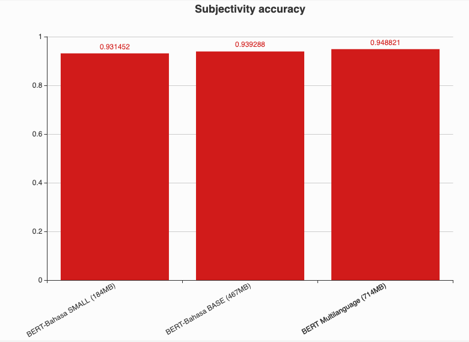

# BERT-Bahasa

**_Last update 5-July-2019, release new pretrained checkpoint._**

Thanks to Google for opensourcing most of the source code to develop BERT, https://github.com/google-research/bert

## Table of contents
  * [Objective](https://github.com/huseinzol05/Malaya/tree/master/bert#objective)
  * [How-to](https://github.com/huseinzol05/Malaya/tree/master/bert#how-to)
  * [Download](https://github.com/huseinzol05/Malaya/tree/master/bert#download)
  * [Comparison using Subjectivity Dataset](https://github.com/huseinzol05/Malaya/tree/master/bert#comparison-using-subjectivity-dataset)
  * [Comparison using Emotion Dataset](https://github.com/huseinzol05/Malaya/tree/master/bert#comparison-using-emotion-dataset)
  * [Comparison using Text Similarity Dataset](https://github.com/huseinzol05/Malaya/tree/master/bert#comparison-using-text-similarity-dataset)
  * [Feedbacks](https://github.com/huseinzol05/Malaya/tree/master/bert#feedbacks)
  * [Citation](https://github.com/huseinzol05/Malaya/tree/master/bert#citation)
  * [Donation](https://github.com/huseinzol05/Malaya/tree/master/bert#donation)

## Objective

1. We saw tokenization process from original BERT Multilanguage is not really targeted to Malaysia language landscape, and pretrained provided only trained on Wikipedia dataset, no social media texts (bahasa pasar). So we decided to train BERT from scratch and finetune using available dataset we have. [Dataset we use for pretraining](https://github.com/huseinzol05/Malaya-Dataset#dumping).

2. Provide **SMALL**, **BASE** and **LARGE** BERT for Bahasa.

## How-to

1. Run [dumping.ipynb](dumping.ipynb) to create text dataset for pretraining.

You need to download `sp10m.cased.v4.model`, you can get this tokenizer from any checkpoints below after extract.

**_We implemented our own tokenizer because Google not open source WordPiece tokenizer, [stated here](https://github.com/google-research/bert#learning-a-new-wordpiece-vocabulary)._**

3. Create pretraining dataset,
```bash
python3 create-pretraining-data.py
```

4. Execute pretraining,
```bash
mkdir pretraining_output
python3 run_pretraining.py --input_file=tests_output.tfrecord --output_dir=pretraining_output --do_train=True --do_eval=True --bert_config_file=checkpoint/bert_config.json --train_batch_size=16 --max_seq_length=128 --max_predictions_per_seq=20 --num_train_steps=1000000 --num_warmup_steps=10 --learning_rate=2e-5 --save_checkpoints_steps=250000
```

**LARGE** size, [LARGE_config.json](config/LARGE_config.json),
```json
{
  "attention_probs_dropout_prob": 0.1,
  "directionality": "bidi",
  "hidden_act": "gelu",
  "hidden_dropout_prob": 0.1,
  "hidden_size": 1024,
  "initializer_range": 0.02,
  "intermediate_size": 4096,
  "max_position_embeddings": 512,
  "num_attention_heads": 16,
  "num_hidden_layers": 24,
  "pooler_fc_size": 768,
  "pooler_num_attention_heads": 12,
  "pooler_num_fc_layers": 3,
  "pooler_size_per_head": 128,
  "pooler_type": "first_token_transform",
  "type_vocab_size": 2,
  "vocab_size": 40000
}
```

**BASE** size, [BASE_config.json](config/BASE_config.json),

```json
{
  "attention_probs_dropout_prob": 0.1,
  "directionality": "bidi",
  "hidden_act": "gelu",
  "hidden_dropout_prob": 0.1,
  "hidden_size": 768,
  "initializer_range": 0.02,
  "intermediate_size": 3072,
  "max_position_embeddings": 512,
  "num_attention_heads": 12,
  "num_hidden_layers": 12,
  "pooler_fc_size": 768,
  "pooler_num_attention_heads": 12,
  "pooler_num_fc_layers": 3,
  "pooler_size_per_head": 128,
  "pooler_type": "first_token_transform",
  "type_vocab_size": 2,
  "vocab_size": 40000
}
```

**SMALL** size, [SMALL_config.json](config/SMALL_config,json),

```json
{
  "attention_probs_dropout_prob": 0.1,
  "directionality": "bidi",
  "hidden_act": "gelu",
  "hidden_dropout_prob": 0.1,
  "hidden_size": 512,
  "initializer_range": 0.02,
  "intermediate_size": 3072,
  "max_position_embeddings": 256,
  "num_attention_heads": 8,
  "num_hidden_layers": 6,
  "pooler_fc_size": 512,
  "pooler_num_attention_heads": 12,
  "pooler_num_fc_layers": 3,
  "pooler_size_per_head": 128,
  "pooler_type": "first_token_transform",
  "type_vocab_size": 2,
  "vocab_size": 40000
}
```

## Download

_**Size calculated after saved trainable variables not included optimizer momentum variables. Size of tar.gz not an actual size.**_

1.  6th July 2019, [bert-bahasa-6-july-2019.tar.gz](https://huseinhouse-storage.s3-ap-southeast-1.amazonaws.com/bert-bahasa/bert-bahasa-6-july-2019.tar.gz)

**Vocab size 32k, Case Sensitive, Train on 500MB dataset, 1M steps, BASE size (410MB)**.

2. 9th July 2019, [bert-bahasa-9-july-2019.tar.gz](https://huseinhouse-storage.s3-ap-southeast-1.amazonaws.com/bert-bahasa/bert-bahasa-9-july-2019.tar.gz)

**Vocab size 40k, Case Sensitive, Train on 1.21GB dataset, 1M steps, BASE size (467MB)**.

3. 12th July 2019, [bert-bahasa-12-july-2019.tar.gz](https://huseinhouse-storage.s3-ap-southeast-1.amazonaws.com/bert-bahasa/bert-bahasa-12-july-2019.tar.gz)

**Vocab size 40k, Case Sensitive, Train on 1.21GB dataset, 1M steps, SMALL size (184MB)**.

## Comparison using Subjectivity Dataset

Link to [subjectivity dataset](https://github.com/huseinzol05/Malaya-Dataset#subjectivity).

Link to [notebooks](finetune-subjectivity).



## Comparison using Emotion Dataset

Link to [emotion dataset](https://github.com/huseinzol05/Malaya-Dataset#emotion).

Link to [notebooks](finetune-emotion).


## Comparison using Text Similarity Dataset

Link to [text similarity dataset](https://github.com/huseinzol05/Malaya-Dataset#text-similarity).

Link to [notebooks](finetune-similarity).


## Feedbacks

1. Feel free to suggest me to add more any kind of finetune, like, QA, Neural Machine Translation and etc.

## Citation

1. Please citate the repository if use these checkpoints.

```
@misc{Malaya, Natural-Language-Toolkit library for bahasa Malaysia, powered by Deep Learning Tensorflow,
  author = {Husein, Zolkepli},
  title = {Malaya},
  year = {2018},
  publisher = {GitHub},
  journal = {GitHub repository},
  howpublished = {\url{https://github.com/huseinzol05/malaya}}
}
```

2. Please at least email us first before distributing these checkpoints. Remember all these hard workings we want to give it for free.
3. What do you see just the checkpoints, but nobody can see how much we spent our cost to make it public.

## Donation

<a href="https://www.patreon.com/bePatron?u=7291337"></a>

Or, One time donation without credit card hustle, **7053174643, CIMB Bank, Husein Zolkepli**
