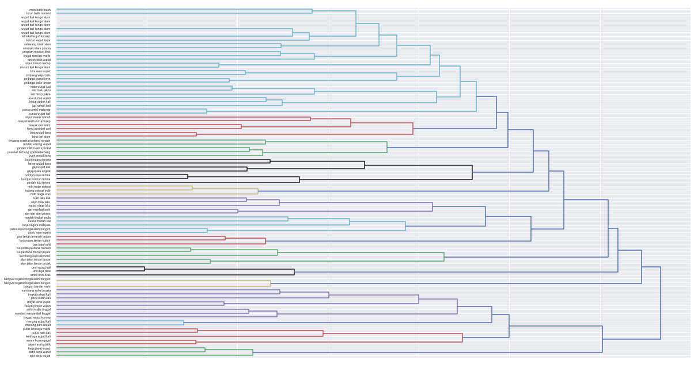
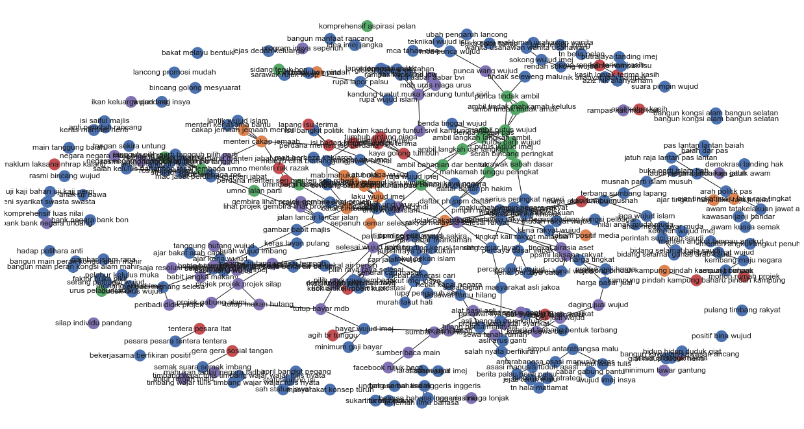
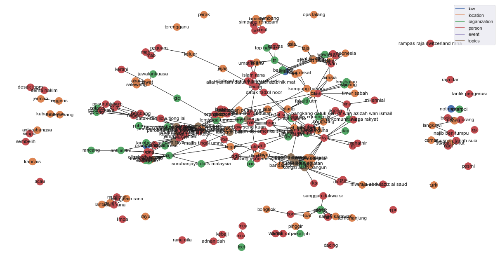

.. code:: python

    %%time
    import malaya


.. parsed-literal::

    CPU times: user 3.64 s, sys: 749 ms, total: 4.39 s
    Wall time: 4.64 s


.. code:: python

    %matplotlib inline
    
    import pandas as pd
    df = pd.read_csv('tests/02032018.csv',sep=';')
    df = df.iloc[3:,1:]
    df.columns = ['text','label']
    corpus = df.text.tolist()

Generate scatter plot for unsupervised clustering
-------------------------------------------------

\```python

def cluster_scatter( corpus, vectorizer, num_clusters = 5, titles =
None, colors = None, stemming = True, stop_words = None, cleaning =
simple_textcleaning, clustering = KMeans, decomposition = MDS, ngram =
(1, 3), figsize = (17, 9), batch_size = 20, ): """ plot scatter plot on
similar text clusters.

::

   Parameters
   ----------

   corpus: list
   vectorizer: class
   num_clusters: int, (default=5)
       size of unsupervised clusters.
   titles: list
       list of titles, length must same with corpus.
   colors: list
       list of colors, length must same with num_clusters.
   stemming: bool, (default=True)
       If True, sastrawi_stemmer will apply.
   stop_words: list, (default=None)
       list of stop words to remove. If None, default is malaya.texts._text_functions.STOPWORDS
   ngram: tuple, (default=(1,3))
       n-grams size to train a corpus.
   cleaning: function, (default=simple_textcleaning)
       function to clean the corpus.
   batch_size: int, (default=10)
       size of strings for each vectorization and attention. Only useful if use transformer vectorizer.

   Returns
   -------
   dictionary: {
       'X': X,
       'Y': Y,
       'labels': clusters,
       'vector': transformed_text_clean,
       'titles': titles,
   }
   """
   ```

.. code:: python

    model = malaya.transformer.load(model = 'albert', size = 'base')
    result_scatter = malaya.cluster.cluster_scatter(corpus,vectorizer=model)


.. parsed-literal::

    embedding_lookup_factorized. factorized embedding parameterization is used.
    INFO:tensorflow:Restoring parameters from /Users/huseinzolkepli/Malaya/albert-model/base/albert-base/model.ckpt


.. image:: load-clustering_files/load-clustering_3_1.png


Generate dendogram plot for unsupervised clustering
---------------------------------------------------

.. code:: python

   def cluster_dendogram(
       corpus,
       vectorizer,
       titles = None,
       stemming = True,
       stop_words = None,
       cleaning = simple_textcleaning,
       random_samples = 0.3,
       ngram = (1, 3),
       figsize = (17, 9),
       batch_size = 20,
       **kwargs
   ):
       """
       plot hierarchical dendogram with similar texts.

       Parameters
       ----------

       corpus: list
       vectorizer: class
       num_clusters: int, (default=5)
           size of unsupervised clusters.
       titles: list
           list of titles, length must same with corpus.
       stemming: bool, (default=True)
           If True, sastrawi_stemmer will apply.
       stop_words: list, (default=None)
           list of stop words to remove. If None, default is malaya.texts._text_functions.STOPWORDS
       cleaning: function, (default=simple_textcleaning)
           function to clean the corpus.
       random_samples: float, (default=0.3)
           random samples from the corpus, 0.3 means 30%.
       ngram: tuple, (default=(1,3))
           n-grams size to train a corpus.
       batch_size: int, (default=20)
           size of strings for each vectorization and attention. Only useful if use transformer vectorizer.

       Returns
       -------
       dictionary: {'linkage_matrix': linkage_matrix, 'titles': titles}
       """

.. code:: python

    result_scatter = malaya.cluster.cluster_dendogram(corpus,vectorizer=model)





Generate undirected graph for unsupervised clustering
-----------------------------------------------------

.. code:: python

   def cluster_graph(
       corpus,
       vectorizer,
       threshold = 0.9,
       num_clusters = 5,
       titles = None,
       colors = None,
       stop_words = None,
       stemming = True,
       ngram = (1, 3),
       cleaning = simple_textcleaning,
       clustering = KMeans,
       figsize = (17, 9),
       with_labels = True,
       batch_size = 20,
       **kwargs
   ):
       """
       plot undirected graph with similar texts.

       Parameters
       ----------

       corpus: list
       vectorizer: class
       threshold: float, (default=0.9)
           0.9 means, 90% above absolute pearson correlation.
       num_clusters: int, (default=5)
           size of unsupervised clusters.
       titles: list
           list of titles, length must same with corpus.
       stemming: bool, (default=True)
           If True, sastrawi_stemmer will apply.
       stop_words: list, (default=None)
           list of stop words to remove. If None, default is malaya.texts._text_functions.STOPWORDS
       cleaning: function, (default=simple_textcleaning)
           function to clean the corpus.
       ngram: tuple, (default=(1,3))
           n-grams size to train a corpus.
       batch_size: int, (default=20)
           size of strings for each vectorization and attention. Only useful if use transformer vectorizer.

       Returns
       -------
       dictionary: {
           'G': G,
           'pos': pos,
           'node_colors': node_colors,
           'node_labels': node_labels,
       }
       """

.. code:: python

    from sklearn.feature_extraction.text import TfidfVectorizer
    tf_vectorizer = TfidfVectorizer(
        ngram_range = (1, 3),
        min_df = 2,
        max_df = 0.95,
    )
    
    result_scatter = malaya.cluster.cluster_graph(corpus,vectorizer=tf_vectorizer,threshold=0.3)





Generate undirected graph for Entities and topics relationship
--------------------------------------------------------------

.. code:: python

   def cluster_entity_linking(
       corpus,
       vectorizer,
       entity_model,
       topic_modeling_model,
       threshold = 0.3,
       topic_decomposition = 2,
       topic_length = 10,
       fuzzy_ratio = 70,
       accepted_entities = ['law', 'location', 'organization', 'person', 'event'],
       cleaning = simple_textcleaning,
       stemming = True,
       colors = None,
       stop_words = None,
       max_df = 1.0,
       min_df = 1,
       ngram = (2, 3),
       figsize = (17, 9),
       batch_size = 20,
       **kwargs
   ):
       """
       plot undirected graph for Entities and topics relationship.

       Parameters
       ----------
       corpus: list or str
       vectorizer: class
       titles: list
           list of titles, length must same with corpus.
       colors: list
           list of colors, length must same with num_clusters.
       threshold: float, (default=0.3)
           0.3 means, 30% above absolute pearson correlation.
       topic_decomposition: int, (default=2)
           size of decomposition.
       topic_length: int, (default=10)
           size of topic models.
       fuzzy_ratio: int, (default=70)
           size of ratio for fuzzywuzzy.
       stemming: bool, (default=True)
           If True, sastrawi_stemmer will apply.
       max_df: float, (default=0.95)
           maximum of a word selected based on document frequency.
       min_df: int, (default=2)
           minimum of a word selected on based on document frequency.
       ngram: tuple, (default=(1,3))
           n-grams size to train a corpus.
       cleaning: function, (default=simple_textcleaning)
           function to clean the corpus.
       stop_words: list, (default=None)
           list of stop words to remove. If None, default is malaya.texts._text_functions.STOPWORDS

       Returns
       -------
       dictionary: {
           'G': G,
           'pos': pos,
           'node_colors': node_colors,
           'node_labels': node_labels,
       }
       """

.. code:: python

    entity_model = malaya.entity.transformer(model = 'albert', size = 'base')
    topic_model = malaya.topic_model.lda


.. parsed-literal::

    WARNING:tensorflow:From /Users/huseinzolkepli/Documents/Malaya/malaya/_utils/_utils.py:69: The name tf.GraphDef is deprecated. Please use tf.compat.v1.GraphDef instead.
    


.. code:: python

    result_linking = malaya.cluster.cluster_entity_linking(corpus,
                                                           tf_vectorizer,
                                                           entity_model,
                                                           topic_model)





Cluster same word structure based on POS and Entities
-----------------------------------------------------

.. code:: python

    string = 'KUALA LUMPUR: Sempena sambutan Aidilfitri minggu depan, Perdana Menteri Tun Dr Mahathir Mohamad dan Menteri Pengangkutan Anthony Loke Siew Fook menitipkan pesanan khas kepada orang ramai yang mahu pulang ke kampung halaman masing-masing. Dalam video pendek terbitan Jabatan Keselamatan Jalan Raya (JKJR) itu, Dr Mahathir menasihati mereka supaya berhenti berehat dan tidur sebentar  sekiranya mengantuk ketika memandu.'

.. code:: python

    bahdanau_entities = malaya.entity.deep_model('bahdanau')
    bahdanau_pos = malaya.pos.deep_model('bahdanau')

.. code:: python

    result_entities = bahdanau_entities.predict(string)
    result_pos = bahdanau_pos.predict(string)

.. code:: python

    generated_grams = malaya.generator.pos_entities_ngram(
        result_pos,
        result_entities,
        ngram = (1, 3),
        accept_pos = ['NOUN', 'PROPN', 'VERB'],
        accept_entities = ['law', 'location', 'organization', 'person', 'time'],
    )
    generated_grams


.. parsed-literal::

    ['terbitan',
     'orang ramai',
     'Anthony Loke',
     'Jalan Raya',
     'sambutan',
     'Mahathir Mohamad',
     'Kuala Lumpur Sempena',
     'Mohamad',
     'Jabatan Keselamatan Jalan',
     'Sempena sambutan',
     'sekiranya',
     'kampung halaman masing-masing',
     'Menteri Pengangkutan Anthony',
     'pesanan',
     'masing-masing video',
     'masing-masing video terbitan',
     'Menteri Tun Dr',
     'Dr Mahathir menasihati',
     'Menteri',
     'mahu pulang kampung',
     'menitipkan pesanan orang',
     'Perdana Menteri Tun',
     'video terbitan',
     'Mahathir menasihati',
     'pulang kampung halaman',
     'Menteri Tun',
     'Pengangkutan Anthony',
     'mengantuk memandu',
     'depan',
     'Jkjr Dr Mahathir',
     'Pengangkutan',
     'Lumpur Sempena',
     'Loke Siew',
     'halaman masing-masing video',
     'minggu',
     'pulang kampung',
     'Mahathir',
     'Anthony Loke Siew',
     'terbitan Jabatan',
     'Keselamatan Jalan',
     'terbitan Jabatan Keselamatan',
     'Dr',
     'sekiranya mengantuk memandu',
     'Lumpur Sempena sambutan',
     'sambutan Aidilfitri minggu',
     'Jabatan',
     'tidur sekiranya',
     'Aidilfitri minggu depan',
     'masing-masing',
     'Fook',
     'memandu',
     'video terbitan Jabatan',
     'Siew',
     'Pengangkutan Anthony Loke',
     'Kuala',
     'pulang',
     'Loke',
     'minggu depan Perdana',
     'Jalan',
     'Sempena sambutan Aidilfitri',
     'ramai',
     'Keselamatan Jalan Raya',
     'berhenti berehat',
     'Aidilfitri minggu',
     'Fook menitipkan',
     'sekiranya mengantuk',
     'ramai mahu pulang',
     'Anthony',
     'Jalan Raya Jkjr',
     'menasihati berhenti berehat',
     'Loke Siew Fook',
     'kampung',
     'berehat tidur',
     'sambutan Aidilfitri',
     'menasihati berhenti',
     'mahu',
     'orang',
     'Raya Jkjr',
     'orang ramai mahu',
     'Mahathir menasihati berhenti',
     'kampung halaman',
     'Menteri Pengangkutan',
     'Lumpur',
     'minggu depan',
     'depan Perdana Menteri',
     'Perdana Menteri',
     'Mohamad Menteri Pengangkutan',
     'Raya',
     'Tun Dr',
     'berhenti',
     'mahu pulang',
     'pesanan orang ramai',
     'Tun Dr Mahathir',
     'Dr Mahathir',
     'Sempena',
     'Perdana',
     'Fook menitipkan pesanan',
     'Raya Jkjr Dr',
     'Jkjr Dr',
     'menasihati',
     'depan Perdana',
     'halaman masing-masing',
     'menitipkan',
     'Jabatan Keselamatan',
     'Siew Fook',
     'menitipkan pesanan',
     'Siew Fook menitipkan',
     'pesanan orang',
     'tidur',
     'Mohamad Menteri',
     'tidur sekiranya mengantuk',
     'Keselamatan',
     'Tun',
     'halaman',
     'ramai mahu',
     'Aidilfitri',
     'berhenti berehat tidur',
     'Dr Mahathir Mohamad',
     'Jkjr',
     'mengantuk',
     'Mahathir Mohamad Menteri',
     'Kuala Lumpur',
     'berehat',
     'video',
     'berehat tidur sekiranya']


.. code:: python

    malaya.cluster.cluster_words(generated_grams)


.. parsed-literal::

    ['halaman masing-masing video',
     'Anthony Loke Siew',
     'sekiranya mengantuk memandu',
     'terbitan Jabatan Keselamatan',
     'Kuala Lumpur Sempena',
     'sambutan Aidilfitri minggu',
     'Lumpur Sempena sambutan',
     'Jabatan Keselamatan Jalan',
     'orang ramai mahu',
     'Aidilfitri minggu depan',
     'Siew Fook menitipkan',
     'video terbitan Jabatan',
     'Mahathir menasihati berhenti',
     'tidur sekiranya mengantuk',
     'Pengangkutan Anthony Loke',
     'kampung halaman masing-masing',
     'Menteri Pengangkutan Anthony',
     'minggu depan Perdana',
     'Sempena sambutan Aidilfitri',
     'depan Perdana Menteri',
     'Keselamatan Jalan Raya',
     'masing-masing video terbitan',
     'Menteri Tun Dr',
     'Dr Mahathir menasihati',
     'ramai mahu pulang',
     'mahu pulang kampung',
     'berhenti berehat tidur',
     'Jalan Raya Jkjr',
     'menitipkan pesanan orang',
     'menasihati berhenti berehat',
     'Mohamad Menteri Pengangkutan',
     'Loke Siew Fook',
     'Perdana Menteri Tun',
     'pesanan orang ramai',
     'Tun Dr Mahathir',
     'pulang kampung halaman',
     'Jkjr Dr Mahathir',
     'Mahathir Mohamad Menteri',
     'Fook menitipkan pesanan',
     'Raya Jkjr Dr',
     'Dr Mahathir Mohamad',
     'berehat tidur sekiranya']


Cluster Part-Of-Speech
----------------------

.. code:: python

    malaya.cluster.cluster_pos(result_pos)


.. parsed-literal::

    {'ADJ': ['khas', 'pendek'],
     'ADP': ['kepada', 'ke', 'Dalam'],
     'ADV': ['sebentar'],
     'ADX': [],
     'AUX': [],
     'CCONJ': ['depan', 'dan'],
     'DET': ['itu'],
     'NOUN': ['sambutan',
      'pesanan',
      'orang ramai',
      'kampung halaman masing-masing',
      'video',
      'terbitan Jabatan Keselamatan',
      'Jkjr',
      'berehat',
      'sekiranya'],
     'NUM': [],
     'PART': [],
     'PRON': ['yang', 'mereka'],
     'PROPN': ['Kuala Lumpur Sempena',
      'Aidilfitri',
      'Perdana Menteri Tun Dr Mahathir Mohamad',
      'Menteri Pengangkutan Anthony Loke Siew Fook',
      'Jalan Raya',
      'Dr Mahathir'],
     'SCONJ': ['supaya', 'ketika'],
     'SYM': [],
     'VERB': ['minggu',
      'menitipkan',
      'mahu pulang',
      'menasihati',
      'berhenti',
      'tidur',
      'mengantuk'],
     'X': []}


.. code:: python

    malaya.cluster.cluster_entities(result_entities)


.. parsed-literal::

    {'OTHER': ['sempena',
      'dan',
      'menitipkan pesanan khas kepada orang ramai yang mahu pulang ke kampung halaman masing-masing dalam video pendek terbitan',
      'itu'],
     'law': [],
     'location': ['kuala lumpur'],
     'organization': ['menteri pengangkutan', 'jabatan keselamatan jalan raya'],
     'person': ['perdana menteri tun dr mahathir mohamad',
      'anthony loke siew fook',
      'jkjr',
      'dr mahathir'],
     'quantity': [],
     'time': ['minggu depan'],
     'event': ['sambutan aidilfitri']}


