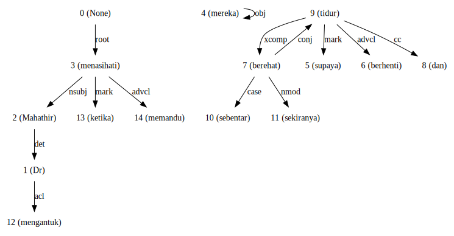
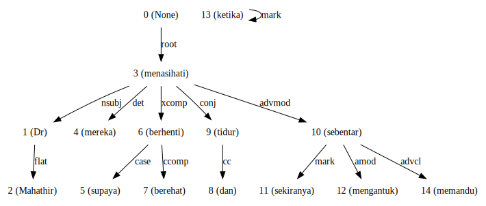
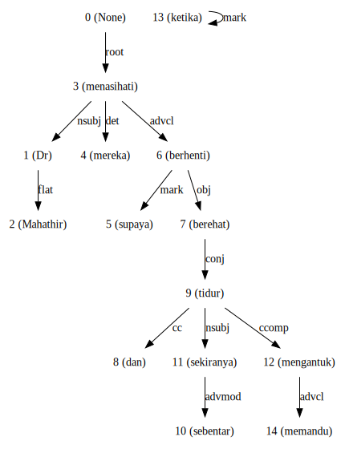
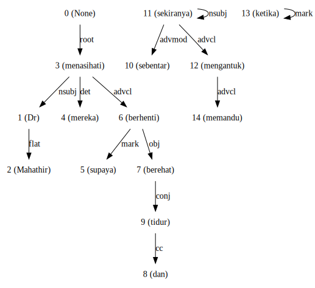
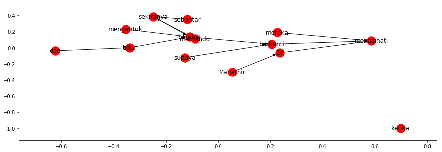

.. code:: python

    %%time
    import malaya

.. parsed-literal::

    CPU times: user 12.2 s, sys: 1.49 s, total: 13.7 s
    Wall time: 17.3 s

List available deep learning Dependency models
----------------------------------------------

.. code:: python

    malaya.dependency.available_deep_model()

.. parsed-literal::

    ['concat', 'bahdanau', 'luong', 'attention-is-all-you-need']

Describe supported dependencies
-------------------------------

.. code:: python

    malaya.describe_dependency()

.. parsed-literal::

    acl - clausal modifier of noun
    advcl - adverbial clause modifier
    advmod - adverbial modifier
    amod - adjectival modifier
    appos - appositional modifier
    aux - auxiliary
    case - case marking
    ccomp - clausal complement
    compound - compound
    compound:plur - plural compound
    conj - conjunct
    cop - cop
    csubj - clausal subject
    dep - dependent
    det - determiner
    fixed - multi-word expression
    flat - name
    iobj - indirect object
    mark - marker
    nmod - nominal modifier
    nsubj - nominal subject
    obj - direct object
    parataxis - parataxis
    root - root
    xcomp - open clausal complement
    you can read more from https://universaldependencies.org/en/dep/xcomp.html

.. code:: python

    string = 'Dr Mahathir menasihati mereka supaya berhenti berehat dan tidur sebentar sekiranya mengantuk ketika memandu.'

Load CRF model
--------------

.. code:: python

    crf = malaya.dependency.crf()
    d_object, tagging, indexing = crf.predict(string)
    tagging, indexing

.. parsed-literal::

    ([('Dr', 'case'),
      ('Mahathir', 'obl'),
      ('menasihati', 'acl'),
      ('mereka', 'obj'),
      ('supaya', 'case'),
      ('berhenti', 'xcomp'),
      ('berehat', 'advcl'),
      ('dan', 'cc'),
      ('tidur', 'conj'),
      ('sebentar', 'advmod'),
      ('sekiranya', 'advmod'),
      ('mengantuk', 'UNK'),
      ('ketika', 'case'),
      ('memandu', 'xcomp')],
     [('Dr', 3),
      ('Mahathir', 6),
      ('menasihati', 4),
      ('mereka', 4),
      ('supaya', 8),
      ('berhenti', 10),
      ('berehat', 10),
      ('dan', 14),
      ('tidur', 4),
      ('sebentar', 12),
      ('sekiranya', 9),
      ('mengantuk', 1),
      ('ketika', 9),
      ('memandu', 7)])

Visualize graph for dependency output
-------------------------------------

**Make sure you already installed graphvis.**

.. code:: python

    d_object.to_graphvis()

Print important features from CRF model
---------------------------------------

.. code:: python

    crf.print_features(10)

.. parsed-literal::

    Top-10 tagging positive:
    12.547764 conj     next_word:perlunya
    12.367710 punct    word:mengembanfkan
    11.793032 nummod   word:mengembanfkan
    10.094637 det      word:berbagai
    9.573215 case     word:dari
    9.210329 appos    word:dimekarkannya
    9.153894 det      word:para
    9.128825 root     word:fasilitator
    9.055041 obl      next_word:ditafsirkan
    9.013166 case     word:dengan

    Top-10 tagging negative:
    -4.373424 flat     prefix-2:ak
    -4.400194 cc       next_word:ketumbar
    -4.465530 obj      next_word:cara
    -4.517578 conj     prefix-2:Mr
    -4.546550 compound word:masih
    -4.644113 case     prev_word:harus
    -4.800643 compound word:telah
    -5.301659 compound word:akan
    -5.808335 compound word:pernah
    -6.553638 flat     is_first

Print important tagging transitions from CRF Model
--------------------------------------------------

.. code:: python

    crf.print_transitions_tag(10)

.. parsed-literal::

    Top-10 likely tagging transitions:
    case   -> obl     5.195645
    aux    -> aux     4.643113
    cc     -> conj    4.223698
    case   -> nmod    4.180786
    flat   -> flat    4.040346
    cop    -> root    3.771183
    punct  -> compound:plur 3.497424
    punct  -> fixed   3.416479
    appos  -> flat    3.031077
    nmod   -> flat    2.940859

    Top-10 unlikely tagging transitions:
    appos  -> advcl   -4.389181
    root   -> parataxis -4.557102
    cop    -> nmod    -4.594469
    cop    -> obl     -4.752784
    aux    -> acl     -4.981520
    case   -> fixed   -5.202611
    nummod -> compound:plur -5.284053
    compound:plur -> cop     -5.808322
    root   -> root    -6.301090
    cop    -> obj     -7.429950

Print important indexing transitions from CRF Model
---------------------------------------------------

.. code:: python

    crf.print_transitions_index(10)

.. parsed-literal::

    Top-10 likely indexing transitions:
    117    -> 117     6.829730
    182    -> 176     6.767373
    1      -> 0       6.499095
    108    -> 109     6.303625
    95     -> 99      6.039325
    138    -> 138     6.011194
    97     -> 97      5.971080
    103    -> 77      5.789712
    79     -> 79      5.758269
    137    -> 140     5.705340

    Top-10 unlikely indexing transitions:
    0      -> 30      -5.182860
    2      -> 39      -5.200419
    33     -> 1       -5.227053
    30     -> 0       -5.265685
    36     -> 0       -5.269204
    34     -> 0       -5.398857
    1      -> 40      -5.499971
    49     -> 2       -5.615010
    1      -> 38      -5.627040
    1      -> 39      -5.758355

Load deep learning models
-------------------------

.. code:: python

    for i in malaya.dependency.available_deep_model():
        print('Testing %s model'%(i))
        model = malaya.dependency.deep_model(i)
        print(model.predict(string))
        print()

.. parsed-literal::

    Testing concat model
    (<malaya._utils._parse_dependency.DependencyGraph object at 0x13f5ea9e8>, [('Dr', 'nsubj'), ('Mahathir', 'nsubj'), ('menasihati', 'root'), ('mereka', 'obj'), ('supaya', 'case'), ('berhenti', 'xcomp'), ('berehat', 'xcomp'), ('dan', 'cc'), ('tidur', 'conj'), ('sebentar', 'det'), ('sekiranya', 'mark'), ('mengantuk', 'amod'), ('ketika', 'case'), ('memandu', 'xcomp')], [('Dr', 2), ('Mahathir', 3), ('menasihati', 0), ('mereka', 3), ('supaya', 6), ('berhenti', 3), ('berehat', 6), ('dan', 9), ('tidur', 7), ('sebentar', 9), ('sekiranya', 13), ('mengantuk', 9), ('ketika', 13), ('memandu', 12)])

    Testing bahdanau model
    (<malaya._utils._parse_dependency.DependencyGraph object at 0x15329d518>, [('Dr', 'nsubj'), ('Mahathir', 'compound'), ('menasihati', 'root'), ('mereka', 'nsubj'), ('supaya', 'case'), ('berhenti', 'obl'), ('berehat', 'ccomp'), ('dan', 'cc'), ('tidur', 'conj'), ('sebentar', 'advmod'), ('sekiranya', 'mark'), ('mengantuk', 'amod'), ('ketika', 'case'), ('memandu', 'xcomp')], [('Dr', 2), ('Mahathir', 2), ('menasihati', 0), ('mereka', 3), ('supaya', 6), ('berhenti', 3), ('berehat', 6), ('dan', 9), ('tidur', 3), ('sebentar', 9), ('sekiranya', 10), ('mengantuk', 10), ('ketika', 13), ('memandu', 11)])

    Testing luong model
    (<malaya._utils._parse_dependency.DependencyGraph object at 0x13f5eae48>, [('Dr', 'nmod'), ('Mahathir', 'nsubj'), ('menasihati', 'UNK'), ('mereka', 'det'), ('supaya', 'mark'), ('berhenti', 'advcl'), ('berehat', 'fixed'), ('dan', 'cc'), ('tidur', 'conj'), ('sebentar', 'advmod'), ('sekiranya', 'mark'), ('mengantuk', 'advcl'), ('ketika', 'mark'), ('memandu', 'advcl')], [('Dr', 4), ('Mahathir', 2), ('menasihati', 0), ('mereka', 6), ('supaya', 6), ('berhenti', 4), ('berehat', 6), ('dan', 9), ('tidur', 2), ('sebentar', 9), ('sekiranya', 10), ('mengantuk', 2), ('ketika', 12), ('memandu', 11)])

    Testing attention-is-all-you-need model
    (<malaya._utils._parse_dependency.DependencyGraph object at 0x15c449518>, [('Dr', 'nsubj'), ('Mahathir', 'UNK'), ('menasihati', 'nsubj'), ('mereka', 'advmod'), ('supaya', 'nsubj'), ('berhenti', 'advmod'), ('berehat', 'root'), ('dan', 'mark'), ('tidur', 'nsubj'), ('sebentar', 'advmod'), ('sekiranya', 'nsubj'), ('mengantuk', 'advmod'), ('ketika', 'UNK'), ('memandu', 'advmod')], [('Dr', 3), ('Mahathir', 0), ('menasihati', 3), ('mereka', 3), ('supaya', 3), ('berhenti', 3), ('berehat', 0), ('dan', 3), ('tidur', 3), ('sebentar', 3), ('sekiranya', 3), ('mengantuk', 3), ('ketika', 0), ('memandu', 3)])

Print important features from deep learning model
-------------------------------------------------

.. code:: python

    attention_is_all_you_need = malaya.dependency.deep_model('attention-is-all-you-need')
    attention_is_all_you_need.print_features(10)

.. parsed-literal::

    Top-10 positive:
    disekitarnya: 15.197718
    Atau: 13.290402
    ektoderma: 13.264775
    sepedanya: 12.893903
    Kitchee: 12.608871
    harafiah: 11.988880
    Naito: 11.850497
    Ukraina: 11.662189
    romantis: 11.286506
    peluncuran: 11.277926

    Top-10 negative:
    basin: -16.109232
    Bernard: -14.093240
    antisipasi: -13.886290
    diminum: -13.461384
    sebelah: -12.955760
    Kusni: -12.772882
    minta: -12.678089
    10Am: -12.510218
    uangnya: -12.470654
    Hati: -12.458626

.. code:: python

    bahdanau = malaya.dependency.deep_model('bahdanau')
    d_object, tagging, indexing = bahdanau.predict(string)
    d_object.to_graphvis()

Print important tagging transitions from deep learning model
------------------------------------------------------------

.. code:: python

    bahdanau.print_transitions_tag(10)

.. parsed-literal::

    Top-10 likely transitions:
    cc -> conj: 3.898244
    punct -> compound:plur: 2.816386
    case -> obl: 2.744200
    case -> xcomp: 2.671549
    case -> nmod: 2.591420
    compound:plur -> amod: 1.975937
    nsubj:pass -> acl: 1.963712
    cop -> ccomp: 1.963573
    punct -> fixed: 1.794608
    xcomp -> obj: 1.712421

    Top-10 unlikely transitions:
    root -> root: -8.622316
    nsubj:pass -> compound:plur: -7.600410
    obl -> compound:plur: -7.044655
    obj -> compound:plur: -6.751858
    case -> iobj: -6.546042
    case -> parataxis: -6.536805
    compound:plur -> compound:plur: -6.359083
    nummod -> compound:plur: -6.165409
    parataxis -> advcl: -6.097473
    nmod -> compound:plur: -6.087421

Print important indexing transitions from deep learning model
-------------------------------------------------------------

.. code:: python

    bahdanau.print_transitions_index(10)

.. parsed-literal::

    Top-10 likely transitions:
    133 -> 136: 2.720363
    108 -> 109: 2.385479
    126 -> 127: 2.302784
    153 -> 56: 2.086003
    88 -> 89: 2.082119
    56 -> 158: 2.057645
    100 -> 103: 2.021965
    136 -> 122: 1.989143
    112 -> 113: 1.980897
    128 -> 129: 1.962656

    Top-10 unlikely transitions:
    46 -> 45: -7.945712
    1 -> 1: -7.238533
    63 -> 62: -6.313935
    41 -> 53: -6.211363
    37 -> 47: -6.163178
    68 -> 67: -6.078556
    64 -> 63: -6.066933
    27 -> 41: -6.057477
    51 -> 59: -6.047529
    45 -> 55: -6.034111

Voting stack model
------------------

.. code:: python

    concat = malaya.dependency.deep_model('concat')
    bahdanau = malaya.dependency.deep_model('bahdanau')
    luong = malaya.dependency.deep_model('luong')
    tagging, indexing = malaya.stack.voting_stack([concat, bahdanau, luong], string)
    malaya.dependency.dependency_graph(tagging, indexing).to_graphvis()

Dependency graph object
-----------------------

To initiate a dependency graph from dependency models, you need to call
``malaya.dependency.dependency_graph``.

.. code:: python

    graph = malaya.dependency.dependency_graph(tagging, indexing)
    graph

.. parsed-literal::

    <malaya._utils._parse_dependency.DependencyGraph at 0x10e9cf400>

generate graphvis
^^^^^^^^^^^^^^^^^

.. code:: python

    graph.to_graphvis()

Get nodes
^^^^^^^^^

.. code:: python

    graph.nodes

.. parsed-literal::

    defaultdict(<function malaya._utils._parse_dependency.DependencyGraph.__init__.<locals>.<lambda>()>,
                {0: {'address': 0,
                  'word': None,
                  'lemma': None,
                  'ctag': 'TOP',
                  'tag': 'TOP',
                  'feats': None,
                  'head': None,
                  'deps': defaultdict(list, {'root': [3]}),
                  'rel': None},
                 1: {'address': 1,
                  'word': 'Dr',
                  'lemma': '_',
                  'ctag': '_',
                  'tag': '_',
                  'feats': '_',
                  'head': 2,
                  'deps': defaultdict(list, {}),
                  'rel': 'nsubj'},
                 2: {'address': 2,
                  'word': 'Mahathir',
                  'lemma': '_',
                  'ctag': '_',
                  'tag': '_',
                  'feats': '_',
                  'head': 3,
                  'deps': defaultdict(list, {'nsubj': [1]}),
                  'rel': 'nmod'},
                 3: {'address': 3,
                  'word': 'menasihati',
                  'lemma': '_',
                  'ctag': '_',
                  'tag': '_',
                  'feats': '_',
                  'head': 0,
                  'deps': defaultdict(list,
                              {'nmod': [2], 'obj': [4], 'xcomp': [6]}),
                  'rel': 'root'},
                 4: {'address': 4,
                  'word': 'mereka',
                  'lemma': '_',
                  'ctag': '_',
                  'tag': '_',
                  'feats': '_',
                  'head': 3,
                  'deps': defaultdict(list, {}),
                  'rel': 'obj'},
                 5: {'address': 5,
                  'word': 'supaya',
                  'lemma': '_',
                  'ctag': '_',
                  'tag': '_',
                  'feats': '_',
                  'head': 6,
                  'deps': defaultdict(list, {'conj': [9]}),
                  'rel': 'case'},
                 6: {'address': 6,
                  'word': 'berhenti',
                  'lemma': '_',
                  'ctag': '_',
                  'tag': '_',
                  'feats': '_',
                  'head': 3,
                  'deps': defaultdict(list, {'case': [5], 'ccomp': [7]}),
                  'rel': 'xcomp'},
                 7: {'address': 7,
                  'word': 'berehat',
                  'lemma': '_',
                  'ctag': '_',
                  'tag': '_',
                  'feats': '_',
                  'head': 6,
                  'deps': defaultdict(list, {}),
                  'rel': 'ccomp'},
                 8: {'address': 8,
                  'word': 'dan',
                  'lemma': '_',
                  'ctag': '_',
                  'tag': '_',
                  'feats': '_',
                  'head': 9,
                  'deps': defaultdict(list, {}),
                  'rel': 'cc'},
                 9: {'address': 9,
                  'word': 'tidur',
                  'lemma': '_',
                  'ctag': '_',
                  'tag': '_',
                  'feats': '_',
                  'head': 5,
                  'deps': defaultdict(list,
                              {'cc': [8], 'det': [10], 'amod': [12]}),
                  'rel': 'conj'},
                 10: {'address': 10,
                  'word': 'sebentar',
                  'lemma': '_',
                  'ctag': '_',
                  'tag': '_',
                  'feats': '_',
                  'head': 9,
                  'deps': defaultdict(list, {}),
                  'rel': 'det'},
                 11: {'address': 11,
                  'word': 'sekiranya',
                  'lemma': '_',
                  'ctag': '_',
                  'tag': '_',
                  'feats': '_',
                  'head': 12,
                  'deps': defaultdict(list, {}),
                  'rel': 'mark'},
                 12: {'address': 12,
                  'word': 'mengantuk',
                  'lemma': '_',
                  'ctag': '_',
                  'tag': '_',
                  'feats': '_',
                  'head': 9,
                  'deps': defaultdict(list, {'mark': [11, 13], 'advcl': [14]}),
                  'rel': 'amod'},
                 13: {'address': 13,
                  'word': 'ketika',
                  'lemma': '_',
                  'ctag': '_',
                  'tag': '_',
                  'feats': '_',
                  'head': 12,
                  'deps': defaultdict(list, {}),
                  'rel': 'mark'},
                 14: {'address': 14,
                  'word': 'memandu',
                  'lemma': '_',
                  'ctag': '_',
                  'tag': '_',
                  'feats': '_',
                  'head': 12,
                  'deps': defaultdict(list, {}),
                  'rel': 'advcl'}})

Flat the graph
^^^^^^^^^^^^^^

.. code:: python

    list(graph.triples())

.. parsed-literal::

    [(('menasihati', '_'), 'nmod', ('Mahathir', '_')),
     (('Mahathir', '_'), 'nsubj', ('Dr', '_')),
     (('menasihati', '_'), 'obj', ('mereka', '_')),
     (('menasihati', '_'), 'xcomp', ('berhenti', '_')),
     (('berhenti', '_'), 'case', ('supaya', '_')),
     (('supaya', '_'), 'conj', ('tidur', '_')),
     (('tidur', '_'), 'cc', ('dan', '_')),
     (('tidur', '_'), 'det', ('sebentar', '_')),
     (('tidur', '_'), 'amod', ('mengantuk', '_')),
     (('mengantuk', '_'), 'mark', ('sekiranya', '_')),
     (('mengantuk', '_'), 'mark', ('ketika', '_')),
     (('mengantuk', '_'), 'advcl', ('memandu', '_')),
     (('berhenti', '_'), 'ccomp', ('berehat', '_'))]

Check the graph contains cycles
^^^^^^^^^^^^^^^^^^^^^^^^^^^^^^^

.. code:: python

    graph.contains_cycle()

.. parsed-literal::

    False

Generate networkx
^^^^^^^^^^^^^^^^^

Make sure you already installed networkx, ``pip install networkx``

.. code:: python

    digraph = graph.to_networkx()
    digraph

.. parsed-literal::

    <networkx.classes.multidigraph.MultiDiGraph at 0x122004240>

.. code:: python

    import networkx as nx
    import matplotlib.pyplot as plt
    nx.draw_networkx(digraph)
    plt.show()

.. parsed-literal::

    <Figure size 640x480 with 1 Axes>

.. code:: python

    digraph.edges()

.. parsed-literal::

    OutMultiEdgeDataView([(1, 2), (2, 3), (4, 3), (5, 6), (6, 3), (7, 6), (8, 9), (9, 5), (10, 9), (11, 12), (12, 9), (13, 12), (14, 12)])

.. code:: python

    digraph.nodes()

.. parsed-literal::

    NodeView((1, 2, 3, 4, 5, 6, 7, 8, 9, 10, 11, 12, 13, 14))

.. code:: python

    labels = {i:graph.get_by_address(i)['word'] for i in digraph.nodes()}
    labels

.. parsed-literal::

    {1: 'Dr',
     2: 'Mahathir',
     3: 'menasihati',
     4: 'mereka',
     5: 'supaya',
     6: 'berhenti',
     7: 'berehat',
     8: 'dan',
     9: 'tidur',
     10: 'sebentar',
     11: 'sekiranya',
     12: 'mengantuk',
     13: 'ketika',
     14: 'memandu'}

.. code:: python

    plt.figure(figsize=(15,5))
    nx.draw_networkx(digraph,labels=labels)
    plt.show()

