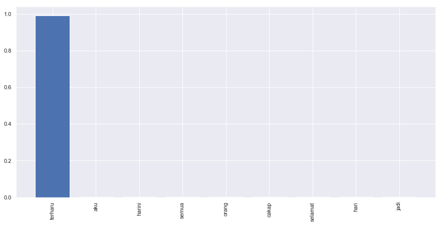
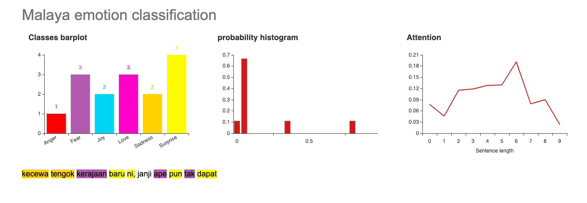

.. code:: ipython3

    %%time
    import malaya

.. parsed-literal::

    CPU times: user 10.4 s, sys: 640 ms, total: 11 s
    Wall time: 11 s

.. code:: ipython3

    anger_text = 'aku cukup tak suka budak gemuk tu'
    fear_text = 'saya takut dengan hantu'
    joy_text = 'gembiranya hari ni, dapat jumpa crush'
    love_text = 'saya terlalu cintakan dia'
    sadness_text = 'kawan rapat aku putuskan hubungan'
    surprise_text = 'terharu aku harini, semua orang cakap selamat hari jadi'

All models got ``get_proba`` parameters. If True, it will returned
probability every classes. Else, it will return highest probability
class. **Default is True.**

Load multinomial model
----------------------

.. code:: ipython3

    model = malaya.emotion.multinomial()
    print(model.predict(anger_text))
    print(model.predict(anger_text,get_proba=True))
    model.predict_batch([anger_text,
                        fear_text,
                        joy_text,
                        love_text,
                        sadness_text,
                        surprise_text])

.. parsed-literal::

    anger
    {'anger': 0.27993946463423486, 'fear': 0.1482931513658756, 'joy': 0.1880009584798728, 'love': 0.21711876657658918, 'sadness': 0.1296730712078804, 'surprise': 0.03697458773554805}

.. parsed-literal::

    ['anger', 'fear', 'joy', 'joy', 'sadness', 'fear']

Load xgb model
--------------

.. code:: ipython3

    model = malaya.emotion.xgb()
    print(model.predict(anger_text))
    print(model.predict(anger_text,get_proba=True))
    model.predict_batch([anger_text,
                        fear_text,
                        joy_text,
                        love_text,
                        sadness_text,
                        surprise_text],get_proba=True)

.. parsed-literal::

    love
    {'anger': 0.21755809, 'fear': 0.090371706, 'joy': 0.13347618, 'love': 0.47302967, 'sadness': 0.0770047, 'surprise': 0.008559667}

.. parsed-literal::

    [{'anger': 0.21755809,
      'fear': 0.090371706,
      'joy': 0.13347618,
      'love': 0.47302967,
      'sadness': 0.0770047,
      'surprise': 0.008559667},
     {'anger': 0.013483193,
      'fear': 0.939588,
      'joy': 0.01674833,
      'love': 0.003220023,
      'sadness': 0.022906518,
      'surprise': 0.0040539484},
     {'anger': 0.09142393,
      'fear': 0.029400537,
      'joy': 0.78257465,
      'love': 0.02881839,
      'sadness': 0.058004435,
      'surprise': 0.009778041},
     {'anger': 0.11640434,
      'fear': 0.097485565,
      'joy': 0.24893147,
      'love': 0.25440857,
      'sadness': 0.2650988,
      'surprise': 0.01767122},
     {'anger': 0.27124837,
      'fear': 0.15662362,
      'joy': 0.131251,
      'love': 0.022184724,
      'sadness': 0.41255626,
      'surprise': 0.006135965},
     {'anger': 0.0714585,
      'fear': 0.19790031,
      'joy': 0.037659157,
      'love': 0.0025473926,
      'sadness': 0.00772799,
      'surprise': 0.6827066}]

List available deep learning models
-----------------------------------

.. code:: ipython3

    malaya.emotion.available_deep_model()

.. parsed-literal::

    ['fast-text',
     'hierarchical',
     'bahdanau',
     'luong',
     'bidirectional',
     'bert',
     'entity-network']

.. code:: ipython3

    for i in malaya.emotion.available_deep_model():
        print('Testing %s model'%(i))
        model = malaya.emotion.deep_model(i)
        print(model.predict(anger_text))
        print(model.predict_batch([anger_text,
                        fear_text,
                        joy_text,
                        love_text,
                        sadness_text,
                        surprise_text]))
        print(model.predict_batch([anger_text,
                        fear_text,
                        joy_text,
                        love_text,
                        sadness_text,
                        surprise_text], get_proba = True))
        print()

.. parsed-literal::

    Testing fast-text model
    love
    ['love', 'fear', 'joy', 'love', 'sadness', 'surprise']
    [{'anger': 2.978304e-06, 'fear': 1.8461518e-10, 'joy': 1.0204276e-09, 'love': 0.999997, 'sadness': 1.3693535e-09, 'surprise': 2.6386826e-09}, {'anger': 1.2210384e-18, 'fear': 1.0, 'joy': 1.0015556e-19, 'love': 1.8750202e-24, 'sadness': 6.976661e-21, 'surprise': 3.2600536e-15}, {'anger': 2.47199e-19, 'fear': 2.3032567e-22, 'joy': 1.0, 'love': 5.1478095e-14, 'sadness': 4.464682e-20, 'surprise': 1.588908e-15}, {'anger': 4.1249185e-11, 'fear': 1.7474476e-10, 'joy': 0.00022258118, 'love': 0.9997774, 'sadness': 1.6592432e-11, 'surprise': 4.1854236e-09}, {'anger': 4.3972154e-08, 'fear': 2.1118221e-06, 'joy': 3.4898858e-07, 'love': 4.5489975e-12, 'sadness': 0.9999975, 'surprise': 4.8414757e-09}, {'anger': 1.1130476e-23, 'fear': 0.0003273876, 'joy': 5.694222e-17, 'love': 1.9363045e-25, 'sadness': 1.4252974e-26, 'surprise': 0.99967265}]
    
    Testing hierarchical model
    joy
    ['anger', 'fear', 'joy', 'joy', 'sadness', 'joy']
    [{'anger': 0.39431405, 'fear': 0.13933083, 'joy': 0.17727984, 'love': 0.042310942, 'sadness': 0.22523886, 'surprise': 0.021525377}, {'anger': 0.004958992, 'fear': 0.9853917, 'joy': 0.006676573, 'love': 0.00023657709, 'sadness': 0.0017484307, 'surprise': 0.0009877522}, {'anger': 0.0013627211, 'fear': 0.0017271177, 'joy': 0.986464, 'love': 0.0039458317, 'sadness': 0.0021411367, 'surprise': 0.0043591294}, {'anger': 0.028909639, 'fear': 0.09853578, 'joy': 0.50412154, 'love': 0.26376858, 'sadness': 0.084195614, 'surprise': 0.02046885}, {'anger': 0.022849305, 'fear': 0.011993612, 'joy': 0.008679014, 'love': 0.002472554, 'sadness': 0.9502534, 'surprise': 0.003752149}, {'anger': 0.015510161, 'fear': 0.0571924, 'joy': 0.5819401, 'love': 0.21683867, 'sadness': 0.006425157, 'surprise': 0.12209346}]
    
    Testing bahdanau model
    love
    ['love', 'fear', 'joy', 'love', 'sadness', 'surprise']
    [{'anger': 0.44805261, 'fear': 0.18378404, 'joy': 0.02516251, 'love': 0.30925235, 'sadness': 0.027497768, 'surprise': 0.0062507084}, {'anger': 0.0010828926, 'fear': 0.9789995, 'joy': 0.0027138714, 'love': 0.00061593985, 'sadness': 0.0048968275, 'surprise': 0.011690898}, {'anger': 0.012288661, 'fear': 0.0025563037, 'joy': 0.85003525, 'love': 0.12451392, 'sadness': 0.0008497203, 'surprise': 0.009756153}, {'anger': 0.02319879, 'fear': 0.031080244, 'joy': 0.14820175, 'love': 0.7294624, 'sadness': 0.021997027, 'surprise': 0.046059813}, {'anger': 0.031083692, 'fear': 0.035790402, 'joy': 0.01741525, 'love': 0.00062268815, 'sadness': 0.9130492, 'surprise': 0.0020387478}, {'anger': 0.00159852, 'fear': 0.34762463, 'joy': 0.04318491, 'love': 0.0028805388, 'sadness': 0.00093575486, 'surprise': 0.6037757}]
    
    Testing luong model
    love
    ['love', 'fear', 'joy', 'love', 'sadness', 'fear']
    [{'anger': 0.044591118, 'fear': 0.063305356, 'joy': 0.33247164, 'love': 0.5347649, 'sadness': 0.0068765697, 'surprise': 0.017990304}, {'anger': 0.0064159264, 'fear': 0.9606779, 'joy': 0.012426791, 'love': 0.0013584964, 'sadness': 0.008015306, 'surprise': 0.011105636}, {'anger': 0.0036163705, 'fear': 5.7273093e-05, 'joy': 0.98739016, 'love': 0.0076421387, 'sadness': 0.00028883366, 'surprise': 0.0010052109}, {'anger': 0.017377134, 'fear': 0.0073309895, 'joy': 0.07374035, 'love': 0.3433876, 'sadness': 0.5455663, 'surprise': 0.012597541}, {'anger': 0.0007876828, 'fear': 0.0009606754, 'joy': 9.633098e-05, 'love': 0.00014691186, 'sadness': 0.9978861, 'surprise': 0.00012229013}, {'anger': 0.00045764598, 'fear': 0.37070635, 'joy': 0.0005788357, 'love': 0.00027592952, 'sadness': 0.00033797708, 'surprise': 0.6276433}]
    
    Testing bidirectional model
    surprise
    ['anger', 'anger', 'anger', 'anger', 'anger', 'fear']
    [{'anger': 0.613231, 'fear': 0.21215951, 'joy': 0.00012107872, 'love': 0.007714424, 'sadness': 0.0029091935, 'surprise': 0.16386479}, {'anger': 0.7650685, 'fear': 0.12844206, 'joy': 0.00046135965, 'love': 0.0025065169, 'sadness': 0.012999088, 'surprise': 0.09052232}, {'anger': 0.7017255, 'fear': 0.12622964, 'joy': 0.00019186054, 'love': 0.0041279723, 'sadness': 0.0051922314, 'surprise': 0.16253278}, {'anger': 0.83330584, 'fear': 0.099247426, 'joy': 0.0007255099, 'love': 0.0023077168, 'sadness': 0.016625375, 'surprise': 0.047788195}, {'anger': 0.77445495, 'fear': 0.11811776, 'joy': 0.00019311535, 'love': 0.002333317, 'sadness': 0.004926041, 'surprise': 0.09997472}, {'anger': 0.28467438, 'fear': 0.3107746, 'joy': 0.0009574863, 'love': 0.039786864, 'sadness': 0.0549624, 'surprise': 0.3088443}]
    
    Testing bert model
    anger
    ['anger', 'anger', 'anger', 'anger', 'anger', 'anger']
    [{'anger': 0.79530007, 'fear': 0.043149363, 'joy': 0.050191555, 'love': 0.0028053583, 'sadness': 0.1083552, 'surprise': 0.0001983959}, {'anger': 0.7761929, 'fear': 0.02267685, 'joy': 0.08533038, 'love': 0.019361326, 'sadness': 0.09622978, 'surprise': 0.00020885638}, {'anger': 0.724599, 'fear': 0.021534633, 'joy': 0.14938025, 'love': 0.009412263, 'sadness': 0.09488238, 'surprise': 0.0001914676}, {'anger': 0.8217926, 'fear': 0.009756618, 'joy': 0.061514165, 'love': 0.03527268, 'sadness': 0.07142815, 'surprise': 0.00023569519}, {'anger': 0.9093987, 'fear': 0.00811897, 'joy': 0.024754424, 'love': 0.003218321, 'sadness': 0.054415427, 'surprise': 9.422473e-05}, {'anger': 0.9215124, 'fear': 0.009484482, 'joy': 0.023237498, 'love': 0.0027847919, 'sadness': 0.042906344, 'surprise': 7.447611e-05}]
    
    Testing entity-network model
    joy
    ['joy', 'sadness', 'joy', 'sadness', 'sadness', 'joy']
    [{'anger': 0.11245817, 'fear': 0.09678851, 'joy': 0.29964533, 'love': 0.07372399, 'sadness': 0.26239878, 'surprise': 0.15498528}, {'anger': 0.12070423, 'fear': 0.13202831, 'joy': 0.22073878, 'love': 0.031163175, 'sadness': 0.3202514, 'surprise': 0.175114}, {'anger': 0.11448454, 'fear': 0.10408847, 'joy': 0.2848294, 'love': 0.059466686, 'sadness': 0.27815202, 'surprise': 0.1589789}, {'anger': 0.12346853, 'fear': 0.15664044, 'joy': 0.17575133, 'love': 0.019622162, 'sadness': 0.33732292, 'surprise': 0.18719462}, {'anger': 0.117459856, 'fear': 0.115517266, 'joy': 0.25831792, 'love': 0.044844825, 'sadness': 0.2980614, 'surprise': 0.16579871}, {'anger': 0.11082334, 'fear': 0.09062623, 'joy': 0.30381778, 'love': 0.097978726, 'sadness': 0.24158238, 'surprise': 0.15517157}]
    

Unsupervised important words learning
-------------------------------------

.. code:: ipython3

    import matplotlib.pyplot as plt
    import seaborn as sns
    sns.set() # i just really like seaborn colors

We need to set ``get_proba`` become True to get the ‘attention’.

Visualizing bahdanau model
^^^^^^^^^^^^^^^^^^^^^^^^^^

.. code:: ipython3

    model = malaya.emotion.deep_model('bahdanau')
    result = model.predict(surprise_text, get_proba = True)['attention']
    
    plt.figure(figsize = (15, 7))
    labels = [r[0] for r in result]
    val = [r[1] for r in result]
    aranged = [i for i in range(len(labels))]
    plt.bar(aranged, val)
    plt.xticks(aranged, labels, rotation = 'vertical')
    plt.show()

Visualizing luong model
^^^^^^^^^^^^^^^^^^^^^^^

.. code:: ipython3

    model = malaya.emotion.deep_model('luong')
    result = model.predict(surprise_text, get_proba = True)['attention']
    
    plt.figure(figsize = (15, 7))
    labels = [r[0] for r in result]
    val = [r[1] for r in result]
    aranged = [i for i in range(len(labels))]
    plt.bar(aranged, val)
    plt.xticks(aranged, labels, rotation = 'vertical')
    plt.show()

.. image:: load-emotion_files/load-emotion_16_0.png

Visualizing hierarchical model
^^^^^^^^^^^^^^^^^^^^^^^^^^^^^^

.. code:: ipython3

    model = malaya.emotion.deep_model('hierarchical')
    result = model.predict(surprise_text, get_proba=True)['attention']
    
    plt.figure(figsize = (15, 7))
    labels = [r[0] for r in result]
    val = [r[1] for r in result]
    aranged = [i for i in range(len(labels))]
    plt.bar(aranged, val)
    plt.xticks(aranged, labels, rotation = 'vertical')
    plt.show()

Load Sparse deep learning models
--------------------------------

What happen if a word not included in the dictionary of the models? like
``setan``, what if ``setan`` appeared in text we want to classify? We
found this problem when classifying social media texts / posts. Words
used not really a vocabulary-based contextual.

Malaya will treat **unknown words** as ``<UNK>``, so, to solve this
problem, we need to use N-grams character based. Malaya chose tri-grams
until fifth-grams.

.. code:: python

   setan = ['set', 'eta', 'tan']

Sklearn provided easy interface to use n-grams, problem is, it is very
sparse, a lot of zeros and not memory efficient. Sklearn returned sparse
matrix for the result, lucky Tensorflow already provided some sparse
function.

.. code:: ipython3

    malaya.emotion.available_sparse_deep_model()

.. parsed-literal::

    ['fast-text-char']

Right now Malaya only provide 1 sparse model, ``fast-text-char``. We
will try to evolve it.

.. code:: ipython3

    sparse_model = malaya.emotion.sparse_deep_model()

.. parsed-literal::

    INFO:tensorflow:Restoring parameters from /Users/huseinzol/Malaya/emotion/fast-text-char/model.ckpt

.. code:: ipython3

    sparse_model.predict(sadness_text)

.. parsed-literal::

    'sadness'

.. code:: ipython3

    sparse_model.predict_batch([anger_text,
                        fear_text,
                        joy_text,
                        love_text,
                        sadness_text,
                        surprise_text])

.. parsed-literal::

    ['love', 'fear', 'joy', 'love', 'sadness', 'fear']

.. code:: ipython3

    sparse_model.predict_batch([anger_text,
                        fear_text,
                        joy_text,
                        love_text,
                        sadness_text,
                        surprise_text], get_proba = True)

.. parsed-literal::

    [{'anger': 0.055561937,
      'fear': 0.034661848,
      'joy': 0.20765074,
      'love': 0.65774184,
      'sadness': 0.0210206,
      'surprise': 0.023363067},
     {'anger': 1.5065236e-05,
      'fear': 0.9998666,
      'joy': 6.3056427e-06,
      'love': 2.9068442e-06,
      'sadness': 3.6798014e-05,
      'surprise': 7.235542e-05},
     {'anger': 0.00097060547,
      'fear': 5.1922354e-05,
      'joy': 0.99052715,
      'love': 0.0024538564,
      'sadness': 0.0005109437,
      'surprise': 0.005485538},
     {'anger': 0.00014133049,
      'fear': 0.0004463539,
      'joy': 0.12486383,
      'love': 0.87307847,
      'sadness': 0.0013382707,
      'surprise': 0.0001317923},
     {'anger': 0.0077239843,
      'fear': 0.014800851,
      'joy': 0.008525367,
      'love': 0.0013007816,
      'sadness': 0.9655128,
      'surprise': 0.0021361646},
     {'anger': 0.0003960413,
      'fear': 0.6634573,
      'joy': 0.0014801685,
      'love': 0.00056572456,
      'sadness': 0.000516784,
      'surprise': 0.33358407}]

