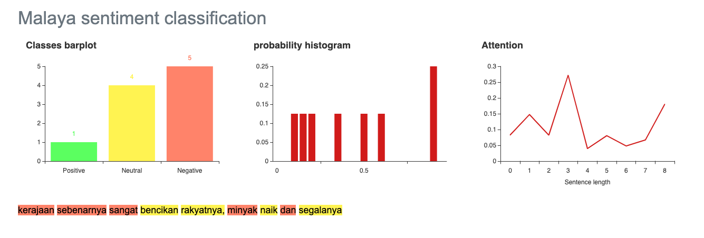

.. code:: python

    %%time
    import malaya

.. parsed-literal::

    CPU times: user 4.83 s, sys: 1.16 s, total: 5.99 s
    Wall time: 6.98 s

.. code:: python

    string1 = 'Sis, students from overseas were brought back because they are not in their countries which is if something happens to them, its not the other countries’ responsibility. Student dalam malaysia ni dah dlm tggjawab kerajaan. Mana part yg tak faham?'
    string2 = 'Harap kerajaan tak bukak serentak. Slowly release week by week. Focus on economy related industries dulu'

Load multinomial model
----------------------

All model interface will follow sklearn interface started v3.4,

.. code:: python

   model.predict(List[str])

   model.predict_proba(List[str])

.. code:: python

    model = malaya.sentiment.multinomial()

.. code:: python

    model.predict([string1, string2])

.. parsed-literal::

    ['positive', 'negative']

.. code:: python

    model.predict_proba([string1, string2])

.. parsed-literal::

    [{'negative': 0.008184343650433397,
      'positive': 0.18156563495665812,
      'neutral': 0.8102500213929085},
     {'negative': 0.010056240383248257,
      'positive': 0.009943759616751778,
      'neutral': 0.98}]

Disable ``neutral`` probability,

.. code:: python

    model.predict_proba([string1, string2], add_neutral = False)

.. parsed-literal::

    [{'negative': 0.40921718252166983, 'positive': 0.5907828174783291},
     {'negative': 0.5028120191624128, 'positive': 0.49718798083758886}]

List available Transformer models
---------------------------------

.. code:: python

    malaya.sentiment.available_transformer_model()

.. parsed-literal::

    {'bert': ['425.6 MB', 'accuracy: 0.993'],
     'tiny-bert': ['57.4 MB', 'accuracy: 0.987'],
     'albert': ['48.6 MB', 'accuracy: 0.992'],
     'tiny-albert': ['22.4 MB', 'accuracy: 0.985'],
     'xlnet': ['446.5 MB', 'accuracy: 0.993'],
     'alxlnet': ['46.8 MB', 'accuracy: 0.991']}

Make sure you can check accuracy chart from here first before select a
model,
https://malaya.readthedocs.io/en/latest/Accuracy.html#sentiment-analysis

**You might want to use Tiny-Albert, a very small size, 22.4MB, but the
accuracy is still on the top notch.**

Load XLNET model
----------------

All model interface will follow sklearn interface started v3.4,

.. code:: python

   model.predict(List[str])

   model.predict_proba(List[str])

.. code:: python

    model = malaya.sentiment.transformer(model = 'xlnet')

.. parsed-literal::

    WARNING:tensorflow:From /Users/huseinzolkepli/Documents/Malaya/malaya/function/__init__.py:54: The name tf.gfile.GFile is deprecated. Please use tf.io.gfile.GFile instead.
    
    WARNING:tensorflow:From /Users/huseinzolkepli/Documents/Malaya/malaya/function/__init__.py:55: The name tf.GraphDef is deprecated. Please use tf.compat.v1.GraphDef instead.
    
    WARNING:tensorflow:From /Users/huseinzolkepli/Documents/Malaya/malaya/function/__init__.py:49: The name tf.InteractiveSession is deprecated. Please use tf.compat.v1.InteractiveSession instead.
    

Predict batch of strings
^^^^^^^^^^^^^^^^^^^^^^^^

.. code:: python

    model.predict_proba([string1, string2])

.. parsed-literal::

    [{'negative': 0.00018888633, 'positive': 0.9811114, 'neutral': 0.018699706},
     {'negative': 0.8079505, 'positive': 0.0019204962, 'neutral': 0.19012898}]

.. code:: python

    model.predict_proba([string1, string2], add_neutral = False)

.. parsed-literal::

    [{'negative': 0.029847767, 'positive': 0.97015226},
     {'negative': 0.1034979, 'positive': 0.89650214}]

Open emotion visualization dashboard
^^^^^^^^^^^^^^^^^^^^^^^^^^^^^^^^^^^^

Default when you call ``predict_words`` it will open a browser with
visualization dashboard, you can disable by ``visualization=False``.

.. code:: python

    model.predict_words(string1)

.. code:: python

    from IPython.core.display import Image, display
    
    display(Image('sentiment-dashboard.png', width=800))

Stacking models
---------------

More information, you can read at
https://malaya.readthedocs.io/en/latest/Stack.html

.. code:: python

    multinomial = malaya.sentiment.multinomial()
    alxlnet = malaya.sentiment.transformer(model = 'alxlnet')

.. code:: python

    malaya.stack.predict_stack([multinomial, alxlnet, model], [string1, string2])

.. parsed-literal::

    [{'negative': 0.0005453552136673502,
      'positive': 0.5603020846001405,
      'neutral': 0.05399025419995675},
     {'negative': 0.0002248290781177622,
      'positive': 0.21361579430243546,
      'neutral': 0.022142383292097452}]

If you do not want neutral in ``predict_stack``, simply override the
parameter,

.. code:: python

    malaya.stack.predict_stack([multinomial, alxlnet, model], [string1, string2], add_neutral = False)

.. parsed-literal::

    [{'negative': 0.05828375571937787, 'positive': 0.8221586003437801},
     {'negative': 0.014352668987571138, 'positive': 0.7835866999009022}]

