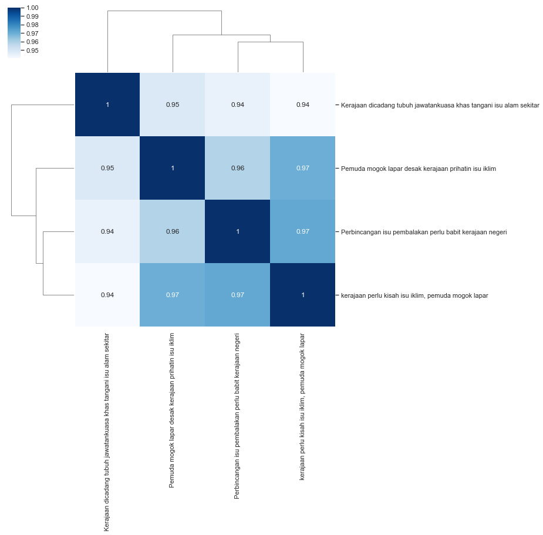

.. code:: python

    %%time
    import malaya

.. parsed-literal::

    CPU times: user 6.07 s, sys: 1.3 s, total: 7.38 s
    Wall time: 10.4 s

.. code:: python

    string1 = 'Pemuda mogok lapar desak kerajaan prihatin isu iklim'
    string2 = 'Perbincangan isu pembalakan perlu babit kerajaan negeri'
    string3 = 'kerajaan perlu kisah isu iklim, pemuda mogok lapar'
    string4 = 'Kerajaan dicadang tubuh jawatankuasa khas tangani isu alam sekitar'

Calculate similarity using doc2vec
----------------------------------

We can use any word vector interface provided by Malaya to use doc2vec
similarity interface.

Important parameters, 1. ``aggregation``, aggregation function to
accumulate word vectors. Default is ``mean``.

::

   * ``'mean'`` - mean.
   * ``'min'`` - min.
   * ``'max'`` - max.
   * ``'sum'`` - sum.
   * ``'sqrt'`` - square root.

2. ``similarity`` distance function to calculate similarity. Default is
   ``cosine``.

   -  ``'cosine'`` - cosine similarity.
   -  ``'euclidean'`` - euclidean similarity.
   -  ``'manhattan'`` - manhattan similarity.

Using word2vec
^^^^^^^^^^^^^^

I will use ``load_news``, word2vec from wikipedia took a very long time.
wikipedia much more accurate.

.. code:: python

    embedded_news = malaya.wordvector.load_news(256)
    w2v_wiki = malaya.wordvector.load(embedded_news['nce_weights'],
                                        embedded_news['dictionary'])
    doc2vec = malaya.similarity.doc2vec(w2v_wiki)

.. parsed-literal::

    WARNING: Logging before flag parsing goes to stderr.
    W0911 18:39:35.259301 4561462720 deprecation_wrapper.py:119] From /Users/huseinzol/Documents/Malaya/malaya/wordvector.py:85: The name tf.placeholder is deprecated. Please use tf.compat.v1.placeholder instead.

    W0911 18:39:35.311326 4561462720 deprecation_wrapper.py:119] From /Users/huseinzol/Documents/Malaya/malaya/wordvector.py:96: The name tf.InteractiveSession is deprecated. Please use tf.compat.v1.InteractiveSession instead.

predict for 2 strings
^^^^^^^^^^^^^^^^^^^^^

.. code:: python

    doc2vec.predict(string1, string2, aggregation = 'mean', soft = False)

.. parsed-literal::

    0.8368814

predict batch of strings
^^^^^^^^^^^^^^^^^^^^^^^^

.. code:: python

    doc2vec.predict_batch([string1, string2], [string3, string4])

.. parsed-literal::

    array([0.9507282 , 0.88227606], dtype=float32)

visualize tree plot
^^^^^^^^^^^^^^^^^^^

.. code:: python

    doc2vec.tree_plot([string1, string2, string3, string4])

.. parsed-literal::

    <Figure size 504x504 with 0 Axes>

.. image:: load-similarity_files/load-similarity_10_1.png

Different similarity function different percentage.

Calculate similarity using deep encoder
---------------------------------------

We can use any encoder models provided by Malaya to use encoder
similarity interface, example, BERT, XLNET, and skip-thought. Again,
these encoder models not trained to do similarity classification, it
just encode the strings into vector representation.

Important parameters,

1. ``similarity`` distance function to calculate similarity. Default is
   ``cosine``.

   -  ``'cosine'`` - cosine similarity.
   -  ``'euclidean'`` - euclidean similarity.
   -  ``'manhattan'`` - manhattan similarity.

using xlnet
^^^^^^^^^^^

.. code:: python

    xlnet = malaya.transformer.load(model = 'xlnet')
    encoder = malaya.similarity.encoder(xlnet)

.. parsed-literal::

    WARNING: Logging before flag parsing goes to stderr.
    W1018 09:43:51.760437 4592133568 deprecation_wrapper.py:119] From /Users/huseinzol/Documents/Malaya/malaya/_transformer/_xlnet_model/xlnet.py:70: The name tf.gfile.Open is deprecated. Please use tf.io.gfile.GFile instead.

    W1018 09:43:51.773338 4592133568 deprecation_wrapper.py:119] From /Users/huseinzol/Documents/Malaya/malaya/_transformer/_xlnet.py:71: The name tf.placeholder is deprecated. Please use tf.compat.v1.placeholder instead.

    W1018 09:43:51.808459 4592133568 deprecation_wrapper.py:119] From /Users/huseinzol/Documents/Malaya/malaya/_transformer/_xlnet_model/xlnet.py:253: The name tf.variable_scope is deprecated. Please use tf.compat.v1.variable_scope instead.

    W1018 09:43:51.810034 4592133568 deprecation_wrapper.py:119] From /Users/huseinzol/Documents/Malaya/malaya/_transformer/_xlnet_model/xlnet.py:253: The name tf.AUTO_REUSE is deprecated. Please use tf.compat.v1.AUTO_REUSE instead.

    W1018 09:43:51.811383 4592133568 deprecation_wrapper.py:119] From /Users/huseinzol/Documents/Malaya/malaya/_transformer/_xlnet_model/modeling.py:686: The name tf.logging.info is deprecated. Please use tf.compat.v1.logging.info instead.

    W1018 09:43:51.813071 4592133568 deprecation_wrapper.py:119] From /Users/huseinzol/Documents/Malaya/malaya/_transformer/_xlnet_model/modeling.py:693: The name tf.get_variable is deprecated. Please use tf.compat.v1.get_variable instead.

    W1018 09:43:51.921389 4592133568 deprecation.py:323] From /Users/huseinzol/Documents/Malaya/malaya/_transformer/_xlnet_model/modeling.py:797: dropout (from tensorflow.python.layers.core) is deprecated and will be removed in a future version.
    Instructions for updating:
    Use keras.layers.dropout instead.
    W1018 09:43:52.719312 4592133568 deprecation.py:323] From /Users/huseinzol/Documents/Malaya/malaya/_transformer/_xlnet_model/modeling.py:99: dense (from tensorflow.python.layers.core) is deprecated and will be removed in a future version.
    Instructions for updating:
    Use keras.layers.dense instead.
    W1018 09:43:59.544004 4592133568 deprecation_wrapper.py:119] From /Users/huseinzol/Documents/Malaya/malaya/_transformer/_xlnet.py:84: The name tf.InteractiveSession is deprecated. Please use tf.compat.v1.InteractiveSession instead.

    W1018 09:44:00.761409 4592133568 deprecation_wrapper.py:119] From /Users/huseinzol/Documents/Malaya/malaya/_transformer/_xlnet.py:90: The name tf.train.Saver is deprecated. Please use tf.compat.v1.train.Saver instead.

    W1018 09:44:01.053367 4592133568 deprecation.py:323] From /usr/local/lib/python3.6/site-packages/tensorflow/python/training/saver.py:1276: checkpoint_exists (from tensorflow.python.training.checkpoint_management) is deprecated and will be removed in a future version.
    Instructions for updating:
    Use standard file APIs to check for files with this prefix.

predict for 2 strings
^^^^^^^^^^^^^^^^^^^^^

.. code:: python

    encoder.predict(string1, string2)

.. parsed-literal::

    0.88778234

predict batch of strings
^^^^^^^^^^^^^^^^^^^^^^^^

.. code:: python

    encoder.predict_batch([string1, string2], [string3, string4])

.. parsed-literal::

    array([0.97005975, 0.9447437 ], dtype=float32)

visualize tree plot
^^^^^^^^^^^^^^^^^^^

.. code:: python

    encoder.tree_plot([string1, string2, string3, string4])

.. parsed-literal::

    <Figure size 504x504 with 0 Axes>

List available Transformer models
---------------------------------

.. code:: python

    malaya.similarity.available_transformer_model()

.. parsed-literal::

    {'bert': ['base'], 'xlnet': ['base'], 'albert': ['base']}

Make sure you can check accuracy chart from here first before select a
model, https://malaya.readthedocs.io/en/latest/Accuracy.html#similarity

**You might want to use ALBERT, a very small size, 43MB, but the
accuracy is still on the top notch.**

.. code:: python

    model = malaya.similarity.transformer(model = 'albert')

.. parsed-literal::

    W1018 09:45:25.593791 4592133568 deprecation_wrapper.py:119] From /Users/huseinzol/Documents/Malaya/malaya/_utils/_utils.py:68: The name tf.gfile.GFile is deprecated. Please use tf.io.gfile.GFile instead.

.. code:: python

    model.predict(string1, string3)

.. parsed-literal::

    0.043411437

predict batch
^^^^^^^^^^^^^

you need to give list of left strings, and list of right strings.

first left string will compare will first right string and so on.

.. code:: python

    model.predict_batch([string1, string2], [string3, string4])

.. parsed-literal::

    array([0.07098369, 0.0001071 ], dtype=float32)

.. code:: python

    model = malaya.similarity.transformer(model = 'xlnet')

.. parsed-literal::

    WARNING: Logging before flag parsing goes to stderr.
    W1018 09:52:34.326930 4583105984 deprecation_wrapper.py:119] From /Users/huseinzol/Documents/Malaya/malaya/_utils/_utils.py:68: The name tf.gfile.GFile is deprecated. Please use tf.io.gfile.GFile instead.

    W1018 09:52:34.332230 4583105984 deprecation_wrapper.py:119] From /Users/huseinzol/Documents/Malaya/malaya/_utils/_utils.py:69: The name tf.GraphDef is deprecated. Please use tf.compat.v1.GraphDef instead.

    W1018 09:52:39.548710 4583105984 deprecation_wrapper.py:119] From /Users/huseinzol/Documents/Malaya/malaya/_utils/_utils.py:64: The name tf.InteractiveSession is deprecated. Please use tf.compat.v1.InteractiveSession instead.

.. code:: python

    model.predict_batch([string1, string2], [string3, string4])

.. parsed-literal::

    array([0.99143314, 0.96505105], dtype=float32)
