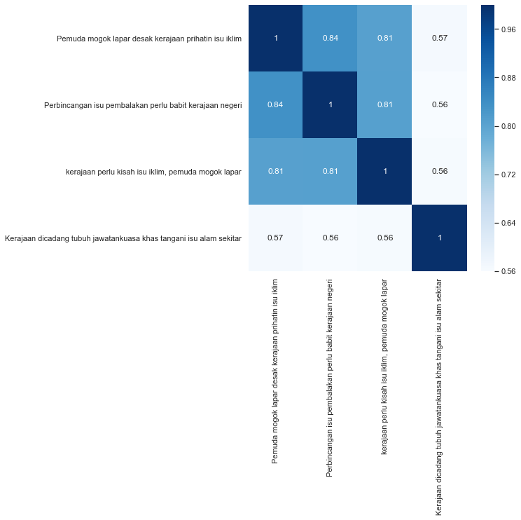

.. code:: python

    %%time
    import malaya

.. parsed-literal::

    CPU times: user 4.39 s, sys: 885 ms, total: 5.27 s
    Wall time: 4.48 s

.. code:: python

    string1 = 'Pemuda mogok lapar desak kerajaan prihatin isu iklim'
    string2 = 'Perbincangan isu pembalakan perlu babit kerajaan negeri'
    string3 = 'kerajaan perlu kisah isu iklim, pemuda mogok lapar'
    string4 = 'Kerajaan dicadang tubuh jawatankuasa khas tangani isu alam sekitar'

.. code:: python

    news1 = 'Tun Dr Mahathir Mohamad mengakui pembubaran Parlimen bagi membolehkan pilihan raya diadakan tidak sesuai dilaksanakan pada masa ini berikutan isu COVID-19'
    husein = 'DrM sembang pilihan raya tak boleh buat sebab COVID 19'

Calculate similarity using doc2vec
----------------------------------

We can use any word vector interface provided by Malaya to use doc2vec
similarity interface.

Important parameters, 1. ``aggregation``, aggregation function to
accumulate word vectors. Default is ``mean``.

::

   * ``'mean'`` - mean.
   * ``'min'`` - min.
   * ``'max'`` - max.
   * ``'sum'`` - sum.
   * ``'sqrt'`` - square root.

2. ``similarity`` distance function to calculate similarity. Default is
   ``cosine``.

   -  ``'cosine'`` - cosine similarity.
   -  ``'euclidean'`` - euclidean similarity.
   -  ``'manhattan'`` - manhattan similarity.

Using word2vec
^^^^^^^^^^^^^^

I will use ``load_news``, word2vec from wikipedia took a very long time.
wikipedia much more accurate.

.. code:: python

    vocab_news, embedded_news = malaya.wordvector.load_news()
    w2v = malaya.wordvector.load(embedded_news, vocab_news)
    doc2vec = malaya.similarity.doc2vec(w2v)

.. parsed-literal::

    downloading frozen /Users/huseinzolkepli/Malaya/wordvector/news vocab

.. parsed-literal::

    4.00MB [00:01, 2.03MB/s]                          

.. parsed-literal::

    downloading frozen /Users/huseinzolkepli/Malaya/wordvector/news model

.. parsed-literal::

    191MB [01:01, 3.13MB/s]                          

.. parsed-literal::

    WARNING:tensorflow:From /Users/huseinzolkepli/Documents/Malaya/malaya/wordvector.py:114: The name tf.placeholder is deprecated. Please use tf.compat.v1.placeholder instead.
    
    WARNING:tensorflow:From /Users/huseinzolkepli/Documents/Malaya/malaya/wordvector.py:125: The name tf.InteractiveSession is deprecated. Please use tf.compat.v1.InteractiveSession instead.
    

predict for 2 strings
^^^^^^^^^^^^^^^^^^^^^

.. code:: python

    doc2vec.predict_proba([string1], [string2], aggregation = 'mean', soft = False)

.. parsed-literal::

    array([0.899711], dtype=float32)

predict batch of strings
^^^^^^^^^^^^^^^^^^^^^^^^

.. code:: python

    doc2vec.predict_proba([string1, string2], [string3, string4])

.. parsed-literal::

    array([0.9215344, 0.853461 ], dtype=float32)

visualize heatmap
^^^^^^^^^^^^^^^^^

.. code:: python

    doc2vec.heatmap([string1, string2, string3, string4])

.. image:: load-similarity_files/load-similarity_11_0.png

Different similarity function different percentage.

Calculate similarity using deep encoder
---------------------------------------

We can use any encoder models provided by Malaya to use encoder
similarity interface, example, BERT, XLNET, and skip-thought. Again,
these encoder models not trained to do similarity classification, it
just encode the strings into vector representation.

Important parameters,

1. ``similarity`` distance function to calculate similarity. Default is
   ``cosine``.

   -  ``'cosine'`` - cosine similarity.
   -  ``'euclidean'`` - euclidean similarity.
   -  ``'manhattan'`` - manhattan similarity.

using xlnet
^^^^^^^^^^^

.. code:: python

    xlnet = malaya.transformer.load(model = 'xlnet')
    encoder = malaya.similarity.encoder(xlnet)

.. parsed-literal::

    INFO:tensorflow:memory input None
    INFO:tensorflow:Use float type <dtype: 'float32'>
    INFO:tensorflow:Restoring parameters from /Users/huseinzolkepli/Malaya/xlnet-model/base/xlnet-base/model.ckpt

predict for 2 strings
^^^^^^^^^^^^^^^^^^^^^

.. code:: python

    encoder.predict_proba([string1], [string2])

.. parsed-literal::

    array([0.8212017], dtype=float32)

predict batch of strings
^^^^^^^^^^^^^^^^^^^^^^^^

.. code:: python

    encoder.predict_proba([string1, string2, news1, news1], [string3, string4, husein, string1])

.. parsed-literal::

    array([0.8097714 , 0.78071797, 0.8244793 , 0.5807183 ], dtype=float32)

visualize heatmap
^^^^^^^^^^^^^^^^^

.. code:: python

    encoder.heatmap([string1, string2, string3, string4])

List available Transformer models
---------------------------------

.. code:: python

    malaya.similarity.available_transformer()

.. parsed-literal::

    {'bert': ['423.4 MB', 'accuracy: 0.885'],
     'tiny-bert': ['56.6 MB', 'accuracy: 0.873'],
     'albert': ['46.3 MB', 'accuracy: 0.873'],
     'tiny-albert': ['21.9 MB', 'accuracy: 0.824'],
     'xlnet': ['448.7 MB', 'accuracy: 0.784'],
     'alxlnet': ['49.0 MB', 'accuracy: 0.888']}

We trained on `Quora Question
Pairs <https://github.com/huseinzol05/Malay-Dataset#quora>`__,
`translated SNLI <https://github.com/huseinzol05/Malay-Dataset#snli>`__
and `translated
MNLI <https://github.com/huseinzol05/Malay-Dataset#mnli>`__

Make sure you can check accuracy chart from here first before select a
model, https://malaya.readthedocs.io/en/latest/Accuracy.html#similarity

**You might want to use ALXLNET, a very small size, 49MB, but the
accuracy is still on the top notch.**

Load transformer model
----------------------

In this example, I am going to load ``alxlnet``, feel free to use any
available models above.

.. code:: python

    model = malaya.similarity.transformer(model = 'alxlnet')

.. parsed-literal::

    WARNING:tensorflow:From /Users/huseinzolkepli/Documents/Malaya/malaya/function/__init__.py:54: The name tf.gfile.GFile is deprecated. Please use tf.io.gfile.GFile instead.
    
    WARNING:tensorflow:From /Users/huseinzolkepli/Documents/Malaya/malaya/function/__init__.py:55: The name tf.GraphDef is deprecated. Please use tf.compat.v1.GraphDef instead.
    

predict batch
^^^^^^^^^^^^^

.. code:: python

   def predict_proba(self, strings_left: List[str], strings_right: List[str]):
       """
       calculate similarity for two different batch of texts.

       Parameters
       ----------
       string_left : List[str]
       string_right : List[str]

       Returns
       -------
       result : List[float]
       """

you need to give list of left strings, and list of right strings.

first left string will compare will first right string and so on.

similarity model only supported ``predict_proba``.

.. code:: python

    model.predict_proba([string1, string2, news1, news1], [string3, string4, husein, string1])

.. parsed-literal::

    array([0.9986665 , 0.04221377, 0.7916767 , 0.98151684], dtype=float32)

visualize heatmap
^^^^^^^^^^^^^^^^^

.. code:: python

    model.heatmap([string1, string2, string3, string4])

.. image:: load-similarity_files/load-similarity_30_0.png

.. code:: python

    alxlnet = malaya.similarity.transformer(model = 'alxlnet')
    albert = malaya.similarity.transformer(model = 'albert')
    tiny_bert = malaya.similarity.transformer(model = 'tiny-bert')

.. parsed-literal::

    WARNING:tensorflow:From /Users/huseinzolkepli/Documents/Malaya/malaya/function/__init__.py:54: The name tf.gfile.GFile is deprecated. Please use tf.io.gfile.GFile instead.
    
    WARNING:tensorflow:From /Users/huseinzolkepli/Documents/Malaya/malaya/function/__init__.py:55: The name tf.GraphDef is deprecated. Please use tf.compat.v1.GraphDef instead.
    
    WARNING:tensorflow:From /Users/huseinzolkepli/Documents/Malaya/malaya/function/__init__.py:49: The name tf.InteractiveSession is deprecated. Please use tf.compat.v1.InteractiveSession instead.
    
    WARNING:tensorflow:From /usr/local/lib/python3.7/site-packages/albert/tokenization.py:240: The name tf.logging.info is deprecated. Please use tf.compat.v1.logging.info instead.
    
    INFO:tensorflow:loading sentence piece model

Stacking models
---------------

More information, you can read at
https://malaya.readthedocs.io/en/latest/Stack.html

If you want to stack zero-shot classification models, you need to pass
labels using keyword parameter,

.. code:: python

   malaya.stack.predict_stack([model1, model2], List[str], strings_right = List[str])

We will passed ``strings_right`` as ``**kwargs``.

.. code:: python

    malaya.stack.predict_stack([alxlnet, albert, tiny_bert], [string1, string2, news1, news1], 
                               strings_right = [string3, string4, husein, string1])

.. parsed-literal::

    array([0.99745977, 0.07261255, 0.16457608, 0.03985301], dtype=float32)

