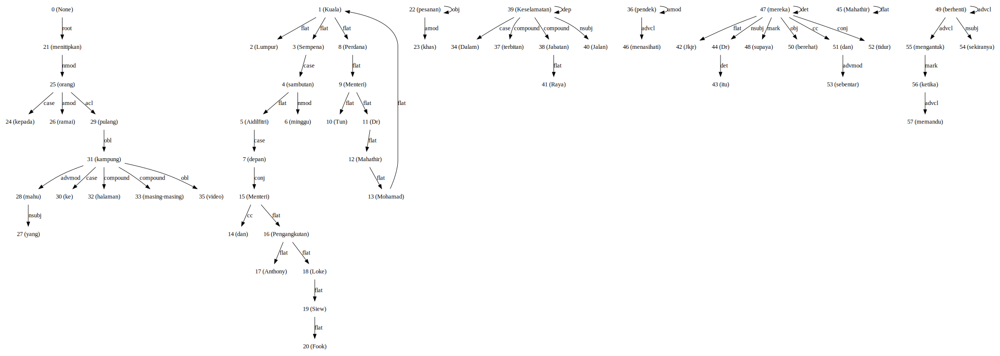

Why Stacking?
-------------

Sometime a single model is not good enough. So, you need to use multiple
models to get a better result! It called stacking.

.. code:: python

    %%time
    import malaya

.. parsed-literal::

    CPU times: user 9.68 s, sys: 747 ms, total: 10.4 s
    Wall time: 10.5 s

.. code:: python

    bahdanau = malaya.sentiment.deep_model('bahdanau')
    luong = malaya.sentiment.deep_model('luong')
    entity = malaya.sentiment.deep_model('entity-network')
    multinomial = malaya.sentiment.multinomial()

Stack multiple sentiment models
-------------------------------

``malaya.stack.predict_stack`` provide an easy stacking solution for
Malaya models. Well, not just for sentiment models, any classification
models can use ``malaya.stack.predict_stack``.

.. code:: python

   def predict_stack(models, text, mode = 'gmean'):
       """
       Stacking for predictive models.

       Parameters
       ----------
       models: list
           list of models
       text: str
           string to predict
       mode : str, optional (default='gmean')
           Model architecture supported. Allowed values:

           * ``'gmean'`` - geometrical mean
           * ``'hmean'`` - harmonic mean
           * ``'mean'`` - mean
           * ``'min'`` - min
           * ``'max'`` - max
           * ``'median'`` - Harrell-Davis median

       Returns
       -------
       result: dict
       """

.. code:: python

    malaya.stack.predict_stack([bahdanau,
                                luong,
                                entity,
                                multinomial],
                              'harga minyak tak menentu')

.. parsed-literal::

    {'negative': 0.506150402587375, 'positive': 0.4045639078752239}

Stack multiple toxic models
---------------------------

.. code:: python

    bahdanau = malaya.toxic.deep_model('bahdanau')
    luong = malaya.toxic.deep_model('luong')
    entity = malaya.toxic.deep_model('entity-network')
    malaya.stack.predict_stack([bahdanau,
                                luong,
                                entity],
                              'harga minyak tak menentu')

.. parsed-literal::

    {'toxic': 0.21490112,
     'severe_toxic': 0.07022426,
     'obscene': 0.17856258,
     'threat': 0.15631571,
     'insult': 0.16029277,
     'identity_hate': 0.1327232}

Stack language detection models
-------------------------------

.. code:: python

    xgb = malaya.language_detection.xgb()
    multinomial = malaya.language_detection.multinomial()
    sgd = malaya.language_detection.sgd()
    malaya.stack.predict_stack([xgb,
                                multinomial,
                                sgd],
                              'didukungi secara natifnya')

.. parsed-literal::

    {'OTHER': 1.5017138319820553e-05,
     'ENGLISH': 0.0,
     'INDONESIA': 0.0,
     'MALAY': 0.0}

Stack emotion detection models
------------------------------

.. code:: python

    xgb = malaya.emotion.xgb()
    multinomial = malaya.emotion.multinomial()
    bahdanau = malaya.emotion.deep_model('bahdanau')
    malaya.stack.predict_stack([xgb,
                                multinomial,
                                bahdanau],
                              'aku benci betul dekat budak gemuk tu')

.. parsed-literal::

    {'anger': 0.6324093751385098,
     'fear': 0.06528178211644504,
     'joy': 0.008890118694162983,
     'love': 0.011420978246531412,
     'sadness': 0.058377601127569685,
     'surprise': 0.004896366282692069}

Stack tagging models
--------------------

For tagging models, we use majority voting stacking. So you need to need
have more than 2 models to make it perfect, or else, it will pick
randomly from 2 models. ``malaya.stack.voting_stack`` provides easy
interface for this kind of stacking. **But only can use for Entites, POS
and Dependency Parsing recognition.**

.. code:: python

   def voting_stack(models, text):
       """
       Stacking for POS and Entities Recognition models.

       Parameters
       ----------
       models: list
           list of models
       text: str
           string to predict

       Returns
       -------
       result: list
       """

.. code:: python

    string = 'KUALA LUMPUR: Sempena sambutan Aidilfitri minggu depan, Perdana Menteri Tun Dr Mahathir Mohamad dan Menteri Pengangkutan Anthony Loke Siew Fook menitipkan pesanan khas kepada orang ramai yang mahu pulang ke kampung halaman masing-masing. Dalam video pendek terbitan Jabatan Keselamatan Jalan Raya (JKJR) itu, Dr Mahathir menasihati mereka supaya berhenti berehat dan tidur sebentar  sekiranya mengantuk ketika memandu.'
    entity_network = malaya.entity.deep_model('entity-network')
    bahdanau = malaya.entity.deep_model('bahdanau')
    luong = malaya.entity.deep_model('luong')
    malaya.stack.voting_stack([entity_network, bahdanau, luong], string)

.. parsed-literal::

    [('kuala', 'location'),
     ('lumpur', 'location'),
     ('sempena', 'OTHER'),
     ('sambutan', 'event'),
     ('aidilfitri', 'event'),
     ('minggu', 'time'),
     ('depan', 'time'),
     ('perdana', 'person'),
     ('menteri', 'person'),
     ('tun', 'person'),
     ('dr', 'person'),
     ('mahathir', 'person'),
     ('mohamad', 'person'),
     ('dan', 'OTHER'),
     ('menteri', 'person'),
     ('pengangkutan', 'organization'),
     ('anthony', 'person'),
     ('loke', 'person'),
     ('siew', 'person'),
     ('fook', 'person'),
     ('menitipkan', 'OTHER'),
     ('pesanan', 'OTHER'),
     ('khas', 'OTHER'),
     ('kepada', 'OTHER'),
     ('orang', 'OTHER'),
     ('ramai', 'OTHER'),
     ('yang', 'OTHER'),
     ('mahu', 'OTHER'),
     ('pulang', 'OTHER'),
     ('ke', 'OTHER'),
     ('kampung', 'OTHER'),
     ('halaman', 'time'),
     ('masing-masing', 'OTHER'),
     ('dalam', 'OTHER'),
     ('video', 'OTHER'),
     ('pendek', 'OTHER'),
     ('terbitan', 'OTHER'),
     ('jabatan', 'organization'),
     ('keselamatan', 'organization'),
     ('jalan', 'organization'),
     ('raya', 'organization'),
     ('jkjr', 'law'),
     ('itu', 'OTHER'),
     ('dr', 'person'),
     ('mahathir', 'person'),
     ('menasihati', 'OTHER'),
     ('mereka', 'OTHER'),
     ('supaya', 'OTHER'),
     ('berhenti', 'OTHER'),
     ('berehat', 'OTHER'),
     ('dan', 'OTHER'),
     ('tidur', 'OTHER'),
     ('sebentar', 'OTHER'),
     ('sekiranya', 'OTHER'),
     ('mengantuk', 'OTHER'),
     ('ketika', 'OTHER'),
     ('memandu', 'OTHER')]

.. code:: python

    bahdanau = malaya.dependency.deep_model('bahdanau')
    luong = malaya.dependency.deep_model('luong')
    concat = malaya.dependency.deep_model('concat')
    tagging, indexing = malaya.stack.voting_stack([concat, bahdanau, luong], string)

.. code:: python

    malaya.dependency.dependency_graph(tagging, indexing).to_graphvis()

