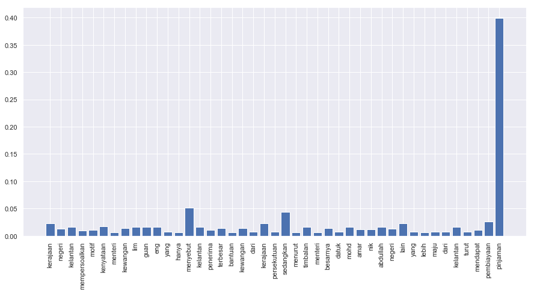

.. code:: python

    %%time
    import malaya

.. parsed-literal::

    CPU times: user 6.32 s, sys: 1.43 s, total: 7.76 s
    Wall time: 11.6 s

Explanation
-----------

Positive subjectivity: based on or influenced by personal feelings,
tastes, or opinions. Can be a positive or negative sentiment.

Negative subjectivity: based on a report or a fact. Can be a positive or
negative sentiment.

.. code:: python

    negative_text = 'Kerajaan negeri Kelantan mempersoalkan motif kenyataan Menteri Kewangan Lim Guan Eng yang hanya menyebut Kelantan penerima terbesar bantuan kewangan dari Kerajaan Persekutuan. Sedangkan menurut Timbalan Menteri Besarnya, Datuk Mohd Amar Nik Abdullah, negeri lain yang lebih maju dari Kelantan turut mendapat pembiayaan dan pinjaman.'
    positive_text = 'kerajaan sebenarnya sangat bencikan rakyatnya, minyak naik dan segalanya'

All models got ``get_proba`` parameters. If True, it will returned
probability every classes. Else, it will return highest probability
class. **Default is False.**

Load multinomial model
----------------------

.. code:: python

    model = malaya.subjective.multinomial()
    print(model.predict(positive_text,get_proba=True))
    print(model.predict(negative_text,get_proba=True))
    model.predict_batch([negative_text,negative_text],get_proba=True)

.. parsed-literal::

    downloading frozen /Users/huseinzol/Malaya/subjective/multinomial model

.. parsed-literal::

    1.00MB [00:00, 3.75MB/s]
      0%|          | 0.00/7.13 [00:00<?, ?MB/s]

.. parsed-literal::

    downloading frozen /Users/huseinzol/Malaya/subjective/multinomial vector

.. parsed-literal::

    8.00MB [00:01, 5.21MB/s]

.. parsed-literal::

    {'negative': 0.009240767162200498, 'positive': 0.0759232837799535, 'neutral': 0.914835949057846}
    {'negative': 0.7214589553228845, 'positive': 0.0027854104467711456, 'neutral': 0.2757556342303443}

.. parsed-literal::

    [{'negative': 0.7214589553228845,
      'positive': 0.0027854104467711456,
      'neutral': 0.2757556342303443},
     {'negative': 0.7214589553228845,
      'positive': 0.0027854104467711456,
      'neutral': 0.2757556342303443}]

List available Transformer models
---------------------------------

.. code:: python

    malaya.subjective.available_transformer_model()

.. parsed-literal::

    {'bert': ['base', 'small'], 'xlnet': ['base'], 'albert': ['base']}

Make sure you can check accuracy chart from here first before select a
model,
https://malaya.readthedocs.io/en/latest/Accuracy.html#subjectivity-analysis

**You might want to use ALBERT, a very small size, 43MB, but the
accuracy is still on the top notch.**

Load BERT model
---------------

.. code:: python

    model = malaya.subjective.transformer(model = 'bert', size = 'base')

.. parsed-literal::

    WARNING: Logging before flag parsing goes to stderr.
    W1018 00:30:10.522279 4461032896 deprecation_wrapper.py:119] From /Users/huseinzol/Documents/Malaya/malaya/_utils/_utils.py:68: The name tf.gfile.GFile is deprecated. Please use tf.io.gfile.GFile instead.

    W1018 00:30:10.524765 4461032896 deprecation_wrapper.py:119] From /Users/huseinzol/Documents/Malaya/malaya/_utils/_utils.py:69: The name tf.GraphDef is deprecated. Please use tf.compat.v1.GraphDef instead.

    W1018 00:30:18.999648 4461032896 deprecation_wrapper.py:119] From /Users/huseinzol/Documents/Malaya/malaya/_utils/_utils.py:64: The name tf.InteractiveSession is deprecated. Please use tf.compat.v1.InteractiveSession instead.

Predict single string
^^^^^^^^^^^^^^^^^^^^^

.. code:: python

    model.predict(positive_text,get_proba=True)

.. parsed-literal::

    {'negative': 0.998701, 'positive': 1.2991321e-05, 'neutral': 0.0012860298}

Predict batch of strings
^^^^^^^^^^^^^^^^^^^^^^^^

.. code:: python

    model.predict_batch([negative_text, positive_text],get_proba=True)

.. parsed-literal::

    [{'negative': 0.99980426, 'positive': 1.9581228e-06, 'neutral': 0.0001937747},
     {'negative': 0.9975145, 'positive': 2.4854015e-05, 'neutral': 0.0024606586}]

Open subjectivity visualization dashboard
^^^^^^^^^^^^^^^^^^^^^^^^^^^^^^^^^^^^^^^^^

Default when you call ``predict_words`` it will open a browser with
visualization dashboard, you can disable by ``visualization=False``.

.. code:: python

    model.predict_words(negative_text)

.. code:: python

    from IPython.core.display import Image, display

    display(Image('bert-subjective.png', width=800))

Stacking models
---------------

More information, you can read at
https://malaya.readthedocs.io/en/latest/Stack.html

.. code:: python

    multinomial = malaya.subjective.multinomial()
    xlnet = malaya.subjective.transformer(model = 'xlnet', size = 'base')

.. code:: python

    malaya.stack.predict_stack([multinomial, model, xlnet], positive_text)

.. parsed-literal::

    [{'negative': 0.20977346055707108,
      'positive': 3.634771278019363e-05,
      'neutral': 0.0017738667822587307}]
