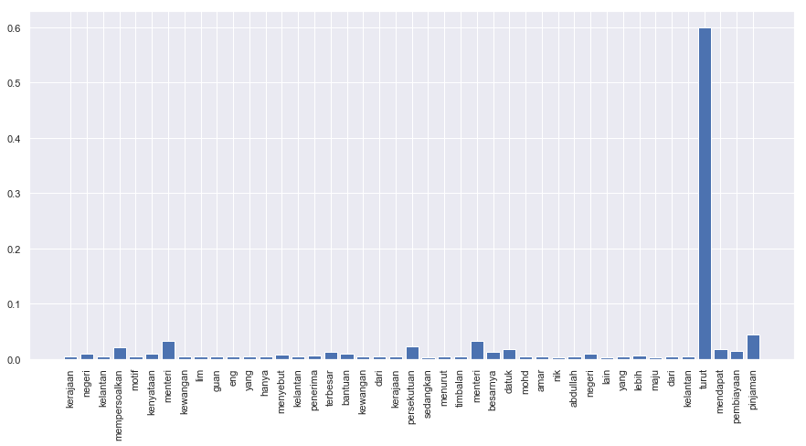

.. code:: python

    import malaya

Explanation
-----------

Positive subjectivity: based on or influenced by personal feelings,
tastes, or opinions. Can be a positive or negative sentiments.

Negative subjectivity: based on a report or a fact. Can be a positive or
negative sentiments.

.. code:: python

    negative_text = 'Kerajaan negeri Kelantan mempersoalkan motif kenyataan Menteri Kewangan Lim Guan Eng yang hanya menyebut Kelantan penerima terbesar bantuan kewangan dari Kerajaan Persekutuan. Sedangkan menurut Timbalan Menteri Besarnya, Datuk Mohd Amar Nik Abdullah, negeri lain yang lebih maju dari Kelantan turut mendapat pembiayaan dan pinjaman.'
    positive_text = 'kerajaan sebenarnya sangat bencikan rakyatnya, minyak naik dan segalanya'

Load multinomial model
----------------------

.. code:: python

    model = malaya.subjective.multinomial()
    print(model.predict(positive_text,get_proba=True))
    print(model.predict(negative_text,get_proba=True))
    model.predict_batch([negative_text,negative_text],get_proba=True)

.. parsed-literal::

    {'negative': 0.46203835811002486, 'positive': 0.5379616418899767}
    {'negative': 0.8698758314042119, 'positive': 0.13012416859579023}

.. parsed-literal::

    [{'negative': 0.8698758314042119, 'positive': 0.13012416859579023},
     {'negative': 0.8698758314042119, 'positive': 0.13012416859579023}]

Load xgb model
--------------

.. code:: python

    model = malaya.subjective.xgb()
    print(model.predict(positive_text,get_proba=True))
    print(model.predict(negative_text,get_proba=True))
    model.predict_batch([negative_text,negative_text],get_proba=True)

.. parsed-literal::

    {'negative': 0.4284472, 'positive': 0.5715528}
    {'negative': 0.9249991, 'positive': 0.07500088}

.. parsed-literal::

    [{'negative': 0.9249991, 'positive': 0.07500088},
     {'negative': 0.9249991, 'positive': 0.07500088}]

List available deep learning models
-----------------------------------

.. code:: python

    malaya.subjective.available_deep_model()

.. parsed-literal::

    ['fast-text',
     'hierarchical',
     'bahdanau',
     'luong',
     'bidirectional',
     'bert',
     'entity-network']

.. code:: python

    for i in malaya.subjective.available_deep_model():
        print('Testing %s model'%(i))
        model = malaya.subjective.deep_model(i)
        print(model.predict(negative_text))
        print(model.predict_batch([negative_text, positive_text]))
        print()

.. parsed-literal::

    Testing fast-text model
    {'negative': 0.9999857, 'positive': 1.4311945e-05}
    [{'negative': 0.99998176, 'positive': 1.8284805e-05}, {'negative': 0.6197021, 'positive': 0.3802979}]

    Testing hierarchical model
    {'negative': 0.99999106, 'positive': 8.908054e-06, 'attention': [['kerajaan', 0.0026431128], ['negeri', 0.0023254503], ['kelantan', 0.0020627102], ['mempersoalkan', 0.0030728227], ['motif', 0.008248507], ['kenyataan', 0.043281738], ['menteri', 0.013182686], ['kewangan', 0.09176193], ['lim', 0.04344287], ['guan', 0.03522484], ['eng', 0.0461848], ['yang', 0.09767821], ['hanya', 0.08986266], ['menyebut', 0.031121315], ['kelantan', 0.021764606], ['penerima', 0.015131315], ['terbesar', 0.08985191], ['bantuan', 0.006960401], ['kewangan', 0.031935796], ['dari', 0.010873584], ['kerajaan', 0.009254754], ['persekutuan', 0.009717415], ['sedangkan', 0.0040391926], ['menurut', 0.0066842665], ['timbalan', 0.011416538], ['menteri', 0.013341902], ['besarnya', 0.002481642], ['datuk', 0.042085297], ['mohd', 0.01442942], ['amar', 0.01908006], ['nik', 0.009496236], ['abdullah', 0.050433077], ['negeri', 0.059876796], ['lain', 0.037059795], ['yang', 0.011822811], ['lebih', 0.0034201501], ['maju', 0.0025036496], ['dari', 0.0022793075], ['kelantan', 0.0016129243], ['turut', 0.0008071765], ['mendapat', 0.00044486515], ['pembiayaan', 0.0006439999], ['pinjaman', 0.00045750322]]}
    [{'negative': 0.9999914, 'positive': 8.570751e-06}, {'negative': 0.13745736, 'positive': 0.86254257}]

    Testing bahdanau model
    {'negative': 0.99980694, 'positive': 0.00019306253, 'attention': [['kerajaan', 0.0050749457], ['negeri', 0.009439934], ['kelantan', 0.0040419037], ['mempersoalkan', 0.0214517], ['motif', 0.005316791], ['kenyataan', 0.010294732], ['menteri', 0.03291764], ['kewangan', 0.0049661435], ['lim', 0.0040683458], ['guan', 0.0040419037], ['eng', 0.0040419037], ['yang', 0.004419986], ['hanya', 0.005385534], ['menyebut', 0.0076758233], ['kelantan', 0.0040419037], ['penerima', 0.006874847], ['terbesar', 0.013762572], ['bantuan', 0.009585191], ['kewangan', 0.0049661435], ['dari', 0.004591231], ['kerajaan', 0.0050749457], ['persekutuan', 0.022824157], ['sedangkan', 0.0034627551], ['menurut', 0.0051674796], ['timbalan', 0.0040419037], ['menteri', 0.03291764], ['besarnya', 0.013762572], ['datuk', 0.017903224], ['mohd', 0.0040419037], ['amar', 0.004367938], ['nik', 0.0037139847], ['abdullah', 0.0040419037], ['negeri', 0.009439934], ['lain', 0.0033763673], ['yang', 0.004419986], ['lebih', 0.006034435], ['maju', 0.0038030783], ['dari', 0.004591231], ['kelantan', 0.0040419037], ['turut', 0.6005219], ['mendapat', 0.01686728], ['pembiayaan', 0.013716733], ['pinjaman', 0.044907507]]}
    [{'negative': 0.99991393, 'positive': 8.602566e-05}, {'negative': 0.56615204, 'positive': 0.43384793}]

    Testing luong model
    {'negative': 0.05270607, 'positive': 0.94729394, 'attention': [['kerajaan', 0.024131631], ['negeri', 0.011953921], ['kelantan', 0.012911553], ['mempersoalkan', 0.00873569], ['motif', 0.008673658], ['kenyataan', 0.016589355], ['menteri', 0.0063872887], ['kewangan', 0.016722612], ['lim', 0.013983263], ['guan', 0.012911553], ['eng', 0.012911553], ['yang', 0.007033144], ['hanya', 0.005824854], ['menyebut', 0.03765733], ['kelantan', 0.012911553], ['penerima', 0.011384356], ['terbesar', 0.013326466], ['bantuan', 0.0054743947], ['kewangan', 0.016722612], ['dari', 0.0074779517], ['kerajaan', 0.024131631], ['persekutuan', 0.0063038715], ['sedangkan', 0.04904128], ['menurut', 0.006200655], ['timbalan', 0.012911553], ['menteri', 0.0063872887], ['besarnya', 0.013326466], ['datuk', 0.006796812], ['mohd', 0.012911553], ['amar', 0.00872326], ['nik', 0.011290737], ['abdullah', 0.012911553], ['negeri', 0.011953921], ['lain', 0.01890528], ['yang', 0.007033144], ['lebih', 0.0062040263], ['maju', 0.00676356], ['dari', 0.0074779517], ['kelantan', 0.012911553], ['turut', 0.0059344224], ['mendapat', 0.010373441], ['pembiayaan', 0.027220346], ['pinjaman', 0.45056102]]}
    [{'negative': 0.075147994, 'positive': 0.92485195}, {'negative': 0.79208255, 'positive': 0.20791744}]

    Testing bidirectional model
    {'negative': 0.999992, 'positive': 8.023105e-06}
    [{'negative': 0.99999034, 'positive': 9.699501e-06}, {'negative': 0.99284464, 'positive': 0.0071553625}]

    Testing bert model
    {'negative': 0.98487025, 'positive': 0.0151297115}
    [{'negative': 0.98487025, 'positive': 0.015129704}, {'negative': 0.98668575, 'positive': 0.013314218}]

    Testing entity-network model
    {'negative': 0.6470485, 'positive': 0.35295156}
    [{'negative': 0.6470482, 'positive': 0.35295185}, {'negative': 0.65467215, 'positive': 0.34532788}]

Unsupervised important words learning
-------------------------------------

.. code:: python

    import matplotlib.pyplot as plt
    import seaborn as sns
    sns.set() # i just really like seaborn colors

Visualizing bahdanau model
^^^^^^^^^^^^^^^^^^^^^^^^^^

.. code:: python

    model = malaya.subjective.deep_model('bahdanau')
    result = model.predict(negative_text)['attention']

    plt.figure(figsize = (15, 7))
    labels = [r[0] for r in result]
    val = [r[1] for r in result]
    aranged = [i for i in range(len(labels))]
    plt.bar(aranged, val)
    plt.xticks(aranged, labels, rotation = 'vertical')
    plt.show()

Visualizing luong model
^^^^^^^^^^^^^^^^^^^^^^^

.. code:: python

    model = malaya.subjective.deep_model('luong')
    result = model.predict(negative_text)['attention']

    plt.figure(figsize = (15, 7))
    labels = [r[0] for r in result]
    val = [r[1] for r in result]
    aranged = [i for i in range(len(labels))]
    plt.bar(aranged, val)
    plt.xticks(aranged, labels, rotation = 'vertical')
    plt.show()

.. image:: load-subjectivity_files/load-subjectivity_15_0.png

Visualizing hierarchical model
^^^^^^^^^^^^^^^^^^^^^^^^^^^^^^

.. code:: python

    model = malaya.subjective.deep_model('hierarchical')
    result = model.predict(negative_text)['attention']

    plt.figure(figsize = (15, 7))
    labels = [r[0] for r in result]
    val = [r[1] for r in result]
    aranged = [i for i in range(len(labels))]
    plt.bar(aranged, val)
    plt.xticks(aranged, labels, rotation = 'vertical')
    plt.show()

.. image:: load-subjectivity_files/load-subjectivity_17_0.png
