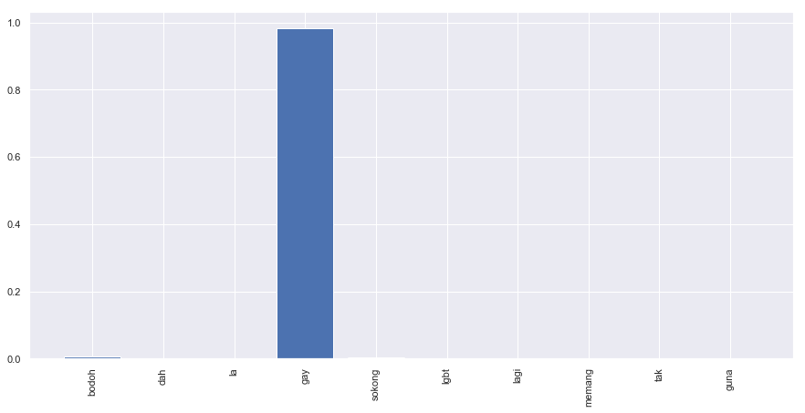
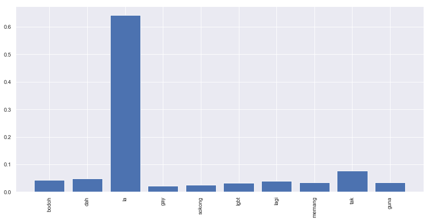
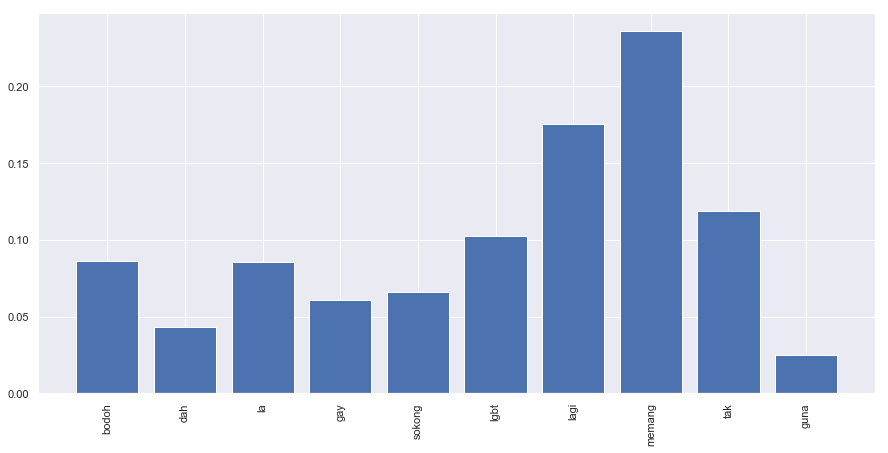

.. code:: ipython3

    %%time
    import malaya

.. parsed-literal::

    CPU times: user 12.4 s, sys: 1.42 s, total: 13.8 s
    Wall time: 17.5 s

.. code:: ipython3

    string = 'Benda yg SALAH ni, jgn lah didebatkan. Yg SALAH xkan jadi betul. Ingat tu. Mcm mana kesat sekalipun org sampaikan mesej, dan memang benda tu salah, diam je. Xyah nk tunjuk kau open sangat nk tegur cara org lain berdakwah. '
    another_string = 'bodoh, dah la gay, sokong lgbt lagi, memang tak guna'

All models got ``get_proba`` parameters. If True, it will returned
probability every classes. Else, it will return highest probability
class. **Default is False.**

Load multinomial model
----------------------

.. code:: ipython3

    model = malaya.toxic.multinomial()

.. code:: ipython3

    model.predict(string)

.. parsed-literal::

    []

.. code:: ipython3

    model.predict(string,get_proba=True)

.. parsed-literal::

    {'toxic': 0.14165235977019472,
     'severe_toxic': 1.9272487152616215e-06,
     'obscene': 0.011323038998473341,
     'threat': 8.249039905334012e-08,
     'insult': 0.008620760536227347,
     'identity_hate': 4.703244329372946e-06}

.. code:: ipython3

    model.predict(another_string)

.. parsed-literal::

    ['toxic', 'insult']

.. code:: ipython3

    model.predict(another_string,get_proba=True)

.. parsed-literal::

    {'toxic': 0.97624511869432,
     'severe_toxic': 0.0004143925305717536,
     'obscene': 0.48936571876841484,
     'threat': 5.809081616106756e-06,
     'insult': 0.7853970362543069,
     'identity_hate': 0.002109806847753244}

.. code:: ipython3

    model.predict_batch([string,another_string])

.. parsed-literal::

    [[], ['toxic', 'insult']]

.. code:: ipython3

    model.predict_batch([string,another_string],get_proba=True)

.. parsed-literal::

    [{'toxic': 0.14165235977019472,
      'severe_toxic': 1.9272487152616215e-06,
      'obscene': 0.011323038998473341,
      'threat': 8.249039905334012e-08,
      'insult': 0.008620760536227347,
      'identity_hate': 4.703244329372946e-06},
     {'toxic': 0.97624511869432,
      'severe_toxic': 0.0004143925305717536,
      'obscene': 0.48936571876841484,
      'threat': 5.809081616106756e-06,
      'insult': 0.7853970362543069,
      'identity_hate': 0.002109806847753244}]

Load logistics model
--------------------

.. code:: ipython3

    model = malaya.toxic.logistic()

.. code:: ipython3

    model.predict(string)

.. parsed-literal::

    []

.. code:: ipython3

    model.predict_batch([string,another_string],get_proba=True)

.. parsed-literal::

    [{'toxic': 0.10299208923447233,
      'severe_toxic': 0.010195223990855215,
      'obscene': 0.04834509566263489,
      'threat': 0.003488478318883341,
      'insult': 0.04528784776538583,
      'identity_hate': 0.011326619000125776},
     {'toxic': 0.6297643126911581,
      'severe_toxic': 0.019551370640497476,
      'obscene': 0.1995748012804703,
      'threat': 0.004014463652898358,
      'insult': 0.3354069432946268,
      'identity_hate': 0.052626041879065236}]

List available deep learning models
-----------------------------------

.. code:: ipython3

    malaya.toxic.available_deep_model()

.. parsed-literal::

    ['bahdanau', 'hierarchical', 'luong', 'fast-text', 'entity-network']

Load deep learning model
------------------------

.. code:: ipython3

    for model in malaya.toxic.available_deep_model():
        print('Testing %s model'%(model))
        deep_model = malaya.toxic.deep_model(model = model)
        print(deep_model.predict(string))
        print(deep_model.predict_batch([string, another_string]))
        print(deep_model.predict_batch([string, another_string],get_proba=True))
        print()

.. parsed-literal::

    Testing bahdanau model
    []
    [[], ['toxic']]
    [{'toxic': 0.002869941, 'severe_toxic': 3.2165422e-05, 'obscene': 0.00031625567, 'threat': 3.3063134e-05, 'insult': 0.0001917479, 'identity_hate': 5.6739605e-05}, {'toxic': 0.844302, 'severe_toxic': 0.0026948317, 'obscene': 0.048079386, 'threat': 0.00057450164, 'insult': 0.108705685, 'identity_hate': 0.06786145}]
    
    Testing hierarchical model
    []
    [[], ['toxic']]
    [{'toxic': 0.01493061, 'severe_toxic': 0.0001075709, 'obscene': 0.003345779, 'threat': 0.00030603033, 'insult': 0.0016393703, 'identity_hate': 0.00053284934}, {'toxic': 0.69389653, 'severe_toxic': 0.002439942, 'obscene': 0.033795167, 'threat': 0.002826849, 'insult': 0.30907208, 'identity_hate': 0.06302948}]
    
    Testing luong model
    []
    [[], ['toxic']]
    [{'toxic': 0.0038469762, 'severe_toxic': 0.00030991185, 'obscene': 0.0025601375, 'threat': 0.0010575273, 'insult': 0.0007667314, 'identity_hate': 0.0008790955}, {'toxic': 0.9767287, 'severe_toxic': 0.021122381, 'obscene': 0.25348565, 'threat': 0.01192961, 'insult': 0.4519248, 'identity_hate': 0.09681236}]
    
    Testing fast-text model
    ['threat']
    [[], []]
    [{'toxic': 4.6989637e-08, 'severe_toxic': 2.8443527e-08, 'obscene': 4.1618722e-10, 'threat': 3.280739e-06, 'insult': 7.941728e-10, 'identity_hate': 8.946894e-07}, {'toxic': 0.07565687, 'severe_toxic': 0.005023106, 'obscene': 0.0053009894, 'threat': 0.0040464187, 'insult': 0.043121953, 'identity_hate': 0.016103525}]
    
    Testing entity-network model
    ['toxic']
    [['toxic', 'obscene', 'insult'], []]
    [{'toxic': 0.7704032, 'severe_toxic': 0.1794783, 'obscene': 0.50242037, 'threat': 0.16002978, 'insult': 0.61826205, 'identity_hate': 0.2263789}, {'toxic': 0.23564923, 'severe_toxic': 0.009002773, 'obscene': 0.14901799, 'threat': 0.030735493, 'insult': 0.12641545, 'identity_hate': 0.019457512}]
    

Unsupervised important words learning
-------------------------------------

.. code:: ipython3

    import matplotlib.pyplot as plt
    import seaborn as sns
    sns.set() # i just really like seaborn colors

We need to set ``get_proba`` become True to get the ‘attention’.

Visualizing bahdanau model
^^^^^^^^^^^^^^^^^^^^^^^^^^

.. code:: ipython3

    model = malaya.toxic.deep_model('bahdanau')
    result = model.predict(another_string,get_proba=True)['attention']
    
    plt.figure(figsize = (15, 7))
    labels = [r[0] for r in result]
    val = [r[1] for r in result]
    aranged = [i for i in range(len(labels))]
    plt.bar(aranged, val)
    plt.xticks(aranged, labels, rotation = 'vertical')
    plt.show()

Visualizing luong model
^^^^^^^^^^^^^^^^^^^^^^^

.. code:: ipython3

    model = malaya.toxic.deep_model('luong')
    result = model.predict(another_string,get_proba=True)['attention']
    
    plt.figure(figsize = (15, 7))
    labels = [r[0] for r in result]
    val = [r[1] for r in result]
    aranged = [i for i in range(len(labels))]
    plt.bar(aranged, val)
    plt.xticks(aranged, labels, rotation = 'vertical')
    plt.show()

Visualizing hierarchical model
^^^^^^^^^^^^^^^^^^^^^^^^^^^^^^

.. code:: ipython3

    model = malaya.toxic.deep_model('hierarchical')
    result = model.predict(another_string,get_proba=True)['attention']
    
    plt.figure(figsize = (15, 7))
    labels = [r[0] for r in result]
    val = [r[1] for r in result]
    aranged = [i for i in range(len(labels))]
    plt.bar(aranged, val)
    plt.xticks(aranged, labels, rotation = 'vertical')
    plt.show()

