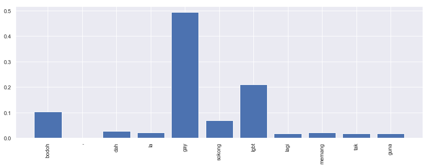

.. code:: python

    %%time
    import malaya

.. parsed-literal::

    CPU times: user 12.6 s, sys: 1.5 s, total: 14.1 s
    Wall time: 17.9 s

.. code:: python

    string = 'Benda yg SALAH ni, jgn lah didebatkan. Yg SALAH xkan jadi betul. Ingat tu. Mcm mana kesat sekalipun org sampaikan mesej, dan memang benda tu salah, diam je. Xyah nk tunjuk kau open sangat nk tegur cara org lain berdakwah. '
    another_string = 'bodoh, dah la gay, sokong lgbt lagi, memang tak guna'

All models got ``get_proba`` parameters. If True, it will returned
probability every classes. Else, it will return classes more than 0.5
probability. **Default is False.**

Load multinomial model
----------------------

.. code:: python

    model = malaya.toxic.multinomial()

.. code:: python

    model.predict(string)

.. parsed-literal::

    []

.. code:: python

    model.predict(string,get_proba=True)

.. parsed-literal::

    {'toxic': 0.14165235977019472,
     'severe_toxic': 1.9272487152616215e-06,
     'obscene': 0.011323038998473341,
     'threat': 8.249039905334012e-08,
     'insult': 0.008620760536227347,
     'identity_hate': 4.703244329372946e-06}

.. code:: python

    model.predict(another_string)

.. parsed-literal::

    ['toxic', 'insult']

.. code:: python

    model.predict(another_string,get_proba=True)

.. parsed-literal::

    {'toxic': 0.97624511869432,
     'severe_toxic': 0.0004143925305717536,
     'obscene': 0.48936571876841484,
     'threat': 5.809081616106756e-06,
     'insult': 0.7853970362543069,
     'identity_hate': 0.002109806847753244}

.. code:: python

    model.predict_batch([string,another_string])

.. parsed-literal::

    [[], ['toxic', 'insult']]

.. code:: python

    model.predict_batch([string,another_string],get_proba=True)

.. parsed-literal::

    [{'toxic': 0.14165235977019472,
      'severe_toxic': 1.9272487152616215e-06,
      'obscene': 0.011323038998473341,
      'threat': 8.249039905334012e-08,
      'insult': 0.008620760536227347,
      'identity_hate': 4.703244329372946e-06},
     {'toxic': 0.97624511869432,
      'severe_toxic': 0.0004143925305717536,
      'obscene': 0.48936571876841484,
      'threat': 5.809081616106756e-06,
      'insult': 0.7853970362543069,
      'identity_hate': 0.002109806847753244}]

Load logistics model
--------------------

.. code:: python

    model = malaya.toxic.logistic()

.. code:: python

    model.predict(string)

.. parsed-literal::

    []

.. code:: python

    model.predict_batch([string,another_string],get_proba=True)

.. parsed-literal::

    [{'toxic': 0.10299208923447233,
      'severe_toxic': 0.010195223990855215,
      'obscene': 0.04834509566263489,
      'threat': 0.003488478318883341,
      'insult': 0.04528784776538583,
      'identity_hate': 0.011326619000125776},
     {'toxic': 0.6297643126911581,
      'severe_toxic': 0.019551370640497476,
      'obscene': 0.1995748012804703,
      'threat': 0.004014463652898358,
      'insult': 0.3354069432946268,
      'identity_hate': 0.052626041879065236}]

List available deep learning models
-----------------------------------

.. code:: python

    malaya.toxic.available_deep_model()

.. parsed-literal::

    ['self-attention', 'bahdanau', 'luong']

Load deep learning models
-------------------------

Good thing about deep learning models from Malaya, it returns
``Attention`` result, means, which part of words give the high impact to
the results. But to get ``Attention``, you need to set
``get_proba=True``.

.. code:: python

    import matplotlib.pyplot as plt
    import seaborn as sns
    sns.set()

Load bahdanau model
~~~~~~~~~~~~~~~~~~~

.. code:: python

    model = malaya.toxic.deep_model(model = 'bahdanau')

Predict single string
^^^^^^^^^^^^^^^^^^^^^

.. code:: python

    model.predict(string)

.. parsed-literal::

    []

.. code:: python

    result = model.predict(another_string, get_proba = True)
    result

.. parsed-literal::

    {'toxic': 0.75407517,
     'severe_toxic': 0.16274202,
     'obscene': 0.5291958,
     'threat': 0.10058941,
     'insult': 0.75971705,
     'identity_hate': 0.8826025,
     'attention': {'bodoh': 0.10320988,
      ',': 0.0,
      'dah': 0.027506806,
      'la': 0.021144494,
      'gay': 0.4988079,
      'sokong': 0.06969115,
      'lgbt': 0.20489135,
      'lagi': 0.018106166,
      'memang': 0.02190801,
      'tak': 0.017407918,
      'guna': 0.017326297}}

.. code:: python

    plt.figure(figsize = (15, 5))
    keys = result['attention'].keys()
    values = result['attention'].values()
    aranged = [i for i in range(len(keys))]
    plt.bar(aranged, values)
    plt.xticks(aranged, keys, rotation = 'vertical')
    plt.show()

Open toxicity visualization dashboard
^^^^^^^^^^^^^^^^^^^^^^^^^^^^^^^^^^^^^

Default when you call ``predict_words`` it will open a browser with
visualization dashboard, you can disable by ``visualization=False``.

.. code:: python

    model.predict_words(another_string)

.. parsed-literal::

    Serving to http://127.0.0.1:8889/    [Ctrl-C to exit]

.. parsed-literal::

    127.0.0.1 - - [01/Jun/2019 12:12:10] "GET / HTTP/1.1" 200 -
    127.0.0.1 - - [01/Jun/2019 12:12:10] "GET /static/admin-materialize.min.css HTTP/1.1" 200 -
    127.0.0.1 - - [01/Jun/2019 12:12:10] "GET /static/echarts.min.js HTTP/1.1" 200 -
    127.0.0.1 - - [01/Jun/2019 12:12:11] "GET /favicon.ico HTTP/1.1" 200 -
    ----------------------------------------
    Exception happened during processing of request from ('127.0.0.1', 61873)
    Traceback (most recent call last):
      File "/usr/local/Cellar/python/3.6.5_1/Frameworks/Python.framework/Versions/3.6/lib/python3.6/socketserver.py", line 317, in _handle_request_noblock
        self.process_request(request, client_address)
      File "/usr/local/Cellar/python/3.6.5_1/Frameworks/Python.framework/Versions/3.6/lib/python3.6/socketserver.py", line 348, in process_request
        self.finish_request(request, client_address)
      File "/usr/local/Cellar/python/3.6.5_1/Frameworks/Python.framework/Versions/3.6/lib/python3.6/socketserver.py", line 361, in finish_request
        self.RequestHandlerClass(request, client_address, self)
      File "/usr/local/Cellar/python/3.6.5_1/Frameworks/Python.framework/Versions/3.6/lib/python3.6/socketserver.py", line 696, in __init__
        self.handle()
      File "/usr/local/Cellar/python/3.6.5_1/Frameworks/Python.framework/Versions/3.6/lib/python3.6/http/server.py", line 418, in handle
        self.handle_one_request()
      File "/usr/local/Cellar/python/3.6.5_1/Frameworks/Python.framework/Versions/3.6/lib/python3.6/http/server.py", line 406, in handle_one_request
        method()
      File "/Users/huseinzol/Documents/Malaya/malaya/_utils/_server.py", line 32, in do_GET
        with open(filepath, 'rb') as fh:
    FileNotFoundError: [Errno 2] No such file or directory: '/Users/huseinzol/Documents/Malaya/malaya/_utils/web/favicon.ico'
    ----------------------------------------

.. parsed-literal::

    stopping Server...

.. code:: python

    from IPython.core.display import Image, display

    display(Image('toxicity.png', width=800))

.. image:: load-toxic_files/load-toxic_27_0.png
   :width: 800px

Predict batch of strings
^^^^^^^^^^^^^^^^^^^^^^^^

.. code:: python

    model.predict_batch([string, another_string],get_proba=True)

.. parsed-literal::

    [{'toxic': 0.21699297,
      'severe_toxic': 0.021610105,
      'obscene': 0.110013016,
      'threat': 0.010765828,
      'insult': 0.10372056,
      'identity_hate': 0.03946534},
     {'toxic': 0.93524134,
      'severe_toxic': 0.33446547,
      'obscene': 0.7178085,
      'threat': 0.56429744,
      'insult': 0.8922918,
      'identity_hate': 0.9618688}]

**You might want to try ``luong`` and ``self-attention`` by yourself.**

Stacking models
---------------

More information, you can read at
https://malaya.readthedocs.io/en/latest/Stack.html

.. code:: python

    multinomial = malaya.toxic.multinomial()
    logistics = malaya.toxic.logistic()
    bahdanau = malaya.toxic.deep_model('bahdanau')

.. code:: python

    malaya.stack.predict_stack([multinomial, logistics, bahdanau], another_string)
