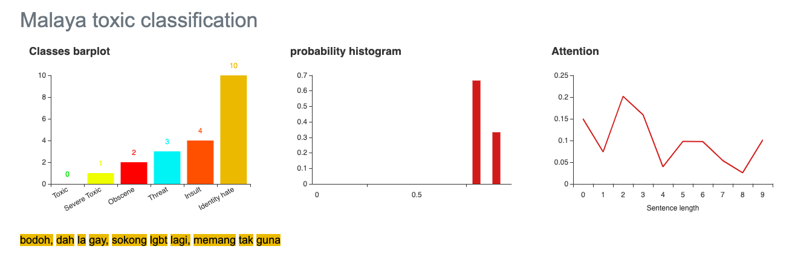

.. code:: ipython3

    import malaya
    print(malaya.version, malaya.bump_version)

.. parsed-literal::

    1.0 1.0.0.0

.. code:: ipython3

    string = 'Benda yg SALAH ni, jgn lah didebatkan. Yg SALAH xkan jadi betul. Ingat tu. Mcm mana kesat sekalipun org sampaikan mesej, dan memang benda tu salah, diam je. Xyah nk tunjuk kau open sangat nk tegur cara org lain berdakwah. '
    another_string = 'bodoh, dah la gay, sokong lgbt lagi, memang tak guna'

Load multinomial model
----------------------

.. code:: ipython3

    model = malaya.toxic.multinomial()

.. parsed-literal::

    downloading frozen /Users/huseinzol/Malaya/toxic/multinomial model

.. parsed-literal::

    11.0MB [00:04, 1.98MB/s]                          
      0%|          | 0.00/19.3 [00:00<?, ?MB/s]

.. parsed-literal::

    downloading frozen /Users/huseinzol/Malaya/toxic/multinomial vector

.. parsed-literal::

    20.0MB [00:08, 3.55MB/s]                          

.. code:: ipython3

    model.predict(string)

.. parsed-literal::

    {'toxic': 0,
     'severe_toxic': 0,
     'obscene': 0,
     'threat': 0,
     'insult': 0,
     'identity_hate': 0}

.. code:: ipython3

    model.predict(string,get_proba=True)

.. parsed-literal::

    {'toxic': 0.14165235977019472,
     'severe_toxic': 1.9272487152616215e-06,
     'obscene': 0.011323038998473341,
     'threat': 8.249039905334012e-08,
     'insult': 0.008620760536227347,
     'identity_hate': 4.703244329372946e-06}

.. code:: ipython3

    model.predict(another_string)

.. parsed-literal::

    {'toxic': 1,
     'severe_toxic': 0,
     'obscene': 0,
     'threat': 0,
     'insult': 1,
     'identity_hate': 0}

.. code:: ipython3

    model.predict(another_string,get_proba=True)

.. parsed-literal::

    {'toxic': 0.97624511869432,
     'severe_toxic': 0.0004143925305717536,
     'obscene': 0.48936571876841484,
     'threat': 5.809081616106756e-06,
     'insult': 0.7853970362543069,
     'identity_hate': 0.002109806847753244}

.. code:: ipython3

    model.predict_batch([string,another_string])

.. parsed-literal::

    {'toxic': [0, 1],
     'severe_toxic': [0, 0],
     'obscene': [0, 0],
     'threat': [0, 0],
     'insult': [0, 1],
     'identity_hate': [0, 0]}

.. code:: ipython3

    model.predict_batch([string,another_string],get_proba=True)

.. parsed-literal::

    {'toxic': [0.14165235977019472, 0.97624511869432],
     'severe_toxic': [1.9272487152616215e-06, 0.0004143925305717536],
     'obscene': [0.011323038998473341, 0.48936571876841484],
     'threat': [8.249039905334012e-08, 5.809081616106756e-06],
     'insult': [0.008620760536227347, 0.7853970362543069],
     'identity_hate': [4.703244329372946e-06, 0.002109806847753244]}

Load logistics model
--------------------

.. code:: ipython3

    model = malaya.toxic.logistic()

.. parsed-literal::

    downloading frozen /Users/huseinzol/Malaya/toxic/logistic model

.. parsed-literal::

    3.00MB [00:00, 2.99MB/s]                          
      0%|          | 0.00/19.3 [00:00<?, ?MB/s]

.. parsed-literal::

    downloading frozen /Users/huseinzol/Malaya/toxic/logistic vector

.. parsed-literal::

    20.0MB [00:06, 4.17MB/s]                          

.. code:: ipython3

    model.predict(string)

.. parsed-literal::

    {'toxic': 0,
     'severe_toxic': 0,
     'obscene': 0,
     'threat': 0,
     'insult': 0,
     'identity_hate': 0}

.. code:: ipython3

    model.predict_batch([string,another_string],get_proba=True)

.. parsed-literal::

    {'toxic': [0.10299208923447233, 0.6297643126911581],
     'severe_toxic': [0.010195223990855215, 0.019551370640497476],
     'obscene': [0.04834509566263489, 0.1995748012804703],
     'threat': [0.003488478318883341, 0.004014463652898358],
     'insult': [0.04528784776538583, 0.3354069432946268],
     'identity_hate': [0.011326619000125776, 0.052626041879065236]}

List available deep learning models
-----------------------------------

.. code:: ipython3

    malaya.toxic.available_deep_model()

.. parsed-literal::

    ['bahdanau', 'hierarchical', 'luong', 'fast-text', 'entity-network']

Load deep learning model
------------------------

.. code:: ipython3

    for model in malaya.toxic.available_deep_model():
        deep_model = malaya.toxic.deep_model(model = model)
        print(deep_model.predict(string))
        print(deep_model.predict_batch([string, another_string]),'\n')
        

.. parsed-literal::

      0%|          | 0.00/60.7 [00:00<?, ?MB/s]

.. parsed-literal::

    downloading frozen /Users/huseinzol/Malaya/toxic/bahdanau model

.. parsed-literal::

    61.0MB [00:40, 1.02s/MB]                          

.. parsed-literal::

    downloading frozen /Users/huseinzol/Malaya/toxic/bahdanau setting

.. parsed-literal::

    2.00MB [00:01, 1.28MB/s]                          

.. parsed-literal::

    {'toxic': 0.0016742008, 'severe_toxic': 1.7662573e-05, 'obscene': 0.00022085723, 'threat': 2.8091223e-05, 'insult': 0.00012736337, 'identity_hate': 2.3157776e-05, 'attention': [['benda', 0.091448985], ['yg', 0.010792643], ['salah', 0.0094901575], ['ni', 0.030621372], ['jgn', 0.059444103], ['didebatkan', 0.009425078], ['yg', 0.010792643], ['salah', 0.0094901575], ['jadi', 0.0104246065], ['betul', 0.008610405], ['ingat', 0.016614432], ['tu', 0.010084518], ['mcm', 0.0073846644], ['mana', 0.008301517], ['kesat', 0.022555746], ['sekalipun', 0.024207924], ['org', 0.03206277], ['sampaikan', 0.013050129], ['mesej', 0.012118619], ['memang', 0.007917009], ['benda', 0.091448985], ['tu', 0.010084518], ['salah', 0.0094901575], ['diam', 0.00885792], ['je', 0.13976514], ['xyah', 0.059444103], ['nk', 0.0849323], ['tunjuk', 0.006834551], ['kau', 0.011403494], ['sangat', 0.0076839714], ['nk', 0.0849323], ['tegur', 0.016239613], ['cara', 0.013840728], ['org', 0.03206277], ['lain', 0.010591825], ['berdakwah', 0.007550152]]}

.. parsed-literal::

      0%|          | 0.00/65.2 [00:00<?, ?MB/s]

.. parsed-literal::

    {'toxic': [0.0016551929, 0.8803142], 'severe_toxic': [1.36922545e-05, 0.003729248], 'obscene': [0.00017486684, 0.06859021], 'threat': [1.4183259e-05, 0.00055752473], 'insult': [7.17542e-05, 0.1324517], 'identity_hate': [1.6397036e-05, 0.1142907]} 
    
    downloading frozen /Users/huseinzol/Malaya/toxic/hierarchical model

.. parsed-literal::

    66.0MB [00:28, 3.40MB/s]                          
      0%|          | 0.00/1.98 [00:00<?, ?MB/s]

.. parsed-literal::

    downloading frozen /Users/huseinzol/Malaya/toxic/hierarchical setting

.. parsed-literal::

    2.00MB [00:00, 3.60MB/s]                          

.. parsed-literal::

    {'toxic': 0.016313301, 'severe_toxic': 0.00022255233, 'obscene': 0.0042808177, 'threat': 0.0005204327, 'insult': 0.0019180704, 'identity_hate': 0.00081829965, 'attention': [['benda', 0.101997666], ['yg', 0.037477322], ['salah', 0.06909519], ['ni', 0.015138972], ['jgn', 0.017931793], ['didebatkan', 0.005441455], ['yg', 0.014737692], ['salah', 0.009726078], ['jadi', 0.011726628], ['betul', 0.040568814], ['ingat', 0.011717768], ['tu', 0.046530075], ['mcm', 0.0351902], ['mana', 0.011379077], ['kesat', 0.1248077], ['sekalipun', 0.029303], ['org', 0.017944867], ['sampaikan', 0.010932395], ['mesej', 0.011052727], ['memang', 0.02511157], ['benda', 0.06368019], ['tu', 0.020176394], ['salah', 0.06027492], ['diam', 0.04705445], ['je', 0.018319523], ['xyah', 0.050702535], ['nk', 0.06662749], ['tunjuk', 0.017117476], ['kau', 0.0040451945], ['sangat', 0.0017867531], ['nk', 0.00040787706], ['tegur', 0.00022611297], ['cara', 0.00038514007], ['org', 0.00034493007], ['lain', 0.00047185872], ['berdakwah', 0.0005681523]]}

.. parsed-literal::

      0%|          | 0.00/60.4 [00:00<?, ?MB/s]

.. parsed-literal::

    {'toxic': [0.019022115, 0.7026508], 'severe_toxic': [0.00018498747, 0.002541811], 'obscene': [0.0040143826, 0.04182527], 'threat': [0.00040674658, 0.0038593104], 'insult': [0.0021619846, 0.23215641], 'identity_hate': [0.0008833514, 0.056888826]} 
    
    downloading frozen /Users/huseinzol/Malaya/toxic/luong model

.. parsed-literal::

    61.0MB [00:29, 2.90MB/s]                          
      0%|          | 0.00/1.98 [00:00<?, ?MB/s]

.. parsed-literal::

    downloading frozen /Users/huseinzol/Malaya/toxic/luong setting

.. parsed-literal::

    2.00MB [00:00, 3.72MB/s]                          

.. parsed-literal::

    {'toxic': 0.0014804129, 'severe_toxic': 0.00017674293, 'obscene': 0.0008130327, 'threat': 0.00028337093, 'insult': 0.00023613627, 'identity_hate': 0.0007284258, 'attention': [['benda', 0.0014139642], ['yg', 0.0016312348], ['salah', 0.007912597], ['ni', 0.0016698316], ['jgn', 0.001369154], ['didebatkan', 0.0012927211], ['yg', 0.0016312348], ['salah', 0.007912597], ['jadi', 0.0013706309], ['betul', 0.0016492187], ['ingat', 0.0013966222], ['tu', 0.0013238997], ['mcm', 0.001623619], ['mana', 0.0014395164], ['kesat', 0.0076838294], ['sekalipun', 0.013703095], ['org', 0.0030888263], ['sampaikan', 0.0023580098], ['mesej', 0.0012328016], ['memang', 0.0013224662], ['benda', 0.0014139642], ['tu', 0.0013238997], ['salah', 0.007912597], ['diam', 0.0012353956], ['je', 0.0013446732], ['xyah', 0.001369154], ['nk', 0.0032641657], ['tunjuk', 0.0015030154], ['kau', 0.011394377], ['sangat', 0.0017340722], ['nk', 0.0032641657], ['tegur', 0.0034078276], ['cara', 0.8561393], ['org', 0.0030888263], ['lain', 0.0037536188], ['berdakwah', 0.034825023]]}
    {'toxic': [0.0050339997, 0.97731346], 'severe_toxic': [0.0012615193, 0.015941802], 'obscene': [0.0023579854, 0.25056282], 'threat': [0.0025420662, 0.0076949443], 'insult': [0.00090396986, 0.36417997], 'identity_hate': [0.002062297, 0.11571509]} 
    
    downloading frozen /Users/huseinzol/Malaya/toxic/fast-text model

.. parsed-literal::

    258MB [01:52, 2.37MB/s]                          

.. parsed-literal::

    downloading frozen /Users/huseinzol/Malaya/toxic/fast-text setting

.. parsed-literal::

    2.00MB [00:00, 3.69MB/s]                          

.. parsed-literal::

    downloading frozen /Users/huseinzol/Malaya/toxic/fast-text pickle

.. parsed-literal::

    8.00MB [00:02, 2.97MB/s]                          

.. parsed-literal::

    {'toxic': 0.0020534173, 'severe_toxic': 0.0050337594, 'obscene': 3.7653503e-05, 'threat': 0.7628687, 'insult': 9.012385e-05, 'identity_hate': 0.22991635}
    {'toxic': [4.6989637e-08, 0.07565687], 'severe_toxic': [2.8443527e-08, 0.005023106], 'obscene': [4.1618722e-10, 0.0053009894], 'threat': [3.280739e-06, 0.0040464187], 'insult': [7.941728e-10, 0.043121953], 'identity_hate': [8.946894e-07, 0.016103525]} 
    
    downloading frozen /Users/huseinzol/Malaya/toxic/entity-network model

.. parsed-literal::

    56.0MB [00:22, 1.92MB/s]                          
      0%|          | 0.00/1.98 [00:00<?, ?MB/s]

.. parsed-literal::

    downloading frozen /Users/huseinzol/Malaya/toxic/entity-network setting

.. parsed-literal::

    2.00MB [00:00, 2.25MB/s]                          

.. parsed-literal::

    {'toxic': 0.501814, 'severe_toxic': 0.03271238, 'obscene': 0.15100613, 'threat': 0.028492289, 'insult': 0.24221319, 'identity_hate': 0.043762065}
    {'toxic': [0.7704032, 0.23564923], 'severe_toxic': [0.1794783, 0.009002773], 'obscene': [0.50242037, 0.14901799], 'threat': [0.16002978, 0.030735493], 'insult': [0.61826205, 0.12641545], 'identity_hate': [0.2263789, 0.019457512]} 
    

Unsupervised important words learning
-------------------------------------

.. code:: ipython3

    import matplotlib.pyplot as plt
    import seaborn as sns
    sns.set() # i just really like seaborn colors

Visualizing bahdanau model
^^^^^^^^^^^^^^^^^^^^^^^^^^

.. code:: ipython3

    model = malaya.toxic.deep_model('bahdanau')
    result = model.predict(another_string)['attention']
    
    plt.figure(figsize = (15, 7))
    labels = [r[0] for r in result]
    val = [r[1] for r in result]
    aranged = [i for i in range(len(labels))]
    plt.bar(aranged, val)
    plt.xticks(aranged, labels, rotation = 'vertical')
    plt.show()

Visualizing luong model
^^^^^^^^^^^^^^^^^^^^^^^

.. code:: ipython3

    model = malaya.toxic.deep_model('luong')
    result = model.predict(another_string)['attention']
    
    plt.figure(figsize = (15, 7))
    labels = [r[0] for r in result]
    val = [r[1] for r in result]
    aranged = [i for i in range(len(labels))]
    plt.bar(aranged, val)
    plt.xticks(aranged, labels, rotation = 'vertical')
    plt.show()

.. image:: load-toxic_files/load-toxic_23_0.png

Visualizing hierarchical model
^^^^^^^^^^^^^^^^^^^^^^^^^^^^^^

.. code:: ipython3

    model = malaya.toxic.deep_model('hierarchical')
    result = model.predict(another_string)['attention']
    
    plt.figure(figsize = (15, 7))
    labels = [r[0] for r in result]
    val = [r[1] for r in result]
    aranged = [i for i in range(len(labels))]
    plt.bar(aranged, val)
    plt.xticks(aranged, labels, rotation = 'vertical')
    plt.show()

.. image:: load-toxic_files/load-toxic_25_0.png

