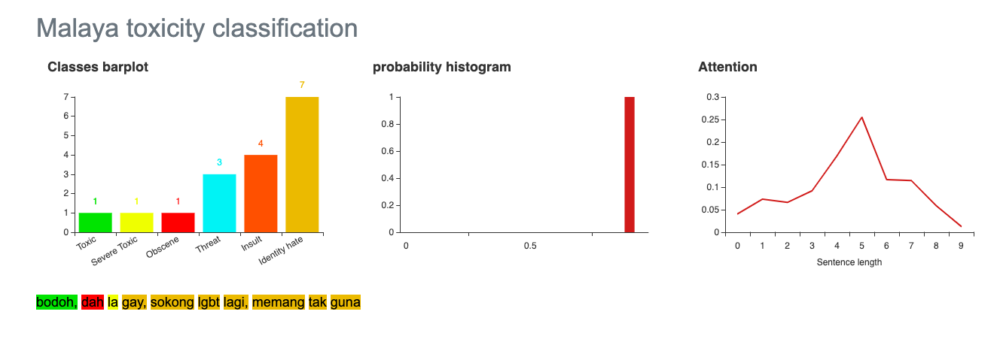

.. code:: python

    %%time
    import malaya

.. parsed-literal::

    CPU times: user 5.81 s, sys: 1.45 s, total: 7.26 s
    Wall time: 12.2 s

.. code:: python

    string = 'Benda yg SALAH ni, jgn lah didebatkan. Yg SALAH xkan jadi betul. Ingat tu. Mcm mana kesat sekalipun org sampaikan mesej, dan memang benda tu salah, diam je. Xyah nk tunjuk kau open sangat nk tegur cara org lain berdakwah. '
    another_string = 'bodoh, dah la gay, sokong lgbt lagi, memang tak guna'

All models got ``get_proba`` parameters. If True, it will returned
probability every classes. Else, it will return classes more than 0.5
probability. **Default is False.**

Load multinomial model
----------------------

.. code:: python

    model = malaya.toxic.multinomial()

.. code:: python

    model.predict(string)

.. parsed-literal::

    []

.. code:: python

    model.predict(string,get_proba=True)

.. parsed-literal::

    {'toxic': 0.14165235977019472,
     'severe_toxic': 1.9272487152616215e-06,
     'obscene': 0.011323038998473341,
     'threat': 8.249039905334012e-08,
     'insult': 0.008620760536227347,
     'identity_hate': 4.703244329372946e-06}

.. code:: python

    model.predict(another_string)

.. parsed-literal::

    ['toxic', 'insult']

.. code:: python

    model.predict(another_string,get_proba=True)

.. parsed-literal::

    {'toxic': 0.97624511869432,
     'severe_toxic': 0.0004143925305717536,
     'obscene': 0.48936571876841484,
     'threat': 5.809081616106756e-06,
     'insult': 0.7853970362543069,
     'identity_hate': 0.002109806847753244}

.. code:: python

    model.predict_batch([string,another_string])

.. parsed-literal::

    [[], ['toxic', 'insult']]

.. code:: python

    model.predict_batch([string,another_string],get_proba=True)

.. parsed-literal::

    [{'toxic': 0.14165235977019472,
      'severe_toxic': 1.9272487152616215e-06,
      'obscene': 0.011323038998473341,
      'threat': 8.249039905334012e-08,
      'insult': 0.008620760536227347,
      'identity_hate': 4.703244329372946e-06},
     {'toxic': 0.97624511869432,
      'severe_toxic': 0.0004143925305717536,
      'obscene': 0.48936571876841484,
      'threat': 5.809081616106756e-06,
      'insult': 0.7853970362543069,
      'identity_hate': 0.002109806847753244}]

Load logistics model
--------------------

.. code:: python

    model = malaya.toxic.logistic()

.. code:: python

    model.predict(string)

.. parsed-literal::

    []

.. code:: python

    model.predict_batch([string,another_string],get_proba=True)

.. parsed-literal::

    [{'toxic': 0.10299208923447233,
      'severe_toxic': 0.010195223990855215,
      'obscene': 0.04834509566263489,
      'threat': 0.003488478318883341,
      'insult': 0.04528784776538583,
      'identity_hate': 0.011326619000125776},
     {'toxic': 0.6297643126911581,
      'severe_toxic': 0.019551370640497476,
      'obscene': 0.1995748012804703,
      'threat': 0.004014463652898358,
      'insult': 0.3354069432946268,
      'identity_hate': 0.052626041879065236}]

BERT model
----------

BERT is the best toxicity model in term of accuracy, you can check
toxicity accuracy here,
https://malaya.readthedocs.io/en/latest/Accuracy.html#toxicity-analysis.
Question is, why BERT?

1. Transformer model learn the context of a word based on all of its
   surroundings (live string), bidirectionally. So it much better
   understand left and right hand side relationships.
2. Because of transformer able to leverage to context during live
   string, we dont need to capture available words in this world,
   instead capture substrings and build the attention after that. BERT
   will never have Out-Of-Vocab problem.

List available BERT models
--------------------------

.. code:: python

    malaya.toxic.available_bert_model()

.. parsed-literal::

    ['multilanguage', 'base', 'small']

Load BERT models
----------------

.. code:: python

    model = malaya.toxic.bert(model = 'base')

Predict single string
^^^^^^^^^^^^^^^^^^^^^

.. code:: python

    model.predict(string, get_proba=True)

.. parsed-literal::

    {'toxic': 0.23713578,
     'severe_toxic': 5.5959423e-05,
     'obscene': 0.013920558,
     'threat': 0.00026320494,
     'insult': 0.23729119,
     'identity_hate': 0.0065446077}

Predict batch of strings
^^^^^^^^^^^^^^^^^^^^^^^^

.. code:: python

    model.predict_batch([string,another_string],get_proba=True)

Open emotion visualization dashboard
^^^^^^^^^^^^^^^^^^^^^^^^^^^^^^^^^^^^

Default when you call ``predict_words`` it will open a browser with
visualization dashboard, you can disable by ``visualization=False``.

.. code:: python

    model.predict_words(another_string)

.. code:: python

    from IPython.core.display import Image, display

    display(Image('bert-toxic.png', width=800))

List available deep learning models
-----------------------------------

.. code:: python

    malaya.toxic.available_deep_model()

.. parsed-literal::

    ['self-attention', 'bahdanau', 'luong']

Load deep learning models
-------------------------

Good thing about deep learning models from Malaya, it returns
``Attention`` result, means, which part of words give the high impact to
the results. But to get ``Attention``, you need to set
``get_proba=True``.

.. code:: python

    import matplotlib.pyplot as plt
    import seaborn as sns
    sns.set()

Load bahdanau model
~~~~~~~~~~~~~~~~~~~

.. code:: python

    model = malaya.toxic.deep_model(model = 'bahdanau')

Predict single string
^^^^^^^^^^^^^^^^^^^^^

.. code:: python

    model.predict(string)

.. parsed-literal::

    []

.. code:: python

    result = model.predict(another_string, get_proba = True)
    result

.. parsed-literal::

    {'toxic': 0.72146016,
     'severe_toxic': 0.15249592,
     'obscene': 0.52586496,
     'threat': 0.080838725,
     'insult': 0.70660627,
     'identity_hate': 0.873813,
     'attention': {'bodoh': 0.10318489,
      ',': 0.0,
      'dah': 0.027627107,
      'la': 0.021338655,
      'gay': 0.49313048,
      'sokong': 0.06966582,
      'lgbt': 0.20966116,
      'lagi': 0.018240018,
      'memang': 0.022205882,
      'tak': 0.017513605,
      'guna': 0.01743243}}

.. code:: python

    plt.figure(figsize = (15, 5))
    keys = result['attention'].keys()
    values = result['attention'].values()
    aranged = [i for i in range(len(keys))]
    plt.bar(aranged, values)
    plt.xticks(aranged, keys, rotation = 'vertical')
    plt.show()

.. image:: load-toxic_files/load-toxic_36_0.png

Open toxicity visualization dashboard
^^^^^^^^^^^^^^^^^^^^^^^^^^^^^^^^^^^^^

Default when you call ``predict_words`` it will open a browser with
visualization dashboard, you can disable by ``visualization=False``.

.. code:: python

    model.predict_words(another_string)

.. code:: python

    from IPython.core.display import Image, display

    display(Image('toxicity.png', width=800))

.. image:: load-toxic_files/load-toxic_39_0.png
   :width: 800px

Predict batch of strings
^^^^^^^^^^^^^^^^^^^^^^^^

.. code:: python

    model.predict_batch([string, another_string],get_proba=True)

.. parsed-literal::

    [{'toxic': 0.20031364,
      'severe_toxic': 0.02258549,
      'obscene': 0.10501574,
      'threat': 0.013459218,
      'insult': 0.10834239,
      'identity_hate': 0.043560036},
     {'toxic': 0.8950191,
      'severe_toxic': 0.14762068,
      'obscene': 0.4691061,
      'threat': 0.3425774,
      'insult': 0.7497996,
      'identity_hate': 0.92953944}]

**You might want to try ``luong`` and ``self-attention`` by yourself.**

Stacking models
---------------

More information, you can read at
https://malaya.readthedocs.io/en/latest/Stack.html

.. code:: python

    multinomial = malaya.toxic.multinomial()
    logistics = malaya.toxic.logistic()
    bahdanau = malaya.toxic.deep_model('bahdanau')

.. code:: python

    malaya.stack.predict_stack([multinomial, logistics, bahdanau], another_string)

.. parsed-literal::

    [{'toxic': 0.762428606103178,
      'severe_toxic': 0.011849021176546234,
      'obscene': 0.3832808346427016,
      'threat': 0.0014400114215306784,
      'insult': 0.5784525147196791,
      'identity_hate': 0.04677333735681973}]
