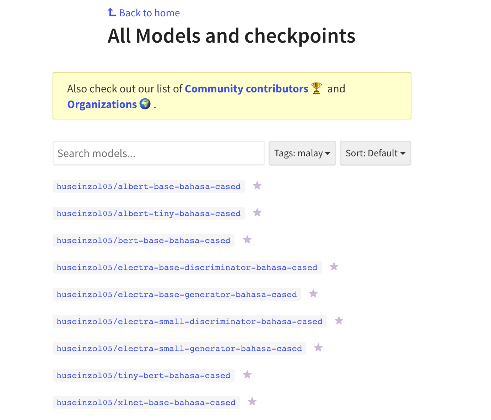

Malaya provided basic interface for Pretrained Transformer encoder
models, specific to Malay, local social media slang and Manglish
language, we called it Transformer-Bahasa. This interface not able us to
use it to do custom training.

If you want to download pretrained model for Transformer-Bahasa and use
it for custom transfer-learning, you can download it here,
https://github.com/huseinzol05/Malaya/tree/master/pretrained-model/,
some notebooks to help you get started.

Or you can simply use `hugging-face
transformers <https://huggingface.co/models?filter=malay>`__ to try
transformer models from Malaya, simply check available models from here,
https://huggingface.co/models?filter=malay

.. code:: python

    from IPython.core.display import Image, display
    
    display(Image('huggingface.png', width=500))

.. code:: python

    %%time
    import malaya

.. parsed-literal::

    CPU times: user 4.85 s, sys: 1.27 s, total: 6.12 s
    Wall time: 7.45 s

list Transformer-Bahasa available
---------------------------------

.. code:: python

    malaya.transformer.available_model()

.. parsed-literal::

    ['bert', 'tiny-bert', 'albert', 'tiny-albert', 'xlnet', 'alxlnet']

1. ``bert`` - BERT architecture from google.

2. ``tiny-bert`` - BERT architecture from google with smaller
   parameters.

3. ``albert`` - ALBERT architecture from google.

4. ``tiny-albert`` - ALBERT architecture from google with smaller
   parameters.

5. ``xlnet`` - XLNET architecture from google.

6. ``alxlnet`` Malaya architecture, unpublished model.

Load XLNET-Bahasa
-----------------

Feel free to use another models.

.. code:: python

    xlnet = malaya.transformer.load(model = 'xlnet')

.. parsed-literal::

    WARNING:tensorflow:From /Users/huseinzolkepli/Documents/Malaya/malaya/transformers/xlnet/xlnet.py:70: The name tf.gfile.Open is deprecated. Please use tf.io.gfile.GFile instead.
    
    WARNING:tensorflow:From /Users/huseinzolkepli/Documents/Malaya/malaya/transformers/xlnet/__init__.py:81: The name tf.placeholder is deprecated. Please use tf.compat.v1.placeholder instead.
    
    WARNING:tensorflow:From /Users/huseinzolkepli/Documents/Malaya/malaya/transformers/xlnet/xlnet.py:253: The name tf.variable_scope is deprecated. Please use tf.compat.v1.variable_scope instead.
    
    WARNING:tensorflow:From /Users/huseinzolkepli/Documents/Malaya/malaya/transformers/xlnet/xlnet.py:253: The name tf.AUTO_REUSE is deprecated. Please use tf.compat.v1.AUTO_REUSE instead.
    
    WARNING:tensorflow:From /Users/huseinzolkepli/Documents/Malaya/malaya/transformers/xlnet/modeling.py:686: The name tf.logging.info is deprecated. Please use tf.compat.v1.logging.info instead.
    
    INFO:tensorflow:memory input None
    INFO:tensorflow:Use float type <dtype: 'float32'>
    WARNING:tensorflow:From /Users/huseinzolkepli/Documents/Malaya/malaya/transformers/xlnet/modeling.py:693: The name tf.get_variable is deprecated. Please use tf.compat.v1.get_variable instead.
    
    WARNING:tensorflow:From /Users/huseinzolkepli/Documents/Malaya/malaya/transformers/xlnet/modeling.py:797: dropout (from tensorflow.python.layers.core) is deprecated and will be removed in a future version.
    Instructions for updating:
    Use keras.layers.dropout instead.
    WARNING:tensorflow:From /usr/local/lib/python3.7/site-packages/tensorflow_core/python/layers/core.py:271: Layer.apply (from tensorflow.python.keras.engine.base_layer) is deprecated and will be removed in a future version.
    Instructions for updating:
    Please use `layer.__call__` method instead.
    WARNING:tensorflow:
    The TensorFlow contrib module will not be included in TensorFlow 2.0.
    For more information, please see:
      * https://github.com/tensorflow/community/blob/master/rfcs/20180907-contrib-sunset.md
      * https://github.com/tensorflow/addons
      * https://github.com/tensorflow/io (for I/O related ops)
    If you depend on functionality not listed there, please file an issue.
    
    WARNING:tensorflow:From /Users/huseinzolkepli/Documents/Malaya/malaya/transformers/xlnet/modeling.py:99: dense (from tensorflow.python.layers.core) is deprecated and will be removed in a future version.
    Instructions for updating:
    Use keras.layers.Dense instead.
    WARNING:tensorflow:From /Users/huseinzolkepli/Documents/Malaya/malaya/transformers/xlnet/__init__.py:94: The name tf.InteractiveSession is deprecated. Please use tf.compat.v1.InteractiveSession instead.
    
    WARNING:tensorflow:From /Users/huseinzolkepli/Documents/Malaya/malaya/transformers/xlnet/__init__.py:95: The name tf.global_variables_initializer is deprecated. Please use tf.compat.v1.global_variables_initializer instead.
    
    WARNING:tensorflow:From /Users/huseinzolkepli/Documents/Malaya/malaya/transformers/xlnet/__init__.py:96: The name tf.trainable_variables is deprecated. Please use tf.compat.v1.trainable_variables instead.
    
    WARNING:tensorflow:From /Users/huseinzolkepli/Documents/Malaya/malaya/transformers/xlnet/__init__.py:100: The name tf.train.Saver is deprecated. Please use tf.compat.v1.train.Saver instead.
    
    WARNING:tensorflow:From /Users/huseinzolkepli/Documents/Malaya/malaya/transformers/xlnet/__init__.py:103: The name tf.get_default_graph is deprecated. Please use tf.compat.v1.get_default_graph instead.
    
    INFO:tensorflow:Restoring parameters from /Users/huseinzolkepli/Malaya/xlnet-model/base/xlnet-base/model.ckpt

.. code:: python

    strings = ['Kerajaan galakkan rakyat naik public transport tapi parking kat lrt ada 15. Reserved utk staff rapid je dah berpuluh. Park kereta tepi jalan kang kene saman dgn majlis perbandaran. Kereta pulak senang kene curi. Cctv pun tak ada. Naik grab dah 5-10 ringgit tiap hari. Gampang juga',
               'Alaa Tun lek ahhh npe muka masam cmni kn agong kata usaha kerajaan terdahulu sejak selepas merdeka',
               "Orang ramai cakap nurse kerajaan garang. So i tell u this. Most of our local ppl will treat us as hamba abdi and they don't respect us as a nurse"]

I have random sentences copied from Twitter, searched using ``kerajaan``
keyword.

Vectorization
^^^^^^^^^^^^^

Change a string or batch of strings to latent space / vectors
representation.

.. code:: python

    v = xlnet.vectorize(strings)
    v.shape

.. parsed-literal::

    (3, 768)

Attention
^^^^^^^^^

Attention is to get which part of the sentence give the impact. Method
available for attention,

-  ``'last'`` - attention from last layer.
-  ``'first'`` - attention from first layer.
-  ``'mean'`` - average attentions from all layers.

You can give list of strings or a string to get the attention, in this
documentation, I just want to use a string.

.. code:: python

    xlnet.attention(strings[1], method = 'last')

.. parsed-literal::

    [[('Alaa', 0.037521128),
      ('Tun', 0.064996645),
      ('lek', 0.029629104),
      ('ahhh', 0.06980243),
      ('npe', 0.0651414),
      ('muka', 0.043275837),
      ('masam', 0.05444884),
      ('cmni', 0.06830223),
      ('kn', 0.09239126),
      ('agong', 0.05974282),
      ('kata', 0.050666627),
      ('usaha', 0.07447508),
      ('kerajaan', 0.046375286),
      ('terdahulu', 0.08609032),
      ('sejak', 0.05165012),
      ('selepas', 0.03853117),
      ('merdeka', 0.066959694)]]

.. code:: python

    xlnet.attention(strings[1], method = 'first')

.. parsed-literal::

    [[('Alaa', 0.09218865),
      ('Tun', 0.082360476),
      ('lek', 0.06480303),
      ('ahhh', 0.043700345),
      ('npe', 0.04972692),
      ('muka', 0.063137144),
      ('masam', 0.04529886),
      ('cmni', 0.08594233),
      ('kn', 0.05617679),
      ('agong', 0.08094259),
      ('kata', 0.0571896),
      ('usaha', 0.05006538),
      ('kerajaan', 0.050642338),
      ('terdahulu', 0.053613685),
      ('sejak', 0.04977575),
      ('selepas', 0.041657023),
      ('merdeka', 0.03277911)]]

.. code:: python

    xlnet.attention(strings[1], method = 'mean')

.. parsed-literal::

    [[('Alaa', 0.061377168),
      ('Tun', 0.058099397),
      ('lek', 0.059254784),
      ('ahhh', 0.085350394),
      ('npe', 0.052339662),
      ('muka', 0.062530704),
      ('masam', 0.04982319),
      ('cmni', 0.064762965),
      ('kn', 0.05489512),
      ('agong', 0.06542812),
      ('kata', 0.05790908),
      ('usaha', 0.053684656),
      ('kerajaan', 0.052263502),
      ('terdahulu', 0.056048058),
      ('sejak', 0.056344092),
      ('selepas', 0.049894),
      ('merdeka', 0.05999512)]]

Visualize Attention
^^^^^^^^^^^^^^^^^^^

Before using attention visualization, we need to load D3 into our
jupyter notebook first. This visualization borrow from
https://github.com/jessevig/bertviz .

.. code:: javascript

    %%javascript
    require.config({
      paths: {
          d3: '//cdnjs.cloudflare.com/ajax/libs/d3/3.4.8/d3.min',
          jquery: '//ajax.googleapis.com/ajax/libs/jquery/2.0.0/jquery.min',
      }
    });

.. parsed-literal::

    <IPython.core.display.Javascript object>

.. code:: python

    xlnet.visualize_attention('nak makan ayam dgn husein')

.. raw:: html

    
    
      Layer: <select id="layer"></select>
    
    

.. parsed-literal::

    <IPython.core.display.Javascript object>

.. parsed-literal::

    <IPython.core.display.Javascript object>

*I attached a printscreen, readthedocs cannot visualize the javascript.*

.. code:: python

    from IPython.core.display import Image, display
    
    display(Image('xlnet-attention.png', width=300))

.. image:: load-transformer_files/load-transformer_24_0.png
   :width: 300px

**All attention models able to use these interfaces.**
