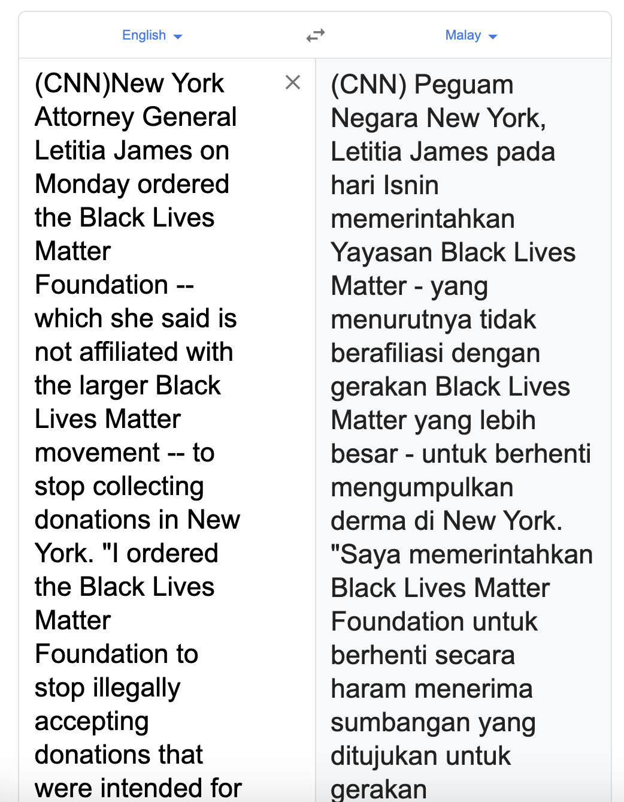
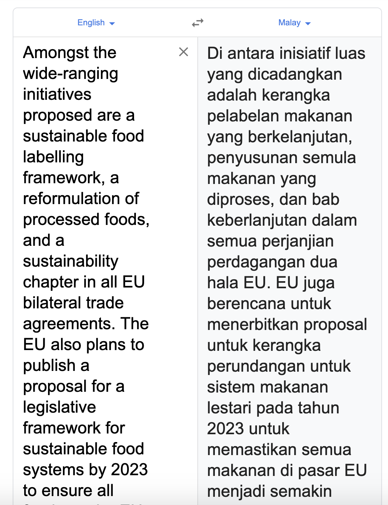

.. code:: python

    %%time
    import malaya

.. parsed-literal::

    CPU times: user 4.81 s, sys: 1.22 s, total: 6.03 s
    Wall time: 7.54 s

List available Transformer models
---------------------------------

.. code:: python

    malaya.translation.en_ms.available_transformer()

.. parsed-literal::

    {'small': ['18.4MB', 'BLEU: 0.534'],
     'base': ['234MB', 'BLEU: 0.625'],
     'large': ['817MB', 'BLEU: 0.638']}

We tested on 66k EN-MY sentences.

Load Transformer models
-----------------------

.. code:: python

    transformer = malaya.translation.en_ms.transformer()
    transformer_small = malaya.translation.en_ms.transformer(model = 'small')
    transformer_large = malaya.translation.en_ms.transformer(model = 'large')

.. parsed-literal::

    WARNING:tensorflow:From /Users/huseinzolkepli/Documents/Malaya/malaya/function/__init__.py:72: The name tf.gfile.GFile is deprecated. Please use tf.io.gfile.GFile instead.
    
    WARNING:tensorflow:From /Users/huseinzolkepli/Documents/Malaya/malaya/function/__init__.py:73: The name tf.GraphDef is deprecated. Please use tf.compat.v1.GraphDef instead.
    
    WARNING:tensorflow:From /Users/huseinzolkepli/Documents/Malaya/malaya/function/__init__.py:66: The name tf.InteractiveSession is deprecated. Please use tf.compat.v1.InteractiveSession instead.
    

Translate
^^^^^^^^^

.. code:: python

   def translate(self, strings: List[str], beam_search: bool = True):
       """
       translate list of strings.

       Parameters
       ----------
       strings : List[str]
       beam_search : bool, (optional=True)
           If True, use beam search decoder, else use greedy decoder.

       Returns
       -------
       result: List[str]
       """

**For better results, we suggest do not to try translate more than 200
words, always split by end of sentences**.

.. code:: python

    from pprint import pprint

.. code:: python

    # https://www.malaymail.com/news/malaysia/2020/07/01/dr-mahathir-again-claims-anwar-lacks-popularity-with-malays-to-be-pakatans/1880420
    
    string_news1 = 'KUALA LUMPUR, July 1 - Datuk Seri Anwar Ibrahim is not suitable to as the prime minister candidate as he is allegedly not "popular" among the Malays, Tun Dr Mahathir Mohamad claimed. The former prime minister reportedly said the PKR president needs someone like himself in order to acquire support from the Malays and win the election.'
    pprint(string_news1)

.. parsed-literal::

    ('KUALA LUMPUR, July 1 - Datuk Seri Anwar Ibrahim is not suitable to as the '
     'prime minister candidate as he is allegedly not "popular" among the Malays, '
     'Tun Dr Mahathir Mohamad claimed. The former prime minister reportedly said '
     'the PKR president needs someone like himself in order to acquire support '
     'from the Malays and win the election.')

.. code:: python

    # https://edition.cnn.com/2020/07/06/politics/new-york-attorney-general-blm/index.html
    
    string_news2 = '(CNN)New York Attorney General Letitia James on Monday ordered the Black Lives Matter Foundation -- which she said is not affiliated with the larger Black Lives Matter movement -- to stop collecting donations in New York. "I ordered the Black Lives Matter Foundation to stop illegally accepting donations that were intended for the #BlackLivesMatter movement. This foundation is not affiliated with the movement, yet it accepted countless donations and deceived goodwill," James tweeted.'
    pprint(string_news2)

.. parsed-literal::

    ('(CNN)New York Attorney General Letitia James on Monday ordered the Black '
     'Lives Matter Foundation -- which she said is not affiliated with the larger '
     'Black Lives Matter movement -- to stop collecting donations in New York. "I '
     'ordered the Black Lives Matter Foundation to stop illegally accepting '
     'donations that were intended for the #BlackLivesMatter movement. This '
     'foundation is not affiliated with the movement, yet it accepted countless '
     'donations and deceived goodwill," James tweeted.')

.. code:: python

    # https://www.thestar.com.my/business/business-news/2020/07/04/malaysia-worries-new-eu-food-rules-could-hurt-palm-oil-exports
    
    string_news3 = 'Amongst the wide-ranging initiatives proposed are a sustainable food labelling framework, a reformulation of processed foods, and a sustainability chapter in all EU bilateral trade agreements. The EU also plans to publish a proposal for a legislative framework for sustainable food systems by 2023 to ensure all foods on the EU market become increasingly sustainable.'
    pprint(string_news3)

.. parsed-literal::

    ('Amongst the wide-ranging initiatives proposed are a sustainable food '
     'labelling framework, a reformulation of processed foods, and a '
     'sustainability chapter in all EU bilateral trade agreements. The EU also '
     'plans to publish a proposal for a legislative framework for sustainable food '
     'systems by 2023 to ensure all foods on the EU market become increasingly '
     'sustainable.')

.. code:: python

    # https://jamesclear.com/articles
    
    string_article1 = 'This page shares my best articles to read on topics like health, happiness, creativity, productivity and more. The central question that drives my work is, “How can we live better?” To answer that question, I like to write about science-based ways to solve practical problems.'
    pprint(string_article1)

.. parsed-literal::

    ('This page shares my best articles to read on topics like health, happiness, '
     'creativity, productivity and more. The central question that drives my work '
     'is, “How can we live better?” To answer that question, I like to write about '
     'science-based ways to solve practical problems.')

.. code:: python

    # https://towardsdatascience.com/fuzzy-matching-at-scale-84f2bfd0c536
    
    string_article2 = 'Fuzzy matching at scale. From 3.7 hours to 0.2 seconds. How to perform intelligent string matching in a way that can scale to even the biggest data sets. Data in the real world is messy. Dealing with messy data sets is painful and burns through time which could be spent analysing the data itself.'
    pprint(string_article2)

.. parsed-literal::

    ('Fuzzy matching at scale. From 3.7 hours to 0.2 seconds. How to perform '
     'intelligent string matching in a way that can scale to even the biggest data '
     'sets. Data in the real world is messy. Dealing with messy data sets is '
     'painful and burns through time which could be spent analysing the data '
     'itself.')

.. code:: python

    random_string1 = 'i am in medical school.'
    random_string2 = 'Emmerdale is the debut studio album,songs were not released in the U.S <> These songs were not released in the U.S. edition of said album and were previously unavailable on any U.S. release.'
    pprint(random_string2)

.. parsed-literal::

    ('Emmerdale is the debut studio album,songs were not released in the U.S <> '
     'These songs were not released in the U.S. edition of said album and were '
     'previously unavailable on any U.S. release.')

Comparing with Google Translate
^^^^^^^^^^^^^^^^^^^^^^^^^^^^^^^

These printscreens taken on 7th July 2020, Google always update model,
so Google Translate in the future might improved.

**string_news1**

.. code:: python

    from IPython.core.display import Image, display
    
    display(Image('en-string1.png', width=450))

.. image:: load-translation-en-ms_files/load-translation-en-ms_16_0.png
   :width: 450px

KUALA LUMPUR, 1 Julai - Anwar Ibrahim tidak sesuai menjadi calon perdana
menteri kerana dia dikatakan tidak “popular” di kalangan orang Melayu,
kata Tun Dr Mahathir Mohamad. Bekas perdana menteri itu dilaporkan
mengatakan bahawa presiden PKR memerlukan seseorang seperti dirinya
untuk mendapatkan sokongan orang Melayu dan memenangi pilihan raya.

**string_news2**

.. code:: python

    display(Image('en-string2.png', width=450))

(CNN) Peguam Negara New York, Letitia James pada hari Isnin
memerintahkan Yayasan Black Lives Matter - yang menurutnya tidak
berafiliasi dengan gerakan Black Lives Matter yang lebih besar - untuk
berhenti mengumpulkan derma di New York. “Saya memerintahkan Black Lives
Matter Foundation untuk berhenti secara haram menerima sumbangan yang
ditujukan untuk gerakan #BlackLivesMatter. Yayasan ini tidak berafiliasi
dengan gerakan itu, namun ia menerima banyak sumbangan dan menipu
muhibah,” tweet James.

**string_news3**

.. code:: python

    display(Image('en-string3.png', width=450))

Di antara inisiatif luas yang dicadangkan adalah kerangka pelabelan
makanan yang berkelanjutan, penyusunan semula makanan yang diproses, dan
bab keberlanjutan dalam semua perjanjian perdagangan dua hala EU. EU
juga berencana untuk menerbitkan proposal untuk kerangka perundangan
untuk sistem makanan lestari pada tahun 2023 untuk memastikan semua
makanan di pasar EU menjadi semakin

**random_string2**

.. code:: python

    display(Image('en-string4.png', width=450))

.. image:: load-translation-en-ms_files/load-translation-en-ms_25_0.png
   :width: 450px

Emmerdale adalah album studio sulung, lagu-lagu tidak dirilis di A.S.

Translate transformer base
^^^^^^^^^^^^^^^^^^^^^^^^^^

.. code:: python

    %%time
    
    pprint(transformer.translate([string_news1, string_news2, string_news3], beam_search = False))

.. parsed-literal::

    ['KUALA LUMPUR 1 Julai - Datuk Seri Anwar Ibrahim tidak sesuai menjadi calon '
     'Perdana Menteri kerana beliau didakwa tidak "popular" dalam kalangan orang '
     'Melayu, dakwa Tun Dr. Bekas Perdana Menteri itu dilaporkan berkata presiden '
     'PKR itu memerlukan seseorang seperti dirinya demi mendapatkan sokongan '
     'daripada orang Melayu dan memenangi pilihan raya.',
     '(CNN)New York Peguam Negara Letitia James pada hari Isnin mengarahkan Black '
     'Lives Matter Foundation-yang menurutnya tidak berkaitan dengan pergerakan '
     'Black Lives Matter yang lebih besar-untuk berhenti mengumpulkan sumbangan di '
     'New York. "Saya mengarahkan Black Lives Matter Foundation untuk berhenti '
     'menerima sumbangan secara haram yang dimaksudkan untuk pergerakan '
     '#BlackLivesMatter. Yayasan ini tidak berkaitan dengan pergerakan ini, namun '
     'ia menerima sumbangan yang tidak terkira banyaknya dan menipu niat baik," '
     'kicauan James.',
     'Antara inisiatif yang dikemukakan secara meluas adalah rangka kerja '
     'pelabelan makanan lestari, pembaharuan makanan yang diproses, dan bab '
     'kelestarian dalam semua perjanjian perdagangan dua hala EU. EU juga '
     'merancang untuk menerbitkan cadangan untuk rangka kerja perundangan untuk '
     'sistem makanan lestari menjelang 2023 untuk memastikan semua makanan di '
     'pasaran EU menjadi semakin mampan.']
    CPU times: user 25.8 s, sys: 13.5 s, total: 39.3 s
    Wall time: 11 s

.. code:: python

    %%time
    
    pprint(transformer.translate([string_article1, string_article2], beam_search = False))

.. parsed-literal::

    ['Laman ini berkongsi artikel terbaik saya untuk membaca mengenai topik '
     'seperti kesihatan, kebahagiaan, kreativiti, produktiviti dan banyak lagi. '
     'Soalan utama yang mendorong karya saya adalah, "Bagaimana kita dapat hidup '
     'lebih baik?" Untuk menjawab soalan itu, saya suka menulis mengenai cara '
     'berasaskan sains untuk menyelesaikan masalah praktikal.',
     'Pemadanan kabur pada skala. Dari 3.7 jam hingga 0.2 saat. Cara melakukan '
     'pemadanan rentetan pintar dengan cara yang boleh skalakan pada set data '
     'terbesar. Data dalam dunia nyata tidak kemas. Menangani set data yang tidak '
     'kemas adalah menyakitkan dan terbakar melalui masa yang mana ia boleh '
     'dibelanjakan untuk menganalisis data itu sendiri.']
    CPU times: user 16.2 s, sys: 8.66 s, total: 24.8 s
    Wall time: 5.68 s

.. code:: python

    %%time
    
    pprint(transformer.translate([random_string1, random_string2], beam_search = False))

.. parsed-literal::

    ['saya di sekolah perubatan.',
     'Emmerdale adalah album studio sulung, lagu-lagu tidak dikeluarkan di A.S <> '
     'Lagu-lagu ini tidak dikeluarkan dalam album edisi AS dan sebelumnya tidak '
     'dapat digunakan pada sebarang keluaran A.S.']
    CPU times: user 9.91 s, sys: 5.24 s, total: 15.1 s
    Wall time: 3.43 s

Translate transformer small
^^^^^^^^^^^^^^^^^^^^^^^^^^^

.. code:: python

    %%time
    
    pprint(transformer_small.translate([string_news1, string_news2, string_news3], beam_search = False))

.. parsed-literal::

    ['KUALA LUMPUR 1 Julai - Datuk Seri Anwar Ibrahim tidak sesuai kerana calon '
     'perdana menteri kerana didakwa tidak "popular" dalam kalangan orang Melayu, '
     'Tun Dr Mahathir Mohamad mendakwa. Bekas perdana menteri itu dilaporkan '
     'berkata Presiden PKR memerlukan seseorang seperti dirinya untuk memperoleh '
     'sokongan daripada orang Melayu dan memenangi pilihan raya.',
     '(CNN)New York Peguam Negara Letitia James pada Isnin mengarahkan Black Lives '
     'Matter Foundation-yang dia katakan tidak bergabung dengan pergerakan Black '
     'Lives Matter yang lebih besar - untuk berhenti mengumpulkan sumbangan di New '
     'York. "Saya mengarahkan Black Lives Matter Foundation untuk menghentikan '
     'sumbangan secara haram yang dimaksudkan untuk gerakan #BlackLivesMatter. '
     'Yayasan ini tidak bergabung dengan pergerakan, tetapi ia menerima sumbangan '
     'yang tidak dikira dan telah ditipu," James tweeted.',
     'Antara inisiatif yang telah dimulakan secara meluas adalah kerangka makmal '
     'makanan yang mampan, suatu pembaharuan makanan yang diproses, dan bab '
     'kelestarian dalam semua perjanjian perdagangan dua hala EU. EU juga '
     'merancang untuk menerbitkan cadangan rangka perundangan untuk sistem makanan '
     'lestari menjelang 2023 untuk memastikan semua makanan di pasaran EU semakin '
     'lestari.']
    CPU times: user 3.69 s, sys: 775 ms, total: 4.47 s
    Wall time: 1.67 s

.. code:: python

    %%time
    
    pprint(transformer_small.translate([string_article1, string_article2], beam_search = False))

.. parsed-literal::

    ['Laman ini berkongsi artikel terbaik saya untuk membaca topik seperti '
     'kesihatan, kebahagiaan, kreativiti, produktiviti dan lain-lain. Soalan pusat '
     'yang mendorong kerja saya adalah, "Bagaimana kita dapat hidup lebih baik?" '
     'Untuk menjawab soalan itu, saya suka menulis mengenai cara berasaskan sains '
     'untuk menyelesaikan masalah praktikal.',
     'Pemadanan bahan api pada skala. Dari 3.7 jam kepada 0.2 saat. Bagaimana '
     'untuk melakukan pemadanan rentetan pintar dengan cara yang boleh skala '
     'hingga set data terbesar. Data di dunia sebenar tidak kemas. Menyangi set '
     'data tidak kemas. Memberi maklumat tidak kemas dan terbakar melalui masa '
     'yang boleh dibelanjakan menganalisis data itu sendiri.']
    CPU times: user 2.46 s, sys: 413 ms, total: 2.87 s
    Wall time: 799 ms

.. code:: python

    %%time
    
    pprint(transformer_small.translate([random_string1, random_string2], beam_search = False))

.. parsed-literal::

    ['saya di sekolah perubatan.',
     'Emmerdale adalah album studio sulung, lagu-lagu tidak dikeluarkan dalam U.S '
     '<> Lagu-lagu ini tidak dikeluarkan dalam album kata A.S. dan sebelum ini '
     'tidak tersedia pada sebarang keluaran A.S.']
    CPU times: user 1.69 s, sys: 318 ms, total: 2.01 s
    Wall time: 564 ms

Translate transformer large
^^^^^^^^^^^^^^^^^^^^^^^^^^^

.. code:: python

    %%time
    
    pprint(transformer_large.translate([string_news1, string_news2, string_news3], beam_search = False))

.. parsed-literal::

    ['KUALA LUMPUR 1 Julai - Datuk Seri Anwar Ibrahim tidak sesuai menjadi calon '
     'Perdana Menteri kerana beliau didakwa tidak "popular" dalam kalangan orang '
     'Melayu, Tun Dr. Mahathir Mohamad mendakwa bekas Perdana Menteri itu '
     'dilaporkan berkata, Presiden PKR memerlukan seseorang seperti dirinya '
     'sendiri bagi mendapatkan sokongan daripada orang Melayu dan memenangi '
     'pilihan raya.',
     '(CNN)New York Attorney General Letitia James on Monday ordered the Black '
     'Lives Matter Foundation-which she said is not affiliated with the larger '
     'Black Lives Matter movement-to stop collecting donations in New York. "I '
     'ordered the Black Lives Matter Foundation to stop illegally accepting '
     'donations that were intended for the #BlackLivesMatter movement. Yayasan ini '
     'tidak bergabung dengan gerakan tersebut, namun ia menerima sumbangan yang '
     'tidak terkira banyaknya dan niat baik yang tertipu," tweet James.',
     'Antara inisiatif meluas yang dicadangkan adalah rangka kerja pelabelan '
     'makanan mampan, pembaharuan makanan diproses, dan bab kemampanan dalam semua '
     'perjanjian perdagangan dua hala EU. EU juga merancang untuk menerbitkan '
     'cadangan rangka kerja perundangan untuk sistem makanan lestari menjelang '
     '2023 untuk memastikan semua makanan di pasaran EU menjadi semakin mampan.']
    CPU times: user 1min 1s, sys: 25.3 s, total: 1min 26s
    Wall time: 27.8 s

.. code:: python

    %%time
    
    pprint(transformer_large.translate([string_article1, string_article2], beam_search = False))

.. parsed-literal::

    ['Laman ini berkongsi artikel terbaik saya untuk membaca mengenai topik '
     'seperti kesihatan, kebahagiaan, kreativiti, produktiviti dan banyak lagi. '
     'Soalan utama yang mendorong karya saya adalah, "Bagaimana kita boleh hidup '
     'lebih baik?" Untuk menjawab soalan itu, saya suka menulis mengenai cara '
     'berasaskan sains untuk menyelesaikan masalah praktikal.',
     'Pemadanan kabur pada skala. Dari 3.7 jam hingga 0.2 saat. Bagaimana '
     'melakukan pemadanan rentetan pintar dengan cara yang dapat skala bahkan set '
     'data terbesar. Data di dunia nyata tidak kemas. Berurusan dengan set data '
     'yang tidak kemas adalah menyakitkan dan terbakar melalui masa yang boleh '
     'dihabiskan untuk menganalisis data itu sendiri.']
    CPU times: user 42.2 s, sys: 17.5 s, total: 59.8 s
    Wall time: 11.7 s

.. code:: python

    %%time
    
    pprint(transformer_large.translate([random_string1, random_string2], beam_search = False))

.. parsed-literal::

    ['saya di sekolah perubatan.',
     'Emmerdale adalah album studio sulung, lagu tidak dikeluarkan di A.S <> '
     'Lagu-lagu ini tidak dikeluarkan dalam edisi A.S. album itu dan sebelumnya '
     'tidak tersedia di mana-mana pelepasan A.S.']
    CPU times: user 25.1 s, sys: 9.59 s, total: 34.6 s
    Wall time: 8.39 s

