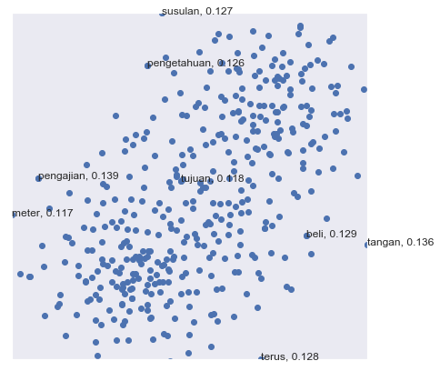

.. code:: python

    %%time
    import malaya
    %matplotlib inline

.. parsed-literal::

    CPU times: user 12.2 s, sys: 1.39 s, total: 13.6 s
    Wall time: 17.2 s

Load malaya news word2vec
-------------------------

.. code:: python

    embedded = malaya.word2vec.load(256)

Load word2vec model
-------------------

.. code:: python

    word_vector = malaya.word2vec.word2vec(embedded['nce_weights'], embedded['dictionary'])

Check top-k similar semantics based on a word
---------------------------------------------

.. code:: python

    word = 'anwar'
    print("Embedding layer: 8 closest words to: '%s'"%(word))
    print(word_vector.n_closest(word=word, num_closest=8, metric='cosine'))

.. parsed-literal::

    Embedding layer: 8 closest words to: 'anwar'
    [['mahathir', 0.44774019718170166], ['beliau', 0.44170427322387695], ['zaid', 0.43993180990219116], ['hishammuddin', 0.4343132972717285], ['kuok', 0.43307822942733765], ['husam', 0.43213725090026855], ['anifah', 0.4307258129119873], ['pesakit', 0.4262162446975708]]

Calculate vb - va + vc
----------------------

.. code:: python

    print(word_vector.analogy('anwar', 'penjara', 'kerajaan', 5))

.. parsed-literal::

    ['penjara', 'kerajaan', 'kkm', 'kabinet', 'tuju']

Word2vec calculator
-------------------

You can put any equation you wanted.

.. code:: python

    word_vector.calculator('anwar + amerika + mahathir', num_closest=8, metric='cosine',
                          return_similarity=False)

.. parsed-literal::

    ['mahathir',
     'anwar',
     'amerika',
     'UNK',
     'najib',
     'husam',
     'kuok',
     'azalina',
     'mujahid']

.. code:: python

    word_vector.calculator('anwar * amerika', num_closest=8, metric='cosine',
                          return_similarity=False)

.. parsed-literal::

    ['turut',
     'pengajian',
     'tangan',
     'beli',
     'terus',
     'susulan',
     'pengetahuan',
     'tujuan',
     'meter']

Visualize scatter-plot
----------------------

.. code:: python

    word = 'anwar'
    result = word_vector.n_closest(word=word, num_closest=8, metric='cosine')
    word_vector.scatter_plot(result, centre = word, notebook_mode = True)

.. image:: load-word2vec_files/load-word2vec_13_0.png

.. code:: python

    result = word_vector.calculator('anwar * amerika', num_closest=8, metric='cosine',
                          return_similarity=True)
    word_vector.scatter_plot(result, notebook_mode = True)

Visualize tree-plot
-------------------

.. code:: python

    word = 'anwar'
    result = word_vector.n_closest(word=word, num_closest=8, metric='cosine')
    word_vector.tree_plot(result, notebook_mode = True)

.. parsed-literal::

    <Figure size 504x504 with 0 Axes>

.. image:: load-word2vec_files/load-word2vec_16_1.png

Get embedding from a word
-------------------------

If a word not found in the vocabulary, it will throw an exception with
top-5 nearest words

.. code:: python

    word_vector.get_vector_by_name('husein-comel')

::

    ---------------------------------------------------------------------------

    Exception                                 Traceback (most recent call last)

    <ipython-input-11-a2cb3bf2a088> in <module>
    ----> 1 word_vector.get_vector_by_name('husein-comel')

    ~/Documents/Malaya/malaya/word2vec.py in get_vector_by_name(self, word)
        109             raise Exception(
        110                 'input not found in dictionary, here top-5 nearest words [%s]'
    --> 111                 % (strings)
        112             )
        113         return np.ravel(self._embed_matrix[self._dictionary[word], :])

    Exception: input not found in dictionary, here top-5 nearest words [income, husein, incomes, hussein, husseiny]
