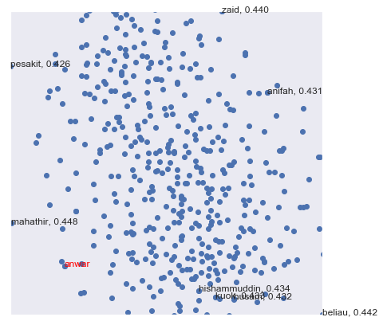

Pretrained word2vec
-------------------

You can download Malaya pretrained without need to import malaya.

word2vec from news
^^^^^^^^^^^^^^^^^^

`size-32 <https://s3-ap-southeast-1.amazonaws.com/huseinhouse-storage/v7/word2vec/word2vec-32.p>`__

`size-64 <https://s3-ap-southeast-1.amazonaws.com/huseinhouse-storage/v7/word2vec/word2vec-64.p>`__

`size-128 <https://s3-ap-southeast-1.amazonaws.com/huseinhouse-storage/v7/word2vec/word2vec-128.p>`__

`size-256 <https://s3-ap-southeast-1.amazonaws.com/huseinhouse-storage/v7/word2vec/word2vec-256.p>`__

`size-512 <https://s3-ap-southeast-1.amazonaws.com/huseinhouse-storage/v7/word2vec/word2vec-512.p>`__

word2vec from wikipedia
^^^^^^^^^^^^^^^^^^^^^^^

`size-256 <https://s3-ap-southeast-1.amazonaws.com/huseinhouse-storage/v13/word2vec/word2vec-wiki-nce-256.p>`__

You will get a pickle file, contains ``['nce_weights', 'dictionary']``.

To load that pickle file,

.. code:: python

   import pickle
   with open('file.p', 'rb') as fopen:
       word2vec = pickle.load(fopen)

But If you don’t know what to do with malaya word2vec, Malaya provided
some useful functions for you!

.. code:: python

    %%time
    import malaya
    %matplotlib inline

.. parsed-literal::

    CPU times: user 12.4 s, sys: 1.3 s, total: 13.7 s
    Wall time: 17.1 s

Load malaya news word2vec
-------------------------

.. code:: python

    embedded_news = malaya.word2vec.load_news(256)

Load malaya wikipedia word2vec
------------------------------

.. code:: python

    embedded_wiki = malaya.word2vec.load_wiki()

Load word2vec interface
-----------------------

.. code:: python

    word_vector_news = malaya.word2vec.word2vec(embedded_news['nce_weights'], embedded_news['dictionary'])
    word_vector_wiki = malaya.word2vec.word2vec(embedded_wiki['nce_weights'], embedded_wiki['dictionary'])

Check top-k similar semantics based on a word
---------------------------------------------

.. code:: python

    word = 'anwar'
    print("Embedding layer: 8 closest words to: '%s'"%(word))
    print(word_vector_news.n_closest(word=word, num_closest=8, metric='cosine'))

.. parsed-literal::

    Embedding layer: 8 closest words to: 'anwar'
    [['mahathir', 0.44774019718170166], ['beliau', 0.44170427322387695], ['zaid', 0.43993180990219116], ['hishammuddin', 0.4343132972717285], ['kuok', 0.43307822942733765], ['husam', 0.43213725090026855], ['anifah', 0.4307258129119873], ['pesakit', 0.4262162446975708]]

.. code:: python

    word = 'anwar'
    print("Embedding layer: 8 closest words to: '%s'"%(word))
    print(word_vector_wiki.n_closest(word=word, num_closest=8, metric='cosine'))

.. parsed-literal::

    Embedding layer: 8 closest words to: 'anwar'
    [['zaid', 0.7285637855529785], ['khairy', 0.6839416027069092], ['zabidi', 0.6709405183792114], ['nizar', 0.6695379018783569], ['harussani', 0.6595045328140259], ['shahidan', 0.6565827131271362], ['azalina', 0.6541041135787964], ['shahrizat', 0.6538639068603516]]

Calculate vb - va + vc
----------------------

.. code:: python

    print(word_vector_news.analogy('anwar', 'penjara', 'kerajaan', 5))

.. parsed-literal::

    ['penjara', 'kerajaan', 'kkm', 'kabinet', 'tuju']

.. code:: python

    print(word_vector_wiki.analogy('anwar', 'penjara', 'kerajaan', 5))

.. parsed-literal::

    ['penjara', 'kerajaan', 'kemaharajaan', 'pemerintah', 'pelabuhan']

Word2vec calculator
-------------------

You can put any equation you wanted.

.. code:: python

    word_vector_news.calculator('anwar + amerika + mahathir', num_closest=8, metric='cosine',
                          return_similarity=False)

.. parsed-literal::

    ['mahathir',
     'anwar',
     'amerika',
     'UNK',
     'najib',
     'husam',
     'kuok',
     'azalina',
     'mujahid']

.. code:: python

    word_vector_wiki.calculator('anwar + amerika + mahathir', num_closest=8, metric='cosine',
                          return_similarity=False)

.. parsed-literal::

    ['anwar',
     'mahathir',
     'hishammuddin',
     'sukarno',
     'khairy',
     'suffian',
     'ahmadinejad',
     'davutoglu',
     'shahrizat']

Visualize scatter-plot
----------------------

.. code:: python

    word = 'anwar'
    result = word_vector_news.n_closest(word=word, num_closest=8, metric='cosine')
    word_vector_news.scatter_plot(result, centre = word, notebook_mode = True)

.. code:: python

    word = 'anwar'
    result = word_vector_wiki.n_closest(word=word, num_closest=8, metric='cosine')
    word_vector_wiki.scatter_plot(result, centre = word, notebook_mode = True)

.. image:: load-word2vec_files/load-word2vec_20_0.png

Visualize tree-plot
-------------------

.. code:: python

    word = 'anwar'
    result = word_vector_news.n_closest(word=word, num_closest=8, metric='cosine')
    word_vector_news.tree_plot(result, notebook_mode = True)

.. parsed-literal::

    <Figure size 504x504 with 0 Axes>

.. image:: load-word2vec_files/load-word2vec_22_1.png

.. code:: python

    word = 'anwar'
    result = word_vector_wiki.n_closest(word=word, num_closest=8, metric='cosine')
    word_vector_wiki.tree_plot(result, notebook_mode = True)

.. parsed-literal::

    <Figure size 504x504 with 0 Axes>

.. image:: load-word2vec_files/load-word2vec_23_1.png

Get embedding from a word
-------------------------

If a word not found in the vocabulary, it will throw an exception with
top-5 nearest words

.. code:: python

    word_vector_news.get_vector_by_name('husein-comel')

::

    ---------------------------------------------------------------------------

    Exception                                 Traceback (most recent call last)

    <ipython-input-15-b4f84915c530> in <module>
    ----> 1 word_vector_news.get_vector_by_name('husein-comel')

    ~/Documents/Malaya/malaya/word2vec.py in get_vector_by_name(self, word)
        259             raise Exception(
        260                 'input not found in dictionary, here top-5 nearest words [%s]'
    --> 261                 % (strings)
        262             )
        263         return np.ravel(self._embed_matrix[self._dictionary[word], :])

    Exception: input not found in dictionary, here top-5 nearest words [income, husein, incomes, hussein, husseiny]

Train on custom corpus
----------------------

.. code:: python

    isu_kerajaan = ['Institusi raja khususnya Yang di-Pertuan Agong adalah kedaulatan negara dengan kedudukan dan peranannya termaktub dalam Perlembagaan Persekutuan yang perlu disokong dan didukung oleh kerajaan serta rakyat.',
                   'Pensyarah Kulliyah Undang-Undang Ahmad Ibrahim, Universiti Islam Antarabangsa Malaysia (UIAM) Prof Madya Dr Shamrahayu Ab Aziz berkata perubahan kerajaan, susulan kemenangan Pakatan Harapan pada Pilihan Raya Umum Ke-14 pada Mei lepas, tidak memberi kesan dari segi peranan, fungsi dan kedudukan Yang di-Pertuan Agong.',
                   'Peralihan kerajaan itu menyaksikan Sultan Muhammad V mencatat sejarah tersendiri dengan menjadi Yang di-Pertuan Agong Malaysia yang pertama memerintah dalam era dua kerajaan berbeza.',
                   'Semasa dilantik sebagai Yang di-Pertuan Agong Ke-15 pada 13 Dis 2016, kerajaan ketika itu diterajui oleh Barisan Nasional dan pada 10 Mei lepas, kepimpinan negara diambil alih oleh Pakatan Harapan yang memenangi Pilihan Raya Umum Ke-14.',
                   'Ketika merasmikan Istiadat Pembukaan Penggal Pertama, Parlimen ke-14 pada 17 Julai lepas, Seri Paduka bertitah mengalu-alukan pendekatan kerajaan Pakatan Harapan dalam menegakkan ketelusan terutamanya dengan mendedahkan kedudukan kewangan negara yang sebenar serta mengkaji semula perbelanjaan, kos projek dan mengurus kewangan secara berhemat bagi menangani kos sara hidup.',
                   'Pada Jun lepas, Sultan Muhammad V memperkenankan supaya peruntukan gaji dan emolumen Yang di-Pertuan Agong dikurangkan sebanyak 10 peratus sepanjang pemerintahan sehingga 2021 berikutan keprihatinan Seri Paduka terhadap tahap hutang dan keadaan ekonomi negara.',
                   'Seri Paduka turut menitahkan supaya Majlis Rumah Terbuka Aidilfitri tahun ini tidak diadakan di Istana Negara dengan peruntukan majlis itu digunakan bagi membantu golongan yang kurang bernasib baik.']

.. code:: python

    embed_weights, nce_weights, dictionary = malaya.word2vec.train(isu_kerajaan)

.. parsed-literal::

    WARNING:tensorflow:From /usr/local/lib/python3.6/site-packages/tensorflow/python/ops/nn_impl.py:1124: sparse_to_dense (from tensorflow.python.ops.sparse_ops) is deprecated and will be removed in a future version.
    Instructions for updating:
    Create a `tf.sparse.SparseTensor` and use `tf.sparse.to_dense` instead.

.. parsed-literal::

    train minibatch loop: 100%|██████████| 8/8 [00:00<00:00, 70.86it/s, cost=32.1]
    test minibatch loop: 100%|██████████| 1/1 [00:00<00:00, 31.61it/s, cost=29.1]
    train minibatch loop:   0%|          | 0/8 [00:00<?, ?it/s, cost=27.9]

.. parsed-literal::

    model built, vocab size 157, document length 239

.. parsed-literal::

    train minibatch loop: 100%|██████████| 8/8 [00:00<00:00, 110.32it/s, cost=23.5]
    test minibatch loop: 100%|██████████| 1/1 [00:00<00:00, 105.95it/s, cost=29.7]
    train minibatch loop: 100%|██████████| 8/8 [00:00<00:00, 136.31it/s, cost=32.3]
    test minibatch loop: 100%|██████████| 1/1 [00:00<00:00, 158.56it/s, cost=32.2]
    train minibatch loop: 100%|██████████| 8/8 [00:00<00:00, 88.86it/s, cost=14.9]
    test minibatch loop: 100%|██████████| 1/1 [00:00<00:00, 105.29it/s, cost=23.8]
    train minibatch loop: 100%|██████████| 8/8 [00:00<00:00, 97.94it/s, cost=21.7]
    test minibatch loop: 100%|██████████| 1/1 [00:00<00:00, 112.82it/s, cost=13.2]
    train minibatch loop: 100%|██████████| 8/8 [00:00<00:00, 97.43it/s, cost=17.1]
    test minibatch loop: 100%|██████████| 1/1 [00:00<00:00, 89.99it/s, cost=7.05]
    train minibatch loop: 100%|██████████| 8/8 [00:00<00:00, 98.69it/s, cost=15.3]
    test minibatch loop: 100%|██████████| 1/1 [00:00<00:00, 164.83it/s, cost=13.2]
    train minibatch loop: 100%|██████████| 8/8 [00:00<00:00, 113.04it/s, cost=15.1]
    test minibatch loop: 100%|██████████| 1/1 [00:00<00:00, 120.88it/s, cost=8.18]
    train minibatch loop: 100%|██████████| 8/8 [00:00<00:00, 120.55it/s, cost=7.06]
    test minibatch loop: 100%|██████████| 1/1 [00:00<00:00, 123.27it/s, cost=10]
    train minibatch loop: 100%|██████████| 8/8 [00:00<00:00, 114.26it/s, cost=7.71]
    test minibatch loop: 100%|██████████| 1/1 [00:00<00:00, 165.34it/s, cost=6.47]

.. code:: python

    trained_word2vec = malaya.word2vec.word2vec(nce_weights, dictionary)

.. code:: python

    word = 'paduka'
    print("Embedding layer: 8 closest words to: '%s'"%(word))
    print(trained_word2vec.n_closest(word=word, num_closest=8, metric='cosine'))

.. parsed-literal::

    Embedding layer: 8 closest words to: 'paduka'
    [['pakatan', 0.6065390110015869], ['bagi', 0.5856462121009827], ['majlis', 0.5783143043518066], ['mei', 0.569650411605835], ['START', 0.5642930269241333], ['memberi', 0.5552166700363159], ['ke', 0.5527567267417908], ['malaysia', 0.5336258411407471]]
