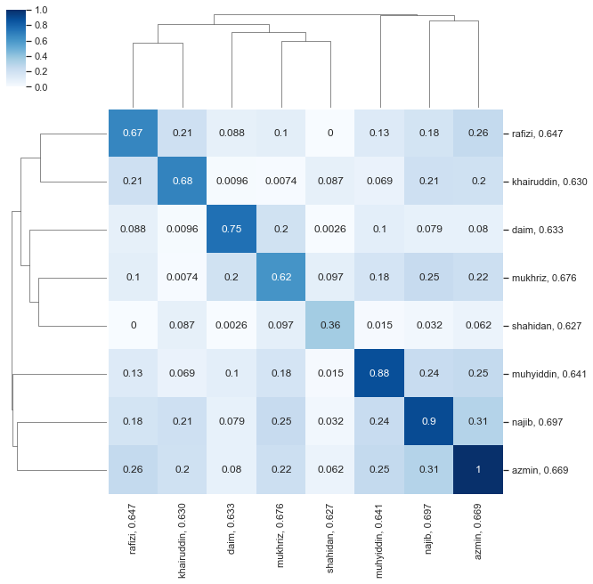
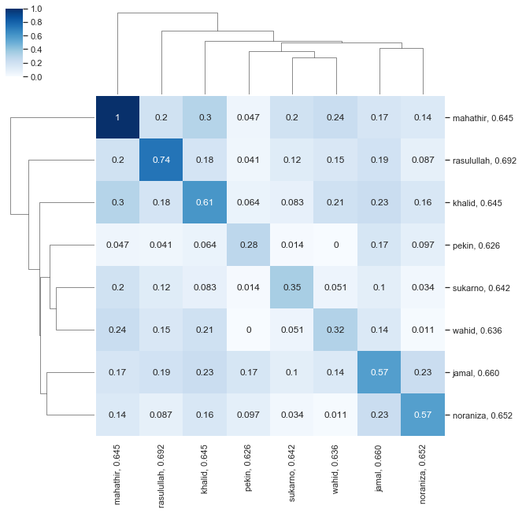
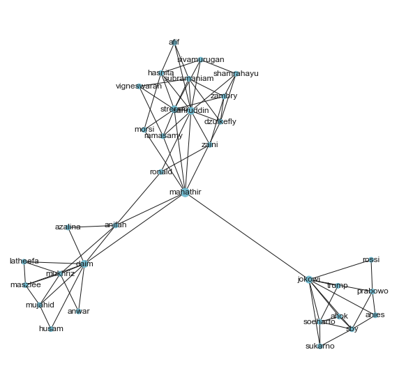
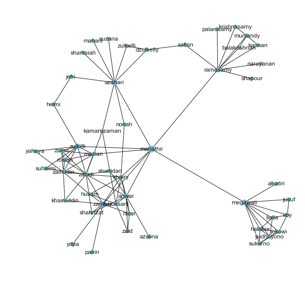

Pretrained word2vec
-------------------

You can download Malaya pretrained without need to import malaya.

word2vec from local news
^^^^^^^^^^^^^^^^^^^^^^^^

`size-256 <https://github.com/huseinzol05/Malaya/tree/master/pretrained-model/wordvector#download>`__

word2vec from wikipedia
^^^^^^^^^^^^^^^^^^^^^^^

`size-256 <https://github.com/huseinzol05/Malaya/tree/master/pretrained-model/wordvector#download>`__

word2vec from local social media
^^^^^^^^^^^^^^^^^^^^^^^^^^^^^^^^

`size-256 <https://github.com/huseinzol05/Malaya/tree/master/pretrained-model/wordvector#download>`__

But If you don’t know what to do with malaya word2vec, Malaya provided
some useful functions for you!

.. code:: python

    %%time
    import malaya
    %matplotlib inline

.. parsed-literal::

    CPU times: user 4.21 s, sys: 793 ms, total: 5 s
    Wall time: 4.11 s

Load malaya news word2vec
-------------------------

.. code:: python

    vocab_news, embedded_news = malaya.wordvector.load_news()

Load malaya wikipedia word2vec
------------------------------

.. code:: python

    vocab_wiki, embedded_wiki = malaya.wordvector.load_wiki()

Load word vector interface
--------------------------

.. code:: python

   def load(embed_matrix, dictionary):

       """
       Return malaya.wordvector._wordvector object.

       Parameters
       ----------
       embed_matrix: numpy array
       dictionary: dictionary

       Returns
       -------
       _wordvector: malaya.wordvector._wordvector object
       """
       

1. ``embed_matrix`` must be a 2d,

.. code:: python

   array([[ 0.25      , -0.10816103, -0.19881412, ...,  0.40432587,
            0.19388093, -0.07062137],
          [ 0.3231817 , -0.01318745, -0.17950962, ...,  0.25      ,
            0.08444146, -0.11705721],
          [ 0.29103908, -0.16274083, -0.20255531, ...,  0.25      ,
            0.06253044, -0.16404966],
          ...,
          [ 0.21346697,  0.12686132, -0.4029543 , ...,  0.43466234,
            0.20910986, -0.32219803],
          [ 0.2372157 ,  0.32420087, -0.28036436, ...,  0.2894639 ,
            0.20745888, -0.30600077],
          [ 0.27907744,  0.35755727, -0.34932107, ...,  0.37472805,
            0.42045262, -0.21725406]], dtype=float32)

2. ``dictionary``, a dictionary mapped ``{'word': 0}``,

.. code:: python

   {'mengembanfkan': 394623,
    'dipujanya': 234554,
    'comicolor': 182282,
    'immaz': 538660,
    'qabar': 585119,
    'phidippus': 180802,
   }

Load custom word vector
^^^^^^^^^^^^^^^^^^^^^^^

Like fast-text, example, I download from here,
https://dl.fbaipublicfiles.com/fasttext/vectors-wiki/wiki.ms.vec

We need to parse the data to get ``embed_matrix`` and ``dictionary``.

.. code:: python

    import io
    import numpy as np
    
    fin = io.open('wiki.ms.vec', 'r', encoding='utf-8', newline='\n', errors='ignore')
    n, d = map(int, fin.readline().split())
    
    data, vectors = {}, []
    for no, line in enumerate(fin):
        tokens = line.rstrip().split(' ')
        data[tokens[0]] = no
        vectors.append(list(map(float, tokens[1:])))
        
    vectors = np.array(vectors)
    fast_text = malaya.wordvector.load(vectors, data)

.. code:: python

    word_vector_news = malaya.wordvector.load(embedded_news, vocab_news)
    word_vector_wiki = malaya.wordvector.load(embedded_wiki, vocab_wiki)

.. parsed-literal::

    WARNING:tensorflow:From /Users/huseinzolkepli/Documents/Malaya/malaya/wordvector.py:94: The name tf.placeholder is deprecated. Please use tf.compat.v1.placeholder instead.
    
    WARNING:tensorflow:From /Users/huseinzolkepli/Documents/Malaya/malaya/wordvector.py:105: The name tf.InteractiveSession is deprecated. Please use tf.compat.v1.InteractiveSession instead.
    

Check top-k similar semantics based on a word
---------------------------------------------

.. code:: python

    word = 'anwar'
    print("Embedding layer: 8 closest words to: '%s' using malaya news word2vec"%(word))
    print(word_vector_news.n_closest(word=word, num_closest=8, metric='cosine'))

.. parsed-literal::

    Embedding layer: 8 closest words to: 'anwar' using malaya news word2vec
    [['najib', 0.6967672109603882], ['mukhriz', 0.675892174243927], ['azmin', 0.6686884164810181], ['rafizi', 0.6465028524398804], ['muhyiddin', 0.6413404941558838], ['daim', 0.6334482431411743], ['khairuddin', 0.6300410032272339], ['shahidan', 0.6269811391830444]]

.. code:: python

    word = 'anwar'
    print("Embedding layer: 8 closest words to: '%s' using malaya wiki word2vec"%(word))
    print(word_vector_wiki.n_closest(word=word, num_closest=8, metric='cosine'))

.. parsed-literal::

    Embedding layer: 8 closest words to: 'anwar' using malaya wiki word2vec
    [['rasulullah', 0.6918460130691528], ['jamal', 0.6604709029197693], ['noraniza', 0.65153968334198], ['khalid', 0.6450133323669434], ['mahathir', 0.6447468400001526], ['sukarno', 0.641593337059021], ['wahid', 0.6359774470329285], ['pekin', 0.6262176036834717]]

Check batch top-k similar semantics based on a word
---------------------------------------------------

.. code:: python

    words = ['anwar', 'mahathir']
    word_vector_news.batch_n_closest(words, num_closest=8,
                                     return_similarity=False)

.. parsed-literal::

    [['anwar',
      'najib',
      'mukhriz',
      'azmin',
      'rafizi',
      'muhyiddin',
      'daim',
      'khairuddin'],
     ['mahathir',
      'daim',
      'sahruddin',
      'streram',
      'morsi',
      'anifah',
      'jokowi',
      'ramasamy']]

What happen if a word not in the dictionary?

You can set parameter ``soft`` to ``True`` or ``False``. Default is
``True``.

if ``True``, a word not in the dictionary will be replaced with nearest
JaroWrinkler ratio.

if ``False``, it will throw an exception if a word not in the
dictionary.

.. code:: python

    words = ['anwar', 'mahathir','husein-comel']
    word_vector_wiki.batch_n_closest(words, num_closest=8,
                                     return_similarity=False,soft=False)

::

    ---------------------------------------------------------------------------

    Exception                                 Traceback (most recent call last)

    <ipython-input-14-50a78d59e7a9> in <module>
          1 words = ['anwar', 'mahathir','husein-comel']
          2 word_vector_wiki.batch_n_closest(words, num_closest=8,
    ----> 3                                  return_similarity=False,soft=False)
    

    ~/Documents/Malaya/malaya/wordvector.py in batch_n_closest(self, words, num_closest, return_similarity, soft)
        484                     raise Exception(
        485                         '%s not in dictionary, please use another word or set `soft` = True'
    --> 486                         % (words[i])
        487                     )
        488         batches = np.array([self.get_vector_by_name(w) for w in words])

    Exception: husein-comel not in dictionary, please use another word or set `soft` = True

.. code:: python

    words = ['anwar', 'mahathir','husein-comel']
    word_vector_wiki.batch_n_closest(words, num_closest=8,
                                     return_similarity=False,soft=True)

.. parsed-literal::

    [['anwar',
      'rasulullah',
      'jamal',
      'noraniza',
      'khalid',
      'mahathir',
      'sukarno',
      'wahid'],
     ['mahathir',
      'anwar',
      'wahid',
      'najib',
      'khalid',
      'sukarno',
      'suharto',
      'salahuddin'],
     ['husein',
      'khairi',
      'gccsa',
      'jkrte',
      'montagny',
      'pejudo',
      'badriyyin',
      'naginatajutsu']]

Calculate vb - va + vc
----------------------

.. code:: python

    print(word_vector_news.analogy('anwar', 'penjara', 'kerajaan', 5))

.. parsed-literal::

    ['kerajaan', 'penjara', 'pemerintah', 'sebat', 'jas']

.. code:: python

    print(word_vector_wiki.analogy('anwar', 'penjara', 'kerajaan', 5))

.. parsed-literal::

    ['kerajaan', 'penjara', 'pemerintah', 'hospital', 'kesultanan']

Word2vec calculator
-------------------

You can put any equation you wanted.

.. code:: python

    word_vector_news.calculator('anwar + amerika + mahathir', num_closest=8, metric='cosine',
                          return_similarity=False)

.. parsed-literal::

    ['mahathir',
     'anwar',
     'trump',
     'duterte',
     'netanyahu',
     'jokowi',
     'rusia',
     'kj',
     'obama']

.. code:: python

    word_vector_wiki.calculator('anwar + amerika + mahathir', num_closest=8, metric='cosine',
                          return_similarity=False)

.. parsed-literal::

    ['mahathir',
     'anwar',
     'sukarno',
     'suharto',
     'hamas',
     'sparta',
     'amerika',
     'iraq',
     'lubnan']

Visualize scatter-plot
----------------------

.. code:: python

    word = 'anwar'
    result = word_vector_news.n_closest(word=word, num_closest=8, metric='cosine')
    data = word_vector_news.scatter_plot(result, centre = word)

.. image:: load-wordvector_files/load-wordvector_26_0.png

.. code:: python

    word = 'anwar'
    result = word_vector_wiki.n_closest(word=word, num_closest=8, metric='cosine')
    data = word_vector_wiki.scatter_plot(result, centre = word)

.. image:: load-wordvector_files/load-wordvector_27_0.png

Visualize tree-plot
-------------------

.. code:: python

    word = 'anwar'
    result = word_vector_news.n_closest(word=word, num_closest=8, metric='cosine')
    data = word_vector_news.tree_plot(result)

.. parsed-literal::

    <Figure size 504x504 with 0 Axes>

.. code:: python

    word = 'anwar'
    result = word_vector_wiki.n_closest(word=word, num_closest=8, metric='cosine')
    data = word_vector_wiki.tree_plot(result)

.. parsed-literal::

    <Figure size 504x504 with 0 Axes>

Visualize social-network
------------------------

.. code:: python

   def network(
       self,
       word,
       num_closest = 8,
       depth = 4,
       min_distance = 0.5,
       iteration = 300,
       figsize = (15, 15),
       node_color = '#72bbd0',
       node_factor = 50,
   ):

       """
       plot a social network based on word given

       Parameters
       ----------
       word : str
           centre of social network.
       num_closest: int, (default=8)
           number of words closest to the node.
       depth: int, (default=4)
           depth of social network. More deeper more expensive to calculate, big^O(num_closest ** depth).
       min_distance: float, (default=0.5)
           minimum distance among nodes. Increase the value to increase the distance among nodes.
       iteration: int, (default=300)
           number of loops to train the social network to fit min_distace.
       figsize: tuple, (default=(15, 15))
           figure size for plot.
       node_color: str, (default='#72bbd0')
           color for nodes.
       node_factor: int, (default=10)
           size factor for depth nodes. Increase this value will increase nodes sizes based on depth.
           

.. code:: python

    g = word_vector_news.network('mahathir', figsize = (10, 10), node_factor = 50, depth = 3)

.. code:: python

    g = word_vector_wiki.network('mahathir', figsize = (10, 10), node_factor = 50, depth = 3)

Get embedding from a word
-------------------------

.. code:: python

    word_vector_wiki.get_vector_by_name('najib').shape

.. parsed-literal::

    (256,)

If a word not found in the vocabulary, it will throw an exception with
top-5 nearest words

.. code:: python

    word_vector_wiki.get_vector_by_name('husein-comel')

::

    ---------------------------------------------------------------------------

    Exception                                 Traceback (most recent call last)

    <ipython-input-26-0460b04adbfb> in <module>
    ----> 1 word_vector_wiki.get_vector_by_name('husein-comel')
    

    ~/Documents/Malaya/malaya/wordvector.py in get_vector_by_name(self, word)
        127             raise Exception(
        128                 'input not found in dictionary, here top-5 nearest words [%s]'
    --> 129                 % (strings)
        130             )
        131         return self._embed_matrix[self._dictionary[word]]

    Exception: input not found in dictionary, here top-5 nearest words [husein, husei, husenil, husen, secomel]

