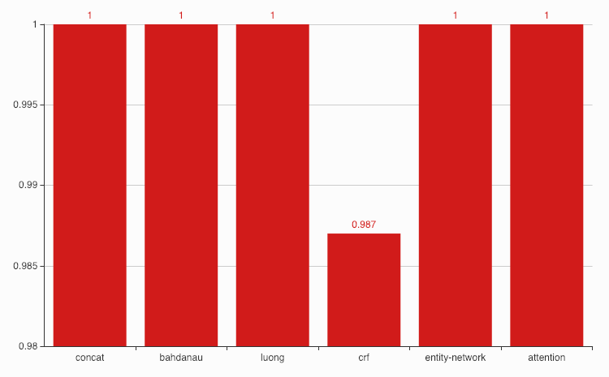
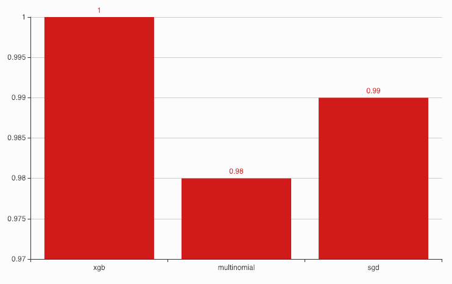
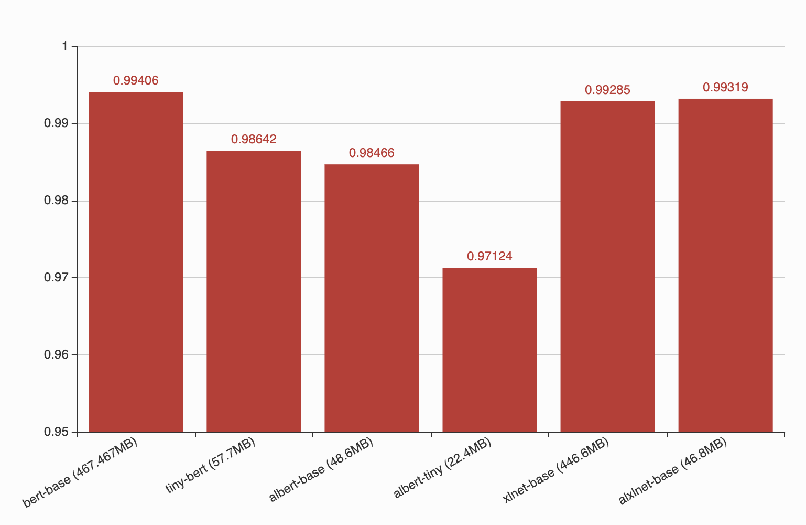
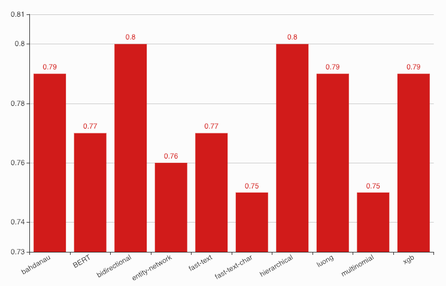

Dependency parsing
------------------

Trained on 80% of dataset, tested on 20% of dataset. Link to download
dataset available inside the notebooks. All training sessions stored in
`session/dependency <https://github.com/huseinzol05/Malaya/tree/master/session/dependency>`__

**Below chart is F1 accuracy for dependency tagging.**

.. code:: ipython3

    from IPython.core.display import Image, display
    
    display(Image('dependency-accuracy.png', width=500))

bert-base
^^^^^^^^^

.. code:: text

   arc accuracy: 0.8554239102233114
   types accuracy: 0.8481064607232274
   root accuracy: 0.9203253968253969

                  precision    recall  f1-score   support

             PAD    0.99996   1.00000   0.99998    877864
               X    1.00000   0.99986   0.99993    145204
             acl    0.96111   0.96190   0.96150      6037
           advcl    0.94287   0.93895   0.94091      2408
          advmod    0.97171   0.96904   0.97037      9464
            amod    0.96283   0.94008   0.95132      8128
           appos    0.97426   0.95940   0.96677      4852
             aux    1.00000   0.50000   0.66667         4
            case    0.98907   0.98834   0.98870     21519
              cc    0.98089   0.98708   0.98397      6500
           ccomp    0.95515   0.92164   0.93810       855
        compound    0.95432   0.96565   0.95995     13479
   compound:plur    0.96507   0.97778   0.97138      1215
            conj    0.96943   0.98036   0.97486      8604
             cop    0.96407   0.98531   0.97457      1906
           csubj    0.92157   0.85455   0.88679        55
      csubj:pass    0.93750   0.78947   0.85714        19
             dep    0.95199   0.93574   0.94380       996
             det    0.97043   0.96678   0.96860      8248
           fixed    0.94176   0.93672   0.93923      1122
            flat    0.98010   0.98217   0.98113     20755
            iobj    0.87500   0.80000   0.83582        35
            mark    0.94507   0.97448   0.95955      2860
            nmod    0.96363   0.95912   0.96137      8121
           nsubj    0.97076   0.97091   0.97083     12788
      nsubj:pass    0.95192   0.96362   0.95774      3986
          nummod    0.98563   0.97942   0.98251      7773
             obj    0.96915   0.97071   0.96993     10551
             obl    0.97549   0.97164   0.97356     11389
       parataxis    0.95038   0.90415   0.92669       699
           punct    0.99752   0.99773   0.99762     33438
            root    0.98046   0.98124   0.98085     10073
           xcomp    0.95153   0.94749   0.94951      2590

        accuracy                        0.99562   1243537
       macro avg    0.96396   0.93822   0.94823   1243537
    weighted avg    0.99562   0.99562   0.99562   1243537

tiny-bert
^^^^^^^^^

.. code:: text

   arc accuracy: 0.7189048051328787
   types accuracy: 0.6942783162846734
   root accuracy: 0.8860992063492065

                  precision    recall  f1-score   support

             PAD    0.99996   1.00000   0.99998    943088
               X    0.99999   0.99981   0.99990    145797
             acl    0.85006   0.80040   0.82448      6042
           advcl    0.61783   0.60566   0.61169      2437
          advmod    0.86865   0.86755   0.86810      9513
            amod    0.82596   0.78837   0.80672      8217
           appos    0.84113   0.79100   0.81530      5000
             aux    0.80000   0.50000   0.61538         8
            case    0.94714   0.95046   0.94879     21376
              cc    0.92151   0.94487   0.93304      6349
           ccomp    0.59326   0.26201   0.36349       874
        compound    0.85764   0.83530   0.84632     13667
   compound:plur    0.83743   0.91349   0.87381      1156
            conj    0.87306   0.90624   0.88934      8500
             cop    0.90592   0.93670   0.92105      1943
           csubj    0.75000   0.05263   0.09836        57
      csubj:pass    0.00000   0.00000   0.00000        16
             dep    0.66704   0.55176   0.60395      1082
             det    0.89147   0.84818   0.86929      7970
           fixed    0.80819   0.61696   0.69975      1120
            flat    0.90396   0.93947   0.92137     21129
            iobj    0.00000   0.00000   0.00000        25
            mark    0.74718   0.83845   0.79019      2767
            nmod    0.86083   0.78159   0.81930      8017
           nsubj    0.85174   0.89750   0.87402     12712
      nsubj:pass    0.78514   0.82246   0.80337      4061
          nummod    0.88943   0.93509   0.91169      8026
             obj    0.89982   0.84423   0.87114     10618
             obl    0.84081   0.88283   0.86131     11385
       parataxis    0.48635   0.26667   0.34446       735
           punct    0.98350   0.99126   0.98736     33736
            root    0.91085   0.93726   0.92387     10073
           xcomp    0.69305   0.76415   0.72686      2544

        accuracy                        0.98102   1310040
       macro avg    0.77906   0.72946   0.74011   1310040
    weighted avg    0.98076   0.98102   0.98073   1310040

albert-base
^^^^^^^^^^^

.. code:: text

   arc accuracy: 0.8118309576064845
   types accuracy: 0.7931625589721538
   root accuracy: 0.879281746031746

                  precision    recall  f1-score   support

             PAD    1.00000   1.00000   1.00000    905035
               X    0.99997   0.99998   0.99998    159607
             acl    0.89111   0.88994   0.89052      6051
           advcl    0.75213   0.78003   0.76583      2373
          advmod    0.89975   0.92642   0.91289      9378
            amod    0.86607   0.87808   0.87204      8145
           appos    0.87914   0.89496   0.88698      4779
             aux    1.00000   0.37500   0.54545         8
            case    0.96890   0.97142   0.97016     21521
              cc    0.96049   0.96393   0.96221      6405
           ccomp    0.70574   0.67583   0.69046       873
        compound    0.88800   0.89660   0.89228     13530
   compound:plur    0.93381   0.93981   0.93680      1246
            conj    0.94147   0.93436   0.93790      8608
             cop    0.94652   0.96651   0.95641      1941
           csubj    0.75000   0.39623   0.51852        53
      csubj:pass    0.77778   0.77778   0.77778         9
             dep    0.81778   0.72871   0.77068      1010
             det    0.91665   0.90606   0.91132      8314
           fixed    0.87862   0.80565   0.84055      1168
            flat    0.96177   0.93608   0.94875     20400
            iobj    0.71429   0.42857   0.53571        35
            mark    0.88640   0.88577   0.88608      2854
            nmod    0.86857   0.90150   0.88473      8020
           nsubj    0.89466   0.93382   0.91382     12633
      nsubj:pass    0.91977   0.81904   0.86648      4045
          nummod    0.95316   0.95864   0.95589      8003
             obj    0.90795   0.92092   0.91439     10357
             obl    0.93016   0.90607   0.91796     11466
       parataxis    0.72669   0.62953   0.67463       718
           punct    0.99482   0.99724   0.99603     33312
            root    0.93869   0.94093   0.93981     10073
           xcomp    0.85300   0.80468   0.82813      2524

        accuracy                        0.98785   1284494
       macro avg    0.88860   0.84152   0.85761   1284494
    weighted avg    0.98786   0.98785   0.98782   1284494

albert-tiny
^^^^^^^^^^^

.. code:: text

   arc accuracy: 0.7087220659183397
   types accuracy: 0.6735055899028873
   root accuracy: 0.8178452380952382

                  precision    recall  f1-score   support

             PAD    1.00000   1.00000   1.00000    901404
               X    0.99997   0.99998   0.99997    158217
             acl    0.74523   0.72259   0.73374      6056
           advcl    0.44763   0.44416   0.44589      2319
          advmod    0.80839   0.80245   0.80541      9537
            amod    0.74481   0.69167   0.71726      8144
           appos    0.71137   0.68084   0.69577      4963
             aux    0.00000   0.00000   0.00000         9
            case    0.90625   0.93745   0.92159     21056
              cc    0.92435   0.90888   0.91655      6453
           ccomp    0.32162   0.13918   0.19429       855
        compound    0.76535   0.75323   0.75924     13008
   compound:plur    0.76103   0.77066   0.76581      1186
            conj    0.79454   0.78507   0.78978      8640
             cop    0.87581   0.90736   0.89130      1943
           csubj    0.66667   0.04082   0.07692        49
      csubj:pass    0.00000   0.00000   0.00000        18
             dep    0.41637   0.38321   0.39910       929
             det    0.81424   0.77924   0.79636      7909
           fixed    0.63932   0.41054   0.50000      1101
            flat    0.85963   0.91321   0.88561     20856
            iobj    1.00000   0.03333   0.06452        30
            mark    0.69997   0.72039   0.71003      2879
            nmod    0.71129   0.68985   0.70041      7964
           nsubj    0.74144   0.81233   0.77527     12719
      nsubj:pass    0.68649   0.56466   0.61964      3905
          nummod    0.84427   0.87244   0.85813      7581
             obj    0.79591   0.78073   0.78825     10380
             obl    0.75820   0.78392   0.77085     11144
       parataxis    0.25150   0.06231   0.09988       674
           punct    0.98207   0.98323   0.98265     33034
            root    0.84186   0.87362   0.85745     10073
           xcomp    0.62652   0.63961   0.63300      2489

        accuracy                        0.96997   1277524
       macro avg    0.70128   0.63294   0.64105   1277524
    weighted avg    0.96929   0.96997   0.96946   1277524

xlnet-base
^^^^^^^^^^

.. code:: text

   arc accuracy: 0.9310084738376598
   types accuracy: 0.9258795751889828
   root accuracy: 0.9474206349206349

                  precision    recall  f1-score   support

             PAD    0.99998   1.00000   0.99999    632972
               X    1.00000   0.99997   0.99999    143586
             acl    0.98091   0.98226   0.98158      5806
           advcl    0.97098   0.95161   0.96120      2356
          advmod    0.98802   0.97806   0.98302      9527
            amod    0.95966   0.97100   0.96530      8208
           appos    0.98846   0.98947   0.98896      4936
             aux    1.00000   1.00000   1.00000        10
            case    0.99454   0.99110   0.99282     21128
              cc    0.98704   0.99518   0.99109      6429
           ccomp    0.89091   0.97313   0.93021       856
        compound    0.98091   0.96643   0.97362     13079
   compound:plur    0.99068   0.98401   0.98733      1188
            conj    0.98303   0.99214   0.98756      8524
             cop    0.98664   0.99071   0.98867      1938
           csubj    0.96000   0.96000   0.96000        50
      csubj:pass    0.95652   0.91667   0.93617        24
             dep    0.98182   0.96716   0.97444      1005
             det    0.98698   0.97756   0.98225      8065
           fixed    0.96071   0.97162   0.96613      1057
            flat    0.98389   0.99064   0.98726     20411
            iobj    0.96154   0.80645   0.87719        31
            mark    0.96611   0.98539   0.97565      2806
            nmod    0.97956   0.97285   0.97619      8030
           nsubj    0.98317   0.98402   0.98359     12701
      nsubj:pass    0.96930   0.97858   0.97392      3969
          nummod    0.99113   0.99327   0.99220      7879
             obj    0.98266   0.98076   0.98171     10342
             obl    0.98468   0.98256   0.98362     11183
       parataxis    0.95595   0.95455   0.95525       682
           punct    0.99952   0.99949   0.99950     33107
            root    0.98888   0.98888   0.98888     10073
           xcomp    0.95951   0.96027   0.95989      2517

        accuracy                        0.99678    994475
       macro avg    0.97738   0.97381   0.97531    994475
    weighted avg    0.99679   0.99678   0.99678    994475

alxlnet-base
^^^^^^^^^^^^

.. code:: text

   arc accuracy: 0.8943757029483008
   types accuracy: 0.88690168487317
   root accuracy: 0.9425595238095238

                  precision    recall  f1-score   support

             PAD    0.99999   1.00000   0.99999    644667
               X    0.99998   0.99999   0.99998    144988
             acl    0.95995   0.96137   0.96066      6058
           advcl    0.91687   0.93839   0.92751      2386
          advmod    0.97160   0.97620   0.97389      9496
            amod    0.95264   0.94761   0.95012      8342
           appos    0.97560   0.97638   0.97599      4995
             aux    1.00000   1.00000   1.00000         6
            case    0.99147   0.98685   0.98916     21680
              cc    0.97523   0.99377   0.98441      6418
           ccomp    0.95249   0.90112   0.92610       890
        compound    0.95478   0.95656   0.95567     13399
   compound:plur    0.97575   0.98067   0.97821      1190
            conj    0.96575   0.98929   0.97738      8494
             cop    0.98201   0.98708   0.98454      1935
           csubj    1.00000   0.90476   0.95000        42
      csubj:pass    0.91667   0.91667   0.91667        12
             dep    0.96490   0.94781   0.95628      1073
             det    0.96461   0.97375   0.96916      8230
           fixed    0.95762   0.92188   0.93941      1152
            flat    0.98208   0.98030   0.98119     20967
            iobj    1.00000   0.82927   0.90667        41
            mark    0.96463   0.95609   0.96034      2824
            nmod    0.96933   0.95492   0.96207      8207
           nsubj    0.97533   0.97086   0.97309     12867
      nsubj:pass    0.95811   0.94145   0.94970      3911
          nummod    0.98952   0.98590   0.98770      7659
             obj    0.97249   0.96839   0.97044     10440
             obl    0.97129   0.97222   0.97175     11483
       parataxis    0.95691   0.91348   0.93469       705
           punct    0.99883   0.99955   0.99919     33252
            root    0.98284   0.98372   0.98328     10073
           xcomp    0.92520   0.94988   0.93738      2474

        accuracy                        0.99475   1010356
       macro avg    0.97044   0.95958   0.96462   1010356
    weighted avg    0.99476   0.99475   0.99475   1010356

Emotion Analysis
----------------

Trained on 80% of dataset, tested on 20% of dataset. All training
sessions stored in
`session/emotion <https://github.com/huseinzol05/Malaya/tree/master/session/emotion>`__

**Graph based on F1-score.**

.. code:: ipython3

    from IPython.core.display import Image, display
    
    display(Image('emotion-accuracy.png', width=500))

multinomial
^^^^^^^^^^^

.. code:: text

                 precision    recall  f1-score   support

          anger    0.88832   0.90889   0.89848      5872
           fear    0.89515   0.88078   0.88791      4110
          happy    0.88992   0.92776   0.90845      6091
           love    0.92420   0.90616   0.91509      4252
        sadness    0.91943   0.87356   0.89591      5212
       surprise    0.92340   0.92838   0.92588      2597

       accuracy                        0.90371     28134
      macro avg    0.90674   0.90426   0.90529     28134
   weighted avg    0.90409   0.90371   0.90366     28134

bert-base
^^^^^^^^^

.. code:: text

                 precision    recall  f1-score   support

          anger    0.99712   0.99763   0.99737      5895
           fear    0.99687   0.99759   0.99723      4150
          happy    0.99900   0.99900   0.99900      6017
           love    0.99855   0.99615   0.99735      4154
        sadness    0.99793   0.99906   0.99849      5307
       surprise    0.99770   0.99694   0.99732      2612

       accuracy                        0.99790     28135
      macro avg    0.99786   0.99773   0.99779     28135
   weighted avg    0.99790   0.99790   0.99790     28135

tiny-bert
^^^^^^^^^

.. code:: text

                 precision    recall  f1-score   support

          anger    0.99765   0.99481   0.99623      5970
           fear    0.99607   0.99656   0.99631      4068
          happy    0.99671   0.99918   0.99794      6062
           love    0.99758   0.99638   0.99698      4145
        sadness    0.99736   0.99793   0.99764      5303
       surprise    0.99614   0.99691   0.99652      2587

       accuracy                        0.99701     28135
      macro avg    0.99692   0.99696   0.99694     28135
   weighted avg    0.99702   0.99701   0.99701     28135

albert-base
^^^^^^^^^^^

.. code:: text

                 precision    recall  f1-score   support

          anger    0.99785   0.99472   0.99628      6062
           fear    0.99582   0.99926   0.99754      4056
          happy    0.99866   0.99866   0.99866      5988
           love    0.99712   0.99760   0.99736      4162
        sadness    0.99813   0.99813   0.99813      5334
       surprise    0.99685   0.99803   0.99744      2533

       accuracy                        0.99758     28135
      macro avg    0.99740   0.99773   0.99757     28135
   weighted avg    0.99758   0.99758   0.99758     28135

albert-tiny
^^^^^^^^^^^

.. code:: text

                 precision    recall  f1-score   support

          anger    0.99396   0.98603   0.98998      6012
           fear    0.99390   0.99512   0.99451      4096
          happy    0.99652   0.99652   0.99652      6030
           love    0.99114   0.99187   0.99150      4059
        sadness    0.99121   0.99699   0.99409      5316
       surprise    0.99278   0.99619   0.99448      2622

       accuracy                        0.99346     28135
      macro avg    0.99325   0.99378   0.99351     28135
   weighted avg    0.99346   0.99346   0.99346     28135

xlnet-base
^^^^^^^^^^

.. code:: text

                 precision    recall  f1-score   support

          anger    0.99699   0.99733   0.99716      5983
           fear    0.99778   0.99827   0.99802      4045
          happy    0.99883   0.99850   0.99867      6005
           love    0.99718   0.99625   0.99671      4261
        sadness    0.99754   0.99773   0.99764      5288
       surprise    0.99804   0.99843   0.99824      2553

       accuracy                        0.99773     28135
      macro avg    0.99773   0.99775   0.99774     28135
   weighted avg    0.99773   0.99773   0.99773     28135

alxlnet-base
^^^^^^^^^^^^

.. code:: text

                 precision    recall  f1-score   support

          anger    0.99669   0.99439   0.99554      6065
           fear    0.99702   0.99727   0.99714      4027
          happy    0.99764   0.99949   0.99857      5918
           love    0.99554   0.99694   0.99624      4250
        sadness    0.99867   0.99641   0.99754      5286
       surprise    0.99422   0.99730   0.99576      2589

       accuracy                        0.99691     28135
      macro avg    0.99663   0.99697   0.99680     28135
   weighted avg    0.99691   0.99691   0.99691     28135

Entities Recognition
--------------------

Trained on 80% of dataset, tested on 20% of dataset. Link to download
dataset available inside the notebooks. All training sessions stored in
`session/entities <https://github.com/huseinzol05/Malaya/tree/master/session/entities>`__

**Graph based on F1-score.**

.. code:: ipython3

    from IPython.core.display import Image, display
    
    display(Image('ner-accuracy.png', width=500))

bert-base
^^^^^^^^^

.. code:: text

                 precision    recall  f1-score   support

          OTHER    0.99224   0.99931   0.99576   5160854
            PAD    1.00000   1.00000   1.00000    877767
              X    0.99995   1.00000   0.99998   2921053
          event    0.99911   0.88679   0.93961    143787
            law    0.99704   0.97040   0.98354    146950
       location    0.98677   0.98420   0.98548    428869
   organization    0.99335   0.95355   0.97304    694150
         person    0.97636   0.99476   0.98547    507960
       quantity    0.99965   0.99803   0.99884     88200
           time    0.98462   0.99938   0.99194    179880

       accuracy                        0.99406  11149470
      macro avg    0.99291   0.97864   0.98537  11149470
   weighted avg    0.99409   0.99406   0.99400  11149470

tiny-bert
^^^^^^^^^

.. code:: text

                 precision    recall  f1-score   support

          OTHER    0.98178   0.99946   0.99054   5160854
            PAD    1.00000   1.00000   1.00000   1673627
              X    1.00000   1.00000   1.00000   2921053
          event    0.99666   0.70215   0.82388    143787
            law    0.99522   0.94921   0.97167    146950
       location    0.96753   0.96547   0.96650    428869
   organization    0.99403   0.87009   0.92794    694150
         person    0.92771   0.99283   0.95917    507960
       quantity    0.99643   0.99762   0.99703     88200
           time    0.95574   0.99855   0.97668    179880

       accuracy                        0.98642  11945330
      macro avg    0.98151   0.94754   0.96134  11945330
   weighted avg    0.98675   0.98642   0.98594  11945330

albert-base
^^^^^^^^^^^

.. code:: text

                 precision    recall  f1-score   support

          OTHER    0.98087   0.99948   0.99008   5160854
            PAD    1.00000   1.00000   1.00000    881183
              X    0.99996   1.00000   0.99998   2933007
          event    0.99021   0.80012   0.88507    143787
            law    0.96373   0.94234   0.95291    146950
       location    0.97388   0.96256   0.96819    428869
   organization    0.99506   0.83927   0.91055    694150
         person    0.91340   0.99378   0.95189    507960
       quantity    0.99636   0.99704   0.99670     88200
           time    0.98911   0.99859   0.99383    179880

       accuracy                        0.98466  11164840
      macro avg    0.98026   0.95332   0.96492  11164840
   weighted avg    0.98509   0.98466   0.98421  11164840

albert-tiny
^^^^^^^^^^^

.. code:: text

                 precision    recall  f1-score   support

          OTHER    0.96614   0.99651   0.98109   5160854
            PAD    1.00000   1.00000   1.00000    881183
              X    0.99984   1.00000   0.99992   2933007
          event    0.97661   0.52453   0.68250    143787
            law    0.97992   0.89007   0.93284    146950
       location    0.92117   0.91206   0.91659    428869
   organization    0.96821   0.76413   0.85414    694150
         person    0.87211   0.97366   0.92009    507960
       quantity    0.98545   0.99220   0.98881     88200
           time    0.94056   0.98312   0.96137    179880

       accuracy                        0.97124  11164840
      macro avg    0.96100   0.90363   0.92374  11164840
   weighted avg    0.97185   0.97124   0.96965  11164840

xlnet-base
^^^^^^^^^^

.. code:: text

                 precision    recall  f1-score   support

          OTHER    0.98873   0.99965   0.99416   5160854
            PAD    1.00000   1.00000   1.00000    877767
              X    0.99999   1.00000   0.99999   2921053
          event    0.99404   0.93677   0.96456    143787
            law    0.99734   0.98832   0.99281    146950
       location    0.99189   0.97927   0.98554    428869
   organization    0.99785   0.92433   0.95968    694150
         person    0.97446   0.98956   0.98195    507960
       quantity    0.99861   0.99875   0.99868     88200
           time    0.99153   0.99872   0.99511    179880

       accuracy                        0.99285  11149470
      macro avg    0.99344   0.98154   0.98725  11149470
   weighted avg    0.99291   0.99285   0.99276  11149470

alxlnet-base
^^^^^^^^^^^^

.. code:: text

                 precision    recall  f1-score   support

          OTHER    0.99124   0.99962   0.99541   5160854
            PAD    1.00000   1.00000   1.00000    877767
              X    1.00000   1.00000   1.00000   2921053
          event    0.99766   0.86900   0.92890    143787
            law    0.99837   0.97023   0.98410    146950
       location    0.99004   0.98249   0.98625    428869
   organization    0.99584   0.94088   0.96758    694150
         person    0.96062   0.99571   0.97785    507960
       quantity    0.99920   0.99976   0.99948     88200
           time    0.98851   0.99976   0.99410    179880

       accuracy                        0.99319  11149470
      macro avg    0.99215   0.97575   0.98337  11149470
   weighted avg    0.99327   0.99319   0.99309  11149470

Language Detection
------------------

Trained on 80% of dataset, tested on 20% of dataset. All training
sessions stored in
`session/language-detection <https://github.com/huseinzol05/Malaya/tree/master/session/language-detection>`__

**Graph based on F1-score.**

.. code:: ipython3

    display(Image('language-detection-accuracy.png', width=500))

.. image:: models-accuracy_files/models-accuracy_26_0.png
   :width: 500px

fast-text
^^^^^^^^^

.. code:: text

                 precision    recall  f1-score   support

            eng    0.94014   0.96750   0.95362    553739
            ind    0.97290   0.97316   0.97303    576059
          malay    0.98674   0.95262   0.96938   1800649
       manglish    0.96595   0.98417   0.97498    181442
          other    0.98454   0.99698   0.99072   1428083
          rojak    0.81149   0.91650   0.86080    189678

       accuracy                        0.97002   4729650
      macro avg    0.94363   0.96515   0.95375   4729650
   weighted avg    0.97111   0.97002   0.97028   4729650

Deep learning
^^^^^^^^^^^^^

.. code:: text

                 precision    recall  f1-score   support

            eng    0.96760   0.97401   0.97080    553739
            ind    0.97635   0.96131   0.96877    576059
          malay    0.96985   0.98498   0.97736   1800649
       manglish    0.98036   0.96569   0.97297    181442
          other    0.99641   0.99627   0.99634   1428083
          rojak    0.94221   0.84302   0.88986    189678

       accuracy                        0.97779   4729650
      macro avg    0.97213   0.95421   0.96268   4729650
   weighted avg    0.97769   0.97779   0.97760   4729650

POS Recognition
---------------

Trained on 80% of dataset, tested on 20% of dataset. Link to download
dataset available inside the notebooks. All training sessions stored in
`session/pos <https://github.com/huseinzol05/Malaya/tree/master/session/pos>`__

**Graph based on F1-score.**

.. code:: ipython3

    display(Image('pos-accuracy.png', width=500))

.. image:: models-accuracy_files/models-accuracy_30_0.png
   :width: 500px

bert-base
^^^^^^^^^

.. code:: text

                 precision    recall  f1-score   support

            ADJ    0.79261   0.80819   0.80033     45666
            ADP    0.95551   0.96155   0.95852    119589
            ADV    0.86824   0.83832   0.85302     47760
            AUX    0.99362   0.99710   0.99536     10000
          CCONJ    0.97639   0.92470   0.94984     37171
            DET    0.93663   0.92556   0.93107     38839
           NOUN    0.91335   0.89454   0.90385    268329
            NUM    0.91883   0.94521   0.93183     41211
            PAD    0.98980   1.00000   0.99487    147445
           PART    0.91225   0.91291   0.91258      5500
           PRON    0.97505   0.94047   0.95745     48835
          PROPN    0.91824   0.94054   0.92926    227608
          PUNCT    0.99829   0.99853   0.99841    182824
          SCONJ    0.76934   0.84297   0.80447     15150
            SYM    0.99711   0.95722   0.97676      3600
           VERB    0.94284   0.94533   0.94408    124518
              X    0.99947   0.99882   0.99914    413549

       accuracy                        0.95254   1777594
      macro avg    0.93280   0.93129   0.93181   1777594
   weighted avg    0.95272   0.95254   0.95254   1777594

tiny-bert
^^^^^^^^^

.. code:: text

                 precision    recall  f1-score   support

            ADJ    0.78068   0.79622   0.78837     45666
            ADP    0.95356   0.96107   0.95730    119589
            ADV    0.85048   0.83499   0.84266     47760
            AUX    0.99502   0.99850   0.99676     10000
          CCONJ    0.96900   0.91986   0.94379     37171
            DET    0.93853   0.94263   0.94058     38839
           NOUN    0.89955   0.89812   0.89883    268329
            NUM    0.93685   0.93740   0.93712     41211
            PAD    0.99445   1.00000   0.99722    272341
           PART    0.91302   0.91418   0.91360      5500
           PRON    0.97478   0.93785   0.95596     48835
          PROPN    0.92504   0.92239   0.92371    227608
          PUNCT    0.99776   0.99815   0.99796    182824
          SCONJ    0.75747   0.84376   0.79829     15150
            SYM    0.95358   0.90167   0.92690      3600
           VERB    0.93816   0.94470   0.94142    124518
              X    0.99974   0.99879   0.99926    413549

       accuracy                        0.95343   1902490
      macro avg    0.92810   0.92649   0.92704   1902490
   weighted avg    0.95364   0.95343   0.95349   1902490

albert-base
^^^^^^^^^^^

.. code:: text

                 precision    recall  f1-score   support

            ADJ    0.81706   0.76324   0.78923     45666
            ADP    0.95181   0.96143   0.95660    119589
            ADV    0.84898   0.84148   0.84521     47760
            AUX    0.99502   1.00000   0.99751     10000
          CCONJ    0.93370   0.94071   0.93719     37171
            DET    0.93324   0.92824   0.93073     38839
           NOUN    0.90102   0.89915   0.90008    268329
            NUM    0.93291   0.94002   0.93645     41211
            PAD    1.00000   1.00000   1.00000    147215
           PART    0.91795   0.89909   0.90842      5500
           PRON    0.97728   0.93198   0.95409     48835
          PROPN    0.91565   0.93866   0.92701    227608
          PUNCT    0.99818   0.99890   0.99854    182824
          SCONJ    0.79499   0.74330   0.76828     15150
            SYM    0.98485   0.90278   0.94203      3600
           VERB    0.94143   0.94251   0.94197    124518
              X    0.99972   0.99975   0.99973    414899

       accuracy                        0.95105   1778714
      macro avg    0.93199   0.91948   0.92547   1778714
   weighted avg    0.95085   0.95105   0.95088   1778714

albert-tiny
^^^^^^^^^^^

.. code:: text

                 precision    recall  f1-score   support

            ADJ    0.71343   0.69192   0.70251     45666
            ADP    0.94552   0.92892   0.93715    119589
            ADV    0.82394   0.77969   0.80120     47760
            AUX    0.99502   0.99930   0.99716     10000
          CCONJ    0.95223   0.92397   0.93789     37171
            DET    0.92886   0.89495   0.91159     38839
           NOUN    0.85984   0.87755   0.86860    268329
            NUM    0.90365   0.90240   0.90303     41211
            PAD    1.00000   1.00000   1.00000    147215
           PART    0.88633   0.82509   0.85461      5500
           PRON    0.94693   0.93722   0.94205     48835
          PROPN    0.90464   0.89602   0.90031    227608
          PUNCT    0.98900   0.99757   0.99327    182824
          SCONJ    0.70104   0.77234   0.73496     15150
            SYM    0.94761   0.86417   0.90397      3600
           VERB    0.90093   0.92448   0.91255    124518
              X    0.99946   0.99954   0.99950    414899

       accuracy                        0.93335   1778714
      macro avg    0.90579   0.89501   0.90002   1778714
   weighted avg    0.93344   0.93335   0.93331   1778714

xlnet-base
^^^^^^^^^^

.. code:: text

                 precision    recall  f1-score   support

            ADJ    0.83194   0.77563   0.80280     45666
            ADP    0.96501   0.95786   0.96142    119589
            ADV    0.85073   0.84144   0.84606     47760
            AUX    0.99502   0.99950   0.99726     10000
          CCONJ    0.96564   0.92473   0.94474     37171
            DET    0.94985   0.93192   0.94080     38839
           NOUN    0.89484   0.92123   0.90784    268329
            NUM    0.94009   0.94511   0.94260     41211
            PAD    0.99816   1.00000   0.99908    146373
           PART    0.91259   0.94345   0.92777      5500
           PRON    0.96988   0.94223   0.95586     48835
          PROPN    0.93581   0.92557   0.93066    227608
          PUNCT    0.99831   0.99933   0.99882    182824
          SCONJ    0.73907   0.82376   0.77912     15150
            SYM    0.96944   0.96917   0.96930      3600
           VERB    0.94517   0.94727   0.94622    124518
              X    0.99992   0.99957   0.99975    410749

       accuracy                        0.95410   1773722
      macro avg    0.93303   0.93222   0.93236   1773722
   weighted avg    0.95433   0.95410   0.95411   1773722

alxlnet-base
^^^^^^^^^^^^

.. code:: text

                 precision    recall  f1-score   support

            ADJ    0.79153   0.79396   0.79275     45666
            ADP    0.95941   0.96102   0.96021    119589
            ADV    0.85117   0.82073   0.83567     47760
            AUX    0.99641   0.99860   0.99750     10000
          CCONJ    0.96687   0.92793   0.94700     37171
            DET    0.91526   0.93156   0.92334     38839
           NOUN    0.91155   0.89253   0.90194    268329
            NUM    0.92871   0.93635   0.93252     41211
            PAD    0.99816   1.00000   0.99908    146373
           PART    0.91285   0.92364   0.91821      5500
           PRON    0.97040   0.94404   0.95704     48835
          PROPN    0.90899   0.94301   0.92569    227608
          PUNCT    0.99887   0.99928   0.99908    182824
          SCONJ    0.69691   0.86964   0.77375     15150
            SYM    0.99941   0.94556   0.97174      3600
           VERB    0.95809   0.93052   0.94411    124518
              X    0.99985   0.99945   0.99965    410749

       accuracy                        0.95109   1773722
      macro avg    0.92732   0.93046   0.92819   1773722
   weighted avg    0.95168   0.95109   0.95121   1773722

Relevancy
---------

Trained on 80% of dataset, tested on 20% of dataset. All training
sessions stored in
`session/relevancy <https://github.com/huseinzol05/Malaya/tree/master/session/relevancy>`__

**Graph based on F1-score.**

.. code:: ipython3

    display(Image('relevancy-accuracy.png', width=500))

.. image:: models-accuracy_files/models-accuracy_38_0.png
   :width: 500px

bert-base
^^^^^^^^^

.. code:: text

                 precision    recall  f1-score   support

   not relevant    0.87625   0.73478   0.79930      5946
       relevant    0.87117   0.94531   0.90673     11281

       accuracy                        0.87264     17227
      macro avg    0.87371   0.84004   0.85302     17227
   weighted avg    0.87293   0.87264   0.86965     17227

tiny-bert
^^^^^^^^^

.. code:: text

                 precision    recall  f1-score   support

   not relevant    0.95455   0.00353   0.00704      5946
       relevant    0.65562   0.99991   0.79197     11281

       accuracy                        0.65601     17227
      macro avg    0.80508   0.50172   0.39950     17227
   weighted avg    0.75880   0.65601   0.52104     17227

albert-base
^^^^^^^^^^^

.. code:: text

                 precision    recall  f1-score   support

   not relevant    0.81807   0.80844   0.81323      5946
       relevant    0.89966   0.90524   0.90244     11281

       accuracy                        0.87183     17227
      macro avg    0.85886   0.85684   0.85783     17227
   weighted avg    0.87150   0.87183   0.87165     17227

albert-tiny
^^^^^^^^^^^

.. code:: text

                 precision    recall  f1-score   support

   not relevant    0.84793   0.66768   0.74708      5946
       relevant    0.84249   0.93689   0.88718     11281

       accuracy                        0.84397     17227
      macro avg    0.84521   0.80228   0.81713     17227
   weighted avg    0.84437   0.84397   0.83883     17227

xlnet-base
^^^^^^^^^^

.. code:: text

                 precision    recall  f1-score   support

   not relevant    0.85676   0.80272   0.82886      5946
       relevant    0.89937   0.92926   0.91407     11281

       accuracy                        0.88559     17227
      macro avg    0.87806   0.86599   0.87147     17227
   weighted avg    0.88466   0.88559   0.88466     17227

alxlnet-base
^^^^^^^^^^^^

.. code:: text

                 precision    recall  f1-score   support

   not relevant    0.89878   0.71678   0.79753      5946
       relevant    0.86512   0.95745   0.90895     11281

       accuracy                        0.87438     17227
      macro avg    0.88195   0.83712   0.85324     17227
   weighted avg    0.87674   0.87438   0.87049     17227

Sentiment Analysis
------------------

Trained on 80% of dataset, tested on 20% of dataset. All training
sessions stored in
`session/sentiment <https://github.com/huseinzol05/Malaya/tree/master/session/sentiment>`__

**Graph based on F1-score.**

.. code:: ipython3

    display(Image('sentiment-accuracy.png', width=500))

.. image:: models-accuracy_files/models-accuracy_46_0.png
   :width: 500px

multinomial
^^^^^^^^^^^

.. code:: text

                 precision    recall  f1-score   support

       negative    0.86962   0.92076   0.89446    101375
       positive    0.91632   0.86274   0.88872    101959

       accuracy                        0.89167    203334
      macro avg    0.89297   0.89175   0.89159    203334
   weighted avg    0.89304   0.89167   0.89158    203334

bert-base
^^^^^^^^^

.. code:: text

                 precision    recall  f1-score   support

       negative    0.99213   0.99444   0.99328    101421
       positive    0.99445   0.99215   0.99330    101924

       accuracy                        0.99329    203345
      macro avg    0.99329   0.99330   0.99329    203345
   weighted avg    0.99329   0.99329   0.99329    203345

tiny-bert
^^^^^^^^^

.. code:: text

                 precision    recall  f1-score   support

       negative    0.98953   0.98579   0.98766    101153
       positive    0.98599   0.98968   0.98783    102192

       accuracy                        0.98774    203345
      macro avg    0.98776   0.98774   0.98774    203345
   weighted avg    0.98775   0.98774   0.98774    203345

albert-base
^^^^^^^^^^^

.. code:: text

                 precision    recall  f1-score   support

       negative    0.99400   0.99051   0.99225    101699
       positive    0.99054   0.99402   0.99228    101646

       accuracy                        0.99226    203345
      macro avg    0.99227   0.99226   0.99226    203345
   weighted avg    0.99227   0.99226   0.99226    203345

albert-tiny
^^^^^^^^^^^

.. code:: text

                 precision    recall  f1-score   support

       negative    0.98825   0.98262   0.98543    101357
       positive    0.98282   0.98839   0.98560    101988

       accuracy                        0.98551    203345
      macro avg    0.98554   0.98550   0.98551    203345
   weighted avg    0.98553   0.98551   0.98551    203345

xlnet-base
^^^^^^^^^^

.. code:: text

                 precision    recall  f1-score   support

       negative    0.99253   0.99451   0.99352    101430
       positive    0.99452   0.99255   0.99354    101915

       accuracy                        0.99353    203345
      macro avg    0.99353   0.99353   0.99353    203345
   weighted avg    0.99353   0.99353   0.99353    203345

alxlnet-base
^^^^^^^^^^^^

.. code:: text

                 precision    recall  f1-score   support

       negative    0.99286   0.99090   0.99188    101710
       positive    0.99091   0.99287   0.99189    101635

       accuracy                        0.99188    203345
      macro avg    0.99188   0.99188   0.99188    203345
   weighted avg    0.99188   0.99188   0.99188    203345

Similarity
----------

Trained on 80% of dataset, tested on 20% of dataset. All training
sessions stored in
`session/similarity <https://github.com/huseinzol05/Malaya/tree/master/session/similarity>`__

**Graph based on F1-score.**

.. code:: ipython3

    display(Image('similarity-accuracy.png', width=500))

bert-base
^^^^^^^^^

.. code:: text

                 precision    recall  f1-score   support

    not similar    0.90249   0.89242   0.89743     51004
        similar    0.91965   0.92737   0.92349     67716

       accuracy                        0.91236    118720
      macro avg    0.91107   0.90990   0.91046    118720
   weighted avg    0.91227   0.91236   0.91229    118720

tiny-bert
^^^^^^^^^

.. code:: text

                 precision    recall  f1-score   support

    not similar    0.90513   0.86192   0.88299     50752
        similar    0.90044   0.93254   0.91621     67968

       accuracy                        0.90235    118720
      macro avg    0.90279   0.89723   0.89960    118720
   weighted avg    0.90245   0.90235   0.90201    118720

albert-base
^^^^^^^^^^^

.. code:: text

                 precision    recall  f1-score   support

    not similar    0.88944   0.88169   0.88555     50951
        similar    0.91163   0.91760   0.91461     67769

       accuracy                        0.90219    118720
      macro avg    0.90054   0.89965   0.90008    118720
   weighted avg    0.90211   0.90219   0.90214    118720

albert-tiny
^^^^^^^^^^^

.. code:: text

                 precision    recall  f1-score   support

    not similar    0.87350   0.80987   0.84048     50840
        similar    0.86497   0.91215   0.88793     67880

       accuracy                        0.86835    118720
      macro avg    0.86923   0.86101   0.86421    118720
   weighted avg    0.86862   0.86835   0.86761    118720

xlnet-base
^^^^^^^^^^

.. code:: text

                 precision    recall  f1-score   support

    not similar    0.77288   0.94355   0.84973     51004
        similar    0.94900   0.79116   0.86292     67716

       accuracy                        0.85663    118720
      macro avg    0.86094   0.86736   0.85633    118720
   weighted avg    0.87334   0.85663   0.85725    118720

alxlnet-base
^^^^^^^^^^^^

.. code:: text

                 precision    recall  f1-score   support

    not similar    0.90872   0.87774   0.89296     50777
        similar    0.91090   0.93411   0.92236     67943

       accuracy                        0.91000    118720
      macro avg    0.90981   0.90592   0.90766    118720
   weighted avg    0.90997   0.91000   0.90978    118720

Subjectivity Analysis
---------------------

Trained on 80% of dataset, tested on 20% of dataset. All training
sessions stored in
`session/subjectivity <https://github.com/huseinzol05/Malaya/tree/master/session/subjectivity>`__

**Graph based on F1-score.**

.. code:: ipython3

    display(Image('subjectivity-accuracy.png', width=500))

.. image:: models-accuracy_files/models-accuracy_63_0.png
   :width: 500px

multinomial
^^^^^^^^^^^

.. code:: text

                 precision    recall  f1-score   support

       negative    0.91527   0.87238   0.89331      1003
       positive    0.87657   0.91818   0.89689       990

       accuracy                        0.89513      1993
      macro avg    0.89592   0.89528   0.89510      1993
   weighted avg    0.89605   0.89513   0.89509      1993

bert-base
^^^^^^^^^

.. code:: text

                 precision    recall  f1-score   support

       negative    0.87825   0.96429   0.91926       980
       positive    0.96183   0.87068   0.91399      1013

       accuracy                        0.91671      1993
      macro avg    0.92004   0.91748   0.91663      1993
   weighted avg    0.92073   0.91671   0.91658      1993

tiny-bert
^^^^^^^^^

.. code:: text

                 precision    recall  f1-score   support

       negative    0.95678   0.84086   0.89508       974
       positive    0.86368   0.96369   0.91095      1019

       accuracy                        0.90366      1993
      macro avg    0.91023   0.90228   0.90301      1993
   weighted avg    0.90917   0.90366   0.90319      1993

albert-base
^^^^^^^^^^^

.. code:: text

                 precision    recall  f1-score   support

       negative    0.87616   0.94006   0.90699      1001
       positive    0.93471   0.86593   0.89901       992

       accuracy                        0.90316      1993
      macro avg    0.90544   0.90299   0.90300      1993
   weighted avg    0.90531   0.90316   0.90301      1993

albert-tiny
^^^^^^^^^^^

.. code:: text

                 precision    recall  f1-score   support

       negative    0.90070   0.89184   0.89625      1017
       positive    0.88844   0.89754   0.89297       976

       accuracy                        0.89463      1993
      macro avg    0.89457   0.89469   0.89461      1993
   weighted avg    0.89469   0.89463   0.89464      1993

xlnet-base
^^^^^^^^^^

.. code:: text

                 precision    recall  f1-score   support

       negative    0.89613   0.94616   0.92047      1003
       positive    0.94218   0.88889   0.91476       990

       accuracy                        0.91771      1993
      macro avg    0.91916   0.91753   0.91761      1993
   weighted avg    0.91901   0.91771   0.91763      1993

alxlnet-base
^^^^^^^^^^^^

.. code:: text

                 precision    recall  f1-score   support

       negative    0.89258   0.92604   0.90900       987
       positive    0.92466   0.89066   0.90734      1006

       accuracy                        0.90818      1993
      macro avg    0.90862   0.90835   0.90817      1993
   weighted avg    0.90877   0.90818   0.90816      1993

Toxicity Analysis
-----------------

Trained on 80% of dataset, tested on 20% of dataset. All training
sessions stored in
`session/toxic <https://github.com/huseinzol05/Malaya/tree/master/session/toxic>`__

**Graph based on F1-score.**

.. code:: ipython3

    display(Image('toxic-accuracy.png', width=500))

.. image:: models-accuracy_files/models-accuracy_72_0.png
   :width: 500px

multinomial
^^^^^^^^^^^

.. code:: text

                                        precision    recall  f1-score   support

                          severe toxic    0.32096   0.99468   0.48532      9955
                               obscene    0.06031   0.68096   0.11081      2799
                       identity attack    0.03312   0.60086   0.06277      1393
                                insult    0.15655   0.69002   0.25519     12575
                                threat    0.00661   0.11058   0.01247       416
                                 asian    0.00087   0.01799   0.00166       389
                               atheist    0.00137   0.04494   0.00266       178
                              bisexual    0.00052   0.08333   0.00104        24
                              buddhist    0.00000   0.00000   0.00000        45
                             christian    0.13652   0.86153   0.23570      4622
                                female    0.12714   0.78073   0.21867      6891
                          heterosexual    0.00153   0.06299   0.00299       127
                                indian    0.14732   0.97509   0.25597      4014
            homosexual, gay or lesbian    0.04442   0.45581   0.08095      1369
   intellectual or learning disability    0.00000   0.00000   0.00000         6
                                  male    0.08106   0.58298   0.14233      4947
                                muslim    0.07845   0.59531   0.13863      2602
                      other disability    0.00000   0.00000   0.00000         0
                          other gender    0.00000   0.00000   0.00000         2
               other race or ethnicity    0.00000   0.00000   0.00000         7
                        other religion    0.00000   0.00000   0.00000         8
              other sexual orientation    0.00000   0.00000   0.00000         1
                   physical disability    0.00000   0.00000   0.00000         2
         psychiatric or mental illness    0.00720   0.09651   0.01340       601
                           transgender    0.00249   0.06608   0.00481       227
                                 malay    0.54919   0.99337   0.70733     17044
                               chinese    0.29545   0.99079   0.45517      8793

                             micro avg    0.14989   0.82799   0.25383     79037
                             macro avg    0.07597   0.35869   0.11807     79037
                          weighted avg    0.25444   0.82799   0.37086     79037
                           samples avg    0.07772   0.16003   0.09295     79037
     

bert-base
^^^^^^^^^

.. code:: text

                                        precision    recall  f1-score   support

                          severe toxic    0.85194   0.65179   0.73854      9790
                               obscene    0.63710   0.41623   0.50351      2847
                       identity attack    0.63238   0.29603   0.40328      1412
                                insult    0.71381   0.56111   0.62832     12673
                                threat    0.56707   0.22850   0.32574       407
                                 asian    0.54394   0.56965   0.55650       402
                               atheist    0.80097   0.96491   0.87533       171
                              bisexual    1.00000   0.51852   0.68293        27
                              buddhist    0.60938   0.90698   0.72897        43
                             christian    0.86376   0.86044   0.86210      4679
                                female    0.88242   0.90816   0.89510      6925
                          heterosexual    0.67073   0.81481   0.73579       135
                                indian    0.95325   0.88580   0.91829      4028
            homosexual, gay or lesbian    0.88355   0.92161   0.90218      1416
   intellectual or learning disability    0.00000   0.00000   0.00000         6
                                  male    0.75975   0.59414   0.66682      5019
                                muslim    0.87416   0.89385   0.88390      2619
                      other disability    0.00000   0.00000   0.00000         0
                          other gender    0.00000   0.00000   0.00000         0
               other race or ethnicity    0.00000   0.00000   0.00000        11
                        other religion    0.14286   0.09091   0.11111        11
              other sexual orientation    0.00000   0.00000   0.00000         0
                   physical disability    0.00000   0.00000   0.00000         6
         psychiatric or mental illness    0.60000   0.81588   0.69148       592
                           transgender    0.79012   0.87671   0.83117       219
                                 malay    0.96219   0.96486   0.96352     16987
                               chinese    0.94062   0.90214   0.92098      8727

                             micro avg    0.86098   0.77313   0.81469     79152
                             macro avg    0.58074   0.54233   0.54909     79152
                          weighted avg    0.84966   0.77313   0.80502     79152
                           samples avg    0.15924   0.15441   0.15445     79152
     

tiny-bert
^^^^^^^^^

.. code:: text

                                        precision    recall  f1-score   support

                          severe toxic    0.77495   0.77346   0.77421      9857
                               obscene    0.62343   0.41033   0.49492      2788
                       identity attack    0.55057   0.34761   0.42616      1378
                                insult    0.69412   0.56324   0.62187     12659
                                threat    0.60825   0.13170   0.21651       448
                                 asian    0.66667   0.47478   0.55459       337
                               atheist    0.85784   0.92593   0.89059       189
                              bisexual    1.00000   0.05263   0.10000        19
                              buddhist    0.63043   0.67442   0.65169        43
                             christian    0.79541   0.89441   0.84201      4612
                                female    0.85257   0.92515   0.88738      6907
                          heterosexual    0.67785   0.78295   0.72662       129
                                indian    0.94898   0.87673   0.91143      3967
            homosexual, gay or lesbian    0.88188   0.92275   0.90185      1424
   intellectual or learning disability    0.00000   0.00000   0.00000         5
                                  male    0.70644   0.64640   0.67509      4918
                                muslim    0.81178   0.94261   0.87232      2544
                      other disability    0.00000   0.00000   0.00000         0
                          other gender    0.00000   0.00000   0.00000         0
               other race or ethnicity    0.00000   0.00000   0.00000         7
                        other religion    0.00000   0.00000   0.00000         9
              other sexual orientation    0.00000   0.00000   0.00000         2
                   physical disability    0.00000   0.00000   0.00000         4
         psychiatric or mental illness    0.67727   0.76410   0.71807       585
                           transgender    0.80090   0.84689   0.82326       209
                                 malay    0.95652   0.97334   0.96486     16839
                               chinese    0.96350   0.88984   0.92521      8869

                             micro avg    0.83535   0.79611   0.81526     78748
                             macro avg    0.57331   0.51182   0.51773     78748
                          weighted avg    0.82603   0.79611   0.80692     78748
                           samples avg    0.15765   0.15682   0.15490     78748
                           

albert-base
^^^^^^^^^^^

.. code:: text

                                        precision    recall  f1-score   support

                          severe toxic    0.79715   0.71003   0.75107      9863
                               obscene    0.64770   0.38489   0.48285      2780
                       identity attack    0.65517   0.27496   0.38736      1382
                                insult    0.73404   0.49344   0.59016     12652
                                threat    0.68478   0.14754   0.24277       427
                                 asian    0.67557   0.48361   0.56369       366
                               atheist    0.85149   0.91489   0.88205       188
                              bisexual    0.93750   0.62500   0.75000        24
                              buddhist    0.55556   0.33333   0.41667        45
                             christian    0.84738   0.87439   0.86068      4737
                                female    0.88191   0.91253   0.89696      6997
                          heterosexual    0.76812   0.76812   0.76812       138
                                indian    0.92663   0.91164   0.91907      4142
            homosexual, gay or lesbian    0.89547   0.92446   0.90973      1390
   intellectual or learning disability    0.00000   0.00000   0.00000         7
                                  male    0.73157   0.61368   0.66746      5014
                                muslim    0.86958   0.87620   0.87288      2496
                      other disability    0.00000   0.00000   0.00000         0
                          other gender    0.00000   0.00000   0.00000         1
               other race or ethnicity    0.00000   0.00000   0.00000        11
                        other religion    0.00000   0.00000   0.00000         9
              other sexual orientation    0.00000   0.00000   0.00000         1
                   physical disability    0.00000   0.00000   0.00000         1
         psychiatric or mental illness    0.65781   0.72131   0.68810       549
                           transgender    0.76995   0.84536   0.80590       194
                                 malay    0.98510   0.94072   0.96240     16869
                               chinese    0.90845   0.95077   0.92913      8694

                             micro avg    0.86054   0.76973   0.81261     78977
                             macro avg    0.58448   0.50766   0.53137     78977
                          weighted avg    0.84634   0.76973   0.79982     78977
                           samples avg    0.15569   0.15257   0.15179     78977

albert-tiny
^^^^^^^^^^^

.. code:: text

                                        precision    recall  f1-score   support

                          severe toxic    0.78533   0.72620   0.75460      9788
                               obscene    0.67641   0.33796   0.45072      2808
                       identity attack    0.66042   0.22988   0.34104      1379
                                insult    0.74085   0.47457   0.57854     12662
                                threat    0.52941   0.02153   0.04138       418
                                 asian    0.65027   0.29975   0.41034       397
                               atheist    0.85882   0.82022   0.83908       178
                              bisexual    1.00000   0.03125   0.06061        32
                              buddhist    0.73333   0.26190   0.38596        42
                             christian    0.87017   0.84438   0.85708      4723
                                female    0.85865   0.92302   0.88967      6963
                          heterosexual    0.76147   0.70339   0.73128       118
                                indian    0.93209   0.90115   0.91636      4097
            homosexual, gay or lesbian    0.89625   0.89690   0.89658      1387
   intellectual or learning disability    0.00000   0.00000   0.00000         7
                                  male    0.68679   0.62619   0.65509      4941
                                muslim    0.86187   0.87102   0.86642      2543
                      other disability    0.00000   0.00000   0.00000         0
                          other gender    0.00000   0.00000   0.00000         0
               other race or ethnicity    0.00000   0.00000   0.00000         8
                        other religion    0.00000   0.00000   0.00000         8
              other sexual orientation    0.00000   0.00000   0.00000         0
                   physical disability    0.00000   0.00000   0.00000         1
         psychiatric or mental illness    0.74208   0.57243   0.64631       573
                           transgender    0.79327   0.76037   0.77647       217
                                 malay    0.99392   0.93774   0.96501     16896
                               chinese    0.89948   0.96317   0.93024      8770

                             micro avg    0.85977   0.76240   0.80816     78956
                             macro avg    0.59003   0.45196   0.48121     78956
                          weighted avg    0.84448   0.76240   0.79239     78956
                           samples avg    0.15465   0.15102   0.15056     78956

xlnet-base
^^^^^^^^^^

.. code:: text

                                        precision    recall  f1-score   support

                          severe toxic    0.76274   0.78363   0.77305     10006
                               obscene    0.50862   0.52366   0.51603      2874
                       identity attack    0.40349   0.52707   0.45707      1404
                                insult    0.58435   0.70709   0.63989     12717
                                threat    0.29885   0.46547   0.36400       391
                                 asian    0.41160   0.74425   0.53005       391
                               atheist    0.78571   0.96175   0.86486       183
                              bisexual    0.54545   0.72000   0.62069        25
                              buddhist    0.54054   0.80000   0.64516        50
                             christian    0.73638   0.92561   0.82022      4584
                                female    0.87304   0.92314   0.89739      6935
                          heterosexual    0.70130   0.81818   0.75524       132
                                indian    0.92564   0.91477   0.92018      4001
            homosexual, gay or lesbian    0.84066   0.93236   0.88414      1375
   intellectual or learning disability    0.10526   0.50000   0.17391         4
                                  male    0.71216   0.65484   0.68230      5044
                                muslim    0.83993   0.92537   0.88058      2546
                      other disability    0.00000   0.00000   0.00000         0
                          other gender    0.00000   0.00000   0.00000         0
               other race or ethnicity    0.00000   0.00000   0.00000         9
                        other religion    0.15625   0.71429   0.25641         7
              other sexual orientation    0.00000   0.00000   0.00000         0
                   physical disability    0.05556   0.33333   0.09524         3
         psychiatric or mental illness    0.57323   0.86678   0.69008       578
                           transgender    0.76557   0.90086   0.82772       232
                                 malay    0.95376   0.97807   0.96576     17103
                               chinese    0.94832   0.90540   0.92636      8837

                             micro avg    0.77904   0.83829   0.80758     79431
                             macro avg    0.51957   0.64911   0.56246     79431
                          weighted avg    0.79150   0.83829   0.81220     79431
                           samples avg    0.16354   0.16681   0.16247     79431
     

alxlnet-base
^^^^^^^^^^^^

.. code:: text

                                        precision    recall  f1-score   support

                          severe toxic    0.81360   0.70005   0.75257      9795
                               obscene    0.55653   0.49517   0.52406      2694
                       identity attack    0.50581   0.34938   0.41329      1371
                                insult    0.68040   0.60330   0.63953     12672
                                threat    0.40360   0.35123   0.37560       447
                                 asian    0.66192   0.49077   0.56364       379
                               atheist    0.87151   0.92308   0.89655       169
                              bisexual    0.87500   0.60870   0.71795        23
                              buddhist    0.60417   0.63043   0.61702        46
                             christian    0.88051   0.84715   0.86351      4619
                                female    0.86958   0.92578   0.89680      6979
                          heterosexual    0.75000   0.82051   0.78367       117
                                indian    0.96407   0.87242   0.91596      4029
            homosexual, gay or lesbian    0.88719   0.93265   0.90935      1366
   intellectual or learning disability    0.21429   0.50000   0.30000         6
                                  male    0.72205   0.65407   0.68638      4897
                                muslim    0.82114   0.94992   0.88085      2576
                      other disability    0.00000   0.00000   0.00000         0
                          other gender    0.00000   0.00000   0.00000         1
               other race or ethnicity    0.00000   0.00000   0.00000         9
                        other religion    0.00000   0.00000   0.00000         6
              other sexual orientation    0.00000   0.00000   0.00000         2
                   physical disability    0.00000   0.00000   0.00000         1
         psychiatric or mental illness    0.57044   0.87589   0.69091       564
                           transgender    0.71756   0.88679   0.79325       212
                                 malay    0.95141   0.97619   0.96364     17051
                               chinese    0.92615   0.92417   0.92516      8888

                             micro avg    0.83376   0.80221   0.81768     78919
                             macro avg    0.56470   0.56732   0.55962     78919
                          weighted avg    0.82757   0.80221   0.81282     78919
                           samples avg    0.16116   0.15980   0.15799     78919
     
