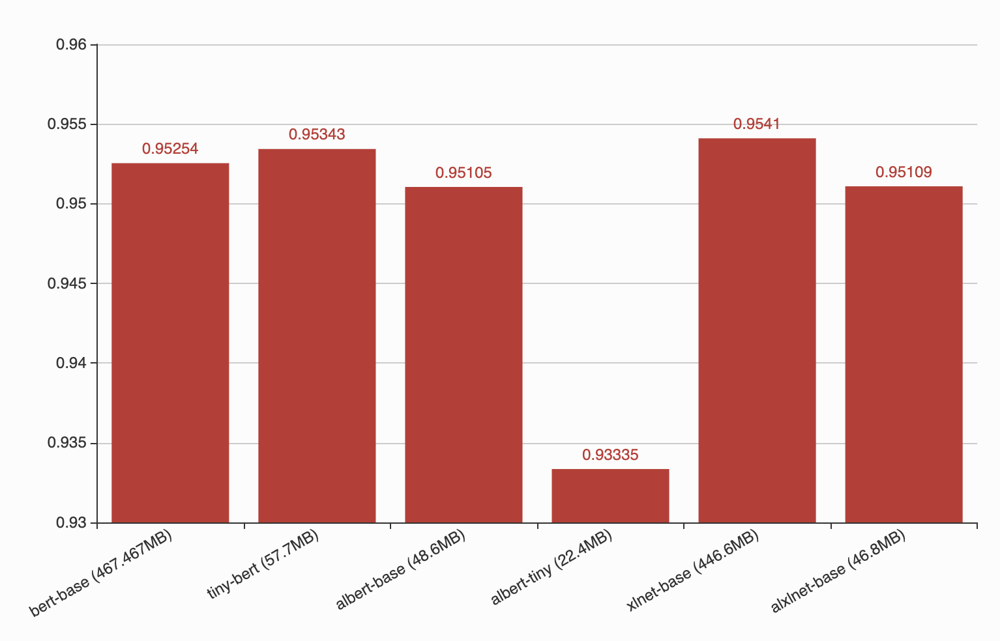

Entities Recognition
--------------------

Trained on 80% of dataset, tested on 20% of dataset. All training
sessions stored in
`session/entities <https://github.com/huseinzol05/Malaya/tree/master/session/entities>`__

.. code:: python

    from IPython.core.display import Image, display

    display(Image('ner-accuracy.png', width=500))

.. image:: models-accuracy_files/models-accuracy_1_0.png
   :width: 500px

Concat
^^^^^^

.. code:: text

                 precision    recall  f1-score   support

          OTHER       1.00      1.00      1.00    498279
          event       0.98      0.99      0.99      2217
            law       0.99      0.99      0.99      1610
       location       0.99      1.00      1.00     20194
   organization       0.99      0.99      0.99     26093
         person       1.00      0.99      1.00     43377
       quantity       1.00      1.00      1.00     13180
           time       0.99      1.00      0.99     12750

    avg / total       1.00      1.00      1.00    617700

Bahdanau
^^^^^^^^

.. code:: text

                 precision    recall  f1-score   support

          OTHER       1.00      1.00      1.00    498587
          event       0.98      0.99      0.98      2212
            law       1.00      0.99      0.99      1746
       location       0.99      1.00      1.00     20387
   organization       0.99      1.00      1.00     25376
         person       1.00      1.00      1.00     43158
       quantity       1.00      1.00      1.00     13581
           time       0.99      1.00      0.99     12653

    avg / total       1.00      1.00      1.00    617700

Luong
^^^^^

.. code:: text

                 precision    recall  f1-score   support

          OTHER       1.00      1.00      1.00    497138
          event       0.99      0.99      0.99      2331
            law       0.99      0.99      0.99      1872
       location       0.99      1.00      1.00     20671
   organization       0.99      1.00      0.99     25942
         person       0.99      1.00      1.00     43511
       quantity       1.00      1.00      1.00     13376
           time       1.00      1.00      1.00     12859

    avg / total       1.00      1.00      1.00    617700

Entity-Network
^^^^^^^^^^^^^^

.. code:: text

                 precision    recall  f1-score   support

          OTHER       1.00      1.00      1.00    497198
          event       0.98      0.95      0.96      2381
            law       0.99      0.97      0.98      1881
       location       0.99      0.99      0.99     20305
   organization       0.99      0.98      0.98     26036
         person       0.99      0.99      0.99     43470
       quantity       0.99      0.99      0.99     13608
           time       0.98      0.99      0.98     12821

    avg / total       1.00      1.00      1.00    617700

CRF
^^^

.. code:: text

                 precision    recall  f1-score   support

       quantity      0.991     0.991     0.991     13891
       location      0.987     0.989     0.988     20798
           time      0.987     0.977     0.982     13264
         person      0.993     0.987     0.990     43590
   organization      0.974     0.973     0.973     25426
          event      0.995     0.983     0.989      2417
            law      0.994     0.988     0.991      1686

    avg / total      0.987     0.983     0.985    121072

Attention
^^^^^^^^^

.. code:: text

                 precision    recall  f1-score   support

          OTHER       1.00      1.00      1.00    497073
          event       0.99      0.97      0.98      2426
            law       1.00      0.99      0.99      1806
       location       1.00      1.00      1.00     20176
   organization       1.00      1.00      1.00     26044
         person       1.00      1.00      1.00     44346
       quantity       1.00      1.00      1.00     13155
           time       0.99      1.00      1.00     12674

    avg / total       1.00      1.00      1.00    617700

Language Detection
------------------

Trained on 80% of dataset, tested on 20% of dataset. All training
sessions stored in
`session/language-detection <https://github.com/huseinzol05/Malaya/tree/master/session/language-detection>`__

.. code:: python

    display(Image('language-detection-accuracy.png', width=500))

.. image:: models-accuracy_files/models-accuracy_9_0.png
   :width: 500px

XGB
^^^

.. code:: text

                 precision    recall  f1-score   support

          OTHER       0.98      0.99      0.99      9424
            eng       1.00      0.99      0.99      9972
            ind       1.00      0.99      0.99     11511
            zlm       1.00      1.00      1.00     10679

      micro avg       0.99      0.99      0.99     41586
      macro avg       0.99      0.99      0.99     41586
   weighted avg       0.99      0.99      0.99     41586

Multinomial
^^^^^^^^^^^

.. code:: text

                 precision    recall  f1-score   support

          OTHER       1.00      0.97      0.99      9424
            eng       0.99      1.00      0.99      9972
            ind       1.00      1.00      1.00     11511
            zlm       0.99      1.00      0.99     10679

      micro avg       0.99      0.99      0.99     41586
      macro avg       0.99      0.99      0.99     41586
   weighted avg       0.99      0.99      0.99     41586

SGD
^^^

.. code:: text

                 precision    recall  f1-score   support

          OTHER       0.97      0.99      0.98      9424
            eng       0.99      0.99      0.99      9972
            ind       1.00      0.99      0.99     11511
            zlm       1.00      1.00      1.00     10679

      micro avg       0.99      0.99      0.99     41586
      macro avg       0.99      0.99      0.99     41586
   weighted avg       0.99      0.99      0.99     41586

Deep learning
^^^^^^^^^^^^^

.. code:: text

                 precision    recall  f1-score   support

          other       1.00      0.99      0.99      9445
        english       1.00      1.00      1.00      9987
     indonesian       1.00      1.00      1.00     11518
          malay       1.00      1.00      1.00     10636

      micro avg       1.00      1.00      1.00     41586
      macro avg       1.00      1.00      1.00     41586
   weighted avg       1.00      1.00      1.00     41586

POS Recognition
---------------

Trained on 80% of dataset, tested on 20% of dataset. All training
sessions stored in
`session/pos <https://github.com/huseinzol05/Malaya/tree/master/session/pos>`__

.. code:: python

    display(Image('pos-accuracy.png', width=500))

.. image:: models-accuracy_files/models-accuracy_15_0.png
   :width: 500px

Concat
^^^^^^

.. code:: text

                precision    recall  f1-score   support

           ADJ       0.99      1.00      1.00     22663
           ADP       1.00      1.00      1.00     60199
           ADV       1.00      1.00      1.00     23633
           AUX       1.00      1.00      1.00      5249
         CCONJ       1.00      1.00      1.00     18485
           DET       1.00      1.00      1.00     19849
          NOUN       1.00      1.00      1.00    135031
           NUM       1.00      1.00      1.00     21842
          PART       1.00      1.00      1.00      2900
          PRON       1.00      1.00      1.00     23908
         PROPN       1.00      1.00      1.00    113206
         SCONJ       1.00      0.99      1.00      7304
           SYM       1.00      1.00      1.00      1205
          VERB       1.00      1.00      1.00     61222
             X       0.97      0.99      0.98       154

   avg / total       1.00      1.00      1.00    516850

Bahdanau
^^^^^^^^

.. code:: text

                precision    recall  f1-score   support

           ADJ       0.99      0.99      0.99     22879
           ADP       1.00      1.00      1.00     60063
           ADV       1.00      0.99      1.00     23653
           AUX       1.00      1.00      1.00      5295
         CCONJ       1.00      1.00      1.00     18395
           DET       1.00      1.00      1.00     20088
          NOUN       1.00      1.00      1.00    134736
           NUM       1.00      1.00      1.00     21938
          PART       0.99      1.00      0.99      3093
          PRON       1.00      1.00      1.00     24060
         PROPN       1.00      1.00      1.00    112859
         SCONJ       0.99      0.99      0.99      7445
           SYM       0.99      0.99      0.99      1219
          VERB       1.00      1.00      1.00     60937
             X       0.98      0.97      0.98       190

   avg / total       1.00      1.00      1.00    516850

Luong
^^^^^

.. code:: text

                precision    recall  f1-score   support

           ADJ       0.99      0.99      0.99     22649
           ADP       1.00      1.00      1.00     60088
           ADV       0.99      1.00      0.99     24031
           AUX       1.00      1.00      1.00      5279
         CCONJ       1.00      1.00      1.00     18469
           DET       1.00      1.00      1.00     20053
          NOUN       1.00      1.00      1.00    134614
           NUM       1.00      1.00      1.00     21703
          PART       1.00      0.99      0.99      2956
          PRON       1.00      1.00      1.00     23786
         PROPN       1.00      1.00      1.00    113689
         SCONJ       0.99      0.99      0.99      7315
           SYM       1.00      1.00      1.00      1189
          VERB       1.00      1.00      1.00     60827
             X       0.97      0.99      0.98       202

   avg / total       1.00      1.00      1.00    516850

CRF
^^^

.. code:: text

                 precision    recall  f1-score   support

           PRON      0.998     0.997     0.998     47911
            DET      0.990     0.993     0.991     39932
           NOUN      0.988     0.988     0.988    270045
           VERB      0.997     0.997     0.997    122015
          PROPN      0.989     0.988     0.988    225893
            ADP      0.997     0.998     0.997    120358
            ADV      0.992     0.991     0.991     47753
          CCONJ      0.997     0.998     0.997     36696
            NUM      0.993     0.995     0.994     43748
            ADJ      0.985     0.988     0.986     45244
           PART      0.992     0.995     0.993      5975
            AUX      1.000     1.000     1.000     10505
          SCONJ      0.994     0.987     0.990     14798
            SYM      0.998     0.997     0.998      2483

      micro avg      0.992     0.992     0.992   1033356
      macro avg      0.994     0.994     0.994   1033356
   weighted avg      0.992     0.992     0.992   1033356

Entity-network
^^^^^^^^^^^^^^

.. code:: text

                precision    recall  f1-score   support

           ADJ       0.98      0.98      0.98     22626
           ADP       0.99      0.99      0.99     60045
           ADV       0.97      0.98      0.98     23537
           AUX       0.99      0.99      0.99      5195
         CCONJ       0.99      0.99      0.99     18357
           DET       0.99      0.99      0.99     19762
          NOUN       0.99      0.99      0.99    134505
           NUM       0.99      0.99      0.99     22083
          PART       0.97      0.97      0.97      2924
          PRON       0.99      0.99      0.99     23783
         PROPN       0.99      0.99      0.99    114144
         SCONJ       0.96      0.95      0.95      7534
           SYM       0.97      0.98      0.97      1335
          VERB       0.99      0.99      0.99     60834
             X       0.93      0.68      0.79       186

   avg / total       0.99      0.99      0.99    516850

Sentiment Analysis
------------------

Trained on 80% of dataset, tested on 20% of dataset. All training
sessions stored in
`session/sentiment <https://github.com/huseinzol05/Malaya/tree/master/session/sentiment>`__

**We found that, higher accuracy models are not a good predictive model
on our social media streaming application. We had to stack multiple
models to get the best shot. Again, most of Malaya models are
deep-learning, really need a good infrastructure if want to stack
multiple models**

.. code:: python

    display(Image('sentiment-accuracy.png', width=500))

.. image:: models-accuracy_files/models-accuracy_22_0.png
   :width: 500px

Bahdanau
^^^^^^^^

.. code:: text

                precision    recall  f1-score   support

      negative       0.63      0.69      0.66      1326
      positive       0.71      0.64      0.67      1530

   avg / total       0.67      0.67      0.67      2856

BERT
^^^^

.. code:: text

                precision    recall  f1-score   support

      negative       0.58      0.88      0.70      1366
      positive       0.79      0.42      0.55      1490

   avg / total       0.69      0.64      0.62      2856

Bidirectional
^^^^^^^^^^^^^

.. code:: text

                precision    recall  f1-score   support

      negative       0.63      0.72      0.67      1356
      positive       0.71      0.62      0.66      1500

   avg / total       0.67      0.67      0.67      2856

Entity-network
^^^^^^^^^^^^^^

.. code:: text

                precision    recall  f1-score   support

      negative       0.70      0.66      0.68      1324
      positive       0.72      0.75      0.74      1532

   avg / total       0.71      0.71      0.71      2856

Fast-text
^^^^^^^^^

.. code:: text

                precision    recall  f1-score   support

      negative       0.69      0.71      0.70      1261
      positive       0.77      0.74      0.75      1595

   avg / total       0.73      0.73      0.73      2856

Fast-text-char
^^^^^^^^^^^^^^

.. code:: text

                precision    recall  f1-score   support

      negative       0.71      0.64      0.67      1303
      positive       0.72      0.78      0.75      1553

   avg / total       0.71      0.71      0.71      2856

Hierarchical
^^^^^^^^^^^^

.. code:: text

                precision    recall  f1-score   support

      negative       0.67      0.61      0.64      1347
      positive       0.68      0.72      0.70      1509

   avg / total       0.67      0.67      0.67      2856

Luong
^^^^^

.. code:: text

                precision    recall  f1-score   support

      negative       0.62      0.73      0.67      1360
      positive       0.71      0.59      0.64      1496

   avg / total       0.66      0.66      0.66      2856

Multinomial
^^^^^^^^^^^

.. code:: text

                precision    recall  f1-score   support

      negative       0.80      0.53      0.64      1379
      positive       0.67      0.88      0.76      1477

   avg / total       0.73      0.71      0.70      2856

XGB
^^^

.. code:: text

                precision    recall  f1-score   support

      negative       0.69      0.61      0.65      1332
      positive       0.69      0.76      0.72      1524

   avg / total       0.69      0.69      0.69      2856

Toxicity Analysis
-----------------

Trained on 80% of dataset, tested on 20% of dataset. All training
sessions stored in
`session/toxic <https://github.com/huseinzol05/Malaya/tree/master/session/toxic>`__

Labels are,

.. code:: python

   {0: 'toxic', 1: 'severe_toxic', 2: 'obscene', 3: 'threat', 4: 'insult', 5: 'identity_hate'}

.. code:: python

    display(Image('toxic-accuracy.png', width=500))

Bahdanau
^^^^^^^^

.. code:: text

                precision    recall  f1-score   support

             0       0.75      0.58      0.65       797
             1       0.46      0.36      0.41        77
             2       0.71      0.59      0.64       423
             3       0.00      0.00      0.00        30
             4       0.68      0.56      0.61       384
             5       0.40      0.23      0.29        74

   avg / total       0.69      0.54      0.60      1785

Entity-network
^^^^^^^^^^^^^^

.. code:: text

                precision    recall  f1-score   support

             0       0.77      0.61      0.68       787
             1       1.00      0.08      0.14        92
             2       0.75      0.66      0.71       432
             3       0.44      0.19      0.27        21
             4       0.68      0.61      0.65       400
             5       0.57      0.05      0.09        79

   avg / total       0.75      0.57      0.62      1811

Fast-text
^^^^^^^^^

.. code:: text

                precision    recall  f1-score   support

             0       0.80      0.47      0.59       815
             1       0.58      0.19      0.29        94
             2       0.90      0.38      0.54       425
             3       0.40      0.06      0.11        31
             4       0.85      0.35      0.49       410
             5       0.35      0.08      0.13        74

   avg / total       0.80      0.39      0.52      1849

Hierarchical
^^^^^^^^^^^^

.. code:: text

                precision    recall  f1-score   support

             0       0.69      0.56      0.62       751
             1       0.68      0.20      0.31        86
             2       0.84      0.48      0.61       412
             3       1.00      0.04      0.07        28
             4       0.70      0.55      0.62       356
             5       0.57      0.27      0.36        60

   avg / total       0.73      0.50      0.58      1693

Logistic Regression
^^^^^^^^^^^^^^^^^^^

.. code:: text

                precision    recall  f1-score   support

             0       0.98      0.27      0.43       805
             1       0.50      0.02      0.04        88
             2       0.99      0.30      0.46       460
             3       0.00      0.00      0.00        32
             4       0.87      0.22      0.35       420
             5       0.00      0.00      0.00        68

   avg / total       0.88      0.24      0.38      1873

Multinomial
^^^^^^^^^^^

.. code:: text

                precision    recall  f1-score   support

             0       0.81      0.52      0.63       805
             1       0.44      0.35      0.39        88
             2       0.76      0.49      0.59       460
             3       0.00      0.00      0.00        32
             4       0.68      0.47      0.56       420
             5       0.15      0.09      0.11        68

   avg / total       0.71      0.47      0.56      1873

Luong
^^^^^

.. code:: text

                precision    recall  f1-score   support

             0       0.68      0.64      0.66       799
             1       0.43      0.22      0.29        81
             2       0.77      0.59      0.67       423
             3       0.57      0.16      0.25        25
             4       0.70      0.53      0.61       404
             5       0.33      0.01      0.02        81

   avg / total       0.68      0.55      0.60      1813

Subjectivity Analysis
---------------------

Trained on 80% of dataset, tested on 20% of dataset. All training
sessions stored in
`session/subjectivity <https://github.com/huseinzol05/Malaya/tree/master/session/subjectivity>`__

.. code:: python

    display(Image('subjectivity-accuracy.png', width=500))

.. image:: models-accuracy_files/models-accuracy_43_0.png
   :width: 500px

Bahdanau
^^^^^^^^

.. code:: text

                 precision    recall  f1-score   support

       negative       0.82      0.83      0.82       983
       positive       0.83      0.83      0.83      1010

      micro avg       0.83      0.83      0.83      1993
      macro avg       0.83      0.83      0.83      1993
   weighted avg       0.83      0.83      0.83      1993

BERT
^^^^

.. code:: text

                 precision    recall  f1-score   support

       negative       0.75      0.95      0.84      1024
       positive       0.93      0.67      0.78       969

      micro avg       0.82      0.82      0.82      1993
      macro avg       0.84      0.81      0.81      1993
   weighted avg       0.84      0.82      0.81      1993

Bidirectional
^^^^^^^^^^^^^

.. code:: text

                 precision    recall  f1-score   support

       negative       0.82      0.89      0.85       989
       positive       0.88      0.81      0.84      1004

      micro avg       0.85      0.85      0.85      1993
      macro avg       0.85      0.85      0.85      1993
   weighted avg       0.85      0.85      0.85      1993

Entity-network
^^^^^^^^^^^^^^

.. code:: text

                 precision    recall  f1-score   support

       negative       0.89      0.87      0.88       984
       positive       0.87      0.89      0.88      1009

      micro avg       0.88      0.88      0.88      1993
      macro avg       0.88      0.88      0.88      1993
   weighted avg       0.88      0.88      0.88      1993

Fast-text
^^^^^^^^^

.. code:: text

                 precision    recall  f1-score   support

       negative       0.88      0.91      0.89      1003
       positive       0.90      0.87      0.89       990

      micro avg       0.89      0.89      0.89      1993
      macro avg       0.89      0.89      0.89      1993
   weighted avg       0.89      0.89      0.89      1993

Fast-text-char
^^^^^^^^^^^^^^

.. code:: text

                precision    recall  f1-score   support

      negative       0.88      0.88      0.88      1002
      positive       0.88      0.87      0.88       991

   avg / total       0.88      0.88      0.88      1993

Hierarchical
^^^^^^^^^^^^

.. code:: text

                 precision    recall  f1-score   support

       negative       0.83      0.87      0.85      1017
       positive       0.85      0.81      0.83       976

      micro avg       0.84      0.84      0.84      1993
      macro avg       0.84      0.84      0.84      1993
   weighted avg       0.84      0.84      0.84      1993

Luong
^^^^^

.. code:: text

                 precision    recall  f1-score   support

       negative       0.85      0.78      0.81       987
       positive       0.80      0.86      0.83      1006

      micro avg       0.82      0.82      0.82      1993
      macro avg       0.82      0.82      0.82      1993
   weighted avg       0.82      0.82      0.82      1993

Multinomial
^^^^^^^^^^^

.. code:: text

                precision    recall  f1-score   support

       negative       0.91      0.85      0.88       999
       positive       0.86      0.92      0.89       994

      micro avg       0.89      0.89      0.89      1993
      macro avg       0.89      0.89      0.89      1993
   weighted avg       0.89      0.89      0.89      1993

XGB
^^^

.. code:: text

                 precision    recall  f1-score   support

       negative       0.86      0.85      0.85      1003
       positive       0.85      0.86      0.85       990

      micro avg       0.85      0.85      0.85      1993
      macro avg       0.85      0.85      0.85      1993
   weighted avg       0.85      0.85      0.85      1993

Emotion Analysis
----------------

Trained on 80% of dataset, tested on 20% of dataset. All training
sessions stored in
`session/emotion <https://github.com/huseinzol05/Malaya/tree/master/session/emotion>`__

.. code:: python

    display(Image('emotion-accuracy.png', width=500))

.. image:: models-accuracy_files/models-accuracy_55_0.png
   :width: 500px

Bahdanau
^^^^^^^^

.. code:: text

                precision    recall  f1-score   support

         anger       0.80      0.80      0.80      3827
          fear       0.77      0.78      0.78      3760
           joy       0.81      0.78      0.80      3958
          love       0.82      0.86      0.84      3099
       sadness       0.73      0.76      0.74      3119
      surprise       0.79      0.74      0.77      1940

   avg / total       0.79      0.79      0.79     19703

BERT
^^^^

.. code:: text

                precision    recall  f1-score   support

         anger       0.73      0.83      0.78      3747
          fear       0.70      0.84      0.77      3789
           joy       0.74      0.80      0.77      3929
          love       0.82      0.76      0.79      3081
       sadness       0.82      0.60      0.69      3168
      surprise       0.85      0.63      0.72      1989

   avg / total       0.77      0.76      0.76     19703

Bidirectional
^^^^^^^^^^^^^

.. code:: text

                precision    recall  f1-score   support

         anger       0.81      0.80      0.81      3726
          fear       0.77      0.78      0.77      3806
           joy       0.83      0.81      0.82      3975
          love       0.86      0.83      0.85      2992
       sadness       0.75      0.78      0.77      3293
      surprise       0.77      0.79      0.78      1911

   avg / total       0.80      0.80      0.80     19703

Entity-network
^^^^^^^^^^^^^^

.. code:: text

                precision    recall  f1-score   support

         anger       0.82      0.72      0.77      3717
          fear       0.72      0.77      0.75      3743
           joy       0.77      0.74      0.76      4050
          love       0.81      0.81      0.81      2992
       sadness       0.71      0.74      0.72      3274
      surprise       0.72      0.80      0.76      1927

   avg / total       0.76      0.76      0.76     19703

Fast-text
^^^^^^^^^

.. code:: text

                precision    recall  f1-score   support

         anger       0.82      0.75      0.78      3754
          fear       0.71      0.81      0.75      3837
           joy       0.76      0.79      0.78      3844
          love       0.83      0.83      0.83      3065
       sadness       0.75      0.75      0.75      3241
      surprise       0.79      0.64      0.71      1962

   avg / total       0.77      0.77      0.77     19703

Fast-text-char
^^^^^^^^^^^^^^

.. code:: text

                precision    recall  f1-score   support

         anger       0.79      0.75      0.77      3803
          fear       0.73      0.73      0.73      3784
           joy       0.71      0.77      0.74      3872
          love       0.81      0.80      0.80      3052
       sadness       0.72      0.70      0.71      3205
      surprise       0.73      0.70      0.72      1987

   avg / total       0.75      0.74      0.75     19703

Hierarchical
^^^^^^^^^^^^

.. code:: text

                precision    recall  f1-score   support

         anger       0.81      0.79      0.80      3786
          fear       0.78      0.79      0.78      3754
           joy       0.81      0.82      0.82      3886
          love       0.85      0.84      0.85      3022
       sadness       0.76      0.80      0.78      3300
      surprise       0.81      0.75      0.78      1955

   avg / total       0.80      0.80      0.80     19703

Luong
^^^^^

.. code:: text

                precision    recall  f1-score   support

         anger       0.80      0.79      0.80      3774
          fear       0.78      0.75      0.77      3759
           joy       0.79      0.80      0.79      3944
          love       0.83      0.84      0.84      3033
       sadness       0.75      0.75      0.75      3272
      surprise       0.76      0.80      0.78      1921

   avg / total       0.79      0.79      0.79     19703

Multinomial
^^^^^^^^^^^

.. code:: text

                precision    recall  f1-score   support

         anger       0.72      0.82      0.77      3833
          fear       0.68      0.80      0.74      3802
           joy       0.68      0.84      0.75      3924
          love       0.85      0.71      0.78      2981
       sadness       0.81      0.67      0.73      3189
      surprise       0.80      0.36      0.50      1974

   avg / total       0.75      0.73      0.73     19703

XGB
^^^

.. code:: text

                precision    recall  f1-score   support

         anger       0.80      0.80      0.80      3769
          fear       0.79      0.76      0.78      3808
           joy       0.79      0.81      0.80      3913
          love       0.84      0.85      0.84      2998
       sadness       0.76      0.75      0.76      3250
      surprise       0.77      0.77      0.77      1965

   avg / total       0.79      0.79      0.79     19703
