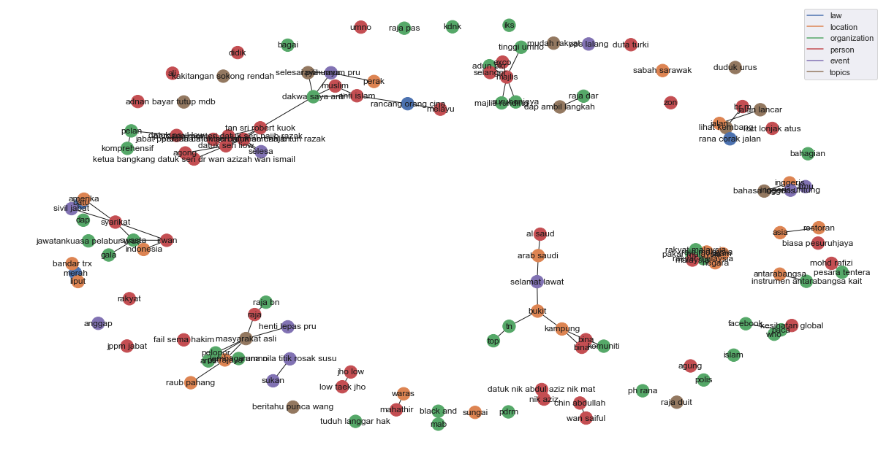

.. code:: ipython3

    %%time
    import malaya

.. parsed-literal::

    CPU times: user 12.3 s, sys: 1.66 s, total: 14 s
    Wall time: 18.9 s

.. code:: ipython3

    %matplotlib inline
    
    import pandas as pd
    df = pd.read_csv('tests/02032018.csv',sep=';')
    df = df.iloc[3:,1:]
    df.columns = ['text','label']
    corpus = df.text.tolist()

Generate scatter plot for unsupervised clustering
-------------------------------------------------

.. code:: ipython3

    result_scatter = malaya.cluster.cluster_scatter(corpus,vectorizer='tfidf')

.. image:: load-clustering_files/load-clustering_3_0.png

Generate dendogram plot for unsupervised clustering
---------------------------------------------------

.. code:: ipython3

    result_scatter = malaya.cluster.cluster_dendogram(corpus,vectorizer='tfidf')

.. image:: load-clustering_files/load-clustering_5_0.png

Generate undirected graph for unsupervised clustering
-----------------------------------------------------

.. code:: ipython3

    result_scatter = malaya.cluster.cluster_graph(corpus,vectorizer='tfidf')

.. image:: load-clustering_files/load-clustering_7_0.png

Generate undirected graph for Entities and topics relationship
--------------------------------------------------------------

.. code:: ipython3

    entity_model = malaya.entity.deep_model('luong')
    topic_model = malaya.topic_model.lda
    result_linking = malaya.cluster.cluster_entity_linking(corpus,
                                                           entity_model,
                                                           topic_model,
                                                           vectorizer='tfidf')

Cluster same word structure based on POS and Entities
-----------------------------------------------------

.. code:: ipython3

    string = 'KUALA LUMPUR: Sempena sambutan Aidilfitri minggu depan, Perdana Menteri Tun Dr Mahathir Mohamad dan Menteri Pengangkutan Anthony Loke Siew Fook menitipkan pesanan khas kepada orang ramai yang mahu pulang ke kampung halaman masing-masing. Dalam video pendek terbitan Jabatan Keselamatan Jalan Raya (JKJR) itu, Dr Mahathir menasihati mereka supaya berhenti berehat dan tidur sebentar  sekiranya mengantuk ketika memandu.'

.. code:: ipython3

    bahdanau_entities = malaya.entity.deep_model('bahdanau')
    bahdanau_pos = malaya.pos.deep_model('bahdanau')

.. code:: ipython3

    result_entities = bahdanau_entities.predict(string)
    result_pos = bahdanau_pos.predict(string)

.. code:: ipython3

    generated_grams = malaya.generator.pos_entities_ngram(
        result_pos,
        result_entities,
        ngram = (1, 3),
        accept_pos = ['NOUN', 'PROPN', 'VERB'],
        accept_entities = ['law', 'location', 'organization', 'person', 'time'],
    )
    generated_grams

.. parsed-literal::

    ['Lumpur Sempena',
     'sambutan Aidilfitri',
     'terbitan Jabatan',
     'depan Perdana Menteri',
     'Menteri Pengangkutan Anthony',
     'Mohamad Menteri',
     'sekiranya mengantuk',
     'Mahathir Mohamad',
     'Lumpur Sempena sambutan',
     'pesanan',
     'Jalan',
     'Mohamad Menteri Pengangkutan',
     'Mahathir menasihati berhenti',
     'Kuala Lumpur Sempena',
     'Tun Dr',
     'Mahathir Mohamad Menteri',
     'pesanan orang mahu',
     'Sempena sambutan',
     'pulang kampung',
     'masing-masing video',
     'orang mahu pulang',
     'Raya',
     'memandu',
     'Perdana',
     'kampung halaman masing-masing',
     'Jabatan Keselamatan',
     'Perdana Menteri Tun',
     'video terbitan Jabatan',
     'Siew',
     'Kuala',
     'terbitan Jabatan Keselamatan',
     'Keselamatan Jalan',
     'Fook menitipkan pesanan',
     'Dr',
     'tidur sekiranya',
     'Mohamad',
     'depan Perdana',
     'Menteri Tun',
     'Sempena',
     'menasihati berhenti berehat',
     'Raya Jkjr Dr',
     'Jabatan',
     'Anthony Loke',
     'tidur',
     'Jkjr',
     'berehat',
     'Pengangkutan Anthony Loke',
     'Jalan Raya',
     'Lumpur',
     'Perdana Menteri',
     'Jkjr Dr',
     'Fook',
     'Dr Mahathir Mohamad',
     'Mahathir',
     'halaman masing-masing video',
     'mahu pulang',
     'Dr Mahathir menasihati',
     'menitipkan',
     'orang',
     'menitipkan pesanan orang',
     'Kuala Lumpur',
     'minggu',
     'sekiranya mengantuk memandu',
     'Pengangkutan Anthony',
     'sekiranya',
     'berehat tidur',
     'pesanan orang',
     'Pengangkutan',
     'mahu pulang kampung',
     'berhenti berehat tidur',
     'kampung halaman',
     'Siew Fook menitipkan',
     'sambutan Aidilfitri minggu',
     'Fook menitipkan',
     'halaman masing-masing',
     'orang mahu',
     'mengantuk',
     'tidur sekiranya mengantuk',
     'mahu',
     'Anthony Loke Siew',
     'Keselamatan',
     'Loke',
     'halaman',
     'berhenti',
     'pulang',
     'Aidilfitri minggu',
     'berehat tidur sekiranya',
     'Menteri Tun Dr',
     'Raya Jkjr',
     'Anthony',
     'menitipkan pesanan',
     'Tun',
     'Menteri Pengangkutan',
     'Aidilfitri minggu depan',
     'Loke Siew Fook',
     'berhenti berehat',
     'sambutan',
     'minggu depan Perdana',
     'Mahathir menasihati',
     'Menteri',
     'video terbitan',
     'masing-masing video terbitan',
     'Aidilfitri',
     'pulang kampung halaman',
     'menasihati berhenti',
     'Siew Fook',
     'Loke Siew',
     'Tun Dr Mahathir',
     'Jalan Raya Jkjr',
     'Dr Mahathir',
     'Sempena sambutan Aidilfitri',
     'terbitan',
     'menasihati',
     'mengantuk memandu',
     'minggu depan',
     'depan',
     'Jabatan Keselamatan Jalan',
     'Keselamatan Jalan Raya',
     'Jkjr Dr Mahathir',
     'masing-masing',
     'video',
     'kampung']

.. code:: ipython3

    malaya.cluster.cluster_words(generated_grams)

.. parsed-literal::

    ['mahu pulang kampung',
     'Fook menitipkan pesanan',
     'berhenti berehat tidur',
     'minggu depan Perdana',
     'masing-masing video terbitan',
     'depan Perdana Menteri',
     'Menteri Pengangkutan Anthony',
     'Siew Fook menitipkan',
     'menasihati berhenti berehat',
     'Raya Jkjr Dr',
     'sambutan Aidilfitri minggu',
     'Pengangkutan Anthony Loke',
     'Lumpur Sempena sambutan',
     'pulang kampung halaman',
     'Mahathir menasihati berhenti',
     'Mohamad Menteri Pengangkutan',
     'tidur sekiranya mengantuk',
     'Kuala Lumpur Sempena',
     'Mahathir Mohamad Menteri',
     'Tun Dr Mahathir',
     'pesanan orang mahu',
     'Jalan Raya Jkjr',
     'Anthony Loke Siew',
     'Dr Mahathir Mohamad',
     'Sempena sambutan Aidilfitri',
     'orang mahu pulang',
     'halaman masing-masing video',
     'Jabatan Keselamatan Jalan',
     'Keselamatan Jalan Raya',
     'Jkjr Dr Mahathir',
     'Dr Mahathir menasihati',
     'berehat tidur sekiranya',
     'Menteri Tun Dr',
     'kampung halaman masing-masing',
     'Perdana Menteri Tun',
     'menitipkan pesanan orang',
     'video terbitan Jabatan',
     'Loke Siew Fook',
     'sekiranya mengantuk memandu',
     'Aidilfitri minggu depan',
     'terbitan Jabatan Keselamatan']

Cluster Part-Of-Speech
----------------------

.. code:: ipython3

    malaya.cluster.cluster_pos(result_pos)

.. parsed-literal::

    {'ADJ': ['depan', 'khas', 'ramai', 'pendek'],
     'ADP': ['kepada', 'ke', 'Dalam'],
     'ADV': ['sebentar'],
     'ADX': [],
     'AUX': [],
     'CCONJ': ['dan'],
     'DET': ['itu'],
     'NOUN': ['sambutan',
      'pesanan',
      'orang',
      'kampung halaman masing-masing',
      'video',
      'terbitan Jabatan Keselamatan',
      'Jkjr',
      'berehat',
      'tidur',
      'sekiranya mengantuk'],
     'NUM': [],
     'PART': [],
     'PRON': ['yang', 'mereka'],
     'PROPN': ['Kuala Lumpur Sempena',
      'Aidilfitri',
      'Perdana Menteri Tun Dr Mahathir Mohamad',
      'Menteri Pengangkutan Anthony Loke Siew Fook',
      'Jalan Raya',
      'Dr Mahathir'],
     'SCONJ': ['supaya', 'ketika'],
     'SYM': [],
     'VERB': ['minggu', 'menitipkan', 'mahu pulang', 'menasihati', 'berhenti'],
     'X': []}

.. code:: ipython3

    malaya.cluster.cluster_entities(result_entities)

.. parsed-literal::

    {'OTHER': ['sempena',
      'dan',
      'menitipkan pesanan khas kepada',
      'ramai yang mahu pulang ke kampung halaman masing-masing dalam video pendek terbitan',
      'itu'],
     'law': ['orang'],
     'location': ['kuala lumpur'],
     'organization': ['menteri pengangkutan', 'jabatan keselamatan jalan raya'],
     'person': ['perdana menteri tun dr mahathir mohamad',
      'anthony loke siew fook',
      'jkjr',
      'dr mahathir'],
     'quantity': [],
     'time': ['minggu depan'],
     'event': ['sambutan aidilfitri']}

