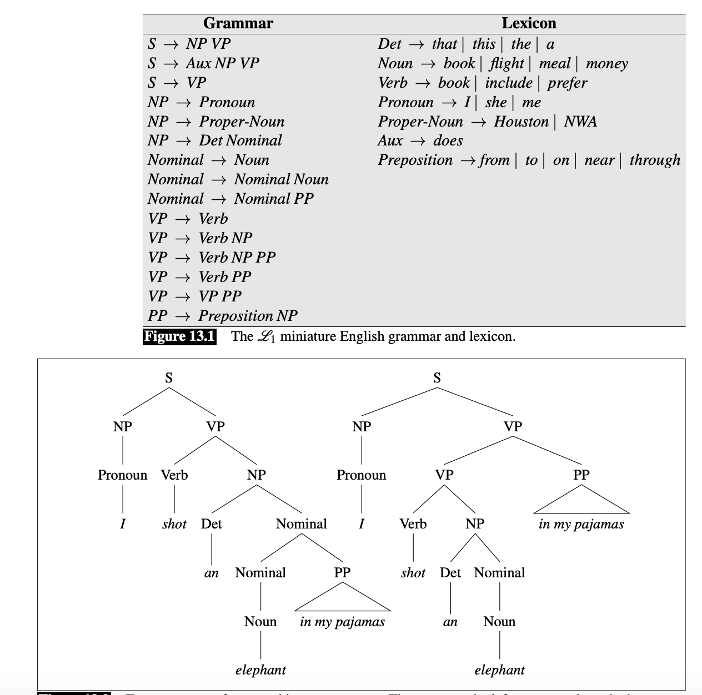
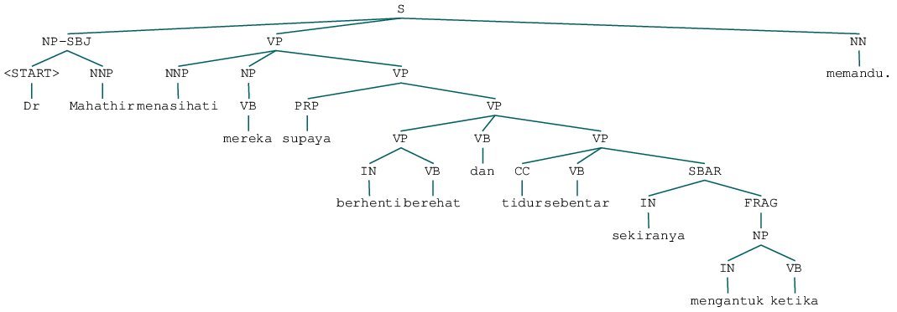

Constituency Parsing
--------------------

.. container:: alert alert-info

   This tutorial is available as an IPython notebook at
   `Malaya/example/constituency <https://github.com/huseinzol05/Malaya/tree/master/example/constituency>`__.

.. code:: ipython3

    %%time
    
    import malaya

.. parsed-literal::

    CPU times: user 5.34 s, sys: 1.01 s, total: 6.34 s
    Wall time: 7.21 s

what is constituency parsing
~~~~~~~~~~~~~~~~~~~~~~~~~~~~

Assign a sentence into its own syntactic structure, defined by certain
standardization. For example,

.. code:: ipython3

    from IPython.core.display import Image, display
    
    display(Image('constituency.png', width=500))

Read more at Stanford notes,
https://web.stanford.edu/~jurafsky/slp3/13.pdf

The context free grammar totally depends on language, so for Bahasa, we
follow https://github.com/famrashel/idn-treebank

List available transformer Constituency models
~~~~~~~~~~~~~~~~~~~~~~~~~~~~~~~~~~~~~~~~~~~~~~

.. code:: ipython3

    malaya.constituency.available_transformer()

.. raw:: html

    

    
    <table border="1" class="dataframe">
      <thead>
        <tr style="text-align: right;">
          <th></th>
          <th>Size (MB)</th>
          <th>Recall</th>
          <th>Precision</th>
          <th>FScore</th>
          <th>CompleteMatch</th>
          <th>TaggingAccuracy</th>
        </tr>
      </thead>
      <tbody>
        <tr>
          <th>bert</th>
          <td>470.0</td>
          <td>78.96</td>
          <td>81.78</td>
          <td>80.35</td>
          <td>10.37</td>
          <td>91.59</td>
        </tr>
        <tr>
          <th>tiny-bert</th>
          <td>125.0</td>
          <td>74.89</td>
          <td>78.79</td>
          <td>76.79</td>
          <td>9.01</td>
          <td>91.17</td>
        </tr>
        <tr>
          <th>albert</th>
          <td>180.0</td>
          <td>77.57</td>
          <td>80.50</td>
          <td>79.01</td>
          <td>5.77</td>
          <td>90.30</td>
        </tr>
        <tr>
          <th>tiny-albert</th>
          <td>56.7</td>
          <td>67.21</td>
          <td>74.89</td>
          <td>70.84</td>
          <td>2.11</td>
          <td>87.75</td>
        </tr>
        <tr>
          <th>xlnet</th>
          <td>498.0</td>
          <td>80.65</td>
          <td>82.22</td>
          <td>81.43</td>
          <td>11.08</td>
          <td>92.12</td>
        </tr>
      </tbody>
    </table>
    

Make sure you can check accuracy chart from here first before select a
model,
https://malaya.readthedocs.io/en/latest/Accuracy.html#constituency-parsing

The best model in term of accuracy is **XLNET**.

.. code:: ipython3

    string = 'Dr Mahathir menasihati mereka supaya berhenti berehat dan tidur sebentar sekiranya mengantuk ketika memandu.'

Load xlnet constituency model
~~~~~~~~~~~~~~~~~~~~~~~~~~~~~

.. code:: ipython3

    model = malaya.constituency.transformer(model = 'xlnet')

.. parsed-literal::

    WARNING:tensorflow:From /Users/huseinzolkepli/Documents/Malaya/malaya/function/__init__.py:73: The name tf.gfile.GFile is deprecated. Please use tf.io.gfile.GFile instead.
    
    WARNING:tensorflow:From /Users/huseinzolkepli/Documents/Malaya/malaya/function/__init__.py:75: The name tf.GraphDef is deprecated. Please use tf.compat.v1.GraphDef instead.
    
    WARNING:tensorflow:From /Users/huseinzolkepli/Documents/Malaya/malaya/function/__init__.py:68: The name tf.InteractiveSession is deprecated. Please use tf.compat.v1.InteractiveSession instead.
    

Parse into NLTK Tree
^^^^^^^^^^^^^^^^^^^^

Make sure you already installed ``nltk``, if not, simply,

.. code:: bash

   pip install nltk

We preferred to parse into NLTK tree, so we can play around with
children / subtrees.

.. code:: ipython3

    tree = model.parse_nltk_tree(string)

.. code:: ipython3

    tree

Parse into Tree
^^^^^^^^^^^^^^^

This is a simple Tree object defined at
`malaya.text.trees <https://github.com/huseinzol05/Malaya/blob/master/malaya/text/trees.py>`__.

.. code:: ipython3

    tree = model.parse_tree(string)
