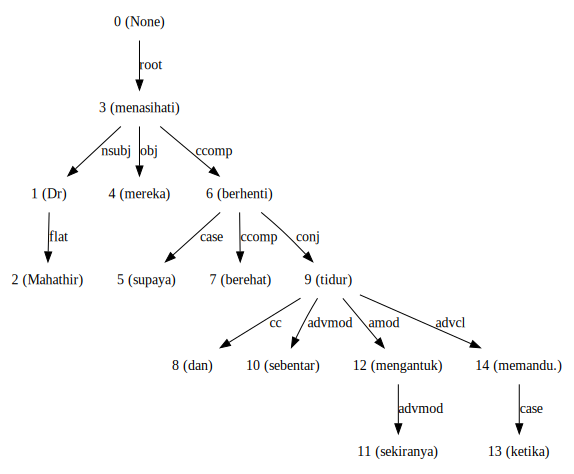
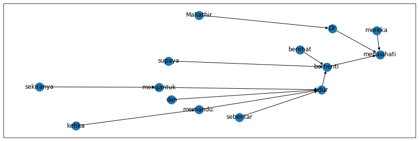

Dependency Parsing
==================

.. container:: alert alert-info

   This tutorial is available as an IPython notebook at
   `Malaya/example/dependency <https://github.com/huseinzol05/Malaya/tree/master/example/dependency>`__.

.. code:: ipython3

    %%time
    import malaya

.. parsed-literal::

    CPU times: user 5.37 s, sys: 955 ms, total: 6.33 s
    Wall time: 6.54 s

Describe supported dependencies
~~~~~~~~~~~~~~~~~~~~~~~~~~~~~~~

.. code:: ipython3

    malaya.dependency.describe()

.. raw:: html

    

    
    <table border="1" class="dataframe">
      <thead>
        <tr style="text-align: right;">
          <th></th>
          <th>Tag</th>
          <th>Description</th>
        </tr>
      </thead>
      <tbody>
        <tr>
          <th>0</th>
          <td>acl</td>
          <td>clausal modifier of noun</td>
        </tr>
        <tr>
          <th>1</th>
          <td>advcl</td>
          <td>adverbial clause modifier</td>
        </tr>
        <tr>
          <th>2</th>
          <td>advmod</td>
          <td>adverbial modifier</td>
        </tr>
        <tr>
          <th>3</th>
          <td>amod</td>
          <td>adjectival modifier</td>
        </tr>
        <tr>
          <th>4</th>
          <td>appos</td>
          <td>appositional modifier</td>
        </tr>
        <tr>
          <th>5</th>
          <td>aux</td>
          <td>auxiliary</td>
        </tr>
        <tr>
          <th>6</th>
          <td>case</td>
          <td>case marking</td>
        </tr>
        <tr>
          <th>7</th>
          <td>ccomp</td>
          <td>clausal complement</td>
        </tr>
        <tr>
          <th>8</th>
          <td>advmod</td>
          <td>adverbial modifier</td>
        </tr>
        <tr>
          <th>9</th>
          <td>compound</td>
          <td>compound</td>
        </tr>
        <tr>
          <th>10</th>
          <td>compound:plur</td>
          <td>plural compound</td>
        </tr>
        <tr>
          <th>11</th>
          <td>conj</td>
          <td>conjunct</td>
        </tr>
        <tr>
          <th>12</th>
          <td>cop</td>
          <td>cop</td>
        </tr>
        <tr>
          <th>13</th>
          <td>csubj</td>
          <td>clausal subject</td>
        </tr>
        <tr>
          <th>14</th>
          <td>dep</td>
          <td>dependent</td>
        </tr>
        <tr>
          <th>15</th>
          <td>det</td>
          <td>determiner</td>
        </tr>
        <tr>
          <th>16</th>
          <td>fixed</td>
          <td>multi-word expression</td>
        </tr>
        <tr>
          <th>17</th>
          <td>flat</td>
          <td>name</td>
        </tr>
        <tr>
          <th>18</th>
          <td>iobj</td>
          <td>indirect object</td>
        </tr>
        <tr>
          <th>19</th>
          <td>mark</td>
          <td>marker</td>
        </tr>
        <tr>
          <th>20</th>
          <td>nmod</td>
          <td>nominal modifier</td>
        </tr>
        <tr>
          <th>21</th>
          <td>nsubj</td>
          <td>nominal subject</td>
        </tr>
        <tr>
          <th>22</th>
          <td>obj</td>
          <td>direct object</td>
        </tr>
        <tr>
          <th>23</th>
          <td>parataxis</td>
          <td>parataxis</td>
        </tr>
        <tr>
          <th>24</th>
          <td>root</td>
          <td>root</td>
        </tr>
        <tr>
          <th>25</th>
          <td>xcomp</td>
          <td>open clausal complement</td>
        </tr>
      </tbody>
    </table>
    

.. code:: ipython3

    string = 'Dr Mahathir menasihati mereka supaya berhenti berehat dan tidur sebentar sekiranya mengantuk ketika memandu.'

List available transformer Dependency models
~~~~~~~~~~~~~~~~~~~~~~~~~~~~~~~~~~~~~~~~~~~~

.. code:: ipython3

    malaya.dependency.available_transformer()

.. raw:: html

    

    
    <table border="1" class="dataframe">
      <thead>
        <tr style="text-align: right;">
          <th></th>
          <th>Size (MB)</th>
          <th>Arc Accuracy</th>
          <th>Types Accuracy</th>
          <th>Root Accuracy</th>
        </tr>
      </thead>
      <tbody>
        <tr>
          <th>bert</th>
          <td>426.0</td>
          <td>0.855</td>
          <td>0.848</td>
          <td>0.920</td>
        </tr>
        <tr>
          <th>tiny-bert</th>
          <td>59.5</td>
          <td>0.718</td>
          <td>0.694</td>
          <td>0.886</td>
        </tr>
        <tr>
          <th>albert</th>
          <td>50.0</td>
          <td>0.811</td>
          <td>0.793</td>
          <td>0.879</td>
        </tr>
        <tr>
          <th>tiny-albert</th>
          <td>24.8</td>
          <td>0.708</td>
          <td>0.673</td>
          <td>0.817</td>
        </tr>
        <tr>
          <th>xlnet</th>
          <td>450.2</td>
          <td>0.931</td>
          <td>0.925</td>
          <td>0.947</td>
        </tr>
        <tr>
          <th>alxlnet</th>
          <td>50.0</td>
          <td>0.894</td>
          <td>0.886</td>
          <td>0.942</td>
        </tr>
      </tbody>
    </table>
    

Make sure you can check accuracy chart from here first before select a
model,
https://malaya.readthedocs.io/en/latest/Accuracy.html#dependency-parsing

**The best model in term of accuracy is XLNET**.

Load xlnet dependency model
~~~~~~~~~~~~~~~~~~~~~~~~~~~

.. code:: ipython3

    model = malaya.dependency.transformer(model = 'xlnet')

.. parsed-literal::

    WARNING:tensorflow:From /Users/huseinzolkepli/Documents/Malaya/malaya/function/__init__.py:54: The name tf.gfile.GFile is deprecated. Please use tf.io.gfile.GFile instead.
    
    WARNING:tensorflow:From /Users/huseinzolkepli/Documents/Malaya/malaya/function/__init__.py:55: The name tf.GraphDef is deprecated. Please use tf.compat.v1.GraphDef instead.
    
    WARNING:tensorflow:From /Users/huseinzolkepli/Documents/Malaya/malaya/function/__init__.py:49: The name tf.InteractiveSession is deprecated. Please use tf.compat.v1.InteractiveSession instead.
    

.. code:: ipython3

    d_object, tagging, indexing = model.predict(string)
    d_object.to_graphvis()

.. image:: load-dependency_files/load-dependency_11_0.svg

Voting stack model
~~~~~~~~~~~~~~~~~~

.. code:: ipython3

    alxlnet = malaya.dependency.transformer(model = 'alxlnet')
    tagging, indexing = malaya.stack.voting_stack([model, alxlnet, model], string)
    malaya.dependency.dependency_graph(tagging, indexing).to_graphvis()

.. parsed-literal::

    downloading frozen /Users/huseinzolkepli/Malaya/dependency/alxlnet/base model

.. parsed-literal::

    51.0MB [00:50, 1.01MB/s]                          

.. image:: load-dependency_files/load-dependency_13_2.svg

Dependency graph object
~~~~~~~~~~~~~~~~~~~~~~~

To initiate a dependency graph from dependency models, you need to call
``malaya.dependency.dependency_graph``.

.. code:: ipython3

    graph = malaya.dependency.dependency_graph(tagging, indexing)
    graph

.. parsed-literal::

    <malaya.function.parse_dependency.DependencyGraph at 0x164e67e90>

generate graphvis
^^^^^^^^^^^^^^^^^

.. code:: ipython3

    graph.to_graphvis()

Get nodes
^^^^^^^^^

.. code:: ipython3

    graph.nodes

.. parsed-literal::

    defaultdict(<function malaya.function.parse_dependency.DependencyGraph.__init__.<locals>.<lambda>()>,
                {0: {'address': 0,
                  'word': None,
                  'lemma': None,
                  'ctag': 'TOP',
                  'tag': 'TOP',
                  'feats': None,
                  'head': None,
                  'deps': defaultdict(list, {'root': [3]}),
                  'rel': None},
                 1: {'address': 1,
                  'word': 'Dr',
                  'lemma': '_',
                  'ctag': '_',
                  'tag': '_',
                  'feats': '_',
                  'head': 3,
                  'deps': defaultdict(list, {'flat': [2]}),
                  'rel': 'nsubj'},
                 3: {'address': 3,
                  'word': 'menasihati',
                  'lemma': '_',
                  'ctag': '_',
                  'tag': '_',
                  'feats': '_',
                  'head': 0,
                  'deps': defaultdict(list,
                              {'nsubj': [1], 'obj': [4], 'ccomp': [6]}),
                  'rel': 'root'},
                 2: {'address': 2,
                  'word': 'Mahathir',
                  'lemma': '_',
                  'ctag': '_',
                  'tag': '_',
                  'feats': '_',
                  'head': 1,
                  'deps': defaultdict(list, {}),
                  'rel': 'flat'},
                 4: {'address': 4,
                  'word': 'mereka',
                  'lemma': '_',
                  'ctag': '_',
                  'tag': '_',
                  'feats': '_',
                  'head': 3,
                  'deps': defaultdict(list, {}),
                  'rel': 'obj'},
                 5: {'address': 5,
                  'word': 'supaya',
                  'lemma': '_',
                  'ctag': '_',
                  'tag': '_',
                  'feats': '_',
                  'head': 6,
                  'deps': defaultdict(list, {}),
                  'rel': 'case'},
                 6: {'address': 6,
                  'word': 'berhenti',
                  'lemma': '_',
                  'ctag': '_',
                  'tag': '_',
                  'feats': '_',
                  'head': 3,
                  'deps': defaultdict(list,
                              {'case': [5], 'ccomp': [7], 'conj': [9]}),
                  'rel': 'ccomp'},
                 7: {'address': 7,
                  'word': 'berehat',
                  'lemma': '_',
                  'ctag': '_',
                  'tag': '_',
                  'feats': '_',
                  'head': 6,
                  'deps': defaultdict(list, {}),
                  'rel': 'ccomp'},
                 8: {'address': 8,
                  'word': 'dan',
                  'lemma': '_',
                  'ctag': '_',
                  'tag': '_',
                  'feats': '_',
                  'head': 9,
                  'deps': defaultdict(list, {}),
                  'rel': 'cc'},
                 9: {'address': 9,
                  'word': 'tidur',
                  'lemma': '_',
                  'ctag': '_',
                  'tag': '_',
                  'feats': '_',
                  'head': 6,
                  'deps': defaultdict(list,
                              {'cc': [8],
                               'advmod': [10],
                               'amod': [12],
                               'advcl': [14]}),
                  'rel': 'conj'},
                 10: {'address': 10,
                  'word': 'sebentar',
                  'lemma': '_',
                  'ctag': '_',
                  'tag': '_',
                  'feats': '_',
                  'head': 9,
                  'deps': defaultdict(list, {}),
                  'rel': 'advmod'},
                 11: {'address': 11,
                  'word': 'sekiranya',
                  'lemma': '_',
                  'ctag': '_',
                  'tag': '_',
                  'feats': '_',
                  'head': 12,
                  'deps': defaultdict(list, {}),
                  'rel': 'advmod'},
                 12: {'address': 12,
                  'word': 'mengantuk',
                  'lemma': '_',
                  'ctag': '_',
                  'tag': '_',
                  'feats': '_',
                  'head': 9,
                  'deps': defaultdict(list, {'advmod': [11]}),
                  'rel': 'amod'},
                 13: {'address': 13,
                  'word': 'ketika',
                  'lemma': '_',
                  'ctag': '_',
                  'tag': '_',
                  'feats': '_',
                  'head': 14,
                  'deps': defaultdict(list, {}),
                  'rel': 'case'},
                 14: {'address': 14,
                  'word': 'memandu.',
                  'lemma': '_',
                  'ctag': '_',
                  'tag': '_',
                  'feats': '_',
                  'head': 9,
                  'deps': defaultdict(list, {'case': [13]}),
                  'rel': 'advcl'}})

Flat the graph
^^^^^^^^^^^^^^

.. code:: ipython3

    list(graph.triples())

.. parsed-literal::

    [(('menasihati', '_'), 'nsubj', ('Dr', '_')),
     (('Dr', '_'), 'flat', ('Mahathir', '_')),
     (('menasihati', '_'), 'obj', ('mereka', '_')),
     (('menasihati', '_'), 'ccomp', ('berhenti', '_')),
     (('berhenti', '_'), 'case', ('supaya', '_')),
     (('berhenti', '_'), 'ccomp', ('berehat', '_')),
     (('berhenti', '_'), 'conj', ('tidur', '_')),
     (('tidur', '_'), 'cc', ('dan', '_')),
     (('tidur', '_'), 'advmod', ('sebentar', '_')),
     (('tidur', '_'), 'amod', ('mengantuk', '_')),
     (('mengantuk', '_'), 'advmod', ('sekiranya', '_')),
     (('tidur', '_'), 'advcl', ('memandu.', '_')),
     (('memandu.', '_'), 'case', ('ketika', '_'))]

Check the graph contains cycles
^^^^^^^^^^^^^^^^^^^^^^^^^^^^^^^

.. code:: ipython3

    graph.contains_cycle()

.. parsed-literal::

    False

Generate networkx
^^^^^^^^^^^^^^^^^

Make sure you already installed networkx,

.. code:: bash

   pip install networkx

.. code:: ipython3

    digraph = graph.to_networkx()
    digraph

.. parsed-literal::

    <networkx.classes.multidigraph.MultiDiGraph at 0x1a875a110>

.. code:: ipython3

    import networkx as nx
    import matplotlib.pyplot as plt
    nx.draw_networkx(digraph)
    plt.show()

.. parsed-literal::

    <Figure size 640x480 with 1 Axes>

.. code:: ipython3

    digraph.edges()

.. parsed-literal::

    OutMultiEdgeDataView([(1, 3), (2, 1), (4, 3), (5, 6), (6, 3), (7, 6), (8, 9), (9, 6), (10, 9), (11, 12), (12, 9), (13, 14), (14, 9)])

.. code:: ipython3

    digraph.nodes()

.. parsed-literal::

    NodeView((1, 2, 3, 4, 5, 6, 7, 8, 9, 10, 11, 12, 13, 14))

.. code:: ipython3

    labels = {i:graph.get_by_address(i)['word'] for i in digraph.nodes()}
    labels

.. parsed-literal::

    {1: 'Dr',
     2: 'Mahathir',
     3: 'menasihati',
     4: 'mereka',
     5: 'supaya',
     6: 'berhenti',
     7: 'berehat',
     8: 'dan',
     9: 'tidur',
     10: 'sebentar',
     11: 'sekiranya',
     12: 'mengantuk',
     13: 'ketika',
     14: 'memandu.'}

.. code:: ipython3

    plt.figure(figsize=(15,5))
    nx.draw_networkx(digraph,labels=labels)
    plt.show()

