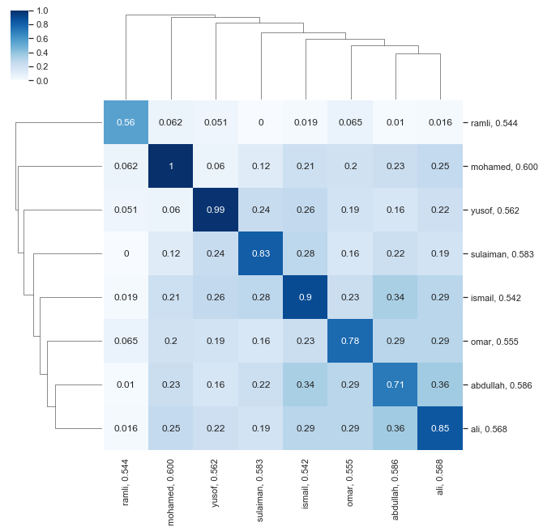

Why ELMO?
---------

ELMO is a new type of deep contextualized word representation of complex
word characteristics.

We are familiar with
`Word2Vec <https://malaya.readthedocs.io/en/latest/Word2vec.html>`__, it
is a really good approach to understand semantic definitions or synonym
of words, but problem with Word2Vec, any words that are not inside the
dictionary, it will treated as ``UNKNOWN`` token. We cannot capture all
the words for our language, it will consumed a lot of space and power to
calculate!

And we also familiar with
`Fast-text <https://malaya.readthedocs.io/en/latest/Fasttext.html>`__,
it’s designed to solve OOV(Out-of-Vocabulary) issue. But problem with
Fast-text, the semantic definitions are not really accurate because the
dictionary is Character N-gram based.

Good thing about ELMO, it learn to generalize word-based dictionary
based on character representation, combined with CNN + RNN, and boom, we
got ELMO!

You can read more about `ELMO
here <https://arxiv.org/abs/1802.05365>`__.

Pretrained ELMO
---------------

ELMO from wikipedia
^^^^^^^^^^^^^^^^^^^

`size-128, 700k unique
words <https://s3-ap-southeast-1.amazonaws.com/huseinhouse-storage/v20/elmo/elmo-128.pkl>`__

You will get a pickle file, contains
``['softmax_weight', 'dictionary']``.

To load that pickle file,

.. code:: python

   import pickle
   with open('file.pkl', 'rb') as fopen:
       elmo = pickle.load(fopen)

But this pickle cannot do much if you have out-of-vocab words!, so
better use ``malaya.elmo.load_wiki()``!

.. code:: ipython3

    %%time
    import malaya
    %matplotlib inline

.. parsed-literal::

    CPU times: user 12.8 s, sys: 1.58 s, total: 14.4 s
    Wall time: 18.2 s

Load malaya wikipedia ELMO
--------------------------

.. code:: ipython3

    %%time
    elmo = malaya.elmo.load_wiki()

.. parsed-literal::

    CPU times: user 9.66 s, sys: 3.37 s, total: 13 s
    Wall time: 14.6 s

Get embedding from a word
-------------------------

If you check `get embedding from
word2vec <https://malaya.readthedocs.io/en/latest/Word2vec.html#get-embedding-from-a-word>`__,
any word / string not included in the dictionary, it will throw
``Exception: input not found in dictionary``.

ELMO will never have this kind of problem, ELMO learn from characters
representations.

.. code:: ipython3

    elmo.get_vector_by_name('najib razak').shape

.. parsed-literal::

    (128,)

.. code:: ipython3

    elmo.get_vector_by_name('najib razak dengan mahathir').shape

.. parsed-literal::

    (128,)

But, we cannot put a string that contains more than 20 words, that’s
depends during training parameter session.

.. code:: ipython3

    elmo.get_vector_by_name('mahathir ' * 20).shape

::

    ---------------------------------------------------------------------------

    ValueError                                Traceback (most recent call last)

    <ipython-input-5-12b63ad9dd4a> in <module>
    ----> 1 elmo.get_vector_by_name('mahathir ' * 20).shape
    

    ~/Documents/Malaya/malaya/elmo.py in get_vector_by_name(self, string, mode_bidirectional, mode_sequence, text_cleaning)
        168             string = string.split()
        169             if len(string) >= 20:
    --> 170                 raise ValueError('input must have less than 20 words')
        171             string_reverse = string[:]
        172             string_reverse.reverse()

    ValueError: input must have less than 20 words

Check top-k similar semantics based on a word
---------------------------------------------

.. code:: ipython3

    word = 'anwar ibrahim'
    print("Embedding layer: 8 closest words to: '%s'"%(word))
    print(elmo.n_closest(word=word, num_closest=8, metric='cosine'))

.. parsed-literal::

    Embedding layer: 8 closest words to: 'anwar ibrahim'
    [['mohamed', 0.6042279005050659], ['ramli', 0.5735872983932495], ['yusof', 0.5597462058067322], ['sulaiman', 0.5592684149742126], ['omar', 0.55012446641922], ['ali', 0.5446622371673584], ['abdullah', 0.5382182002067566], ['kadir', 0.5373321175575256]]

Check batch top-k similar semantics based on a word
---------------------------------------------------

.. code:: ipython3

    words = ['anwar ibrahim', 'dr mahathir mohammad']
    elmo.batch_n_closest(words, num_closest = 8, return_similarity = True,
                        mode_sequence = 'last')

.. parsed-literal::

    [[('ibrahim', 0.5931666),
      ('mohamed', 0.57938087),
      ('omar', 0.54630095),
      ('ali', 0.52854496),
      ('abdullah', 0.5230521),
      ('yusof', 0.5169302),
      ('othman', 0.51660293),
      ('hussein', 0.50562495)],
     [('ibrahim', 0.60006213),
      ('omar', 0.5904051),
      ('yahya', 0.5790444),
      ('hassan', 0.57043797),
      ('abdullah', 0.56728643),
      ('harun', 0.56576926),
      ('hussin', 0.5632854),
      ('ali', 0.5622907)]]

.. code:: ipython3

    words = ['anwar ibrahim', 'dr mahathir mohammad']
    elmo.batch_n_closest(words, num_closest = 8, return_similarity = True,
                        mode_sequence = 'mean')

.. parsed-literal::

    [[('ibrahim', 0.6224059),
      ('mohamed', 0.5902999),
      ('abdullah', 0.57405645),
      ('ramli', 0.5661162),
      ('omar', 0.558924),
      ('sulaiman', 0.5572471),
      ('ali', 0.5569948),
      ('yusof', 0.55097383)],
     [('hashim', 0.5647713),
      ('omar', 0.5587351),
      ('ibrahim', 0.55244577),
      ('hassan', 0.545943),
      ('mohd', 0.54150975),
      ('din', 0.54006946),
      ('hussin', 0.5291501),
      ('ali', 0.52802)]]

Calculate vb - va + vc
----------------------

.. code:: ipython3

    print(elmo.analogy('anwar', 'penjara', 'kerajaan', 5, mode_sequence = 'last'))

.. parsed-literal::

    ['penjara', 'kerajaan', 'tentera', 'gaza', 'masyarakat']

Visualize scatter-plot
----------------------

.. code:: ipython3

    word = 'anwar ibrahim'
    result = elmo.n_closest(word=word, num_closest=8, metric='cosine')
    elmo.scatter_plot(result, centre = word, notebook_mode = True)

.. image:: load-elmo_files/load-elmo_18_0.png

Visualize tree-plot
-------------------

.. code:: ipython3

    word = 'anwar ibrahim'
    result = elmo.n_closest(word=word, num_closest=8, metric='cosine')
    elmo.tree_plot(result, notebook_mode = True)

.. parsed-literal::

    <Figure size 504x504 with 0 Axes>

