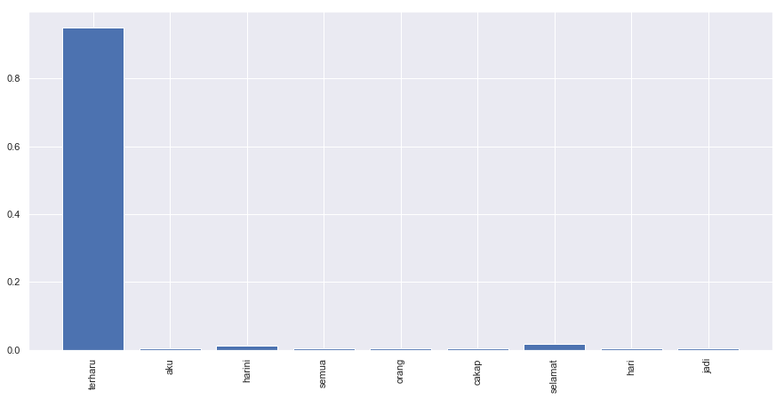
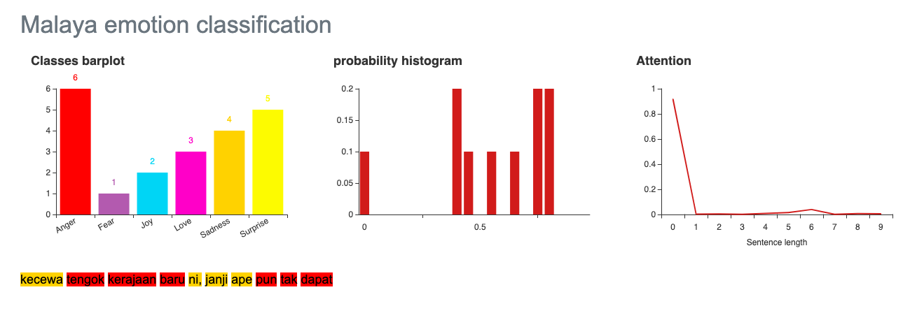

.. code:: ipython3

    %%time
    import malaya

.. parsed-literal::

    CPU times: user 11.5 s, sys: 819 ms, total: 12.3 s
    Wall time: 12.5 s

.. code:: ipython3

    anger_text = 'aku cukup tak suka budak gemuk tu'
    fear_text = 'saya takut dengan hantu'
    joy_text = 'gembiranya hari ni, dapat jumpa crush'
    love_text = 'saya terlalu cintakan dia'
    sadness_text = 'kawan rapat aku putuskan hubungan'
    surprise_text = 'terharu aku harini, semua orang cakap selamat hari jadi'

All models got ``get_proba`` parameters. If True, it will returned
probability every classes. Else, it will return highest probability
class. **Default is True.**

Load multinomial model
----------------------

.. code:: ipython3

    model = malaya.emotion.multinomial()
    print(model.predict(anger_text))
    print(model.predict(anger_text,get_proba=True))
    model.predict_batch([anger_text,
                        fear_text,
                        joy_text,
                        love_text,
                        sadness_text,
                        surprise_text])

.. parsed-literal::

    anger
    {'anger': 0.30367763926253094, 'fear': 0.16709964152193366, 'joy': 0.17026521921403184, 'love': 0.18405977732934192, 'sadness': 0.1388341895665479, 'surprise': 0.03606353310561458}

.. parsed-literal::

    ['anger', 'fear', 'joy', 'joy', 'sadness', 'fear']

Load xgb model
--------------

.. code:: ipython3

    model = malaya.emotion.xgb()
    print(model.predict(anger_text))
    print(model.predict(anger_text,get_proba=True))
    model.predict_batch([anger_text,
                        fear_text,
                        joy_text,
                        love_text,
                        sadness_text,
                        surprise_text],get_proba=True)

.. parsed-literal::

    love
    {'anger': 0.22918181, 'fear': 0.089252785, 'joy': 0.1318236, 'love': 0.46476611, 'sadness': 0.07200217, 'surprise': 0.012973559}

.. parsed-literal::

    [{'anger': 0.22918181,
      'fear': 0.089252785,
      'joy': 0.1318236,
      'love': 0.46476611,
      'sadness': 0.07200217,
      'surprise': 0.012973559},
     {'anger': 0.013483193,
      'fear': 0.939588,
      'joy': 0.01674833,
      'love': 0.003220023,
      'sadness': 0.022906518,
      'surprise': 0.0040539484},
     {'anger': 0.10506946,
      'fear': 0.025150253,
      'joy': 0.725915,
      'love': 0.05211037,
      'sadness': 0.078554265,
      'surprise': 0.013200594},
     {'anger': 0.11640434,
      'fear': 0.097485565,
      'joy': 0.24893147,
      'love': 0.25440857,
      'sadness': 0.2650988,
      'surprise': 0.01767122},
     {'anger': 0.27124837,
      'fear': 0.15662362,
      'joy': 0.131251,
      'love': 0.022184724,
      'sadness': 0.41255626,
      'surprise': 0.006135965},
     {'anger': 0.07513438,
      'fear': 0.2525073,
      'joy': 0.024355419,
      'love': 0.002638406,
      'sadness': 0.0059716892,
      'surprise': 0.6393928}]

List available deep learning models
-----------------------------------

.. code:: ipython3

    malaya.emotion.available_deep_model()

.. parsed-literal::

    ['fast-text',
     'hierarchical',
     'bahdanau',
     'luong',
     'bidirectional',
     'bert',
     'entity-network']

.. code:: ipython3

    for i in malaya.emotion.available_deep_model():
        print('Testing %s model'%(i))
        model = malaya.emotion.deep_model(i)
        print(model.predict(anger_text))
        print(model.predict_batch([anger_text,
                        fear_text,
                        joy_text,
                        love_text,
                        sadness_text,
                        surprise_text]))
        print(model.predict_batch([anger_text,
                        fear_text,
                        joy_text,
                        love_text,
                        sadness_text,
                        surprise_text], get_proba = True))
        print()

.. parsed-literal::

    Testing fast-text model
    love
    ['love', 'fear', 'joy', 'love', 'sadness', 'surprise']
    [{'anger': 2.538603e-07, 'fear': 4.1372344e-13, 'joy': 1.0892472e-08, 'love': 0.99999976, 'sadness': 3.8994935e-16, 'surprise': 2.439655e-08}, {'anger': 4.4489467e-24, 'fear': 1.0, 'joy': 1.3903143e-28, 'love': 1.7920514e-33, 'sadness': 1.01771616e-26, 'surprise': 6.799581e-18}, {'anger': 9.583714e-26, 'fear': 1.5029816e-24, 'joy': 1.0, 'love': 3.7527533e-13, 'sadness': 8.348174e-24, 'surprise': 2.080897e-16}, {'anger': 1.7409228e-13, 'fear': 3.2279754e-12, 'joy': 0.0005876841, 'love': 0.9994123, 'sadness': 1.8902605e-11, 'surprise': 9.9256076e-11}, {'anger': 1.2737708e-11, 'fear': 5.882562e-10, 'joy': 9.112171e-13, 'love': 7.7659496e-20, 'sadness': 1.0, 'surprise': 1.6035637e-16}, {'anger': 5.5730725e-37, 'fear': 0.16033638, 'joy': 1.2999706e-30, 'love': 0.0, 'sadness': 0.0, 'surprise': 0.8396636}]
    
    Testing hierarchical model
    anger
    ['anger', 'fear', 'joy', 'joy', 'sadness', 'joy']
    [{'anger': 0.2683842, 'fear': 0.3206215, 'joy': 0.17552154, 'love': 0.041160323, 'sadness': 0.1729689, 'surprise': 0.021343619}, {'anger': 0.006326744, 'fear': 0.97895914, 'joy': 0.01049677, 'love': 0.0004076402, 'sadness': 0.0026508307, 'surprise': 0.0011588057}, {'anger': 0.018994415, 'fear': 0.025846783, 'joy': 0.87117314, 'love': 0.039761506, 'sadness': 0.01727374, 'surprise': 0.026950512}, {'anger': 0.030335624, 'fear': 0.071699485, 'joy': 0.5445254, 'love': 0.24373391, 'sadness': 0.08821325, 'surprise': 0.021492302}, {'anger': 0.022141613, 'fear': 0.01158712, 'joy': 0.0046922215, 'love': 0.0013928033, 'sadness': 0.95863473, 'surprise': 0.0015515403}, {'anger': 0.028982855, 'fear': 0.15079749, 'joy': 0.4619698, 'love': 0.18604991, 'sadness': 0.009463493, 'surprise': 0.16273652}]
    
    Testing bahdanau model
    love
    ['anger', 'fear', 'joy', 'love', 'sadness', 'surprise']
    [{'anger': 0.4797056, 'fear': 0.168805, 'joy': 0.01420066, 'love': 0.25597632, 'sadness': 0.07191573, 'surprise': 0.009396704}, {'anger': 0.0008658771, 'fear': 0.9851621, 'joy': 0.0026717593, 'love': 0.00049689104, 'sadness': 0.0037894566, 'surprise': 0.007013949}, {'anger': 0.047901724, 'fear': 0.0058520515, 'joy': 0.6818599, 'love': 0.22279568, 'sadness': 0.010295693, 'surprise': 0.03129497}, {'anger': 0.0136362715, 'fear': 0.025698097, 'joy': 0.13118966, 'love': 0.75916684, 'sadness': 0.016278507, 'surprise': 0.05403061}, {'anger': 0.010733987, 'fear': 0.023202764, 'joy': 0.005261726, 'love': 0.00054325344, 'sadness': 0.9586973, 'surprise': 0.0015610264}, {'anger': 0.0028718843, 'fear': 0.21446393, 'joy': 0.034736242, 'love': 0.004341282, 'sadness': 0.001976919, 'surprise': 0.7416098}]
    
    Testing luong model
    love
    ['love', 'fear', 'joy', 'love', 'sadness', 'surprise']
    [{'anger': 0.0027926113, 'fear': 0.0042426162, 'joy': 0.6864444, 'love': 0.2944655, 'sadness': 0.0010767934, 'surprise': 0.010978072}, {'anger': 0.0057431706, 'fear': 0.9705748, 'joy': 0.0043815267, 'love': 0.0008089542, 'sadness': 0.009230111, 'surprise': 0.009261452}, {'anger': 0.0016454123, 'fear': 0.0012319328, 'joy': 0.87483215, 'love': 0.0678572, 'sadness': 0.010661957, 'surprise': 0.043771397}, {'anger': 0.016030224, 'fear': 0.005272452, 'joy': 0.04561528, 'love': 0.31633487, 'sadness': 0.59368426, 'surprise': 0.023062926}, {'anger': 0.0010896003, 'fear': 0.00057456765, 'joy': 4.035251e-05, 'love': 6.2987274e-05, 'sadness': 0.9982096, 'surprise': 2.283629e-05}, {'anger': 0.00042841653, 'fear': 0.33654872, 'joy': 0.00097602647, 'love': 0.00029422223, 'sadness': 0.00032926636, 'surprise': 0.6614233}]
    
    Testing bidirectional model
    love
    ['love', 'fear', 'anger', 'joy', 'sadness', 'surprise']
    [{'anger': 0.04017815, 'fear': 0.40091494, 'joy': 0.005757856, 'love': 0.44828272, 'sadness': 0.00045654154, 'surprise': 0.10440978}, {'anger': 0.0035579149, 'fear': 0.97265065, 'joy': 0.020677356, 'love': 0.000660097, 'sadness': 0.0010607935, 'surprise': 0.0013932855}, {'anger': 0.48268953, 'fear': 0.35196006, 'joy': 0.029008513, 'love': 0.014688243, 'sadness': 0.018093651, 'surprise': 0.10355998}, {'anger': 0.029928548, 'fear': 0.05067155, 'joy': 0.65202534, 'love': 0.10342105, 'sadness': 0.059337158, 'surprise': 0.10461627}, {'anger': 0.06666384, 'fear': 0.057405185, 'joy': 0.06833278, 'love': 0.0036288379, 'sadness': 0.79270375, 'surprise': 0.011265635}, {'anger': 2.1909349e-05, 'fear': 0.0034499653, 'joy': 1.994826e-06, 'love': 0.005034323, 'sadness': 1.7297366e-06, 'surprise': 0.99149007}]
    
    Testing bert model
    anger
    ['anger', 'anger', 'anger', 'anger', 'anger', 'anger']
    [{'anger': 0.79530007, 'fear': 0.043149363, 'joy': 0.050191555, 'love': 0.0028053583, 'sadness': 0.1083552, 'surprise': 0.0001983959}, {'anger': 0.7761929, 'fear': 0.02267685, 'joy': 0.08533038, 'love': 0.019361326, 'sadness': 0.09622978, 'surprise': 0.00020885638}, {'anger': 0.724599, 'fear': 0.021534633, 'joy': 0.14938025, 'love': 0.009412263, 'sadness': 0.09488238, 'surprise': 0.0001914676}, {'anger': 0.8217926, 'fear': 0.009756618, 'joy': 0.061514165, 'love': 0.03527268, 'sadness': 0.07142815, 'surprise': 0.00023569519}, {'anger': 0.9093987, 'fear': 0.00811897, 'joy': 0.024754424, 'love': 0.003218321, 'sadness': 0.054415427, 'surprise': 9.422473e-05}, {'anger': 0.9215124, 'fear': 0.009484482, 'joy': 0.023237498, 'love': 0.0027847919, 'sadness': 0.042906344, 'surprise': 7.447611e-05}]
    
    Testing entity-network model
    joy
    ['joy', 'sadness', 'joy', 'sadness', 'sadness', 'joy']
    [{'anger': 0.11245817, 'fear': 0.09678851, 'joy': 0.29964533, 'love': 0.07372399, 'sadness': 0.26239878, 'surprise': 0.15498528}, {'anger': 0.12070423, 'fear': 0.13202831, 'joy': 0.22073878, 'love': 0.031163175, 'sadness': 0.3202514, 'surprise': 0.175114}, {'anger': 0.11448454, 'fear': 0.10408847, 'joy': 0.2848294, 'love': 0.059466686, 'sadness': 0.27815202, 'surprise': 0.1589789}, {'anger': 0.12346853, 'fear': 0.15664044, 'joy': 0.17575133, 'love': 0.019622162, 'sadness': 0.33732292, 'surprise': 0.18719462}, {'anger': 0.117459856, 'fear': 0.115517266, 'joy': 0.25831792, 'love': 0.044844825, 'sadness': 0.2980614, 'surprise': 0.16579871}, {'anger': 0.11082334, 'fear': 0.09062623, 'joy': 0.30381778, 'love': 0.097978726, 'sadness': 0.24158238, 'surprise': 0.15517157}]
    

Unsupervised important words learning
-------------------------------------

.. code:: ipython3

    import matplotlib.pyplot as plt
    import seaborn as sns
    sns.set() # i just really like seaborn colors

We need to set ``get_proba`` become True to get the ‘attention’.

Visualizing bahdanau model
^^^^^^^^^^^^^^^^^^^^^^^^^^

.. code:: ipython3

    model = malaya.emotion.deep_model('bahdanau')
    result = model.predict(surprise_text, get_proba = True)['attention']
    
    plt.figure(figsize = (15, 7))
    labels = [r[0] for r in result]
    val = [r[1] for r in result]
    aranged = [i for i in range(len(labels))]
    plt.bar(aranged, val)
    plt.xticks(aranged, labels, rotation = 'vertical')
    plt.show()

Visualizing luong model
^^^^^^^^^^^^^^^^^^^^^^^

.. code:: ipython3

    model = malaya.emotion.deep_model('luong')
    result = model.predict(surprise_text, get_proba = True)['attention']
    
    plt.figure(figsize = (15, 7))
    labels = [r[0] for r in result]
    val = [r[1] for r in result]
    aranged = [i for i in range(len(labels))]
    plt.bar(aranged, val)
    plt.xticks(aranged, labels, rotation = 'vertical')
    plt.show()

Visualizing hierarchical model
^^^^^^^^^^^^^^^^^^^^^^^^^^^^^^

.. code:: ipython3

    model = malaya.emotion.deep_model('hierarchical')
    result = model.predict(surprise_text, get_proba=True)['attention']
    
    plt.figure(figsize = (15, 7))
    labels = [r[0] for r in result]
    val = [r[1] for r in result]
    aranged = [i for i in range(len(labels))]
    plt.bar(aranged, val)
    plt.xticks(aranged, labels, rotation = 'vertical')
    plt.show()

.. image:: load-emotion_files/load-emotion_18_0.png

Load Sparse deep learning models
--------------------------------

What happen if a word not included in the dictionary of the models? like
``setan``, what if ``setan`` appeared in text we want to classify? We
found this problem when classifying social media texts / posts. Words
used not really a vocabulary-based contextual.

Malaya will treat **unknown words** as ``<UNK>``, so, to solve this
problem, we need to use N-grams character based. Malaya chose tri-grams
until fifth-grams.

.. code:: python

   setan = ['set', 'eta', 'tan']

Sklearn provided easy interface to use n-grams, problem is, it is very
sparse, a lot of zeros and not memory efficient. Sklearn returned sparse
matrix for the result, lucky Tensorflow already provided some sparse
function.

.. code:: ipython3

    malaya.emotion.available_sparse_deep_model()

.. parsed-literal::

    ['fast-text-char']

Right now Malaya only provide 1 sparse model, ``fast-text-char``. We
will try to evolve it.

.. code:: ipython3

    sparse_model = malaya.emotion.sparse_deep_model()

.. parsed-literal::

    INFO:tensorflow:Restoring parameters from /Users/huseinzol/Malaya/emotion/fast-text-char/model.ckpt

.. code:: ipython3

    sparse_model.predict(sadness_text)

.. parsed-literal::

    'sadness'

.. code:: ipython3

    sparse_model.predict_batch([anger_text,
                        fear_text,
                        joy_text,
                        love_text,
                        sadness_text,
                        surprise_text])

.. parsed-literal::

    ['love', 'fear', 'joy', 'love', 'sadness', 'fear']

.. code:: ipython3

    sparse_model.predict_batch([anger_text,
                        fear_text,
                        joy_text,
                        love_text,
                        sadness_text,
                        surprise_text], get_proba = True)

.. parsed-literal::

    [{'anger': 0.07479232,
      'fear': 0.012134718,
      'joy': 0.034137156,
      'love': 0.85221285,
      'sadness': 0.006336733,
      'surprise': 0.020386234},
     {'anger': 1.6892743e-08,
      'fear': 0.99999964,
      'joy': 6.260633e-08,
      'love': 3.2111713e-10,
      'sadness': 3.542872e-08,
      'surprise': 2.2207877e-07},
     {'anger': 0.00012469916,
      'fear': 9.6892345e-06,
      'joy': 0.9917463,
      'love': 0.006561422,
      'sadness': 0.00040069615,
      'surprise': 0.0011572224},
     {'anger': 5.0021445e-05,
      'fear': 0.0010109642,
      'joy': 0.049688663,
      'love': 0.94577587,
      'sadness': 0.0032941191,
      'surprise': 0.00018034693},
     {'anger': 0.0010146926,
      'fear': 0.00020020001,
      'joy': 5.2909185e-05,
      'love': 2.640257e-06,
      'sadness': 0.99870074,
      'surprise': 2.8823646e-05},
     {'anger': 0.0057854424,
      'fear': 0.8317998,
      'joy': 0.017287944,
      'love': 0.008883897,
      'sadness': 0.0070799366,
      'surprise': 0.12916291}]

