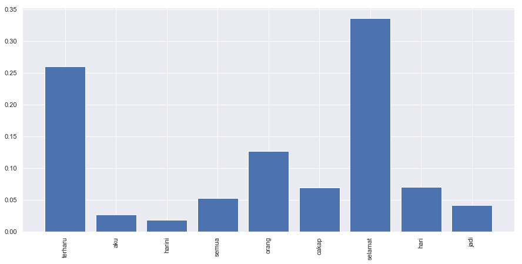

.. code:: ipython3

    %%time
    import malaya

.. parsed-literal::

    CPU times: user 3.84 s, sys: 564 ms, total: 4.41 s
    Wall time: 4.35 s

.. code:: ipython3

    anger_text = 'babi la company ni, aku dah la penat datang dari jauh'
    fear_text = 'takut doh tengok cerita hantu tadi'
    joy_text = 'bestnya dapat tidur harini, tak payah pergi kerja'
    love_text = 'aku sayang sgt dia dah doh'
    sadness_text = 'kecewa tengok kerajaan baru ni, janji ape pun tak dapat'
    surprise_text = 'sakit jantung aku, terkejut dengan cerita hantu tadi'

All models got ``get_proba`` parameters. If True, it will returned
probability every classes. Else, it will return highest probability
class. **Default is True.**

I suggest you to use BERT models to understand emotion, these models are
better for detecting emotions from social media.

Load multinomial model
----------------------

.. code:: ipython3

    model = malaya.emotion.multinomial()
    print(model.predict(anger_text))
    print(model.predict(anger_text,get_proba=True))
    model.predict_batch([anger_text,
                        fear_text,
                        joy_text,
                        love_text,
                        sadness_text,
                        surprise_text])

.. parsed-literal::

    sadness
    {'anger': 0.2783388656630603, 'fear': 0.0075400571793303155, 'joy': 0.1476835629123573, 'love': 0.11405594252487884, 'sadness': 0.4367800906755447, 'surprise': 0.015601481044831793}

.. parsed-literal::

    ['sadness', 'sadness', 'sadness', 'love', 'sadness', 'surprise']

Load xgb model
--------------

.. code:: ipython3

    model = malaya.emotion.xgb()
    print(model.predict(anger_text))
    print(model.predict(anger_text,get_proba=True))
    model.predict_batch([anger_text,
                        fear_text,
                        joy_text,
                        love_text,
                        sadness_text,
                        surprise_text],get_proba=True)

.. parsed-literal::

    anger
    {'anger': 0.9978795, 'fear': 9.978641e-05, 'joy': 0.00025914068, 'love': 0.00023505572, 'sadness': 0.001336072, 'surprise': 0.00019047104}

.. parsed-literal::

    [{'anger': 0.9978795,
      'fear': 9.978641e-05,
      'joy': 0.00025914068,
      'love': 0.00023505572,
      'sadness': 0.001336072,
      'surprise': 0.00019047104},
     {'anger': 0.0009182028,
      'fear': 0.9938689,
      'joy': 0.0006466028,
      'love': 0.0006217728,
      'sadness': 0.0034322464,
      'surprise': 0.0005122587},
     {'anger': 0.121579394,
      'fear': 0.010898398,
      'joy': 0.0679293,
      'love': 0.061627034,
      'sadness': 0.70120406,
      'surprise': 0.036761835},
     {'anger': 0.00063075585,
      'fear': 0.0001394003,
      'joy': 0.00041401104,
      'love': 0.9967757,
      'sadness': 0.001852509,
      'surprise': 0.00018767058},
     {'anger': 0.005961609,
      'fear': 0.0007963562,
      'joy': 0.00073812285,
      'love': 0.0011268321,
      'sadness': 0.9896236,
      'surprise': 0.0017534137},
     {'anger': 0.00033342876,
      'fear': 0.0005808544,
      'joy': 9.261517e-05,
      'love': 6.766275e-05,
      'sadness': 0.062978186,
      'surprise': 0.93594724}]

BERT model
----------

BERT is the best emotion model in term of accuracy, you can check
emotion accuracy here,
https://malaya.readthedocs.io/en/latest/Accuracy.html#emotion-analysis.
Question is, why BERT?

1. Transformer model learn the context of a word based on all of its
   surroundings (live string), bidirectionally. So it much better
   understand left and right hand side relationships.
2. Because of transformer able to leverage to context during live
   string, we dont need to capture available words in this world,
   instead capture substrings and build the attention after that. BERT
   will never have Out-Of-Vocab problem.

List available BERT models
--------------------------

.. code:: ipython3

    malaya.emotion.available_bert_model()

.. parsed-literal::

    ['multilanguage', 'base', 'small']

Load BERT models
----------------

.. code:: ipython3

    model = malaya.emotion.bert(model = 'base')

.. parsed-literal::

    WARNING: Logging before flag parsing goes to stderr.
    W0807 17:09:45.435723 4654429632 deprecation_wrapper.py:119] From /Users/huseinzol/Documents/Malaya/malaya/_utils/_utils.py:45: The name tf.gfile.GFile is deprecated. Please use tf.io.gfile.GFile instead.
    
    W0807 17:09:45.436901 4654429632 deprecation_wrapper.py:119] From /Users/huseinzol/Documents/Malaya/malaya/_utils/_utils.py:46: The name tf.GraphDef is deprecated. Please use tf.compat.v1.GraphDef instead.
    
    W0807 17:09:54.915079 4654429632 deprecation_wrapper.py:119] From /Users/huseinzol/Documents/Malaya/malaya/_utils/_utils.py:41: The name tf.InteractiveSession is deprecated. Please use tf.compat.v1.InteractiveSession instead.
    

Predict single string
^^^^^^^^^^^^^^^^^^^^^

.. code:: ipython3

    model.predict(anger_text,get_proba=True)

.. parsed-literal::

    {'anger': 0.9995183,
     'fear': 0.00017419625,
     'joy': 2.3122206e-05,
     'love': 0.00023385807,
     'sadness': 1.1843695e-05,
     'surprise': 3.8671737e-05}

Predict batch of strings
^^^^^^^^^^^^^^^^^^^^^^^^

.. code:: ipython3

    model.predict_batch([anger_text, fear_text, joy_text,
                        love_text, sadness_text, surprise_text],get_proba=True)

.. parsed-literal::

    [{'anger': 0.9995183,
      'fear': 0.00017419609,
      'joy': 2.3122226e-05,
      'love': 0.00023385829,
      'sadness': 1.1843717e-05,
      'surprise': 3.8671773e-05},
     {'anger': 1.5641068e-05,
      'fear': 0.9999746,
      'joy': 4.5618248e-07,
      'love': 4.5089317e-07,
      'sadness': 8.657858e-06,
      'surprise': 9.3441265e-08},
     {'anger': 0.3507574,
      'fear': 0.62003326,
      'joy': 0.0031742232,
      'love': 0.025879076,
      'sadness': 0.00010764296,
      'surprise': 4.8396298e-05},
     {'anger': 2.5379663e-08,
      'fear': 9.535107e-09,
      'joy': 4.0943105e-06,
      'love': 0.99999547,
      'sadness': 3.593608e-08,
      'surprise': 3.6860254e-07},
     {'anger': 3.586574e-08,
      'fear': 4.728145e-10,
      'joy': 4.6839768e-09,
      'love': 9.5798065e-08,
      'sadness': 0.9998424,
      'surprise': 0.00015748068},
     {'anger': 1.1578501e-05,
      'fear': 1.1245108e-05,
      'joy': 1.9180196e-05,
      'love': 2.3472696e-05,
      'sadness': 0.59861374,
      'surprise': 0.40132073}]

Open emotion visualization dashboard
^^^^^^^^^^^^^^^^^^^^^^^^^^^^^^^^^^^^

Default when you call ``predict_words`` it will open a browser with
visualization dashboard, you can disable by ``visualization=False``.

.. code:: ipython3

    model.predict_words(sadness_text)

.. code:: ipython3

    from IPython.core.display import Image, display
    
    display(Image('emotion-bert.png', width=800))

List available deep learning models
-----------------------------------

.. code:: ipython3

    malaya.emotion.available_deep_model()

.. parsed-literal::

    ['self-attention', 'bahdanau', 'luong']

Load deep learning models
-------------------------

Good thing about deep learning models from Malaya, it returns
``Attention`` result, means, which part of words give the high impact to
the results. But to get ``Attention``, you need to set
``get_proba=True``.

.. code:: ipython3

    import matplotlib.pyplot as plt
    import seaborn as sns
    sns.set()

.. code:: ipython3

    model = malaya.emotion.deep_model('bahdanau')

Predict single string
^^^^^^^^^^^^^^^^^^^^^

.. code:: ipython3

    model.predict(anger_text)

.. parsed-literal::

    'anger'

.. code:: ipython3

    result = model.predict(sadness_text,get_proba=True)
    result

.. parsed-literal::

    {'anger': 0.37485132,
     'fear': 0.00032864438,
     'joy': 1.5022197e-05,
     'love': 0.00061594445,
     'sadness': 0.6070886,
     'surprise': 0.017100457,
     'attention': {'kecewa': 0.9977679,
      'tengok': 0.0003109447,
      'kerajaan': 0.00026438202,
      'baru': 0.00031487268,
      'ni': 0.00021063162,
      ',': 0.0,
      'janji': 0.00028104617,
      'ape': 0.0002138007,
      'pun': 0.00020744104,
      'tak': 0.00022231438,
      'dapat': 0.00020670859}}

.. code:: ipython3

    plt.figure(figsize = (15, 5))
    keys = result['attention'].keys()
    values = result['attention'].values()
    aranged = [i for i in range(len(keys))]
    plt.bar(aranged, values)
    plt.xticks(aranged, keys, rotation = 'vertical')
    plt.show()

.. image:: load-emotion_files/load-emotion_27_0.png

Open emotion visualization dashboard
^^^^^^^^^^^^^^^^^^^^^^^^^^^^^^^^^^^^

Default when you call ``predict_words`` it will open a browser with
visualization dashboard, you can disable by ``visualization=False``.

.. code:: ipython3

    model.predict_words(sadness_text)

.. code:: ipython3

    from IPython.core.display import Image, display
    
    display(Image('emotion-bahdanau.png', width=800))

.. image:: load-emotion_files/load-emotion_30_0.png
   :width: 800px

Predict batch of strings
^^^^^^^^^^^^^^^^^^^^^^^^

.. code:: ipython3

    model.predict_batch([anger_text, fear_text, joy_text,
                        love_text, sadness_text, surprise_text],get_proba=True)

.. parsed-literal::

    [{'anger': 0.9698364,
      'fear': 0.0005593651,
      'joy': 7.586122e-06,
      'love': 6.342388e-05,
      'sadness': 0.0012171157,
      'surprise': 0.028316086},
     {'anger': 0.01627067,
      'fear': 0.98331857,
      'joy': 2.085193e-05,
      'love': 0.000109021596,
      'sadness': 0.00011855385,
      'surprise': 0.00016231627},
     {'anger': 0.6955227,
      'fear': 0.019949429,
      'joy': 0.0003242087,
      'love': 0.0029656421,
      'sadness': 0.24429333,
      'surprise': 0.03694471},
     {'anger': 0.014253476,
      'fear': 0.00040774103,
      'joy': 0.0020515865,
      'love': 0.9768023,
      'sadness': 0.001647722,
      'surprise': 0.0048371824},
     {'anger': 0.47867623,
      'fear': 0.0008374439,
      'joy': 4.5983707e-05,
      'love': 0.0014944059,
      'sadness': 0.50689435,
      'surprise': 0.012051674},
     {'anger': 0.030955592,
      'fear': 0.002918538,
      'joy': 0.0005409431,
      'love': 0.0005454879,
      'sadness': 0.3531333,
      'surprise': 0.6119062}]

**You might want to try ``luong`` and ``self-attention`` by yourself.**

Stacking models
---------------

More information, you can read at
https://malaya.readthedocs.io/en/latest/Stack.html

.. code:: ipython3

    multinomial = malaya.emotion.multinomial()
    xgb = malaya.emotion.xgb()

.. code:: ipython3

    malaya.stack.predict_stack([multinomial, xgb], anger_text)

.. parsed-literal::

    [{'anger': 0.5270186424918443,
      'fear': 0.0008674071997769519,
      'joy': 0.006186341331275944,
      'love': 0.005177789253535511,
      'sadness': 0.024157186192154973,
      'surprise': 0.0017238417196054668}]

.. code:: ipython3

    malaya.stack.predict_stack([multinomial, xgb], [anger_text, sadness_text])

.. parsed-literal::

    [{'anger': 0.5270186424918443,
      'fear': 0.0008674071997769519,
      'joy': 0.006186341331275944,
      'love': 0.005177789253535511,
      'sadness': 0.024157186192154973,
      'surprise': 0.0017238417196054668},
     {'anger': 0.03557488295072826,
      'fear': 0.0034467216292791546,
      'joy': 0.008254856407000835,
      'love': 0.010299470402616383,
      'sadness': 0.7530517475731497,
      'surprise': 0.004829871653663491}]

