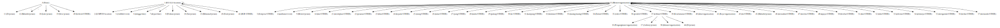

.. code:: ipython3

    %%time
    import malaya

.. parsed-literal::

    CPU times: user 11.9 s, sys: 1.48 s, total: 13.4 s
    Wall time: 17.4 s

List available deep learning NER models
---------------------------------------

.. code:: ipython3

    malaya.entity.available_deep_model()

.. parsed-literal::

    ['concat', 'bahdanau', 'luong', 'entity-network', 'attention']

Describe supported entities
---------------------------

.. code:: ipython3

    malaya.describe_entities()

.. parsed-literal::

    OTHER - Other
    law - law, regulation, related law documents, documents, etc
    location - location, place
    organization - organization, company, government, facilities, etc
    person - person, group of people, believes, etc
    quantity - numbers, quantity
    time - date, day, time, etc
    event - unique event happened, etc

.. code:: ipython3

    string = 'KUALA LUMPUR: Sempena sambutan Aidilfitri minggu depan, Perdana Menteri Tun Dr Mahathir Mohamad dan Menteri Pengangkutan Anthony Loke Siew Fook menitipkan pesanan khas kepada orang ramai yang mahu pulang ke kampung halaman masing-masing. Dalam video pendek terbitan Jabatan Keselamatan Jalan Raya (JKJR) itu, Dr Mahathir menasihati mereka supaya berhenti berehat dan tidur sebentar  sekiranya mengantuk ketika memandu.'

Load CRF model
--------------

.. code:: ipython3

    crf = malaya.entity.crf()
    crf.predict(string)

.. parsed-literal::

    [('kuala', 'location'),
     ('lumpur', 'location'),
     ('sempena', 'OTHER'),
     ('sambutan', 'event'),
     ('aidilfitri', 'event'),
     ('minggu', 'OTHER'),
     ('depan', 'OTHER'),
     ('perdana', 'person'),
     ('menteri', 'person'),
     ('tun', 'person'),
     ('dr', 'person'),
     ('mahathir', 'person'),
     ('mohamad', 'person'),
     ('dan', 'OTHER'),
     ('menteri', 'OTHER'),
     ('pengangkutan', 'OTHER'),
     ('anthony', 'person'),
     ('loke', 'person'),
     ('siew', 'person'),
     ('fook', 'person'),
     ('menitipkan', 'OTHER'),
     ('pesanan', 'OTHER'),
     ('khas', 'OTHER'),
     ('kepada', 'OTHER'),
     ('orang', 'OTHER'),
     ('ramai', 'OTHER'),
     ('yang', 'OTHER'),
     ('mahu', 'OTHER'),
     ('pulang', 'OTHER'),
     ('ke', 'OTHER'),
     ('kampung', 'location'),
     ('halaman', 'location'),
     ('masing-masing', 'OTHER'),
     ('dalam', 'OTHER'),
     ('video', 'OTHER'),
     ('pendek', 'OTHER'),
     ('terbitan', 'OTHER'),
     ('jabatan', 'organization'),
     ('keselamatan', 'organization'),
     ('jalan', 'organization'),
     ('raya', 'organization'),
     ('jkjr', 'organization'),
     ('itu', 'OTHER'),
     ('dr', 'person'),
     ('mahathir', 'person'),
     ('menasihati', 'OTHER'),
     ('mereka', 'OTHER'),
     ('supaya', 'OTHER'),
     ('berhenti', 'OTHER'),
     ('berehat', 'OTHER'),
     ('dan', 'OTHER'),
     ('tidur', 'OTHER'),
     ('sebentar', 'OTHER'),
     ('sekiranya', 'OTHER'),
     ('mengantuk', 'OTHER'),
     ('ketika', 'OTHER'),
     ('memandu', 'OTHER')]

Load Case-Sensitive CRF model
-----------------------------

.. code:: ipython3

    crf = malaya.entity.crf(sensitive = True)
    crf.predict(string)

.. parsed-literal::

    [('Kuala', 'location'),
     ('Lumpur', 'location'),
     ('Sempena', 'OTHER'),
     ('sambutan', 'OTHER'),
     ('Aidilfitri', 'event'),
     ('minggu', 'OTHER'),
     ('depan', 'OTHER'),
     ('Perdana', 'person'),
     ('Menteri', 'person'),
     ('Tun', 'person'),
     ('Dr', 'person'),
     ('Mahathir', 'person'),
     ('Mohamad', 'person'),
     ('dan', 'OTHER'),
     ('Menteri', 'organization'),
     ('Pengangkutan', 'organization'),
     ('Anthony', 'person'),
     ('Loke', 'person'),
     ('Siew', 'person'),
     ('Fook', 'person'),
     ('menitipkan', 'OTHER'),
     ('pesanan', 'OTHER'),
     ('khas', 'OTHER'),
     ('kepada', 'OTHER'),
     ('orang', 'OTHER'),
     ('ramai', 'OTHER'),
     ('yang', 'OTHER'),
     ('mahu', 'OTHER'),
     ('pulang', 'OTHER'),
     ('ke', 'OTHER'),
     ('kampung', 'location'),
     ('halaman', 'location'),
     ('masing-masing', 'OTHER'),
     ('Dalam', 'OTHER'),
     ('video', 'OTHER'),
     ('pendek', 'OTHER'),
     ('terbitan', 'OTHER'),
     ('Jabatan', 'organization'),
     ('Keselamatan', 'organization'),
     ('Jalan', 'organization'),
     ('Raya', 'organization'),
     ('Jkjr', 'organization'),
     ('itu', 'OTHER'),
     ('Dr', 'person'),
     ('Mahathir', 'person'),
     ('menasihati', 'OTHER'),
     ('mereka', 'OTHER'),
     ('supaya', 'OTHER'),
     ('berhenti', 'OTHER'),
     ('berehat', 'OTHER'),
     ('dan', 'OTHER'),
     ('tidur', 'OTHER'),
     ('sebentar', 'OTHER'),
     ('sekiranya', 'OTHER'),
     ('mengantuk', 'OTHER'),
     ('ketika', 'OTHER'),
     ('memandu', 'OTHER')]

Print important features from CRF model
---------------------------------------

.. code:: ipython3

    crf.print_features(10)

.. parsed-literal::

    Top-10 positive:
    14.340635 person   word:pengarah
    11.162717 person   prev_word:perbendaharaan
    10.906426 location word:dibuat-buat
    10.462828 person   word:berkelulusan
    9.680613 organization word:pas
    9.152880 person   word:Presidennya
    8.668067 OTHER    prev_word:bergabungnya
    8.637761 location word:Iran
    8.336057 person   word:dinaungi
    8.233552 person   word:Johan
    
    Top-10 negative:
    -5.274524 OTHER    prev_word:pelantikan
    -5.344889 OTHER    word:pembangkang
    -5.375710 OTHER    word:terminal
    -5.699221 person   is_numeric
    -5.855398 organization suffix-3:ari
    -6.036876 OTHER    word:memintanya
    -6.082631 OTHER    word:pengasuhnya
    -6.278501 person   next_word-prefix-2:Kp
    -6.818189 OTHER    prefix-3:di-
    -7.422581 person   suffix-3:ada

Print important transitions from CRF Model
------------------------------------------

.. code:: ipython3

    crf.print_transitions(10)

.. parsed-literal::

    Top-10 likely transitions:
    OTHER  -> OTHER   4.720173
    organization -> organization 4.512877
    event  -> event   4.286578
    quantity -> quantity 4.244444
    person -> person  4.099601
    location -> location 4.051204
    law    -> law     3.888215
    time   -> time    2.618322
    OTHER  -> location 0.361435
    OTHER  -> person  0.255809
    
    Top-10 unlikely transitions:
    organization -> event   -4.005846
    quantity -> location -4.030371
    law    -> organization -4.154642
    time   -> person  -4.226871
    quantity -> organization -4.251120
    person -> law     -4.379608
    law    -> time    -4.421451
    organization -> time    -4.700082
    time   -> quantity -7.386138
    quantity -> time    -7.824427

Load deep learning models
-------------------------

.. code:: ipython3

    for i in malaya.entity.available_deep_model():
        print('Testing %s model'%(i))
        model = malaya.entity.deep_model(i)
        print(model.predict(string))
        print()

.. parsed-literal::

    Testing concat model
    [('kuala', 'location'), ('lumpur', 'location'), ('sempena', 'OTHER'), ('sambutan', 'event'), ('aidilfitri', 'event'), ('minggu', 'time'), ('depan', 'time'), ('perdana', 'person'), ('menteri', 'person'), ('tun', 'person'), ('dr', 'person'), ('mahathir', 'person'), ('mohamad', 'person'), ('dan', 'OTHER'), ('menteri', 'OTHER'), ('pengangkutan', 'OTHER'), ('anthony', 'person'), ('loke', 'person'), ('siew', 'person'), ('fook', 'person'), ('menitipkan', 'OTHER'), ('pesanan', 'OTHER'), ('khas', 'OTHER'), ('kepada', 'OTHER'), ('orang', 'OTHER'), ('ramai', 'OTHER'), ('yang', 'OTHER'), ('mahu', 'OTHER'), ('pulang', 'OTHER'), ('ke', 'OTHER'), ('kampung', 'location'), ('halaman', 'location'), ('masing-masing', 'OTHER'), ('dalam', 'OTHER'), ('video', 'OTHER'), ('pendek', 'OTHER'), ('terbitan', 'OTHER'), ('jabatan', 'OTHER'), ('keselamatan', 'OTHER'), ('jalan', 'location'), ('raya', 'organization'), ('jkjr', 'event'), ('itu', 'OTHER'), ('dr', 'person'), ('mahathir', 'person'), ('menasihati', 'OTHER'), ('mereka', 'OTHER'), ('supaya', 'OTHER'), ('berhenti', 'OTHER'), ('berehat', 'OTHER'), ('dan', 'OTHER'), ('tidur', 'OTHER'), ('sebentar', 'OTHER'), ('sekiranya', 'OTHER'), ('mengantuk', 'OTHER'), ('ketika', 'OTHER'), ('memandu', 'OTHER')]
    
    Testing bahdanau model
    [('kuala', 'location'), ('lumpur', 'location'), ('sempena', 'OTHER'), ('sambutan', 'event'), ('aidilfitri', 'event'), ('minggu', 'time'), ('depan', 'OTHER'), ('perdana', 'person'), ('menteri', 'person'), ('tun', 'person'), ('dr', 'person'), ('mahathir', 'person'), ('mohamad', 'person'), ('dan', 'OTHER'), ('menteri', 'organization'), ('pengangkutan', 'organization'), ('anthony', 'person'), ('loke', 'person'), ('siew', 'person'), ('fook', 'person'), ('menitipkan', 'OTHER'), ('pesanan', 'OTHER'), ('khas', 'OTHER'), ('kepada', 'OTHER'), ('orang', 'OTHER'), ('ramai', 'OTHER'), ('yang', 'OTHER'), ('mahu', 'OTHER'), ('pulang', 'OTHER'), ('ke', 'OTHER'), ('kampung', 'OTHER'), ('halaman', 'OTHER'), ('masing-masing', 'OTHER'), ('dalam', 'OTHER'), ('video', 'OTHER'), ('pendek', 'OTHER'), ('terbitan', 'OTHER'), ('jabatan', 'OTHER'), ('keselamatan', 'OTHER'), ('jalan', 'organization'), ('raya', 'organization'), ('jkjr', 'OTHER'), ('itu', 'OTHER'), ('dr', 'person'), ('mahathir', 'person'), ('menasihati', 'OTHER'), ('mereka', 'OTHER'), ('supaya', 'OTHER'), ('berhenti', 'OTHER'), ('berehat', 'OTHER'), ('dan', 'OTHER'), ('tidur', 'OTHER'), ('sebentar', 'OTHER'), ('sekiranya', 'OTHER'), ('mengantuk', 'OTHER'), ('ketika', 'OTHER'), ('memandu', 'OTHER')]
    
    Testing luong model
    [('kuala', 'location'), ('lumpur', 'location'), ('sempena', 'OTHER'), ('sambutan', 'event'), ('aidilfitri', 'event'), ('minggu', 'time'), ('depan', 'time'), ('perdana', 'person'), ('menteri', 'person'), ('tun', 'person'), ('dr', 'person'), ('mahathir', 'person'), ('mohamad', 'person'), ('dan', 'OTHER'), ('menteri', 'OTHER'), ('pengangkutan', 'person'), ('anthony', 'person'), ('loke', 'person'), ('siew', 'person'), ('fook', 'person'), ('menitipkan', 'OTHER'), ('pesanan', 'OTHER'), ('khas', 'OTHER'), ('kepada', 'OTHER'), ('orang', 'OTHER'), ('ramai', 'OTHER'), ('yang', 'OTHER'), ('mahu', 'OTHER'), ('pulang', 'OTHER'), ('ke', 'OTHER'), ('kampung', 'OTHER'), ('halaman', 'OTHER'), ('masing-masing', 'OTHER'), ('dalam', 'OTHER'), ('video', 'OTHER'), ('pendek', 'OTHER'), ('terbitan', 'OTHER'), ('jabatan', 'OTHER'), ('keselamatan', 'OTHER'), ('jalan', 'organization'), ('raya', 'organization'), ('jkjr', 'person'), ('itu', 'OTHER'), ('dr', 'person'), ('mahathir', 'person'), ('menasihati', 'OTHER'), ('mereka', 'OTHER'), ('supaya', 'OTHER'), ('berhenti', 'OTHER'), ('berehat', 'OTHER'), ('dan', 'OTHER'), ('tidur', 'OTHER'), ('sebentar', 'OTHER'), ('sekiranya', 'OTHER'), ('mengantuk', 'OTHER'), ('ketika', 'OTHER'), ('memandu', 'OTHER')]
    
    Testing entity-network model
    [('kuala', 'location'), ('lumpur', 'location'), ('sempena', 'OTHER'), ('sambutan', 'OTHER'), ('aidilfitri', 'event'), ('minggu', 'event'), ('depan', 'OTHER'), ('perdana', 'OTHER'), ('menteri', 'OTHER'), ('tun', 'person'), ('dr', 'person'), ('mahathir', 'person'), ('mohamad', 'person'), ('dan', 'OTHER'), ('menteri', 'OTHER'), ('pengangkutan', 'OTHER'), ('anthony', 'person'), ('loke', 'person'), ('siew', 'person'), ('fook', 'person'), ('menitipkan', 'event'), ('pesanan', 'event'), ('khas', 'event'), ('kepada', 'OTHER'), ('orang', 'person'), ('ramai', 'OTHER'), ('yang', 'OTHER'), ('mahu', 'OTHER'), ('pulang', 'OTHER'), ('ke', 'OTHER'), ('kampung', 'OTHER'), ('halaman', 'OTHER'), ('masing-masing', 'OTHER'), ('dalam', 'OTHER'), ('video', 'OTHER'), ('pendek', 'OTHER'), ('terbitan', 'OTHER'), ('jabatan', 'organization'), ('keselamatan', 'organization'), ('jalan', 'organization'), ('raya', 'organization'), ('jkjr', 'organization'), ('itu', 'OTHER'), ('dr', 'person'), ('mahathir', 'person'), ('menasihati', 'OTHER'), ('mereka', 'OTHER'), ('supaya', 'OTHER'), ('berhenti', 'OTHER'), ('berehat', 'OTHER'), ('dan', 'OTHER'), ('tidur', 'OTHER'), ('sebentar', 'OTHER'), ('sekiranya', 'OTHER'), ('mengantuk', 'OTHER'), ('ketika', 'OTHER'), ('memandu', 'OTHER')]
    
    Testing attention model
    [('kuala', 'location'), ('lumpur', 'location'), ('sempena', 'OTHER'), ('sambutan', 'event'), ('aidilfitri', 'event'), ('minggu', 'event'), ('depan', 'OTHER'), ('perdana', 'person'), ('menteri', 'OTHER'), ('tun', 'person'), ('dr', 'person'), ('mahathir', 'person'), ('mohamad', 'person'), ('dan', 'OTHER'), ('menteri', 'OTHER'), ('pengangkutan', 'organization'), ('anthony', 'person'), ('loke', 'person'), ('siew', 'person'), ('fook', 'person'), ('menitipkan', 'OTHER'), ('pesanan', 'OTHER'), ('khas', 'OTHER'), ('kepada', 'OTHER'), ('orang', 'OTHER'), ('ramai', 'OTHER'), ('yang', 'OTHER'), ('mahu', 'OTHER'), ('pulang', 'OTHER'), ('ke', 'OTHER'), ('kampung', 'location'), ('halaman', 'location'), ('masing-masing', 'OTHER'), ('dalam', 'OTHER'), ('video', 'OTHER'), ('pendek', 'OTHER'), ('terbitan', 'OTHER'), ('jabatan', 'organization'), ('keselamatan', 'OTHER'), ('jalan', 'organization'), ('raya', 'organization'), ('jkjr', 'organization'), ('itu', 'OTHER'), ('dr', 'person'), ('mahathir', 'person'), ('menasihati', 'OTHER'), ('mereka', 'OTHER'), ('supaya', 'OTHER'), ('berhenti', 'OTHER'), ('berehat', 'OTHER'), ('dan', 'OTHER'), ('tidur', 'OTHER'), ('sebentar', 'OTHER'), ('sekiranya', 'OTHER'), ('mengantuk', 'OTHER'), ('ketika', 'OTHER'), ('memandu', 'OTHER')]
    

Load Case-Sensitive deep learning models
----------------------------------------

.. code:: ipython3

    for i in malaya.entity.available_deep_model():
        print('Testing %s model'%(i))
        model = malaya.entity.deep_model(i, sensitive = True)
        print(model.predict(string))
        print()

.. parsed-literal::

    Testing concat model
    [('Kuala', 'location'), ('Lumpur', 'location'), ('Sempena', 'OTHER'), ('sambutan', 'time'), ('Aidilfitri', 'time'), ('minggu', 'OTHER'), ('depan', 'OTHER'), ('Perdana', 'person'), ('Menteri', 'person'), ('Tun', 'person'), ('Dr', 'person'), ('Mahathir', 'person'), ('Mohamad', 'person'), ('dan', 'OTHER'), ('Menteri', 'person'), ('Pengangkutan', 'person'), ('Anthony', 'person'), ('Loke', 'person'), ('Siew', 'person'), ('Fook', 'person'), ('menitipkan', 'OTHER'), ('pesanan', 'person'), ('khas', 'OTHER'), ('kepada', 'OTHER'), ('orang', 'person'), ('ramai', 'OTHER'), ('yang', 'OTHER'), ('mahu', 'OTHER'), ('pulang', 'OTHER'), ('ke', 'OTHER'), ('kampung', 'location'), ('halaman', 'OTHER'), ('masing-masing', 'OTHER'), ('Dalam', 'OTHER'), ('video', 'OTHER'), ('pendek', 'OTHER'), ('terbitan', 'OTHER'), ('Jabatan', 'organization'), ('Keselamatan', 'organization'), ('Jalan', 'organization'), ('Raya', 'law'), ('Jkjr', 'time'), ('itu', 'time'), ('Dr', 'person'), ('Mahathir', 'person'), ('menasihati', 'OTHER'), ('mereka', 'OTHER'), ('supaya', 'OTHER'), ('berhenti', 'OTHER'), ('berehat', 'OTHER'), ('dan', 'OTHER'), ('tidur', 'OTHER'), ('sebentar', 'OTHER'), ('sekiranya', 'OTHER'), ('mengantuk', 'OTHER'), ('ketika', 'OTHER'), ('memandu', 'OTHER')]
    
    Testing bahdanau model
    [('Kuala', 'location'), ('Lumpur', 'location'), ('Sempena', 'OTHER'), ('sambutan', 'OTHER'), ('Aidilfitri', 'event'), ('minggu', 'time'), ('depan', 'OTHER'), ('Perdana', 'person'), ('Menteri', 'person'), ('Tun', 'person'), ('Dr', 'person'), ('Mahathir', 'person'), ('Mohamad', 'person'), ('dan', 'OTHER'), ('Menteri', 'person'), ('Pengangkutan', 'person'), ('Anthony', 'person'), ('Loke', 'person'), ('Siew', 'person'), ('Fook', 'person'), ('menitipkan', 'OTHER'), ('pesanan', 'OTHER'), ('khas', 'OTHER'), ('kepada', 'OTHER'), ('orang', 'OTHER'), ('ramai', 'OTHER'), ('yang', 'OTHER'), ('mahu', 'OTHER'), ('pulang', 'OTHER'), ('ke', 'OTHER'), ('kampung', 'person'), ('halaman', 'person'), ('masing-masing', 'OTHER'), ('Dalam', 'OTHER'), ('video', 'OTHER'), ('pendek', 'OTHER'), ('terbitan', 'OTHER'), ('Jabatan', 'organization'), ('Keselamatan', 'organization'), ('Jalan', 'organization'), ('Raya', 'organization'), ('Jkjr', 'organization'), ('itu', 'OTHER'), ('Dr', 'person'), ('Mahathir', 'person'), ('menasihati', 'OTHER'), ('mereka', 'OTHER'), ('supaya', 'OTHER'), ('berhenti', 'OTHER'), ('berehat', 'OTHER'), ('dan', 'OTHER'), ('tidur', 'OTHER'), ('sebentar', 'OTHER'), ('sekiranya', 'OTHER'), ('mengantuk', 'OTHER'), ('ketika', 'OTHER'), ('memandu', 'OTHER')]
    
    Testing luong model
    [('Kuala', 'location'), ('Lumpur', 'location'), ('Sempena', 'OTHER'), ('sambutan', 'OTHER'), ('Aidilfitri', 'event'), ('minggu', 'OTHER'), ('depan', 'OTHER'), ('Perdana', 'person'), ('Menteri', 'person'), ('Tun', 'person'), ('Dr', 'person'), ('Mahathir', 'person'), ('Mohamad', 'person'), ('dan', 'OTHER'), ('Menteri', 'person'), ('Pengangkutan', 'person'), ('Anthony', 'person'), ('Loke', 'person'), ('Siew', 'person'), ('Fook', 'person'), ('menitipkan', 'OTHER'), ('pesanan', 'OTHER'), ('khas', 'OTHER'), ('kepada', 'OTHER'), ('orang', 'OTHER'), ('ramai', 'OTHER'), ('yang', 'OTHER'), ('mahu', 'OTHER'), ('pulang', 'OTHER'), ('ke', 'OTHER'), ('kampung', 'OTHER'), ('halaman', 'OTHER'), ('masing-masing', 'OTHER'), ('Dalam', 'OTHER'), ('video', 'OTHER'), ('pendek', 'OTHER'), ('terbitan', 'OTHER'), ('Jabatan', 'organization'), ('Keselamatan', 'organization'), ('Jalan', 'organization'), ('Raya', 'organization'), ('Jkjr', 'organization'), ('itu', 'OTHER'), ('Dr', 'person'), ('Mahathir', 'person'), ('menasihati', 'OTHER'), ('mereka', 'OTHER'), ('supaya', 'OTHER'), ('berhenti', 'OTHER'), ('berehat', 'OTHER'), ('dan', 'OTHER'), ('tidur', 'OTHER'), ('sebentar', 'OTHER'), ('sekiranya', 'OTHER'), ('mengantuk', 'OTHER'), ('ketika', 'OTHER'), ('memandu', 'OTHER')]
    
    Testing entity-network model
    [('Kuala', 'location'), ('Lumpur', 'location'), ('Sempena', 'OTHER'), ('sambutan', 'OTHER'), ('Aidilfitri', 'event'), ('minggu', 'OTHER'), ('depan', 'OTHER'), ('Perdana', 'OTHER'), ('Menteri', 'OTHER'), ('Tun', 'person'), ('Dr', 'person'), ('Mahathir', 'person'), ('Mohamad', 'person'), ('dan', 'OTHER'), ('Menteri', 'OTHER'), ('Pengangkutan', 'person'), ('Anthony', 'person'), ('Loke', 'person'), ('Siew', 'person'), ('Fook', 'person'), ('menitipkan', 'person'), ('pesanan', 'OTHER'), ('khas', 'OTHER'), ('kepada', 'OTHER'), ('orang', 'person'), ('ramai', 'person'), ('yang', 'OTHER'), ('mahu', 'OTHER'), ('pulang', 'OTHER'), ('ke', 'OTHER'), ('kampung', 'OTHER'), ('halaman', 'location'), ('masing-masing', 'OTHER'), ('Dalam', 'OTHER'), ('video', 'OTHER'), ('pendek', 'OTHER'), ('terbitan', 'OTHER'), ('Jabatan', 'organization'), ('Keselamatan', 'organization'), ('Jalan', 'organization'), ('Raya', 'organization'), ('Jkjr', 'organization'), ('itu', 'OTHER'), ('Dr', 'person'), ('Mahathir', 'person'), ('menasihati', 'OTHER'), ('mereka', 'OTHER'), ('supaya', 'OTHER'), ('berhenti', 'OTHER'), ('berehat', 'OTHER'), ('dan', 'OTHER'), ('tidur', 'OTHER'), ('sebentar', 'OTHER'), ('sekiranya', 'OTHER'), ('mengantuk', 'OTHER'), ('ketika', 'OTHER'), ('memandu', 'OTHER')]
    
    Testing attention model
    [('Kuala', 'person'), ('Lumpur', 'person'), ('Sempena', 'OTHER'), ('sambutan', 'OTHER'), ('Aidilfitri', 'time'), ('minggu', 'time'), ('depan', 'time'), ('Perdana', 'person'), ('Menteri', 'person'), ('Tun', 'person'), ('Dr', 'person'), ('Mahathir', 'person'), ('Mohamad', 'person'), ('dan', 'OTHER'), ('Menteri', 'OTHER'), ('Pengangkutan', 'OTHER'), ('Anthony', 'person'), ('Loke', 'person'), ('Siew', 'person'), ('Fook', 'person'), ('menitipkan', 'OTHER'), ('pesanan', 'OTHER'), ('khas', 'OTHER'), ('kepada', 'OTHER'), ('orang', 'OTHER'), ('ramai', 'OTHER'), ('yang', 'OTHER'), ('mahu', 'OTHER'), ('pulang', 'OTHER'), ('ke', 'OTHER'), ('kampung', 'OTHER'), ('halaman', 'OTHER'), ('masing-masing', 'OTHER'), ('Dalam', 'OTHER'), ('video', 'OTHER'), ('pendek', 'OTHER'), ('terbitan', 'OTHER'), ('Jabatan', 'event'), ('Keselamatan', 'event'), ('Jalan', 'event'), ('Raya', 'event'), ('Jkjr', 'event'), ('itu', 'OTHER'), ('Dr', 'person'), ('Mahathir', 'person'), ('menasihati', 'OTHER'), ('mereka', 'OTHER'), ('supaya', 'OTHER'), ('berhenti', 'OTHER'), ('berehat', 'OTHER'), ('dan', 'OTHER'), ('tidur', 'OTHER'), ('sebentar', 'OTHER'), ('sekiranya', 'OTHER'), ('mengantuk', 'OTHER'), ('ketika', 'OTHER'), ('memandu', 'OTHER')]
    

Print important features from deep learning model
-------------------------------------------------

.. code:: ipython3

    bahdanau = malaya.entity.deep_model('bahdanau')
    bahdanau.print_features(10)

.. parsed-literal::

    Top-10 positive:
    made: 4.456522
    effendi: 3.826650
    dipo: 3.723355
    djamil: 3.653246
    noorfadila: 3.638877
    ahad: 3.611547
    kinabalu: 3.601939
    yorrys: 3.546461
    2008: 3.510597
    ustaz: 3.450228
    
    Top-10 negative:
    memilih: -3.813004
    gentar: -3.738811
    kenalan: -3.586572
    melanjutkan: -3.510132
    istilah: -3.410603
    seusai: -3.405963
    kepolisian: -3.371908
    perwira: -3.364473
    padi: -3.242083
    perusahaan: -3.196474

Print important transitions from deep learning model
----------------------------------------------------

.. code:: ipython3

    bahdanau.print_transitions(10)

.. parsed-literal::

    Top-10 likely transitions:
    quantity -> quantity: 0.768479
    law -> law: 0.748858
    event -> event: 0.671466
    time -> time: 0.566861
    quantity -> PAD: 0.515885
    organization -> time: 0.430649
    PAD -> law: 0.396928
    time -> person: 0.387298
    time -> organization: 0.380183
    OTHER -> time: 0.346963
    
    Top-10 unlikely transitions:
    person -> law: -0.959066
    law -> person: -0.763240
    event -> organization: -0.744430
    person -> event: -0.647477
    time -> event: -0.640794
    law -> OTHER: -0.634643
    organization -> event: -0.629229
    organization -> OTHER: -0.606970
    OTHER -> law: -0.598875
    OTHER -> event: -0.598665

Visualize output alignment from attention
-----------------------------------------

This visualization only can call from ``bahdanau`` or ``luong`` model.

.. code:: ipython3

    d_object, predicted, state_fw, state_bw = bahdanau.get_alignment(string)

.. code:: ipython3

    d_object.to_graphvis()

Voting stack model
------------------

.. code:: ipython3

    entity_network = malaya.entity.deep_model('entity-network')
    bahdanau = malaya.entity.deep_model('bahdanau')
    luong = malaya.entity.deep_model('luong')
    malaya.stack.voting_stack([entity_network, bahdanau, luong], string)

.. parsed-literal::

    [('kuala', 'location'),
     ('lumpur', 'location'),
     ('sempena', 'OTHER'),
     ('sambutan', 'event'),
     ('aidilfitri', 'event'),
     ('minggu', 'time'),
     ('depan', 'time'),
     ('perdana', 'person'),
     ('menteri', 'person'),
     ('tun', 'person'),
     ('dr', 'person'),
     ('mahathir', 'person'),
     ('mohamad', 'person'),
     ('dan', 'OTHER'),
     ('menteri', 'OTHER'),
     ('pengangkutan', 'OTHER'),
     ('anthony', 'person'),
     ('loke', 'person'),
     ('siew', 'person'),
     ('fook', 'person'),
     ('menitipkan', 'OTHER'),
     ('pesanan', 'OTHER'),
     ('khas', 'OTHER'),
     ('kepada', 'OTHER'),
     ('orang', 'OTHER'),
     ('ramai', 'OTHER'),
     ('yang', 'OTHER'),
     ('mahu', 'OTHER'),
     ('pulang', 'OTHER'),
     ('ke', 'OTHER'),
     ('kampung', 'OTHER'),
     ('halaman', 'OTHER'),
     ('masing-masing', 'OTHER'),
     ('dalam', 'OTHER'),
     ('video', 'OTHER'),
     ('pendek', 'OTHER'),
     ('terbitan', 'OTHER'),
     ('jabatan', 'organization'),
     ('keselamatan', 'OTHER'),
     ('jalan', 'organization'),
     ('raya', 'organization'),
     ('jkjr', 'organization'),
     ('itu', 'OTHER'),
     ('dr', 'person'),
     ('mahathir', 'person'),
     ('menasihati', 'OTHER'),
     ('mereka', 'OTHER'),
     ('supaya', 'OTHER'),
     ('berhenti', 'OTHER'),
     ('berehat', 'OTHER'),
     ('dan', 'OTHER'),
     ('tidur', 'OTHER'),
     ('sebentar', 'OTHER'),
     ('sekiranya', 'OTHER'),
     ('mengantuk', 'OTHER'),
     ('ketika', 'OTHER'),
     ('memandu', 'OTHER')]

