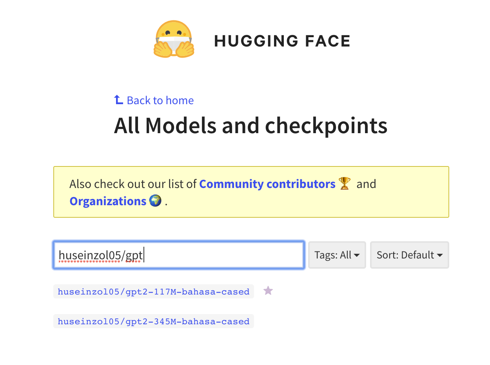

.. code:: ipython3

    %%time
    import malaya

.. parsed-literal::

    CPU times: user 4.8 s, sys: 1.17 s, total: 5.97 s
    Wall time: 6.97 s

List available T5 Model
-----------------------

.. code:: ipython3

    malaya.generator.available_t5()

.. parsed-literal::

    {'small': ['122MB'], 'base': ['448MB']}

Load T5
-------

T5 in Malaya is quite, most of the text generative model we found on the
internet like GPT2 or Markov, simply just continue prefix input from
user, but not for T5 Malaya. We want to generate an article or karangan
like high school when the users give ‘isu penting’.

.. code:: ipython3

    model = malaya.generator.t5()

.. parsed-literal::

    WARNING:tensorflow:From /Users/huseinzolkepli/Documents/Malaya/malaya/generator.py:510: The name tf.InteractiveSession is deprecated. Please use tf.compat.v1.InteractiveSession instead.
    
    WARNING:tensorflow:From /Users/huseinzolkepli/Documents/Malaya/malaya/generator.py:512: load (from tensorflow.python.saved_model.loader_impl) is deprecated and will be removed in a future version.
    Instructions for updating:
    This function will only be available through the v1 compatibility library as tf.compat.v1.saved_model.loader.load or tf.compat.v1.saved_model.load. There will be a new function for importing SavedModels in Tensorflow 2.0.
    INFO:tensorflow:Restoring parameters from /Users/huseinzolkepli/Malaya/generator-sample/t5/base/model/variables/variables

.. code:: ipython3

    isi_penting = ['Dr M perlu dikekalkan sebagai perdana menteri',
                  'Muhyiddin perlulah menolong Dr M',
                  'rakyat perlu menolong Muhyiddin']

I just want to test the model given this isi penting, because we all
know, Dr M and Muhyiddin are not supporting each others in the real
world.

generate
^^^^^^^^

``model.generate`` accepts list of string.

.. code:: ipython3

    model.generate(isi_penting)

.. parsed-literal::

    ': Presiden Bersatu, Tan Sri Muhyiddin Yassin perlu mengekalkan Tun Dr Mahathir Mohamad sebagai perdana menteri berbanding Datuk Seri Anwar Ibrahim yang hanya minta bantuan untuk menyelesaikan kemelut kedudukan negara.Muhyiddin berkata, ini kerana semua pihak tahu masalah yang dihadapi oleh Perdana Menteri adalah di luar bidang kuasa beliau sendiri.Katanya, Muhyiddin perlu membantu beliau kerana beliau percaya rakyat Malaysia tahu apa yang berlaku di luar bidang kuasa beliau."Apa yang berlaku di luar bidang kuasa Dr Mahathir... semua tahu bahawa ini berlaku di bawah kepimpinan Anwar."Muhyiddin dan seluruh rakyat yang tahu apa yang berlaku di Johor."Ini kerana di Johor ini, majoriti menteri-menteri dalam Pakatan Harapan banyak sangat ketua-ketua parti."Jadi Muhyiddin perlu bantu Dr Mahathir sebab rakyat tahu apa yang berlaku di Johor Bahru," katanya dalam satu kenyataan di sini, pada Jumaat.Dalam pada itu, Muhyiddin berkata, rakyat juga perlu menolong Muhyiddin untuk menyelesaikan masalah yang melanda negara ketika ini.Menurutnya, Muhyiddin perlu menggalas tugas dengan baik dan memastikan keadaan negara berada dalam keadaan baik.'

Pretty good!

.. code:: ipython3

    isi_penting = ['Neelofa tetap dengan keputusan untuk berkahwin akhir tahun ini',
                  'Long Tiger sanggup membantu Neelofa',
                  'Tiba-tiba Long Tiger bergaduh dengan Husein']

We also can give any isi penting even does not make any sense.

.. code:: ipython3

    model.generate(isi_penting)

.. parsed-literal::

    'Kuala Lumpur: Pelakon, Neelofa tetap dengan keputusannya untuk membuat keputusan berkahwin selewat-lewatnya hujung tahun ini, bukan kerana bergaduh dengan ahli perniagaan, Datuk Seri Husein Awang. Neelofa, 27, berkata, dia sendiri sudah bersikap berani untuk bersemuka dengan Long Tiger yang juga antara selebriti popular tanah air. "Saya ibarat \'putri\' dalam kehidupan. Bila saya sudah mula berkawan dengan Long Tiger, tiba-tiba Long Tiger bergaduh dengan Husein. "Perselisihan faham antara saya dan Omar adalah isu yang sangat sensitif. Namun ia tidak merebak ke dua pihak saja. "Mohon maaf kalau saya tidak tahu apa-apa, bagaimanapun saya tetap dengan keputusan ini," katanya kepada Bh Online. Pelakon Lelaki Hari Ini Kabir: Tabiat Long Tiger tidak ubah seperti hambar. Foto: Roslin Mat Tahir Isu hangat ini tercetus selepas bapa mentua Neelofa, Datuk Hasbullah Awang, meninggal dunia akibat kemalangan jalan raya semasa dalam perjalanan pulang ke kampung. Dalam kemalangan itu, Neelofa terpaksa menerima nasib malang apabila melenting di hadapan suaminya yang juga teraju kumpulan nafsu, dalam perjalanan pulang. Bagaimanapun, apabila tiba di lokasi kemalangan, oleh pelakon yang dikenali sebagai Nor Neelofa atau mesra dengan panggilan Long Tiger, berlaku pertengkaran antara mereka. Bagaimanapun, pertengkaran terbabit tidak berakhir sehingga ke hari ini. Noor Neelofa berkata, ketika mereka sekeluarga masih berada dalam perjalanan pulang ke kampung, dia sama sekali tidak perlu melayan apa sahaja yang berlaku. "Saya cuma nak terus ke kampung bercerita. Itulah prinsip kita. "Jangan layan apa sahaja yang berlaku, saya tetap nak bercakap mengenai apa yang berlaku," katanya.'

How about karangan like high school?

.. code:: ipython3

    # http://mieadham86.blogspot.com/2016/09/isi-isi-penting-karangan-bahasa-melayu.html
    # KEBAIKAN AMALAN BERGOTONG-ROYONG
    
    isi_penting = ['Dapat memupuk semangat kerjasama',
                   'Dapat mengeratkan hubungan silaturahim.',
                   'Kebersihan kawasan persekitaran terpelihara.',
                   'Terhindar daripada wabak penyakit seperti Denggi',
                   'Mengisi masa lapang',
                   'Menerapkan nilai-nilai murni dalam kehidupan']

.. code:: ipython3

    model.generate(isi_penting)

.. parsed-literal::

    'Dalam meniti era globalisasi ini, kita sering dihantui dengan pelbagai isu dan konflik yang melanda dalam negara yang diselesaikan dengan baik. Hal ini kerana, nila setitik rosak susu sebelanga. Oleh itu, usaha-usaha yang baik akan dapat dilaksanakan dengan meningkatkan semangat kerjasama antara pihak yang terlibat. Hal ini demikian kerana, hubungan yang erat akan memudahkan kita untuk merancakkan lagi aktiviti di peringkat komuniti dalam sama-sama membantu menjalankan aktiviti seharian. Sekiranya semangat kerjasama dapat dipupuk, ia akan memberi semangat baharu dimana hubungan orang ramai dengan individu lain akan menjadi lebih erat. Jelaslah bahawa kerjasama yang baik akan mewujudkan semangat kerjasama yang kukuh dan muafakat dalam kalangan warga masyarakat. Peribahasa Melayu berkata, nah, sepah dikata, apabila orang sekampung menunaikan umrah, penduduk kampung akan menjalankan tugas mereka dengan senang hati dan senang. Tegasnya, kerjasama yang erat akan menjadikan kita lebih dekat dan dikenali daripada orang luar. Ia juga dapat mengeratkan hubungan silaturahim. Semua pihak perlu sedar bahawa usaha yang baik akan memberikan manfaat sekiranya kita membersihkan kawasan persekitaran kita. Makanan yang disediakan oleh penduduk dapat menjadi sumber pendapatan kepada mereka. Seterusnya, kebersihan kawasan persekitaran terpelihara. Kita dapat lihat kawasan-kawasan seperti di sekolah masih terdapat wabak penyakit seperti Denggi. (Kash) Bencana adalah hasil daripada sikap segelintir masyarakat yang mengabaikan kebersihan kawasan persekitaran sehingga menyebabkan berlakunya jangkitan penyakit. Jelaslah bahawa sesetengah kawasan tidak pernah dijangkiti wabak penyakit seperti demam kuning. Justeru, jika kita mengamalkan kebersihan kawasan itu, kita akan sentiasa peka dan mengambil langkah-langkah yang perlu. Oleh itu, kita perlu sedar bahawa kita tidak boleh hidup dalam keadaan yang begitu baik sekiranya kita menggunakan pakaian yang diletakkan di tempat duduk yang rapi. Oleh itu, kita boleh mendapatkan pakaian yang dipakai oleh mereka dan mengamalkan kebersihan yang dapat memenuhi kehendak mereka. Intihannya, pelbagai cara yang boleh dilakukan untuk mengurangkan pembiakan nyamuk aedes. Ibu bapa seharusnya memastikan anak-anak mengamalkan kebersihan di kawasan masing-masing dengan lebih rapi. Sekiranya kebersihan itu dibiarkan, kita akan menjadi lebih buruk. Oleh itu, kita perlulah sentiasa kreatif dalam mengubah sikap setiap anak-anak yang masih kecil agar mampu menjadi orang yang lebih baik. Ibu dan bapa juga perlu menunjukkan teladan yang baik terhadap anak-anak seperti peribahasa Melayu, melentur buluh biarlah dari rebungnya. Anak-Anak juga sewajarnya sentiasa berfikiran positif dan berfikiran positif. Jangan mudah terpengaruh dengan cara-cara yang tidak baik untuk dilakukan oleh sesiapa sahaja. Seterusnya, kita perlu meningkatkan lagi usaha untuk mendidik dan membimbing mereka agar menjadi lebih berhemah dalam menjalani kehidupan seharian. Pada masa yang sama, masyarakat juga perlu menghadiri pelbagai bengkel bagi mendidik dan meningkatkan nilai-nilai murni dalam kehidupan. Hal ini demikian kerana, jika kita mempunyai kelapangan, kita akan sentiasa mencuba-cuba untuk mengkomersialkan diri sendiri. Jika begitu, kita pasti akan gagal menjadi manusia yang lebih baik terutama jika berlaku perselisihan faham dan sebagainya. Maka, kita perlu mencari jalan untuk mewujudkan masyarakat yang sejahtera. Selain itu, dengan mengamalkan nilai-nilai murni yang mudah, kita akan hidup dalam suasana yang aman damai dan ceria. Hal ini demikian kerana, jika kita mengamalkan prinsip ini, kita mampu menjana pendapatan yang lebih tinggi. Hal ini demikian kerana, jika kita tidak mengamalkan nilai-nilai murni ini, yang akan menjadi negara yang lebih baik adalah negara yang makmur dan sejahtera. Seterusnya, kita juga boleh menerapkan nilai-nilai murni yang mampu menjadi ikutan masyarakat. Seperti peribahasa Melayu, melentur buluh biarlah dari rebungnya. Intihannya, sebagai rakyat yang berjiwa besar, kita perlu mempraktikkan nilai-nilai murni yang mampu membantu kita melakukan sesuatu. Kesimpulannya, semua pihak perlu berganding bahu bagai aur dengan tebing untuk mewujudkan masyarakat yang harmoni dan berbudi bahasa.'

.. code:: ipython3

    # http://mieadham86.blogspot.com/2016/09/isi-isi-penting-karangan-bahasa-melayu.html
    # CARA MENJADI MURID CEMERLANG
    
    isi_penting = ['Rajin berusaha – tidak mudah putus asa',
                   'Menghormati orang yang lebih tua – mendapat keberkatan',
                   'Melibatkan diri secara aktif dalam bidang kokurikulum',
                   'Memberi tumpuan ketika guru mengajar.',
                   'Berdisiplin – menepati jadual yang disediakan.',
                   'Bercita-cita tinggi – mempunyai keazaman yang tinggi untuk berjaya']

.. code:: ipython3

    model.generate(isi_penting)

.. parsed-literal::

    'Pada zaman pascakemerdekaan ini, peribahasa Melayu ada berkata, di mana tumpahnya kuah kalau tidak ke nasi. Begitulah peribahasa Melayu berkata, jika tiada usaha tanpa usaha yang kukuh, pasti akan terlambat. Oleh itu, kita sebagai rakyat Malaysia wajar bermuhasabah diri dan berusaha berusaha agar mencapai apa yang diimpikan. Seterusnya, kita harus bersabar menunggu keputusan dan berusaha untuk mencapai apa yang diimpikan. Pelbagai cara dan kaedah yang boleh diguna pakai dalam menyelesaikan masalah yang dihadapi semasa menempuhi zaman ini seperti masalah kesihatan reproduksi, masalah obesiti, kesesakan jalan raya dan perkara-perkara lain yang dilihat menggamit perhatian kita. Di samping itu, kita sebagai rakyat Malaysia harus tampil untuk melihat dan menyelami kesusahan orang sekeliling kita ini. Golongan pekerja dan usahawan adalah golongan yang antara golongan terbesar di dunia dan perlu membantu mencari jalan penyelesaian bagi mengatasi segala masalah tersebut. Golongan berpendapatan rendah seperti orang kaya yang masih memerlukan bantuan dari segi kewangan dan kehidupan perlulah meluangkan masa yang ada untuk mencari pendapatan sampingan yang lebih bermanfaat bagi meringankan beban keluarga mereka. Jelaslah bahawa kita tidak mampu untuk bekerja dalam keadaan yang serba kekurangan. Sekiranya kita malas berusaha, kita akan terus kecundang dan tidak lagi mampu menyediakan produk yang boleh digunakan untuk kehidupan kita. Oleh itu, usaha yang kita lakukan adalah untuk memastikan diri kita sentiasa berada di landasan yang betul. Usaha yang kita lakukan hendaklah didorong dengan semangat yang tinggi supaya tidak mudah berputus asa. Malahan, dengan itu, kita dapat menghargai golongan yang lebih tua kerana kelebihannya mendidik diri - lebih muda dari orang lain. Dalam hal ini, ibu dan bapa akan sentiasa memantau anak-anak mereka di samping melarang anak-anak mereka daripada melakukan aktiviti yang tidak bermanfaat. Apabila kita lihat di televisyen dan di televisyen, pelajar-pelajar akan membuat perancangan untuk mengulang kaji pelajaran mereka di hadapan kamera dan kemudian dibimbing diri untuk menjadi guru-guru. Selain itu, kita juga boleh menjadi orang yang memberi nasihat kepada pelajar-pelajar dengan cara yang betul dalam mencari pengalaman yang baru. Jelaslah bahawa guru-guru juga mempunyai ilmu yang luas dalam pembelajaran dan mereka boleh memberikan fokus apabila menjalankan tugas dan belajar. Mereka dapat merangka pelbagai aktiviti untuk mengajar dalam tempoh yang singkat dan mudah. Oleh itu, mereka boleh merancang aktiviti-aktiviti yang penting dalam membentuk pemikiran dan pemikiran mereka dengan lebih berkesan. Tuntasnya, setiap daripada kita wajar memahami dan memiliki kepentingan untuk membantu sesuatu yang kita tidak tahu. Akhir sekali, peranan yang mustahak dalam mendidik adalah mengenali dan menghormati orang yang lebih tua. Ibu bapa berperanan penting dalam mendidik anak-anak sejak di bangku sekolah lagi. Bak kata peribahasa Melayu, melebihkan pergaulan. Ibu bapa boleh menjadi insan yang bijaksana, sopan santun dan bijaksana sebagai anak yang menjadi khalifah di muka bumi ini. Ibu bapa berperanan penting dalam mendidik anak-anak sehingga mereka bersedia untuk menempuhi zaman dalam dunia yang penuh mencabar ini. Selain itu, ibu bapa juga berperanan penting dalam mendidik anak-anak mereka agar sentiasa berusaha untuk mencapai matlamat yang diidam-idamkan. Ibu bapa juga berperanan penting dalam memastikan setiap anak-anak tidak mengesampingkan perasaan atau perasaan untuk maju bersama keluarga dan negara. Ibu bapa berperanan penting dalam memastikan anak-anak mencapai matlamat yang diidamkan. Menjadikan ibu bapa sebagai idola, saya boleh berbuat demikian dengan menasihatkan mereka supaya sentiasa mendoakan yang terbaik untuk kita. Guru-Guru juga boleh memberikan semangat yang tinggi untuk berjaya dalam kehidupan masing-masing. Sekiranya kita berjaya mencapai tujuan yang telah ditetapkan, pasti pencapaian kita akan menjadi lebih membanggakan. Akhir sekali, kita harus sedar bahawa tugas yang perlu dilaksanakan adalah menjaga kesihatan dan nyawa kita dan memastikan tiada sebarang masalah yang timbul. Pada masa yang sama, kita hendaklah sentiasa menjaga kesihatan dan nyawa kita dan tidak sesekali putus asa untuk sembuh.'

Load GPT2
---------

Malaya provided Pretrained GTP2 model, specific to Malay, we called it
GTP2-Bahasa. This interface not able us to use it to do custom training.

GPT2-Bahasa was pretrained on ~0.9 billion words, and below is the list
of dataset we trained,

1. `dumping wikipedia
   (222MB) <https://github.com/huseinzol05/Malaya-Dataset#wikipedia-1>`__.
2. `local news
   (257MB) <https://github.com/huseinzol05/Malaya-Dataset#public-news>`__.
3. `local parliament text
   (45MB) <https://github.com/huseinzol05/Malaya-Dataset#parliament>`__.
4. `IIUM Confession
   (74MB) <https://github.com/huseinzol05/Malaya-Dataset#iium-confession>`__.
5. `Wattpad
   (74MB) <https://github.com/huseinzol05/Malaya-Dataset#wattpad>`__.
6. `Academia PDF
   (42MB) <https://github.com/huseinzol05/Malaya-Dataset#academia-pdf>`__.
7. `Common-Crawl
   (3GB) <https://github.com/huseinzol05/malaya-dataset#common-crawl>`__.

If you want to download pretrained model for GPT2-Bahasa and use it for
custom transfer-learning, you can download it here,
https://github.com/huseinzol05/Malaya/tree/master/pretrained-model/gpt2,
some notebooks to help you get started.

**Here we hope these models are not use to finetune for spreading fake
news**.

Or you can simply use
`Transformers <https://huggingface.co/models?filter=malay&search=gpt2>`__
to try GPT2-Bahasa models from Malaya, simply check available models
from here, https://huggingface.co/models?filter=malay&search=gpt2

.. code:: ipython3

    from IPython.core.display import Image, display
    
    display(Image('gpt2.png', width=500))

load model
^^^^^^^^^^

GPT2-Bahasa only available ``117M`` and ``345M`` models.

1. ``117M`` size around 442MB.
2. ``345M`` is around 1.2GB.

.. code:: python

   def gpt2(
       model: str = '345M',
       generate_length: int = 256,
       temperature: float = 1.0,
       top_k: int = 40,
       **kwargs
   ):

       """
       Load GPT2 model to generate a string given a prefix string.

       Parameters
       ----------
       model : str, optional (default='345M')
           Model architecture supported. Allowed values:

           * ``'117M'`` - GPT2 117M parameters.
           * ``'345M'`` - GPT2 345M parameters.

       generate_length : int, optional (default=256)
           length of sentence to generate.
       temperature : float, optional (default=1.0)
           temperature value, value should between 0 and 1.
       top_k : int, optional (default=40)
           top-k in nucleus sampling selection.

       Returns
       -------
       result: malaya.transformers.gpt2.Model class
       """

.. code:: ipython3

    model = malaya.generator.gpt2(model = '117M')

.. parsed-literal::

    WARNING:tensorflow:From /Users/huseinzolkepli/Documents/Malaya/malaya/transformers/gpt2/__init__.py:19: where (from tensorflow.python.ops.array_ops) is deprecated and will be removed in a future version.
    Instructions for updating:
    Use tf.where in 2.0, which has the same broadcast rule as np.where
    WARNING:tensorflow:From /Users/huseinzolkepli/Documents/Malaya/malaya/transformers/gpt2/__init__.py:140: The name tf.InteractiveSession is deprecated. Please use tf.compat.v1.InteractiveSession instead.
    
    WARNING:tensorflow:From /Users/huseinzolkepli/Documents/Malaya/malaya/transformers/gpt2/__init__.py:141: The name tf.global_variables_initializer is deprecated. Please use tf.compat.v1.global_variables_initializer instead.
    
    WARNING:tensorflow:From /Users/huseinzolkepli/Documents/Malaya/malaya/transformers/gpt2/__init__.py:142: The name tf.train.Saver is deprecated. Please use tf.compat.v1.train.Saver instead.
    
    WARNING:tensorflow:From /Users/huseinzolkepli/Documents/Malaya/malaya/transformers/gpt2/__init__.py:142: The name tf.trainable_variables is deprecated. Please use tf.compat.v1.trainable_variables instead.
    
    INFO:tensorflow:Restoring parameters from /Users/huseinzolkepli/Malaya/gpt2/117M/gpt2-bahasa-117M/model.ckpt

.. code:: ipython3

    string = 'ceritanya sebegini, aku bangun pagi baca surat khabar berita harian, tetiba aku nampak cerita seram, '

.. code:: ipython3

    print(model.generate(string))

.. parsed-literal::

    ceritanya sebegini, aku bangun pagi baca surat khabar berita harian, tetiba aku nampak cerita seram, ara aku yang lain keluar, aku pandang cerita tapi tak ingat, aku takut dan bimbang aku terpaksa marah kerana hati aku yang berada di sekeliling aku tadi tak putus-putus.
    Dalam diam, aku juga merasa kagum dan terharu bila aku bangun pagi untuk bangun dan tengok kisah seram ni, masa tu aku terus pandang, bila aku berada dalam bilik yang indah, aku tahu tentang benda yang nak diperkatakan.
    “Tu sikit, dengan banyak masa aku nak keluar dan keluar aku dah mula bangun pagi, aku nak keluar lagi, lepas tu nanti terus masuk ke bilik sambil nampak benda yang tak ada yang nak diperkatakan.
    Tak tau cerita tu macam benda yang boleh aku buat kalau rasa macam cerita.
    Sampai di bilik, aku pun rasa macam, benda yang nak diperkatakan tu bukan benda yang perlu aku buat.
    Macam tak percaya apa yang aku buat ni?
    Mungkin benda yang nak diperkatakan itu boleh buat aku jugak, cuma benda yang boleh bagi aku kata tak logik atau memang betul.
    Cuma yang paling aku nak cakap ni adalah benda pelik yang aku fikir nak nampak yang tak boleh dan kalau tak logik pun tak patut.
    So, apa kata dorang mainkan benda yang aku cakap ni.
    Rasa pelik dan amat pelik kan?
    Macam nak buat orang lain jadi macam benda pelik dan susah sangat nak buat

.. code:: ipython3

    model = malaya.generator.gpt2(model = '345M')

.. parsed-literal::

    INFO:tensorflow:Restoring parameters from /Users/huseinzolkepli/Malaya/gpt2/345M/gpt2-bahasa-345M/model.ckpt

.. code:: ipython3

    string = 'ceritanya sebegini, aku bangun pagi baca surat khabar berita harian, tetiba aku nampak cerita seram, '
    print(model.generate(string))

.. parsed-literal::

    ceritanya sebegini, aku bangun pagi baca surat khabar berita harian, tetiba aku nampak cerita seram, omputeh-uteh cerita lama-lama, seram tak boleh bayang
    Sebelum kejadian, dalam 2 jam aku buat panggilan polis , lepas tu kira la sendiri nak ke lokasi.
    Tengok cerita lama..
    Sekarang ni, apa yang aku lalui, kita yang jaga diri, kita yang jaga kesihatan dan juga kita yang jaga minda dalam hidup.
    Maka, inilah jalan penyelesaian terbaiknya.
    Jangan lupakan manusia
    Orang yang paling ditakuti untuk berjaya dalam hidup, tidak akan jumpa yang tersayang!
    Jangan rosakkan masa depannya, ingatlah apa yang kita nak buat, walaupun pahit untuk ditelan.
    Jangan lupakan orang lain - masa depan mereka.
    Jangan lupakan orang - masa itulah kita yang lebih dicintai.
    Jangan lupakan orang - orang yang kita sayang, mereka bukan orang yang tersayang!
    Jangan lupakan orang - orang yang kita cinta, mereka cinta pada kita.
    Jangan lupakan diri - diri kita - yang kita punya, yang kita tinggal adalah masa lalu kita.
    Jangan lupakan orang lain - orang yang kita cinta, lebih indah dari masa lalu kita.
    Jangan lupakan semua orang - orang yang tinggal ataupun hidup.
    Jangan cuba lupakan diri kita - kerja keras dan selalu ada masa depan kita.
    Jangan pernah putus rasa - kecewa kerana kita telah banyak berubah.
    Jangan pernah putus putus asa kerana kita

Load Transformer
----------------

We also can generate a text like GPT2 using Transformer-Bahasa. Right
now only supported BERT, ALBERT and ELECTRA.

.. code:: python

   def transformer(
       string: str,
       model,
       generate_length: int = 30,
       leed_out_len: int = 1,
       temperature: float = 1.0,
       top_k: int = 100,
       burnin: int = 15,
       batch_size: int = 5,
   ):
       """
       Use pretrained transformer models to generate a string given a prefix string.
       https://github.com/nyu-dl/bert-gen, https://arxiv.org/abs/1902.04094

       Parameters
       ----------
       string: str
       model: object
           transformer interface object. Right now only supported BERT, ALBERT.
       generate_length : int, optional (default=256)
           length of sentence to generate.
       leed_out_len : int, optional (default=1)
           length of extra masks for each iteration. 
       temperature: float, optional (default=1.0)
           logits * temperature.
       top_k: int, optional (default=100)
           k for top-k sampling.
       burnin: int, optional (default=15)
           for the first burnin steps, sample from the entire next word distribution, instead of top_k.
       batch_size: int, optional (default=5)
           generate sentences size of batch_size.

       Returns
       -------
       result: List[str]
       """

.. code:: ipython3

    electra = malaya.transformer.load(model = 'electra')

.. parsed-literal::

    WARNING:tensorflow:From /Users/huseinzolkepli/Documents/Malaya/malaya/transformers/electra/__init__.py:56: The name tf.placeholder is deprecated. Please use tf.compat.v1.placeholder instead.
    
    WARNING:tensorflow:From /Users/huseinzolkepli/Documents/Malaya/malaya/transformers/electra/modeling.py:240: dense (from tensorflow.python.layers.core) is deprecated and will be removed in a future version.
    Instructions for updating:
    Use keras.layers.Dense instead.
    WARNING:tensorflow:From /usr/local/lib/python3.7/site-packages/tensorflow_core/python/layers/core.py:187: Layer.apply (from tensorflow.python.keras.engine.base_layer) is deprecated and will be removed in a future version.
    Instructions for updating:
    Please use `layer.__call__` method instead.
    WARNING:tensorflow:From /Users/huseinzolkepli/Documents/Malaya/malaya/transformers/electra/__init__.py:79: The name tf.variable_scope is deprecated. Please use tf.compat.v1.variable_scope instead.
    
    WARNING:tensorflow:From /Users/huseinzolkepli/Documents/Malaya/malaya/transformers/electra/__init__.py:93: The name tf.get_variable is deprecated. Please use tf.compat.v1.get_variable instead.
    
    WARNING:tensorflow:From /Users/huseinzolkepli/Documents/Malaya/malaya/transformers/sampling.py:26: where (from tensorflow.python.ops.array_ops) is deprecated and will be removed in a future version.
    Instructions for updating:
    Use tf.where in 2.0, which has the same broadcast rule as np.where
    WARNING:tensorflow:From /Users/huseinzolkepli/Documents/Malaya/malaya/transformers/electra/__init__.py:114: multinomial (from tensorflow.python.ops.random_ops) is deprecated and will be removed in a future version.
    Instructions for updating:
    Use `tf.random.categorical` instead.
    WARNING:tensorflow:From /Users/huseinzolkepli/Documents/Malaya/malaya/transformers/electra/__init__.py:117: The name tf.InteractiveSession is deprecated. Please use tf.compat.v1.InteractiveSession instead.
    
    WARNING:tensorflow:From /Users/huseinzolkepli/Documents/Malaya/malaya/transformers/electra/__init__.py:118: The name tf.global_variables_initializer is deprecated. Please use tf.compat.v1.global_variables_initializer instead.
    
    WARNING:tensorflow:From /Users/huseinzolkepli/Documents/Malaya/malaya/transformers/electra/__init__.py:120: The name tf.get_collection is deprecated. Please use tf.compat.v1.get_collection instead.
    
    WARNING:tensorflow:From /Users/huseinzolkepli/Documents/Malaya/malaya/transformers/electra/__init__.py:121: The name tf.GraphKeys is deprecated. Please use tf.compat.v1.GraphKeys instead.
    
    WARNING:tensorflow:From /Users/huseinzolkepli/Documents/Malaya/malaya/transformers/electra/__init__.py:127: The name tf.train.Saver is deprecated. Please use tf.compat.v1.train.Saver instead.
    
    WARNING:tensorflow:From /Users/huseinzolkepli/Documents/Malaya/malaya/transformers/electra/__init__.py:129: The name tf.get_default_graph is deprecated. Please use tf.compat.v1.get_default_graph instead.
    
    INFO:tensorflow:Restoring parameters from /Users/huseinzolkepli/Malaya/electra-model/base/electra-base/model.ckpt

.. code:: ipython3

    malaya.generator.transformer(string, electra)

.. parsed-literal::

    WARNING:tensorflow:From /Users/huseinzolkepli/Documents/Malaya/malaya/transformers/babble.py:30: The name tf.Session is deprecated. Please use tf.compat.v1.Session instead.
    

.. parsed-literal::

    ['ceritanya sebegini , aku bangun pagi baca surat khabar berita harian , tetiba aku nampak cerita seram , seriuslah Allah tarik balik rezeki aku untuk kau berjumpa balik . patutlah terpentak apabila tiba masa kita baru perasan kejadian begitu , tapi nyata rupanya . Begitulah kehidupan',
     'ceritanya sebegini , aku bangun pagi baca surat khabar berita harian , tetiba aku nampak cerita seram , rupanya ada segelintir pihak yang tak faham bahasa Melayu berbalas budi . Kisah ringkas , Kisah ringkas , Kisah kisah ringkas , Kisah akhir cerita , Kisah kematian .',
     'ceritanya sebegini , aku bangun pagi baca surat khabar berita harian , tetiba aku nampak cerita seram , kenapa la cara bunuh diri tu mangkuk , orang baru terpengaruh dengan isu kononnya anak anak mangsa bunuh diri , mana tahu tau apa sebenar dosa orang itu sebenar .',
     'ceritanya sebegini , aku bangun pagi baca surat khabar berita harian , tetiba aku nampak cerita seram , diri yang gelap , menyedihkan , menyedihkan , remaja yang kaya , miskin , berkelulusan SPM dan masih hidup lagi . Alhamdulillah Allah berikan kekuatan kami semua sahabat semua',
     'ceritanya sebegini , aku bangun pagi baca surat khabar berita harian , tetiba aku nampak cerita seram , filem yang kerap diorang tayang dalam bahasa sedih . Lagi - lagi , aku rasa seram sebab aku tak sangka kalau korang cerita seram dia hilang tu cerita seram .']

ngrams
------

You can generate ngrams pretty easy using this interface,

.. code:: python

   def ngrams(
       sequence,
       n: int,
       pad_left = False,
       pad_right = False,
       left_pad_symbol = None,
       right_pad_symbol = None,
   ):
       """
       generate ngrams.

       Parameters
       ----------
       sequence : List[str]
           list of tokenize words.
       n : int
           ngram size

       Returns
       -------
       ngram: list
       """

.. code:: ipython3

    string = 'saya suka makan ayam'
    
    list(malaya.generator.ngrams(string.split(), n = 2))

.. parsed-literal::

    [('saya', 'suka'), ('suka', 'makan'), ('makan', 'ayam')]

.. code:: ipython3

    list(malaya.generator.ngrams(string.split(), n = 2, pad_left = True, pad_right = True))

.. parsed-literal::

    [(None, 'saya'),
     ('saya', 'suka'),
     ('suka', 'makan'),
     ('makan', 'ayam'),
     ('ayam', None)]

.. code:: ipython3

    list(malaya.generator.ngrams(string.split(), n = 2, pad_left = True, pad_right = True,
                                left_pad_symbol = 'START'))

.. parsed-literal::

    [('START', 'saya'),
     ('saya', 'suka'),
     ('suka', 'makan'),
     ('makan', 'ayam'),
     ('ayam', None)]

.. code:: ipython3

    list(malaya.generator.ngrams(string.split(), n = 2, pad_left = True, pad_right = True,
                                left_pad_symbol = 'START', right_pad_symbol = 'END'))

.. parsed-literal::

    [('START', 'saya'),
     ('saya', 'suka'),
     ('suka', 'makan'),
     ('makan', 'ayam'),
     ('ayam', 'END')]

