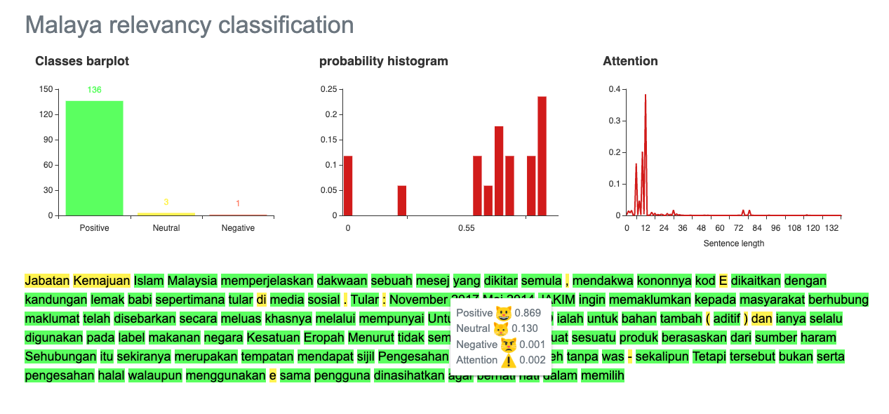

.. code:: ipython3

    %%time
    import malaya

.. parsed-literal::

    CPU times: user 12.3 s, sys: 1.53 s, total: 13.8 s
    Wall time: 17.8 s

Explanation
-----------

Positive relevancy: The article or piece of text is relevant, tendency
is high to become not a fake news. Can be a positive or negative
sentiment.

Negative relevancy: The article or piece of text is not relevant,
tendency is high to become a fake news. Can be a positive or negative
sentiment.

Right now relevancy module only support deep learning model.

.. code:: ipython3

    negative_text = 'Roti Massimo Mengandungi DNA Babi. Roti produk Massimo keluaran Syarikat The Italian Baker mengandungi DNA babi. Para pengguna dinasihatkan supaya tidak memakan produk massimo. Terdapat pelbagai produk roti keluaran syarikat lain yang boleh dimakan dan halal. Mari kita sebarkan berita ini supaya semua rakyat Malaysia sedar dengan apa yang mereka makna setiap hari. Roti tidak halal ada DNA babi jangan makan ok.'
    positive_text = 'Jabatan Kemajuan Islam Malaysia memperjelaskan dakwaan sebuah mesej yang dikitar semula, yang mendakwa kononnya kod E dikaitkan dengan kandungan lemak babi sepertimana yang tular di media sosial. . Tular: November 2017 . Tular: Mei 2014 JAKIM ingin memaklumkan kepada masyarakat berhubung maklumat yang telah disebarkan secara meluas khasnya melalui media sosial berhubung kod E yang dikaitkan mempunyai lemak babi. Untuk makluman, KOD E ialah kod untuk bahan tambah (aditif) dan ianya selalu digunakan pada label makanan di negara Kesatuan Eropah. Menurut JAKIM, tidak semua nombor E yang digunakan untuk membuat sesuatu produk makanan berasaskan dari sumber yang haram. Sehubungan itu, sekiranya sesuatu produk merupakan produk tempatan dan mendapat sijil Pengesahan Halal Malaysia, maka ia boleh digunakan tanpa was-was sekalipun mempunyai kod E-kod. Tetapi sekiranya produk tersebut bukan produk tempatan serta tidak mendapat sijil pengesahan halal Malaysia walaupun menggunakan e-kod yang sama, pengguna dinasihatkan agar berhati-hati dalam memilih produk tersebut.'

List available deep learning models
-----------------------------------

.. code:: ipython3

    malaya.relevancy.available_deep_model()

.. parsed-literal::

    ['self-attention', 'dilated-cnn']

As you can see, we are not using recurrent architecture for relevancy
classification. Article or news can be really a long text, and when
talking about recurrent on long text dependency, we might have a problem
about gradient vanishing or long term dependency, plus it is very
expensive to calculate.

Load deep learning models
-------------------------

Good thing about deep learning models from Malaya, it returns
``Attention`` result, means, which part of words give the high impact to
the results. But to get ``Attention``, you need to set
``get_proba=True``.

.. code:: ipython3

    import matplotlib.pyplot as plt
    import seaborn as sns
    sns.set()

Load dilated-cnn model
~~~~~~~~~~~~~~~~~~~~~~

.. code:: ipython3

    model = malaya.relevancy.deep_model('dilated-cnn')

.. parsed-literal::

    downloading frozen /Users/huseinzol/Malaya/relevancy/self-attention model

.. parsed-literal::

    94.0MB [00:33, 3.73MB/s]                          
      0%|          | 0.00/7.17 [00:00<?, ?MB/s]

.. parsed-literal::

    downloading frozen /Users/huseinzol/Malaya/relevancy/self-attention setting

.. parsed-literal::

    8.00MB [00:02, 3.75MB/s]                          

Predict single string
^^^^^^^^^^^^^^^^^^^^^

.. code:: ipython3

    model.predict(positive_text)

.. parsed-literal::

    'positive'

.. code:: ipython3

    result = model.predict(positive_text,get_proba=True,add_neutral=False)
    result

.. parsed-literal::

    {'positive': 0.9991547,
     'negative': 0.00084533397,
     'attention': {'Jabatan': 0.024738397,
      'Kemajuan': 0.008837365,
      'Islam': 0.0024237907,
      'Malaysia': 9.018409e-08,
      'memperjelaskan': 0.0034145564,
      'dakwaan': 0.00816603,
      'sebuah': 0.2912236,
      'mesej': 0.008252924,
      'yang': 4.0573254e-06,
      'dikitar': 0.004085772,
      'semula': 0.24153505,
      ',': 0.0,
      'mendakwa': 0.08853194,
      'kononnya': 0.0004483624,
      'kod': 9.2239924e-07,
      'E': 0.0,
      'dikaitkan': 0.0001344327,
      'dengan': 0.0011281366,
      'kandungan': 0.0031591463,
      'lemak': 7.5735064e-05,
      'babi': 1.3862892e-05,
      'sepertimana': 0.0031050642,
      'tular': 0.00030034894,
      'di': 0.0,
      'media': 8.364478e-05,
      'sosial': 6.375957e-05,
      '.': 0.0,
      'Tular': 0.00020641745,
      ':': 0.0,
      'November 2017': 0.0019049036,
      'Mei 2014': 0.00048462205,
      'JAKIM': 0.000263208,
      'ingin': 0.003996827,
      'memaklumkan': 0.0024986444,
      'kepada': 0.053978425,
      'masyarakat': 0.0027177127,
      'berhubung': 3.6674945e-05,
      'maklumat': 0.00056058686,
      'telah': 6.9016525e-05,
      'disebarkan': 4.8057937e-05,
      'secara': 1.1552597e-05,
      'meluas': 0.00036511838,
      'khasnya': 0.0001686224,
      'melalui': 4.4864857e-05,
      'mempunyai': 9.183337e-06,
      'Untuk': 2.1401613e-05,
      'makluman': 1.835893e-05,
      'KOD': 8.1660415e-05,
      'ialah': 0.000109723835,
      'untuk': 0.0023879176,
      'bahan': 2.0323605e-05,
      'tambah': 0.0001740233,
      '(': 0.0,
      'aditif': 0.00015762253,
      ')': 0.0,
      'dan': 0.0,
      'ianya': 3.5179684e-05,
      'selalu': 3.0705287e-06,
      'digunakan': 1.6675765e-05,
      'pada': 0.00016509589,
      'label': 2.8167164e-05,
      'makanan': 0.014696745,
      'negara': 6.599796e-05,
      'Kesatuan': 1.063531e-06,
      'Eropah': 3.358216e-05,
      'Menurut': 9.897906e-05,
      'tidak': 1.1552356e-06,
      'semua': 6.3761436e-05,
      'nombor': 0.0003067112,
      'membuat': 0.00020510933,
      'sesuatu': 2.3824721e-05,
      'produk': 4.8747463e-08,
      'berasaskan': 3.6138397e-05,
      'dari': 2.5766512e-05,
      'sumber': 0.00039131506,
      'haram': 1.7160308e-05,
      'Sehubungan': 0.00043635268,
      'itu': 1.8382847e-05,
      'sekiranya': 8.85888e-07,
      'merupakan': 0.00017788174,
      'tempatan': 4.9669284e-06,
      'mendapat': 1.1296393e-05,
      'sijil': 3.888042e-06,
      'Pengesahan': 5.874477e-06,
      'Halal': 2.2031578e-05,
      'maka': 9.334192e-07,
      'ia': 1.4124709e-06,
      'boleh': 8.311782e-08,
      'tanpa': 7.3407455e-06,
      'was': 6.9828195e-07,
      '-': 0.0,
      'sekalipun': 6.4428123e-06,
      'Tetapi': 1.0359242e-07,
      'tersebut': 0.0,
      'bukan': 4.3663792e-07,
      'serta': 6.5460745e-07,
      'pengesahan': 1.9367105e-06,
      'halal': 2.316522e-05,
      'walaupun': 1.6737267e-06,
      'menggunakan': 3.9666007e-05,
      'e': 0.0,
      'sama': 6.843881e-06,
      'pengguna': 1.5709709e-07,
      'dinasihatkan': 2.5268352e-07,
      'agar': 2.6459807e-07,
      'berhati': 2.0848765e-06,
      'hati': 1.2861171e-05,
      'dalam': 3.7498398e-07,
      'memilih': 2.107734e-08}}

.. code:: ipython3

    plt.figure(figsize = (15, 5))
    keys = result['attention'].keys()
    values = result['attention'].values()
    aranged = [i for i in range(len(keys))]
    plt.bar(aranged, values)
    plt.xticks(aranged, keys, rotation = 'vertical')
    plt.show()

.. image:: load-relevancy_files/load-relevancy_13_0.png

Open relevancy visualization dashboard
^^^^^^^^^^^^^^^^^^^^^^^^^^^^^^^^^^^^^^

Default when you call ``predict_words`` it will open a browser with
visualization dashboard, you can disable by ``visualization=False``.

.. code:: ipython3

    model.predict_words(positive_text)

.. parsed-literal::

    Serving to http://127.0.0.1:8889/    [Ctrl-C to exit]

.. parsed-literal::

    127.0.0.1 - - [01/Jun/2019 12:40:51] "GET / HTTP/1.1" 200 -
    127.0.0.1 - - [01/Jun/2019 12:40:52] "GET /static/admin-materialize.min.css HTTP/1.1" 200 -
    127.0.0.1 - - [01/Jun/2019 12:40:52] "GET /static/echarts.min.js HTTP/1.1" 200 -
    127.0.0.1 - - [01/Jun/2019 12:40:52] "GET /favicon.ico HTTP/1.1" 200 -
    ----------------------------------------
    Exception happened during processing of request from ('127.0.0.1', 62487)
    Traceback (most recent call last):
      File "/usr/local/Cellar/python/3.6.5_1/Frameworks/Python.framework/Versions/3.6/lib/python3.6/socketserver.py", line 317, in _handle_request_noblock
        self.process_request(request, client_address)
      File "/usr/local/Cellar/python/3.6.5_1/Frameworks/Python.framework/Versions/3.6/lib/python3.6/socketserver.py", line 348, in process_request
        self.finish_request(request, client_address)
      File "/usr/local/Cellar/python/3.6.5_1/Frameworks/Python.framework/Versions/3.6/lib/python3.6/socketserver.py", line 361, in finish_request
        self.RequestHandlerClass(request, client_address, self)
      File "/usr/local/Cellar/python/3.6.5_1/Frameworks/Python.framework/Versions/3.6/lib/python3.6/socketserver.py", line 696, in __init__
        self.handle()
      File "/usr/local/Cellar/python/3.6.5_1/Frameworks/Python.framework/Versions/3.6/lib/python3.6/http/server.py", line 418, in handle
        self.handle_one_request()
      File "/usr/local/Cellar/python/3.6.5_1/Frameworks/Python.framework/Versions/3.6/lib/python3.6/http/server.py", line 406, in handle_one_request
        method()
      File "/Users/huseinzol/Documents/Malaya/malaya/_utils/_server.py", line 32, in do_GET
        with open(filepath, 'rb') as fh:
    FileNotFoundError: [Errno 2] No such file or directory: '/Users/huseinzol/Documents/Malaya/malaya/_utils/web/favicon.ico'
    ----------------------------------------

.. parsed-literal::

    
    stopping Server...

.. code:: ipython3

    from IPython.core.display import Image, display
    
    display(Image('relevancy-dilated-cnn.png', width=800))

I tried to put the html and javascript inside a notebook cell, pretty
hard you know and a lot of weird bugs. Let stick to HTTP serving ya.

``predict_words`` only accept a single string. You can’t predict
multiple texts.

Predict batch of strings
^^^^^^^^^^^^^^^^^^^^^^^^

.. code:: ipython3

    model.predict_batch([negative_text, positive_text],get_proba=True, add_neutral=False)

.. parsed-literal::

    [{'positive': 0.43126237, 'negative': 0.5687377},
     {'positive': 0.9965766, 'negative': 0.003423397}]

**You might want to try ``self-attention`` by yourself.**

Stacking models
---------------

More information, you can read at
https://malaya.readthedocs.io/en/latest/Stack.html

.. code:: ipython3

    cnn = malaya.relevancy.deep_model('dilated-cnn')
    attention = malaya.relevancy.deep_model('self-attention')

.. parsed-literal::

    downloading frozen /Users/huseinzol/Malaya/relevancy/self-attention model

.. parsed-literal::

    180MB [00:56, 4.70MB/s]                          

.. code:: ipython3

    malaya.stack.predict_stack([cnn, attention], positive_text)

.. parsed-literal::

    {'positive': 0.6821273, 'negative': 0.002180755, 'neutral': 0.21589473}

