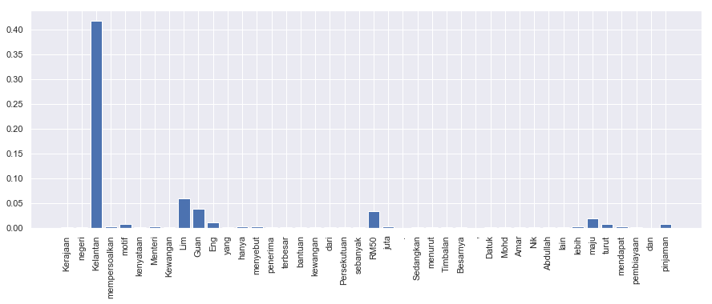

.. code:: ipython3

    %%time
    import malaya

.. parsed-literal::

    CPU times: user 6.33 s, sys: 1.54 s, total: 7.88 s
    Wall time: 12.4 s

.. code:: ipython3

    positive_text = 'Kerajaan negeri Kelantan mempersoalkan motif kenyataan Menteri Kewangan Lim Guan Eng yang hanya menyebut Kelantan penerima terbesar bantuan kewangan dari Kerajaan Persekutuan sebanyak RM50 juta. Sedangkan menurut Timbalan Menteri Besarnya, Datuk Mohd Amar Nik Abdullah, negeri lain yang lebih maju dari Kelantan turut mendapat pembiayaan dan pinjaman.'
    negative_text = 'kerajaan sebenarnya sangat bencikan rakyatnya, minyak naik dan segalanya'

All models have ``get_proba`` parameters. If True, it will returned
probability every classes. Else, it will return highest probability
class. **Default is False.**

All models have ``add_neutral`` parameters. If True, it will add
``neutral`` probability, Else, default probabilities. **Default is
True.**

Load multinomial model
----------------------

.. code:: ipython3

    model = malaya.sentiment.multinomial()
    print(model.predict(positive_text,get_proba=True))
    print(model.predict(negative_text,get_proba=True))
    model.predict_batch([negative_text,negative_text],get_proba=True)

.. parsed-literal::

    {'negative': 0.1708339408275661, 'positive': 0.008291660591724323, 'neutral': 0.8208743985807097}
    {'negative': 0.5124503873063959, 'positive': 0.00487549612693598, 'neutral': 0.48267411656666814}

.. parsed-literal::

    [{'negative': 0.5124503873063959,
      'positive': 0.00487549612693598,
      'neutral': 0.48267411656666814},
     {'negative': 0.5124503873063959,
      'positive': 0.00487549612693598,
      'neutral': 0.48267411656666814}]

Disable ``neutral`` probability,

.. code:: ipython3

    print(model.predict(negative_text,get_proba=True,add_neutral=True))
    print(model.predict(negative_text,get_proba=True,add_neutral=False))

.. parsed-literal::

    {'negative': 0.5124503873063959, 'positive': 0.00487549612693598, 'neutral': 0.48267411656666814}
    {'negative': 0.756225193653198, 'positive': 0.243774806346799}

List available Transformer models
---------------------------------

.. code:: ipython3

    malaya.sentiment.available_transformer_model()

.. parsed-literal::

    {'bert': ['base', 'small'], 'xlnet': ['base'], 'albert': ['base']}

Make sure you can check accuracy chart from here first before select a
model,
https://malaya.readthedocs.io/en/latest/Accuracy.html#sentiment-analysis

**You might want to use ALBERT, a very small size, 43MB, but the
accuracy is still on the top notch.**

Load ALBERT model
-----------------

.. code:: ipython3

    model = malaya.sentiment.transformer(model = 'albert', size = 'base')

.. parsed-literal::

    WARNING: Logging before flag parsing goes to stderr.
    W1018 00:21:45.580282 4405478848 deprecation_wrapper.py:119] From /Users/huseinzol/Documents/Malaya/malaya/_utils/_utils.py:68: The name tf.gfile.GFile is deprecated. Please use tf.io.gfile.GFile instead.
    
    W1018 00:21:45.582058 4405478848 deprecation_wrapper.py:119] From /Users/huseinzol/Documents/Malaya/malaya/_utils/_utils.py:69: The name tf.GraphDef is deprecated. Please use tf.compat.v1.GraphDef instead.
    
    W1018 00:21:48.671772 4405478848 deprecation_wrapper.py:119] From /Users/huseinzol/Documents/Malaya/malaya/_utils/_utils.py:64: The name tf.InteractiveSession is deprecated. Please use tf.compat.v1.InteractiveSession instead.
    

Predict single string
^^^^^^^^^^^^^^^^^^^^^

.. code:: ipython3

    model.predict(positive_text,get_proba=True)

.. parsed-literal::

    {'negative': 0.928911, 'positive': 0.0007108902, 'neutral': 0.070378125}

Predict batch of strings
^^^^^^^^^^^^^^^^^^^^^^^^

.. code:: ipython3

    model.predict_batch([positive_text, negative_text],get_proba=True)

.. parsed-literal::

    [{'negative': 0.928911, 'positive': 0.00071089127, 'neutral': 0.070378125},
     {'negative': 0.94854975, 'positive': 0.0005145021, 'neutral': 0.050935745}]

Open emotion visualization dashboard
^^^^^^^^^^^^^^^^^^^^^^^^^^^^^^^^^^^^

Default when you call ``predict_words`` it will open a browser with
visualization dashboard, you can disable by ``visualization=False``.

.. code:: ipython3

    model.predict_words(negative_text)

.. code:: ipython3

    from IPython.core.display import Image, display
    
    display(Image('bert-sentiment.png', width=800))

Stacking models
---------------

More information, you can read at
https://malaya.readthedocs.io/en/latest/Stack.html

.. code:: ipython3

    multinomial = malaya.sentiment.multinomial()
    bert = malaya.sentiment.transformer(model = 'bert', size = 'base')

.. code:: ipython3

    bert.predict(positive_text, get_proba = True)

.. parsed-literal::

    {'negative': 4.0951385e-05, 'positive': 0.9959047, 'neutral': 0.0040543675}

.. code:: ipython3

    malaya.stack.predict_stack([multinomial, bert, model], [positive_text, negative_text])

.. parsed-literal::

    [{'negative': 0.018319895741887974,
      'positive': 0.01804067965859282,
      'neutral': 0.060514741560741055},
     {'negative': 0.7832971121695218,
      'positive': 0.0006567555331073403,
      'neutral': 0.06501884954119536}]

