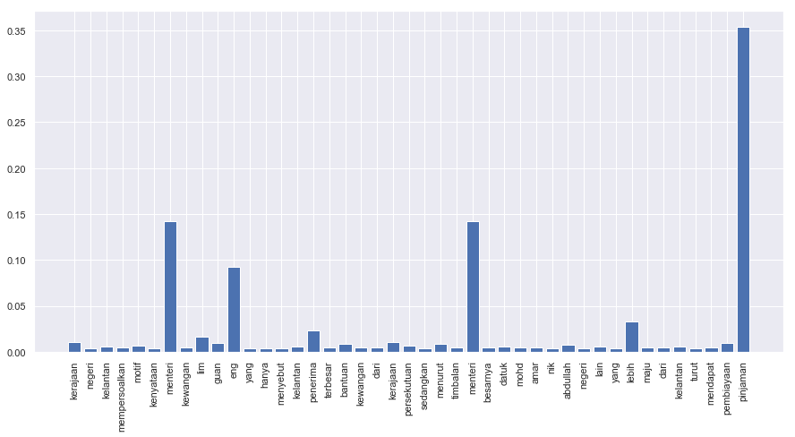
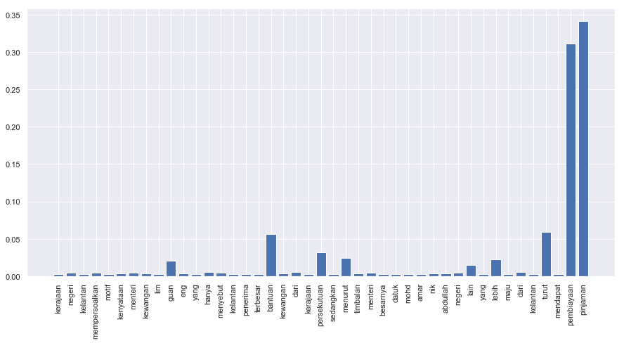
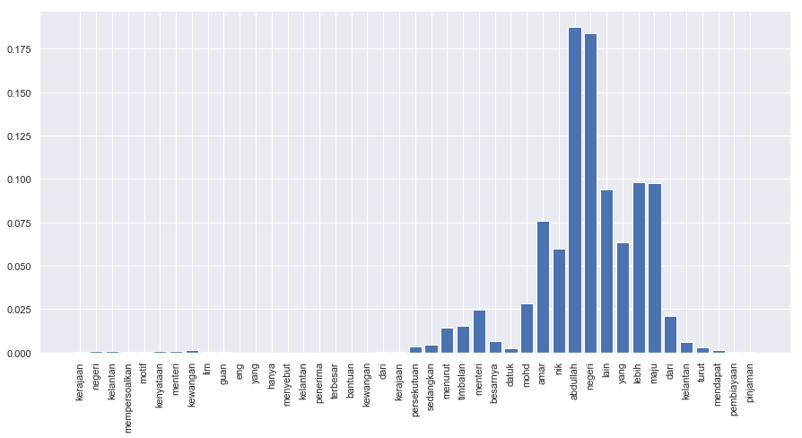

.. code:: ipython3

    %%time
    import malaya

.. parsed-literal::

    CPU times: user 11.7 s, sys: 1.34 s, total: 13.1 s
    Wall time: 16.7 s

.. code:: ipython3

    positive_text = 'Kerajaan negeri Kelantan mempersoalkan motif kenyataan Menteri Kewangan Lim Guan Eng yang hanya menyebut Kelantan penerima terbesar bantuan kewangan dari Kerajaan Persekutuan. Sedangkan menurut Timbalan Menteri Besarnya, Datuk Mohd Amar Nik Abdullah, negeri lain yang lebih maju dari Kelantan turut mendapat pembiayaan dan pinjaman.'
    negative_text = 'kerajaan sebenarnya sangat bencikan rakyatnya, minyak naik dan segalanya'

All models got ``get_proba`` parameters. If True, it will returned
probability every classes. Else, it will return highest probability
class. **Default is False.**

Load multinomial model
----------------------

.. code:: ipython3

    model = malaya.sentiment.multinomial()
    print(model.predict(positive_text,get_proba=True))
    print(model.predict(negative_text,get_proba=True))
    model.predict_batch([negative_text,negative_text],get_proba=True)

.. parsed-literal::

    {'negative': 0.27780816431771815, 'positive': 0.7221918356822792}
    {'negative': 0.4230539695981826, 'positive': 0.5769460304018175}

.. parsed-literal::

    [{'negative': 0.4230539695981826, 'positive': 0.5769460304018175},
     {'negative': 0.4230539695981826, 'positive': 0.5769460304018175}]

Load xgb model
--------------

.. code:: ipython3

    model = malaya.sentiment.xgb()
    print(model.predict(positive_text,get_proba=True))
    print(model.predict(negative_text,get_proba=True))
    model.predict_batch([negative_text,negative_text],get_proba=True)

.. parsed-literal::

    {'negative': 0.44467238, 'positive': 0.5553276}
    {'negative': 0.47532737, 'positive': 0.5246726}

.. parsed-literal::

    [{'negative': 0.47532737, 'positive': 0.5246726},
     {'negative': 0.47532737, 'positive': 0.5246726}]

List available deep learning models
-----------------------------------

.. code:: ipython3

    malaya.sentiment.available_deep_model()

.. parsed-literal::

    ['fast-text',
     'hierarchical',
     'bahdanau',
     'luong',
     'bidirectional',
     'bert',
     'entity-network']

Load deep learning models
-------------------------

.. code:: ipython3

    for i in malaya.sentiment.available_deep_model():
        print('Testing %s model'%(i))
        model = malaya.sentiment.deep_model(i)
        print(model.predict(negative_text))
        print(model.predict_batch([negative_text, positive_text]))
        print(model.predict_batch([negative_text, positive_text],get_proba=True))
        print()

.. parsed-literal::

    Testing fast-text model
    negative
    ['negative', 'positive']
    [{'negative': 0.8494132, 'positive': 0.15058675}, {'negative': 0.04582213, 'positive': 0.95417786}]
    
    Testing hierarchical model
    positive
    ['positive', 'positive']
    [{'negative': 0.11536069, 'positive': 0.88463926}, {'negative': 0.10003439, 'positive': 0.8999656}]
    
    Testing bahdanau model
    positive
    ['negative', 'positive']
    [{'negative': 0.60403764, 'positive': 0.3959623}, {'negative': 0.5672228, 'positive': 0.43277723}]
    
    Testing luong model
    negative
    ['negative', 'positive']
    [{'negative': 0.96496046, 'positive': 0.035039473}, {'negative': 0.08448372, 'positive': 0.91551626}]
    
    Testing bidirectional model
    positive
    ['positive', 'positive']
    [{'negative': 0.17688204, 'positive': 0.82311803}, {'negative': 0.13394275, 'positive': 0.8660573}]
    
    Testing bert model
    negative
    ['negative', 'negative']
    [{'negative': 0.992415, 'positive': 0.007585059}, {'negative': 0.9923813, 'positive': 0.0076187113}]
    
    Testing entity-network model
    negative
    ['negative', 'negative']
    [{'negative': 0.5229405, 'positive': 0.4770595}, {'negative': 0.6998231, 'positive': 0.3001769}]
    

Unsupervised important words learning
-------------------------------------

.. code:: ipython3

    import matplotlib.pyplot as plt
    import seaborn as sns
    sns.set() # i just really like seaborn colors

We need to set ``get_proba`` become True to get the ‘attention’.

Visualizing bahdanau model
^^^^^^^^^^^^^^^^^^^^^^^^^^

.. code:: ipython3

    model = malaya.sentiment.deep_model('bahdanau')
    result = model.predict(positive_text,get_proba=True)['attention']
    
    plt.figure(figsize = (15, 7))
    labels = [r[0] for r in result]
    val = [r[1] for r in result]
    aranged = [i for i in range(len(labels))]
    plt.bar(aranged, val)
    plt.xticks(aranged, labels, rotation = 'vertical')
    plt.show()

Visualizing luong model
^^^^^^^^^^^^^^^^^^^^^^^

.. code:: ipython3

    model = malaya.sentiment.deep_model('luong')
    result = model.predict(positive_text,get_proba=True)['attention']
    
    plt.figure(figsize = (15, 7))
    labels = [r[0] for r in result]
    val = [r[1] for r in result]
    aranged = [i for i in range(len(labels))]
    plt.bar(aranged, val)
    plt.xticks(aranged, labels, rotation = 'vertical')
    plt.show()

Visualizing hierarchical model
^^^^^^^^^^^^^^^^^^^^^^^^^^^^^^

.. code:: ipython3

    model = malaya.sentiment.deep_model('hierarchical')
    result = model.predict(positive_text,get_proba=True)['attention']
    
    plt.figure(figsize = (15, 7))
    labels = [r[0] for r in result]
    val = [r[1] for r in result]
    aranged = [i for i in range(len(labels))]
    plt.bar(aranged, val)
    plt.xticks(aranged, labels, rotation = 'vertical')
    plt.show()

Load Sparse deep learning models
--------------------------------

What happen if a word not included in the dictionary of the models? like
``setan``, what if ``setan`` appeared in text we want to classify? We
found this problem when classifying social media texts / posts. Words
used not really a vocabulary-based contextual.

Malaya will treat **unknown words** as ``<UNK>``, so, to solve this
problem, we need to use N-grams character based. Malaya chose tri-grams
until fifth-grams.

.. code:: python

   setan = ['set', 'eta', 'tan']

Sklearn provided easy interface to use n-grams, problem is, it is very
sparse, a lot of zeros and not memory efficient. Sklearn returned sparse
matrix for the result, lucky Tensorflow already provided some sparse
function.

.. code:: ipython3

    malaya.sentiment.available_sparse_deep_model()

.. parsed-literal::

    ['fast-text-char']

Right now Malaya only provide 1 sparse model, ``fast-text-char``. We
will try to evolve it.

.. code:: ipython3

    sparse_model = malaya.sentiment.sparse_deep_model()

.. parsed-literal::

    INFO:tensorflow:Restoring parameters from /Users/huseinzol/Malaya/sentiment/fast-text-char/model.ckpt

.. code:: ipython3

    sparse_model.predict(positive_text)

.. parsed-literal::

    'positive'

.. code:: ipython3

    sparse_model.predict_batch([positive_text, negative_text])

.. parsed-literal::

    ['positive', 'negative']

.. code:: ipython3

    sparse_model.predict_batch([positive_text, negative_text],get_proba=True)

.. parsed-literal::

    [{'negative': 0.38546535, 'positive': 0.6145346},
     {'negative': 0.50480145, 'positive': 0.49519858}]

**Not bad huh, but the polarity is not really high as word-based models.
Word-based models can get negative / positive value really near to 1.0**

Train a multinomial model using custom dataset
----------------------------------------------

.. code:: ipython3

    import pandas as pd
    df = pd.read_csv('tests/02032018.csv',sep=';')
    df = df.iloc[3:,1:]
    df.columns = ['text','label']
    corpus = df.text.tolist()

corpus should be [(text, label)]

.. code:: ipython3

    dataset = [[df.iloc[i,0],df.iloc[i,1]] for i in range(df.shape[0])]
    bayes = malaya.sentiment.train_multinomial(dataset)

.. parsed-literal::

                 precision    recall  f1-score   support
    
       Negative       0.00      0.00      0.00        12
        Neutral       0.75      0.16      0.26        19
       Positive       0.53      1.00      0.69        30
    
    avg / total       0.49      0.54      0.42        61
    

You also able to feed directory location
^^^^^^^^^^^^^^^^^^^^^^^^^^^^^^^^^^^^^^^^

::

   directory
       |
       |- adidas
       |- apple
       |- hungry

.. code:: ipython3

    bayes = malaya.sentiment.train_multinomial('tests/local')

.. parsed-literal::

                 precision    recall  f1-score   support
    
         adidas       0.97      0.60      0.74       303
          apple       0.99      0.57      0.73       477
         hungry       0.79      0.93      0.86      1051
       kerajaan       0.85      0.81      0.83      1403
           nike       0.96      0.53      0.68       329
    pembangkang       0.71      0.87      0.78      1496
    
    avg / total       0.82      0.80      0.79      5059
    

.. code:: ipython3

    bayes.predict('saya suka kerajaan dan anwar ibrahim', get_proba = True)

.. parsed-literal::

    {'adidas': 0.0005529039473579767,
     'apple': 0.0006348307032386134,
     'hungry': 0.010374347097919939,
     'kerajaan': 0.07250377012308745,
     'nike': 0.00058477543567546,
     'pembangkang': 0.9153493726927218}

Train a multinomial using skip-gram vectorization
^^^^^^^^^^^^^^^^^^^^^^^^^^^^^^^^^^^^^^^^^^^^^^^^^

.. code:: ipython3

    bayes = malaya.sentiment.train_multinomial(
        'tests/local', vector = 'skip-gram', ngram_range = (1, 3), skip = 5
    )

.. parsed-literal::

                 precision    recall  f1-score   support
    
         adidas       0.36      0.86      0.51       301
          apple       0.50      0.87      0.63       482
         hungry       0.83      0.93      0.88      1046
       kerajaan       0.88      0.59      0.70      1358
           nike       0.56      0.81      0.66       321
    pembangkang       0.89      0.55      0.68      1551
    
    avg / total       0.78      0.70      0.71      5059
    

.. code:: ipython3

    bayes.predict('saya suka kerajaan dan anwar ibrahim', get_proba = True)

.. parsed-literal::

    {'adidas': 2.2801686476133734e-13,
     'apple': 7.228512692567908e-14,
     'hungry': 1.2286365803998912e-09,
     'kerajaan': 2.285014011490273e-06,
     'nike': 2.223604221487894e-13,
     'pembangkang': 0.9999977137568394}

