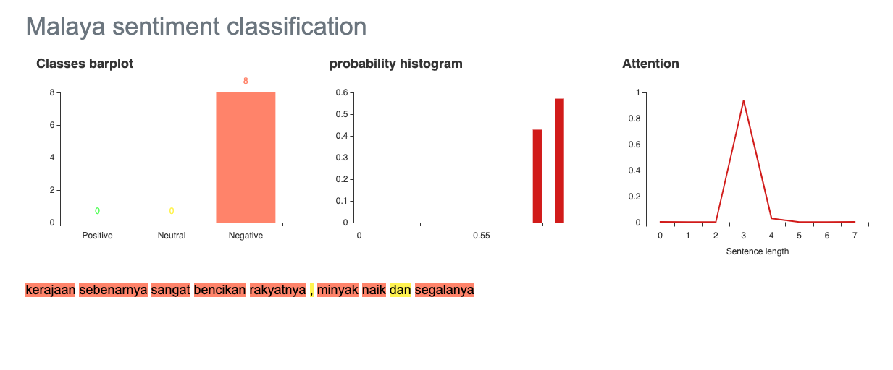
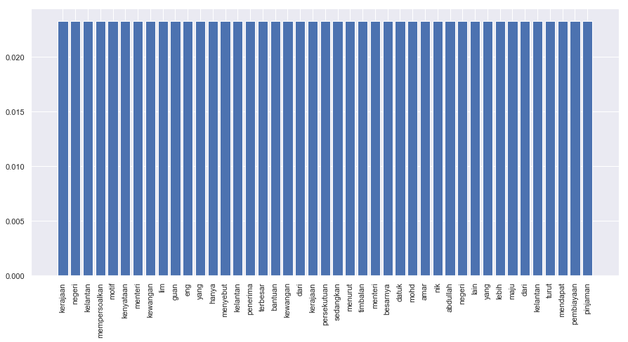
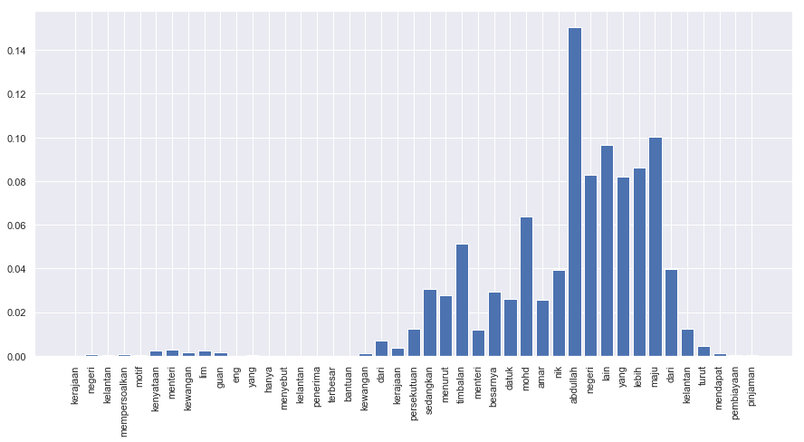

.. code:: ipython3

    import malaya

.. code:: ipython3

    positive_text = 'Kerajaan negeri Kelantan mempersoalkan motif kenyataan Menteri Kewangan Lim Guan Eng yang hanya menyebut Kelantan penerima terbesar bantuan kewangan dari Kerajaan Persekutuan. Sedangkan menurut Timbalan Menteri Besarnya, Datuk Mohd Amar Nik Abdullah, negeri lain yang lebih maju dari Kelantan turut mendapat pembiayaan dan pinjaman.'
    negative_text = 'kerajaan sebenarnya sangat bencikan rakyatnya, minyak naik dan segalanya'

Load multinomial model
----------------------

.. code:: ipython3

    model = malaya.sentiment.multinomial()
    print(model.predict(positive_text,get_proba=True))
    print(model.predict(negative_text,get_proba=True))
    model.predict_batch([negative_text,negative_text],get_proba=True)

.. parsed-literal::

    {'negative': 0.27780816431771815, 'positive': 0.7221918356822792}
    {'negative': 0.4230539695981826, 'positive': 0.5769460304018175}

.. parsed-literal::

    [{'negative': 0.4230539695981826, 'positive': 0.5769460304018175},
     {'negative': 0.4230539695981826, 'positive': 0.5769460304018175}]

Load xgb model
--------------

.. code:: ipython3

    model = malaya.sentiment.xgb()
    print(model.predict(positive_text,get_proba=True))
    print(model.predict(negative_text,get_proba=True))
    model.predict_batch([negative_text,negative_text],get_proba=True)

.. parsed-literal::

    {'negative': 0.44467238, 'positive': 0.5553276}
    {'negative': 0.47532737, 'positive': 0.5246726}

.. parsed-literal::

    [{'negative': 0.47532737, 'positive': 0.5246726},
     {'negative': 0.47532737, 'positive': 0.5246726}]

List available deep learning models
-----------------------------------

.. code:: ipython3

    malaya.sentiment.available_deep_model()

.. parsed-literal::

    ['fast-text',
     'hierarchical',
     'bahdanau',
     'luong',
     'bidirectional',
     'bert',
     'entity-network']

.. code:: ipython3

    for i in malaya.sentiment.available_deep_model():
        print('Testing %s model'%(i))
        model = malaya.sentiment.deep_model(i)
        print(model.predict(negative_text))
        print(model.predict_batch([negative_text, positive_text]))
        print()

.. parsed-literal::

    Testing fast-text model
    {'negative': 0.99185514, 'positive': 0.008144839}
    [{'negative': 0.8494132, 'positive': 0.15058675}, {'negative': 0.04582213, 'positive': 0.95417786}]
    
    Testing hierarchical model
    {'negative': 0.16548774, 'positive': 0.83451223, 'attention': [['kerajaan', 0.109089434], ['sebenarnya', 0.3137235], ['sangat', 0.2670205], ['bencikan', 0.24073339], ['rakyatnya', 0.05572654], ['minyak', 0.008767789], ['naik', 0.0037751873], ['segalanya', 0.0011636332]]}
    [{'negative': 0.08488519, 'positive': 0.9151148}, {'negative': 0.09536239, 'positive': 0.90463763}]
    
    Testing bahdanau model
    {'negative': 0.27857047, 'positive': 0.7214295, 'attention': [['kerajaan', 0.1346821], ['sebenarnya', 0.023742322], ['sangat', 0.03039956], ['bencikan', 0.6389645], ['rakyatnya', 0.048371714], ['minyak', 0.035900667], ['naik', 0.05980329], ['segalanya', 0.02813588]]}
    [{'negative': 0.48411715, 'positive': 0.5158828}, {'negative': 0.31343234, 'positive': 0.6865676}]
    
    Testing luong model
    {'negative': 0.7480302, 'positive': 0.2519698, 'attention': [['kerajaan', 0.13574807], ['sebenarnya', 0.09609673], ['sangat', 0.06295505], ['bencikan', 0.09375848], ['rakyatnya', 0.093516305], ['minyak', 0.098614186], ['naik', 0.16901104], ['segalanya', 0.25030014]]}
    [{'negative': 0.9892952, 'positive': 0.010704841}, {'negative': 0.10066059, 'positive': 0.8993394}]
    
    Testing bidirectional model
    {'negative': 0.1094934, 'positive': 0.8905066}
    [{'negative': 0.2103564, 'positive': 0.7896436}, {'negative': 0.2552409, 'positive': 0.74475914}]
    
    Testing bert model
    {'negative': 0.992415, 'positive': 0.007585052}
    [{'negative': 0.992415, 'positive': 0.007585059}, {'negative': 0.9923813, 'positive': 0.0076187113}]
    
    Testing entity-network model
    {'negative': 0.5229405, 'positive': 0.4770595}
    [{'negative': 0.5229405, 'positive': 0.4770595}, {'negative': 0.6998231, 'positive': 0.3001769}]
    

Train a multinomial model using custom dataset
----------------------------------------------

.. code:: ipython3

    import pandas as pd

.. code:: ipython3

    df = pd.read_csv('tests/02032018.csv',sep=';')
    df = df.iloc[3:,1:]
    df.columns = ['text','label']
    corpus = df.text.tolist()

corpus should be [(text, label)]

.. code:: ipython3

    dataset = [[df.iloc[i,0],df.iloc[i,1]] for i in range(df.shape[0])]
    bayes = malaya.sentiment.train_multinomial(dataset)

.. parsed-literal::

                 precision    recall  f1-score   support
    
       Negative       0.00      0.00      0.00        13
        Neutral       0.67      0.12      0.21        16
       Positive       0.55      1.00      0.71        32
    
    avg / total       0.46      0.56      0.43        61
    

You also able to feed directory location
^^^^^^^^^^^^^^^^^^^^^^^^^^^^^^^^^^^^^^^^

::

   directory
       |
       |- adidas
       |- apple
       |- hungry

.. code:: ipython3

    bayes = malaya.sentiment.train_multinomial('tests/local')

.. parsed-literal::

                 precision    recall  f1-score   support
    
         adidas       0.96      0.61      0.74       319
          apple       0.97      0.59      0.73       448
         hungry       0.78      0.92      0.84      1081
       kerajaan       0.85      0.83      0.84      1379
           nike       0.95      0.48      0.64       335
    pembangkang       0.71      0.85      0.78      1497
    
    avg / total       0.82      0.80      0.79      5059
    

.. code:: ipython3

    bayes.predict('saya suka kerajaan dan anwar ibrahim', get_proba = True)

.. parsed-literal::

    {'adidas': 0.0005316133415573243,
     'apple': 0.0006248454476189618,
     'hungry': 0.009494739464502444,
     'kerajaan': 0.0773079001887801,
     'nike': 0.0005656482161409733,
     'pembangkang': 0.9114752533414014}

Train a multinomial using skip-gram vectorization
^^^^^^^^^^^^^^^^^^^^^^^^^^^^^^^^^^^^^^^^^^^^^^^^^

.. code:: ipython3

    bayes = malaya.sentiment.train_multinomial(
        'tests/local', vector = 'skip-gram', ngram_range = (1, 3), skip = 5
    )

.. parsed-literal::

                 precision    recall  f1-score   support
    
         adidas       0.37      0.82      0.51       330
          apple       0.50      0.90      0.64       484
         hungry       0.82      0.94      0.88      1028
       kerajaan       0.90      0.60      0.72      1404
           nike       0.59      0.80      0.68       312
    pembangkang       0.88      0.53      0.66      1501
    
    avg / total       0.78      0.71      0.71      5059
    

.. code:: ipython3

    bayes.predict('saya suka kerajaan dan anwar ibrahim', get_proba = True)

.. parsed-literal::

    {'adidas': 9.851832247652223e-14,
     'apple': 3.1811421800860636e-14,
     'hungry': 4.87301131586436e-10,
     'kerajaan': 5.936421621648095e-07,
     'nike': 9.654000712770611e-14,
     'pembangkang': 0.9999994058703183}

Unsupervised important words learning
-------------------------------------

.. code:: ipython3

    import matplotlib.pyplot as plt
    import seaborn as sns
    sns.set() # i just really like seaborn colors

Visualizing bahdanau model
^^^^^^^^^^^^^^^^^^^^^^^^^^

.. code:: ipython3

    model = malaya.sentiment.deep_model('bahdanau')
    result = model.predict(positive_text)['attention']
    
    plt.figure(figsize = (15, 7))
    labels = [r[0] for r in result]
    val = [r[1] for r in result]
    aranged = [i for i in range(len(labels))]
    plt.bar(aranged, val)
    plt.xticks(aranged, labels, rotation = 'vertical')
    plt.show()

Visualizing luong model
^^^^^^^^^^^^^^^^^^^^^^^

.. code:: ipython3

    model = malaya.sentiment.deep_model('luong')
    result = model.predict(positive_text)['attention']
    
    plt.figure(figsize = (15, 7))
    labels = [r[0] for r in result]
    val = [r[1] for r in result]
    aranged = [i for i in range(len(labels))]
    plt.bar(aranged, val)
    plt.xticks(aranged, labels, rotation = 'vertical')
    plt.show()

Visualizing hierarchical model
^^^^^^^^^^^^^^^^^^^^^^^^^^^^^^

.. code:: ipython3

    model = malaya.sentiment.deep_model('hierarchical')
    result = model.predict(positive_text)['attention']
    
    plt.figure(figsize = (15, 7))
    labels = [r[0] for r in result]
    val = [r[1] for r in result]
    aranged = [i for i in range(len(labels))]
    plt.bar(aranged, val)
    plt.xticks(aranged, labels, rotation = 'vertical')
    plt.show()

