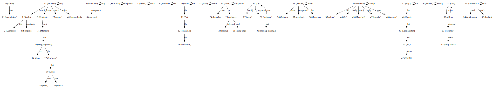

Why Stacking?
-------------

Sometime a single model is not good enough. So, you need to use multiple
models to get a better result! It called stacking.

.. code:: ipython3

    %%time
    import malaya

.. parsed-literal::

    CPU times: user 6.46 s, sys: 1.65 s, total: 8.11 s
    Wall time: 13.1 s

.. code:: ipython3

    albert = malaya.sentiment.transformer('albert')
    multinomial = malaya.sentiment.multinomial()
    bert = malaya.sentiment.transformer('bert')

.. parsed-literal::

    WARNING: Logging before flag parsing goes to stderr.
    W1018 00:55:00.259906 4631889344 deprecation_wrapper.py:119] From /Users/huseinzol/Documents/Malaya/malaya/_utils/_utils.py:68: The name tf.gfile.GFile is deprecated. Please use tf.io.gfile.GFile instead.
    
    W1018 00:55:00.263756 4631889344 deprecation_wrapper.py:119] From /Users/huseinzol/Documents/Malaya/malaya/_utils/_utils.py:69: The name tf.GraphDef is deprecated. Please use tf.compat.v1.GraphDef instead.
    
    W1018 00:55:04.845674 4631889344 deprecation_wrapper.py:119] From /Users/huseinzol/Documents/Malaya/malaya/_utils/_utils.py:64: The name tf.InteractiveSession is deprecated. Please use tf.compat.v1.InteractiveSession instead.
    

Stack multiple sentiment models
-------------------------------

``malaya.stack.predict_stack`` provide an easy stacking solution for
Malaya models. Well, not just for sentiment models, any classification
models can use ``malaya.stack.predict_stack``.

.. code:: python

   def predict_stack(models, text, mode = 'gmean'):
       """
       Stacking for predictive models.

       Parameters
       ----------
       models: list
           list of models
       text: str
           string to predict
       mode : str, optional (default='gmean')
           Model architecture supported. Allowed values:

           * ``'gmean'`` - geometrical mean
           * ``'hmean'`` - harmonic mean
           * ``'mean'`` - mean
           * ``'min'`` - min
           * ``'max'`` - max
           * ``'median'`` - Harrell-Davis median

       Returns
       -------
       result: dict
       """

.. code:: ipython3

    malaya.stack.predict_stack([albert, multinomial, bert],
                              'harga minyak tak menentu')

.. parsed-literal::

    [{'negative': 0.5924219508044609,
      'positive': 0.0008248967143827066,
      'neutral': 0.0816649405431678}]

Stack tagging models
--------------------

For tagging models, we use majority voting stacking. So you need to need
have more than 2 models to make it perfect, or else, it will pick
randomly from 2 models. ``malaya.stack.voting_stack`` provides easy
interface for this kind of stacking. **But only can use for Entites, POS
and Dependency Parsing recognition.**

.. code:: python

   def voting_stack(models, text):
       """
       Stacking for POS and Entities Recognition models.

       Parameters
       ----------
       models: list
           list of models
       text: str
           string to predict

       Returns
       -------
       result: list
       """

.. code:: ipython3

    string = 'KUALA LUMPUR: Sempena sambutan Aidilfitri minggu depan, Perdana Menteri Tun Dr Mahathir Mohamad dan Menteri Pengangkutan Anthony Loke Siew Fook menitipkan pesanan khas kepada orang ramai yang mahu pulang ke kampung halaman masing-masing. Dalam video pendek terbitan Jabatan Keselamatan Jalan Raya (JKJR) itu, Dr Mahathir menasihati mereka supaya berhenti berehat dan tidur sebentar  sekiranya mengantuk ketika memandu.'
    
    albert = malaya.pos.transformer('albert')
    bert = malaya.pos.transformer('bert')
    malaya.stack.voting_stack([albert, bert], string)

.. parsed-literal::

    [('Kuala', 'PROPN'),
     ('Lumpur:', 'PROPN'),
     ('Sempena', 'ADP'),
     ('sambutan', 'NOUN'),
     ('Aidilfitri', 'PROPN'),
     ('minggu', 'NOUN'),
     ('depan,', 'ADJ'),
     ('Perdana', 'PROPN'),
     ('Menteri', 'PROPN'),
     ('Tun', 'PROPN'),
     ('Dr', 'PROPN'),
     ('Mahathir', 'PROPN'),
     ('Mohamad', 'PROPN'),
     ('dan', 'CCONJ'),
     ('Menteri', 'PROPN'),
     ('Pengangkutan', 'PROPN'),
     ('Anthony', 'PROPN'),
     ('Loke', 'PROPN'),
     ('Siew', 'PROPN'),
     ('Fook', 'PROPN'),
     ('menitipkan', 'VERB'),
     ('pesanan', 'NOUN'),
     ('khas', 'ADJ'),
     ('kepada', 'ADP'),
     ('orang', 'NOUN'),
     ('ramai', 'ADJ'),
     ('yang', 'PRON'),
     ('mahu', 'ADV'),
     ('pulang', 'VERB'),
     ('ke', 'ADP'),
     ('kampung', 'NOUN'),
     ('halaman', 'NOUN'),
     ('masing-masing.', 'DET'),
     ('Dalam', 'ADP'),
     ('video', 'NOUN'),
     ('pendek', 'ADJ'),
     ('terbitan', 'NOUN'),
     ('Jabatan', 'PROPN'),
     ('Keselamatan', 'PROPN'),
     ('Jalan', 'PROPN'),
     ('Raya', 'PROPN'),
     ('(JKJR)', 'PUNCT'),
     ('itu,', 'DET'),
     ('Dr', 'PROPN'),
     ('Mahathir', 'PROPN'),
     ('menasihati', 'VERB'),
     ('mereka', 'PRON'),
     ('supaya', 'SCONJ'),
     ('berhenti', 'VERB'),
     ('berehat', 'VERB'),
     ('dan', 'CCONJ'),
     ('tidur', 'VERB'),
     ('sebentar', 'ADV'),
     ('sekiranya', 'SCONJ'),
     ('mengantuk', 'NOUN'),
     ('ketika', 'SCONJ'),
     ('memandu.', 'VERB')]

.. code:: ipython3

    string = 'KUALA LUMPUR: Sempena sambutan Aidilfitri minggu depan, Perdana Menteri Tun Dr Mahathir Mohamad dan Menteri Pengangkutan Anthony Loke Siew Fook menitipkan pesanan khas kepada orang ramai yang mahu pulang ke kampung halaman masing-masing. Dalam video pendek terbitan Jabatan Keselamatan Jalan Raya (JKJR) itu, Dr Mahathir menasihati mereka supaya berhenti berehat dan tidur sebentar  sekiranya mengantuk ketika memandu.'
    
    xlnet = malaya.dependency.transformer(model = 'xlnet')
    bert = malaya.dependency.transformer(model = 'bert')

.. parsed-literal::

    WARNING: Logging before flag parsing goes to stderr.
    W1018 01:10:28.652161 4692850112 deprecation_wrapper.py:119] From /Users/huseinzol/Documents/Malaya/malaya/_utils/_utils.py:68: The name tf.gfile.GFile is deprecated. Please use tf.io.gfile.GFile instead.
    
    W1018 01:10:28.656165 4692850112 deprecation_wrapper.py:119] From /Users/huseinzol/Documents/Malaya/malaya/_utils/_utils.py:69: The name tf.GraphDef is deprecated. Please use tf.compat.v1.GraphDef instead.
    
    W1018 01:10:33.700295 4692850112 deprecation_wrapper.py:119] From /Users/huseinzol/Documents/Malaya/malaya/_utils/_utils.py:64: The name tf.InteractiveSession is deprecated. Please use tf.compat.v1.InteractiveSession instead.
    

.. code:: ipython3

    tagging, indexing = malaya.stack.voting_stack([xlnet, xlnet, bert], string)
    malaya.dependency.dependency_graph(tagging, indexing).to_graphvis()

