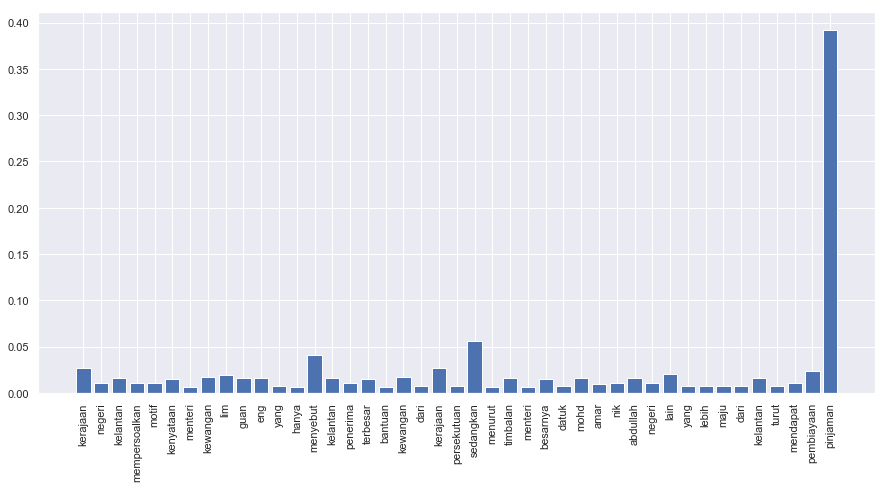
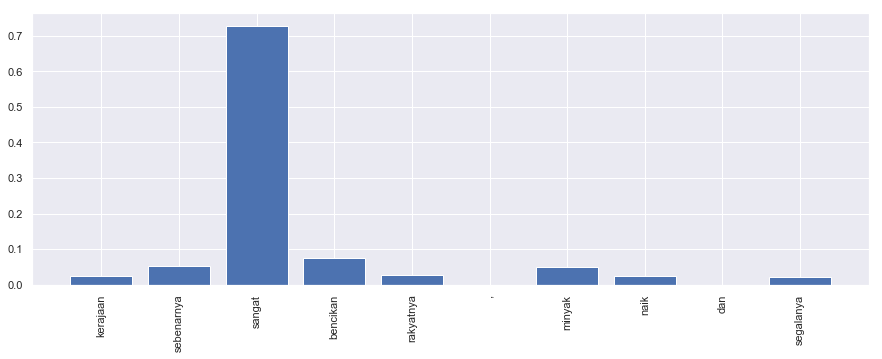

.. code:: ipython3

    %%time
    import malaya

.. parsed-literal::

    CPU times: user 12.4 s, sys: 1.4 s, total: 13.8 s
    Wall time: 17.2 s

Explanation
-----------

Positive subjectivity: based on or influenced by personal feelings,
tastes, or opinions. Can be a positive or negative sentiment.

Negative subjectivity: based on a report or a fact. Can be a positive or
negative sentiment.

.. code:: ipython3

    negative_text = 'Kerajaan negeri Kelantan mempersoalkan motif kenyataan Menteri Kewangan Lim Guan Eng yang hanya menyebut Kelantan penerima terbesar bantuan kewangan dari Kerajaan Persekutuan. Sedangkan menurut Timbalan Menteri Besarnya, Datuk Mohd Amar Nik Abdullah, negeri lain yang lebih maju dari Kelantan turut mendapat pembiayaan dan pinjaman.'
    positive_text = 'kerajaan sebenarnya sangat bencikan rakyatnya, minyak naik dan segalanya'

All models got ``get_proba`` parameters. If True, it will returned
probability every classes. Else, it will return highest probability
class. **Default is False.**

Load multinomial model
----------------------

.. code:: ipython3

    model = malaya.subjective.multinomial()
    print(model.predict(positive_text,get_proba=True))
    print(model.predict(negative_text,get_proba=True))
    model.predict_batch([negative_text,negative_text],get_proba=True)

.. parsed-literal::

    {'negative': 0.46203835811002486, 'positive': 0.5379616418899767}
    {'negative': 0.8607294776614423, 'positive': 0.13927052233855727}

.. parsed-literal::

    [{'negative': 0.8607294776614423, 'positive': 0.13927052233855727},
     {'negative': 0.8607294776614423, 'positive': 0.13927052233855727}]

Load xgb model
--------------

.. code:: ipython3

    model = malaya.subjective.xgb()
    print(model.predict(positive_text,get_proba=True))
    print(model.predict(negative_text,get_proba=True))
    model.predict_batch([negative_text,negative_text],get_proba=True)

.. parsed-literal::

    {'negative': 0.4284472, 'positive': 0.5715528}
    {'negative': 0.9249991, 'positive': 0.07500088}

.. parsed-literal::

    [{'negative': 0.9249991, 'positive': 0.07500088},
     {'negative': 0.9249991, 'positive': 0.07500088}]

List available deep learning models
-----------------------------------

.. code:: ipython3

    malaya.subjective.available_deep_model()

.. parsed-literal::

    ['fast-text',
     'hierarchical',
     'bahdanau',
     'luong',
     'bidirectional',
     'bert',
     'entity-network']

.. code:: ipython3

    for i in malaya.subjective.available_deep_model():
        print('Testing %s model'%(i))
        model = malaya.subjective.deep_model(i)
        print(model.predict(negative_text))
        print(model.predict_batch([negative_text, positive_text]))
        print(model.predict_batch([negative_text, positive_text],get_proba=True))
        print()

.. parsed-literal::

    Testing fast-text model
    negative
    ['negative', 'positive']
    [{'negative': 1.0, 'positive': 5.600171e-08}, {'negative': 0.25236478, 'positive': 0.74763525}]
    
    Testing hierarchical model
    negative
    ['negative', 'positive']
    [{'negative': 0.99999225, 'positive': 7.692454e-06}, {'negative': 0.29224393, 'positive': 0.70775604}]
    
    Testing bahdanau model
    negative
    ['negative', 'positive']
    [{'negative': 0.99998605, 'positive': 1.3971644e-05}, {'negative': 0.41739935, 'positive': 0.5826007}]
    
    Testing luong model
    positive
    ['positive', 'negative']
    [{'negative': 0.07556655, 'positive': 0.92443347}, {'negative': 0.96075815, 'positive': 0.039241895}]
    
    Testing bidirectional model
    negative
    ['negative', 'positive']
    [{'negative': 0.9999918, 'positive': 8.21179e-06}, {'negative': 0.046924926, 'positive': 0.95307505}]
    
    Testing bert model
    negative
    ['negative', 'negative']
    [{'negative': 0.98487025, 'positive': 0.015129704}, {'negative': 0.98668575, 'positive': 0.013314218}]
    
    Testing entity-network model
    negative
    ['negative', 'negative']
    [{'negative': 0.6470482, 'positive': 0.35295185}, {'negative': 0.65467215, 'positive': 0.34532788}]
    

Unsupervised important words learning
-------------------------------------

.. code:: ipython3

    import matplotlib.pyplot as plt
    import seaborn as sns
    sns.set() # i just really like seaborn colors

We need to set ``get_proba`` become True to get the ‘attention’.

Visualizing bahdanau model
^^^^^^^^^^^^^^^^^^^^^^^^^^

.. code:: ipython3

    model = malaya.subjective.deep_model('bahdanau')
    result = model.predict(negative_text, get_proba=True)['attention']
    
    plt.figure(figsize = (15, 7))
    labels = [r[0] for r in result]
    val = [r[1] for r in result]
    aranged = [i for i in range(len(labels))]
    plt.bar(aranged, val)
    plt.xticks(aranged, labels, rotation = 'vertical')
    plt.show()

Visualizing luong model
^^^^^^^^^^^^^^^^^^^^^^^

.. code:: ipython3

    model = malaya.subjective.deep_model('luong')
    result = model.predict(negative_text, get_proba=True)['attention']
    
    plt.figure(figsize = (15, 7))
    labels = [r[0] for r in result]
    val = [r[1] for r in result]
    aranged = [i for i in range(len(labels))]
    plt.bar(aranged, val)
    plt.xticks(aranged, labels, rotation = 'vertical')
    plt.show()

Visualizing hierarchical model
^^^^^^^^^^^^^^^^^^^^^^^^^^^^^^

.. code:: ipython3

    model = malaya.subjective.deep_model('hierarchical')
    result = model.predict(negative_text, get_proba=True)['attention']
    
    plt.figure(figsize = (15, 7))
    labels = [r[0] for r in result]
    val = [r[1] for r in result]
    aranged = [i for i in range(len(labels))]
    plt.bar(aranged, val)
    plt.xticks(aranged, labels, rotation = 'vertical')
    plt.show()

.. image:: load-subjectivity_files/load-subjectivity_19_0.png

Load Sparse deep learning models
--------------------------------

What happen if a word not included in the dictionary of the models? like
``setan``, what if ``setan`` appeared in text we want to classify? We
found this problem when classifying social media texts / posts. Words
used not really a vocabulary-based contextual.

Malaya will treat **unknown words** as ``<UNK>``, so, to solve this
problem, we need to use N-grams character based. Malaya chose tri-grams
until fifth-grams.

.. code:: python

   setan = ['set', 'eta', 'tan']

Sklearn provided easy interface to use n-grams, problem is, it is very
sparse, a lot of zeros and not memory efficient. Sklearn returned sparse
matrix for the result, lucky Tensorflow already provided some sparse
function.

.. code:: ipython3

    malaya.subjective.available_sparse_deep_model()

.. parsed-literal::

    ['fast-text-char']

Right now Malaya only provide 1 sparse model, ``fast-text-char``. We
will try to evolve it.

.. code:: ipython3

    sparse_model = malaya.subjective.sparse_deep_model()

.. parsed-literal::

    INFO:tensorflow:Restoring parameters from /Users/huseinzol/Malaya/subjective/fast-text-char/model.ckpt

.. code:: ipython3

    sparse_model.predict(positive_text)

.. parsed-literal::

    'positive'

.. code:: ipython3

    sparse_model.predict_batch([positive_text, negative_text])

.. parsed-literal::

    ['positive', 'negative']

.. code:: ipython3

    sparse_model.predict_batch([positive_text, negative_text], get_proba=True)

.. parsed-literal::

    [{'negative': 0.054842573, 'positive': 0.94515747},
     {'negative': 0.95071983, 'positive': 0.04928014}]

