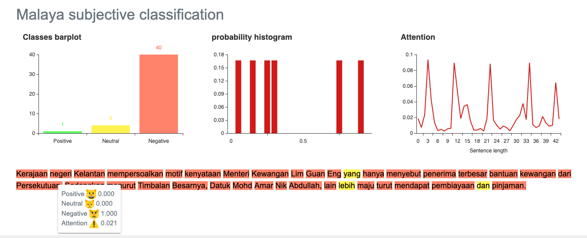

.. code:: ipython3

    %%time
    import malaya

.. parsed-literal::

    CPU times: user 5.88 s, sys: 1.7 s, total: 7.57 s
    Wall time: 13.5 s

Explanation
-----------

Positive subjectivity: based on or influenced by personal feelings,
tastes, or opinions. Can be a positive or negative sentiment.

Negative subjectivity: based on a report or a fact. Can be a positive or
negative sentiment.

.. code:: ipython3

    negative_text = 'Kerajaan negeri Kelantan mempersoalkan motif kenyataan Menteri Kewangan Lim Guan Eng yang hanya menyebut Kelantan penerima terbesar bantuan kewangan dari Kerajaan Persekutuan. Sedangkan menurut Timbalan Menteri Besarnya, Datuk Mohd Amar Nik Abdullah, negeri lain yang lebih maju dari Kelantan turut mendapat pembiayaan dan pinjaman.'
    positive_text = 'kerajaan sebenarnya sangat bencikan rakyatnya, minyak naik dan segalanya'

All models got ``get_proba`` parameters. If True, it will returned
probability every classes. Else, it will return highest probability
class. **Default is False.**

Load multinomial model
----------------------

.. code:: ipython3

    model = malaya.subjective.multinomial()
    print(model.predict(positive_text,get_proba=True))
    print(model.predict(negative_text,get_proba=True))
    model.predict_batch([negative_text,negative_text],get_proba=True)

.. parsed-literal::

    {'negative': 0.009240767162200498, 'positive': 0.0759232837799535, 'neutral': 0.914835949057846}
    {'negative': 0.7214589553228845, 'positive': 0.0027854104467711456, 'neutral': 0.2757556342303443}

.. parsed-literal::

    [{'negative': 0.7214589553228845,
      'positive': 0.0027854104467711456,
      'neutral': 0.2757556342303443},
     {'negative': 0.7214589553228845,
      'positive': 0.0027854104467711456,
      'neutral': 0.2757556342303443}]

Load xgb model
--------------

.. code:: ipython3

    model = malaya.subjective.xgb()
    print(model.predict(positive_text,get_proba=True))
    print(model.predict(negative_text,get_proba=True))
    model.predict_batch([negative_text,negative_text],get_proba=True)

.. parsed-literal::

    {'negative': 0.0085689435, 'positive': 0.14310563, 'neutral': 0.84832543}
    {'negative': 0.84999824, 'positive': 0.0015000176, 'neutral': 0.14850175}

.. parsed-literal::

    [{'negative': 0.84999824, 'positive': 0.0015000176, 'neutral': 0.14850175},
     {'negative': 0.84999824, 'positive': 0.0015000176, 'neutral': 0.14850175}]

BERT model
----------

BERT is the best subjectivity model in term of accuracy, you can check
subjectivity accuracy here,
https://malaya.readthedocs.io/en/latest/Accuracy.html#subjectivity-analysis.
Question is, why BERT?

1. Transformer model learn the context of a word based on all of its
   surroundings (live string), bidirectionally. So it much better
   understand left and right hand side relationships.
2. Because of transformer able to leverage to context during live
   string, we dont need to capture available words in this world,
   instead capture substrings and build the attention after that. BERT
   will never have Out-Of-Vocab problem.

List available BERT models
--------------------------

.. code:: ipython3

    malaya.subjective.available_bert_model()

.. parsed-literal::

    ['multilanguage', 'base', 'small']

Load BERT models
----------------

.. code:: ipython3

    model = malaya.subjective.bert(model = 'base')

.. parsed-literal::

      0%|          | 0.00/447 [00:00<?, ?MB/s]

.. parsed-literal::

    downloading frozen /Users/huseinzol/Malaya/subjective/base model

.. parsed-literal::

    447MB [01:18, 6.44MB/s]                          
    WARNING: Logging before flag parsing goes to stderr.
    W0807 18:18:17.930747 4529976768 deprecation_wrapper.py:119] From /Users/huseinzol/Documents/Malaya/malaya/_utils/_utils.py:45: The name tf.gfile.GFile is deprecated. Please use tf.io.gfile.GFile instead.
    
    W0807 18:18:17.931871 4529976768 deprecation_wrapper.py:119] From /Users/huseinzol/Documents/Malaya/malaya/_utils/_utils.py:46: The name tf.GraphDef is deprecated. Please use tf.compat.v1.GraphDef instead.
    
    W0807 18:18:24.135951 4529976768 deprecation_wrapper.py:119] From /Users/huseinzol/Documents/Malaya/malaya/_utils/_utils.py:41: The name tf.InteractiveSession is deprecated. Please use tf.compat.v1.InteractiveSession instead.
    

Predict single string
^^^^^^^^^^^^^^^^^^^^^

.. code:: ipython3

    model.predict(positive_text,get_proba=True)

.. parsed-literal::

    {'negative': 1.0, 'positive': 1.1824093e-10, 'neutral': 0.0}

Predict batch of strings
^^^^^^^^^^^^^^^^^^^^^^^^

.. code:: ipython3

    model.predict_batch([negative_text, positive_text],get_proba=True)

.. parsed-literal::

    [{'negative': 0.99999976, 'positive': 1.3250168e-09, 'neutral': 2.3841858e-07},
     {'negative': 1.0, 'positive': 3.137356e-10, 'neutral': 0.0}]

Open subjectivity visualization dashboard
^^^^^^^^^^^^^^^^^^^^^^^^^^^^^^^^^^^^^^^^^

Default when you call ``predict_words`` it will open a browser with
visualization dashboard, you can disable by ``visualization=False``.

.. code:: ipython3

    model.predict_words(negative_text)

.. code:: ipython3

    model.predict_words(negative_text)

.. parsed-literal::

    Serving to http://127.0.0.1:8889/    [Ctrl-C to exit]

.. parsed-literal::

    127.0.0.1 - - [07/Aug/2019 18:19:41] "GET / HTTP/1.1" 200 -
    127.0.0.1 - - [07/Aug/2019 18:19:41] "GET /static/admin-materialize.min.css HTTP/1.1" 200 -
    127.0.0.1 - - [07/Aug/2019 18:19:41] "GET /static/echarts.min.js HTTP/1.1" 200 -
    127.0.0.1 - - [07/Aug/2019 18:19:42] "GET /favicon.ico HTTP/1.1" 200 -
    ----------------------------------------
    Exception happened during processing of request from ('127.0.0.1', 52695)
    Traceback (most recent call last):
      File "/usr/local/Cellar/python/3.6.5_1/Frameworks/Python.framework/Versions/3.6/lib/python3.6/socketserver.py", line 317, in _handle_request_noblock
        self.process_request(request, client_address)
      File "/usr/local/Cellar/python/3.6.5_1/Frameworks/Python.framework/Versions/3.6/lib/python3.6/socketserver.py", line 348, in process_request
        self.finish_request(request, client_address)
      File "/usr/local/Cellar/python/3.6.5_1/Frameworks/Python.framework/Versions/3.6/lib/python3.6/socketserver.py", line 361, in finish_request
        self.RequestHandlerClass(request, client_address, self)
      File "/usr/local/Cellar/python/3.6.5_1/Frameworks/Python.framework/Versions/3.6/lib/python3.6/socketserver.py", line 696, in __init__
        self.handle()
      File "/usr/local/Cellar/python/3.6.5_1/Frameworks/Python.framework/Versions/3.6/lib/python3.6/http/server.py", line 418, in handle
        self.handle_one_request()
      File "/usr/local/Cellar/python/3.6.5_1/Frameworks/Python.framework/Versions/3.6/lib/python3.6/http/server.py", line 406, in handle_one_request
        method()
      File "/Users/huseinzol/Documents/Malaya/malaya/_utils/_server.py", line 32, in do_GET
        with open(filepath, 'rb') as fh:
    FileNotFoundError: [Errno 2] No such file or directory: '/Users/huseinzol/Documents/Malaya/malaya/_utils/web/favicon.ico'
    ----------------------------------------

.. parsed-literal::

    
    stopping Server...

List available deep learning models
-----------------------------------

.. code:: ipython3

    malaya.subjective.available_deep_model()

.. parsed-literal::

    ['self-attention', 'bahdanau', 'luong']

.. code:: ipython3

    from IPython.core.display import Image, display
    
    display(Image('bert-subjective.png', width=800))

Load deep learning models
-------------------------

Good thing about deep learning models from Malaya, it returns
``Attention`` result, means, which part of words give the high impact to
the results. But to get ``Attention``, you need to set
``get_proba=True``.

.. code:: ipython3

    import matplotlib.pyplot as plt
    import seaborn as sns
    sns.set()

Load bahdanau model
~~~~~~~~~~~~~~~~~~~

.. code:: ipython3

    model = malaya.subjective.deep_model('bahdanau')

Predict single string
^^^^^^^^^^^^^^^^^^^^^

.. code:: ipython3

    model.predict(positive_text)

.. parsed-literal::

    'neutral'

.. code:: ipython3

    result = model.predict(positive_text,get_proba=True,add_neutral=False)
    result

.. parsed-literal::

    {'negative': 0.42468444,
     'positive': 0.57531554,
     'attention': {'kerajaan': 0.02448606,
      'sebenarnya': 0.054138947,
      'sangat': 0.7235162,
      'bencikan': 0.075951874,
      'rakyatnya': 0.027106065,
      ',': 0.0,
      'minyak': 0.049579866,
      'naik': 0.02358539,
      'dan': 0.0,
      'segalanya': 0.021635499}}

.. code:: ipython3

    plt.figure(figsize = (15, 5))
    keys = result['attention'].keys()
    values = result['attention'].values()
    aranged = [i for i in range(len(keys))]
    plt.bar(aranged, values)
    plt.xticks(aranged, keys, rotation = 'vertical')
    plt.show()

.. image:: load-subjectivity_files/load-subjectivity_30_0.png

Open subjectivity visualization dashboard
^^^^^^^^^^^^^^^^^^^^^^^^^^^^^^^^^^^^^^^^^

Default when you call ``predict_words`` it will open a browser with
visualization dashboard, you can disable by ``visualization=False``.

.. code:: ipython3

    model.predict_words(negative_text)

.. code:: ipython3

    from IPython.core.display import Image, display
    
    display(Image('subjective-bahdanau.png', width=800))

.. image:: load-subjectivity_files/load-subjectivity_33_0.png
   :width: 800px

Predict batch of strings
^^^^^^^^^^^^^^^^^^^^^^^^

.. code:: ipython3

    model.predict_batch([negative_text, positive_text],get_proba=True)

.. parsed-literal::

    [{'negative': 0.6787287, 'positive': 0.0032127132, 'neutral': 0.3180586},
     {'negative': 0.0017332617, 'positive': 0.82667387, 'neutral': 0.17159289}]

**You might want to try ``luong`` and ``self-attention`` by yourself.**

Stacking models
---------------

More information, you can read at
https://malaya.readthedocs.io/en/latest/Stack.html

.. code:: ipython3

    multinomial = malaya.subjective.multinomial()
    xgb = malaya.subjective.xgb()
    bahdanau = malaya.subjective.deep_model('bahdanau')

.. code:: ipython3

    malaya.stack.predict_stack([multinomial, xgb, bahdanau], positive_text)

.. parsed-literal::

    [{'negative': 0.008404338614474443,
      'positive': 0.1395863910599889,
      'neutral': 0.8320294754572061}]

