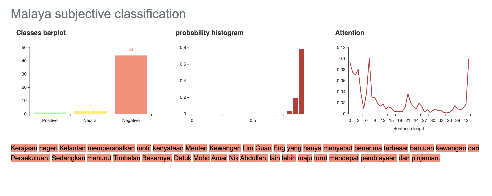

.. code:: ipython3

    %%time
    import malaya

.. parsed-literal::

    CPU times: user 4.96 s, sys: 1.23 s, total: 6.19 s
    Wall time: 7.33 s

Explanation
-----------

Positive subjectivity: based on or influenced by personal feelings,
tastes, or opinions. Can be a positive or negative sentiment.

Negative subjectivity: based on a report or a fact. Can be a positive or
negative sentiment.

.. code:: ipython3

    negative_text = 'Kerajaan negeri Kelantan mempersoalkan motif kenyataan Menteri Kewangan Lim Guan Eng yang hanya menyebut Kelantan penerima terbesar bantuan kewangan dari Kerajaan Persekutuan. Sedangkan menurut Timbalan Menteri Besarnya, Datuk Mohd Amar Nik Abdullah, negeri lain yang lebih maju dari Kelantan turut mendapat pembiayaan dan pinjaman.'
    positive_text = 'kerajaan sebenarnya sangat bencikan rakyatnya, minyak naik dan segalanya'

All models got ``get_proba`` parameters. If True, it will returned
probability every classes. Else, it will return highest probability
class. **Default is False.**

Load multinomial model
----------------------

.. code:: ipython3

    model = malaya.subjective.multinomial()
    model.predict_proba([positive_text,negative_text])

.. parsed-literal::

    [{'negative': 0.008413186333328921,
      'positive': 0.15868136666711186,
      'neutral': 0.8329054469995593},
     {'negative': 0.5812425768208322,
      'positive': 0.004187574231791736,
      'neutral': 0.41456984894737603}]

.. code:: ipython3

    model.predict_proba([positive_text,negative_text], add_neutral = False)

.. parsed-literal::

    [{'negative': 0.420659316666446, 'positive': 0.5793406833335559},
     {'negative': 0.7906212884104161, 'positive': 0.2093787115895868}]

List available Transformer models
---------------------------------

.. code:: ipython3

    malaya.subjective.available_transformer_model()

.. parsed-literal::

    {'bert': ['425.6 MB', 'accuracy: 0.916'],
     'tiny-bert': ['57.4 MB', 'accuracy: 0.903'],
     'albert': ['48.6 MB', 'accuracy: 0.903'],
     'tiny-albert': ['22.4 MB', 'accuracy: 0.894'],
     'xlnet': ['446.5 MB', 'accuracy: 0.917'],
     'alxlnet': ['46.8 MB', 'accuracy: 0.908']}

Make sure you can check accuracy chart from here first before select a
model,
https://malaya.readthedocs.io/en/latest/Accuracy.html#subjectivity-analysis

**You might want to use Tiny-Albert, a very small size, 22.4MB, but the
accuracy is still on the top notch.**

Load ALBERT model
-----------------

.. code:: ipython3

    model = malaya.subjective.transformer(model = 'albert')

.. parsed-literal::

    INFO:tensorflow:loading sentence piece model

Predict batch of strings
^^^^^^^^^^^^^^^^^^^^^^^^

.. code:: ipython3

    model.predict_proba([negative_text, positive_text])

.. parsed-literal::

    [{'negative': 0.9956738, 'positive': 4.326162e-05, 'neutral': 0.0042829514},
     {'negative': 0.9615872, 'positive': 0.00038412912, 'neutral': 0.038028657}]

Open subjectivity visualization dashboard
^^^^^^^^^^^^^^^^^^^^^^^^^^^^^^^^^^^^^^^^^

Default when you call ``predict_words`` it will open a browser with
visualization dashboard, you can disable by ``visualization=False``.

.. code:: ipython3

    model.predict_words(negative_text)

.. code:: ipython3

    from IPython.core.display import Image, display
    
    display(Image('subjective-dashboard.png', width=800))

Stacking models
---------------

More information, you can read at
https://malaya.readthedocs.io/en/latest/Stack.html

.. code:: ipython3

    multinomial = malaya.subjective.multinomial()
    alxlnet = malaya.subjective.transformer(model = 'alxlnet')

.. code:: ipython3

    malaya.stack.predict_stack([multinomial, model, alxlnet], [positive_text])

.. parsed-literal::

    [{'negative': 0.20034929559639789,
      'positive': 0.001535203515262801,
      'neutral': 0.05709727282942257}]

.. code:: ipython3

    malaya.stack.predict_stack([multinomial, model, alxlnet], [positive_text], add_neutral = False)

.. parsed-literal::

    [{'negative': 0.7426834424956867, 'positive': 0.04292000676029137}]

