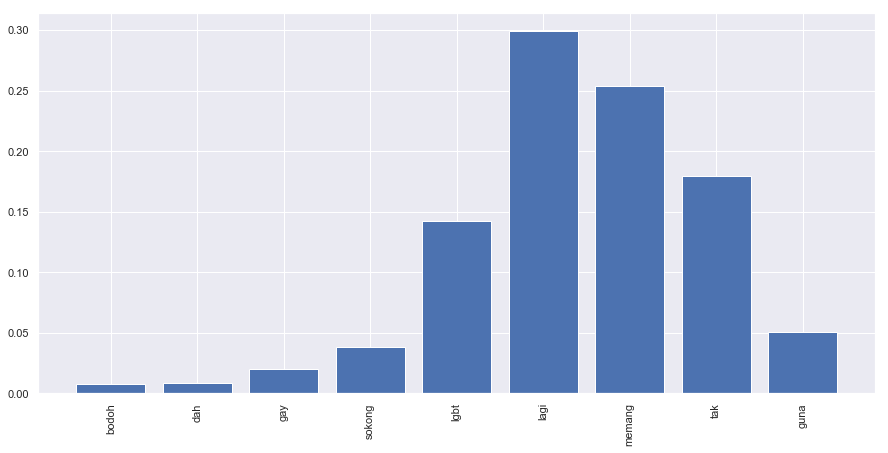

.. code:: ipython3

    %%time
    import malaya

.. parsed-literal::

    CPU times: user 11.8 s, sys: 1.53 s, total: 13.3 s
    Wall time: 17.3 s

.. code:: ipython3

    string = 'Benda yg SALAH ni, jgn lah didebatkan. Yg SALAH xkan jadi betul. Ingat tu. Mcm mana kesat sekalipun org sampaikan mesej, dan memang benda tu salah, diam je. Xyah nk tunjuk kau open sangat nk tegur cara org lain berdakwah. '
    another_string = 'bodoh, dah la gay, sokong lgbt lagi, memang tak guna'

All models got ``get_proba`` parameters. If True, it will returned
probability every classes. Else, it will return classes more than 0.5
probability. **Default is False.**

Load multinomial model
----------------------

.. code:: ipython3

    model = malaya.toxic.multinomial()

.. code:: ipython3

    model.predict(string)

.. parsed-literal::

    []

.. code:: ipython3

    model.predict(string,get_proba=True)

.. parsed-literal::

    {'toxic': 0.14165235977019472,
     'severe_toxic': 1.9272487152616215e-06,
     'obscene': 0.011323038998473341,
     'threat': 8.249039905334012e-08,
     'insult': 0.008620760536227347,
     'identity_hate': 4.703244329372946e-06}

.. code:: ipython3

    model.predict(another_string)

.. parsed-literal::

    ['toxic', 'insult']

.. code:: ipython3

    model.predict(another_string,get_proba=True)

.. parsed-literal::

    {'toxic': 0.97624511869432,
     'severe_toxic': 0.0004143925305717536,
     'obscene': 0.48936571876841484,
     'threat': 5.809081616106756e-06,
     'insult': 0.7853970362543069,
     'identity_hate': 0.002109806847753244}

.. code:: ipython3

    model.predict_batch([string,another_string])

.. parsed-literal::

    [[], ['toxic', 'insult']]

.. code:: ipython3

    model.predict_batch([string,another_string],get_proba=True)

.. parsed-literal::

    [{'toxic': 0.14165235977019472,
      'severe_toxic': 1.9272487152616215e-06,
      'obscene': 0.011323038998473341,
      'threat': 8.249039905334012e-08,
      'insult': 0.008620760536227347,
      'identity_hate': 4.703244329372946e-06},
     {'toxic': 0.97624511869432,
      'severe_toxic': 0.0004143925305717536,
      'obscene': 0.48936571876841484,
      'threat': 5.809081616106756e-06,
      'insult': 0.7853970362543069,
      'identity_hate': 0.002109806847753244}]

Load logistics model
--------------------

.. code:: ipython3

    model = malaya.toxic.logistic()

.. code:: ipython3

    model.predict(string)

.. parsed-literal::

    []

.. code:: ipython3

    model.predict_batch([string,another_string],get_proba=True)

.. parsed-literal::

    [{'toxic': 0.10299208923447233,
      'severe_toxic': 0.010195223990855215,
      'obscene': 0.04834509566263489,
      'threat': 0.003488478318883341,
      'insult': 0.04528784776538583,
      'identity_hate': 0.011326619000125776},
     {'toxic': 0.6297643126911581,
      'severe_toxic': 0.019551370640497476,
      'obscene': 0.1995748012804703,
      'threat': 0.004014463652898358,
      'insult': 0.3354069432946268,
      'identity_hate': 0.052626041879065236}]

List available deep learning models
-----------------------------------

.. code:: ipython3

    malaya.toxic.available_deep_model()

.. parsed-literal::

    ['self-attention', 'bahdanau', 'luong']

Load deep learning models
-------------------------

Good thing about deep learning models from Malaya, it returns
``Attention`` result, means, which part of words give the high impact to
the results. But to get ``Attention``, you need to set
``get_proba=True``.

.. code:: ipython3

    import matplotlib.pyplot as plt
    import seaborn as sns
    sns.set()

Load bahdanau model
~~~~~~~~~~~~~~~~~~~

.. code:: ipython3

    model = malaya.toxic.deep_model(model = 'bahdanau')

Predict single string
^^^^^^^^^^^^^^^^^^^^^

.. code:: ipython3

    model.predict(string)

.. parsed-literal::

    []

.. code:: ipython3

    result = model.predict(another_string, get_proba = True)
    result

.. parsed-literal::

    {'toxic': 0.72146016,
     'severe_toxic': 0.15249592,
     'obscene': 0.52586496,
     'threat': 0.080838725,
     'insult': 0.70660627,
     'identity_hate': 0.873813,
     'attention': {'bodoh': 0.10318489,
      ',': 0.0,
      'dah': 0.027627107,
      'la': 0.021338655,
      'gay': 0.49313048,
      'sokong': 0.06966582,
      'lgbt': 0.20966116,
      'lagi': 0.018240018,
      'memang': 0.022205882,
      'tak': 0.017513605,
      'guna': 0.01743243}}

.. code:: ipython3

    plt.figure(figsize = (15, 5))
    keys = result['attention'].keys()
    values = result['attention'].values()
    aranged = [i for i in range(len(keys))]
    plt.bar(aranged, values)
    plt.xticks(aranged, keys, rotation = 'vertical')
    plt.show()

.. image:: load-toxic_files/load-toxic_24_0.png

Open toxicity visualization dashboard
^^^^^^^^^^^^^^^^^^^^^^^^^^^^^^^^^^^^^

Default when you call ``predict_words`` it will open a browser with
visualization dashboard, you can disable by ``visualization=False``.

.. code:: ipython3

    model.predict_words(another_string)

.. parsed-literal::

    Serving to http://127.0.0.1:8889/    [Ctrl-C to exit]

.. parsed-literal::

    127.0.0.1 - - [09/Jun/2019 21:16:56] "GET / HTTP/1.1" 200 -
    127.0.0.1 - - [09/Jun/2019 21:16:56] "GET /static/admin-materialize.min.css HTTP/1.1" 200 -
    127.0.0.1 - - [09/Jun/2019 21:16:56] "GET /static/echarts.min.js HTTP/1.1" 200 -
    127.0.0.1 - - [09/Jun/2019 21:16:57] "GET /favicon.ico HTTP/1.1" 200 -
    ----------------------------------------
    Exception happened during processing of request from ('127.0.0.1', 62074)
    Traceback (most recent call last):
      File "/usr/local/Cellar/python/3.6.5_1/Frameworks/Python.framework/Versions/3.6/lib/python3.6/socketserver.py", line 317, in _handle_request_noblock
        self.process_request(request, client_address)
      File "/usr/local/Cellar/python/3.6.5_1/Frameworks/Python.framework/Versions/3.6/lib/python3.6/socketserver.py", line 348, in process_request
        self.finish_request(request, client_address)
      File "/usr/local/Cellar/python/3.6.5_1/Frameworks/Python.framework/Versions/3.6/lib/python3.6/socketserver.py", line 361, in finish_request
        self.RequestHandlerClass(request, client_address, self)
      File "/usr/local/Cellar/python/3.6.5_1/Frameworks/Python.framework/Versions/3.6/lib/python3.6/socketserver.py", line 696, in __init__
        self.handle()
      File "/usr/local/Cellar/python/3.6.5_1/Frameworks/Python.framework/Versions/3.6/lib/python3.6/http/server.py", line 418, in handle
        self.handle_one_request()
      File "/usr/local/Cellar/python/3.6.5_1/Frameworks/Python.framework/Versions/3.6/lib/python3.6/http/server.py", line 406, in handle_one_request
        method()
      File "/Users/huseinzol/Documents/Malaya/malaya/_utils/_server.py", line 32, in do_GET
        with open(filepath, 'rb') as fh:
    FileNotFoundError: [Errno 2] No such file or directory: '/Users/huseinzol/Documents/Malaya/malaya/_utils/web/favicon.ico'
    ----------------------------------------

.. parsed-literal::

    
    stopping Server...

.. code:: ipython3

    from IPython.core.display import Image, display
    
    display(Image('toxicity.png', width=800))

Predict batch of strings
^^^^^^^^^^^^^^^^^^^^^^^^

.. code:: ipython3

    model.predict_batch([string, another_string],get_proba=True)

.. parsed-literal::

    [{'toxic': 0.20031364,
      'severe_toxic': 0.02258549,
      'obscene': 0.10501574,
      'threat': 0.013459218,
      'insult': 0.10834239,
      'identity_hate': 0.043560036},
     {'toxic': 0.8950191,
      'severe_toxic': 0.14762068,
      'obscene': 0.4691061,
      'threat': 0.3425774,
      'insult': 0.7497996,
      'identity_hate': 0.92953944}]

**You might want to try ``luong`` and ``self-attention`` by yourself.**

BERT model
----------

BERT is the best toxicity model in term of accuracy, you can check
toxicity accuracy here,
https://malaya.readthedocs.io/en/latest/Accuracy.html#toxicity-analysis.
But warning, the model size is 700MB! Make sure you have enough
resources to use BERT, and installed ``bert-tensorflow`` first,

.. code:: bash

   pip3 install bert-tensorflow

.. code:: ipython3

    model = malaya.toxic.bert()

.. parsed-literal::

    downloading frozen /Users/huseinzol/Malaya/toxic/bert model

.. parsed-literal::

    679MB [03:35, 3.85MB/s]                          

.. code:: ipython3

    model.predict(another_string, get_proba = True)

.. parsed-literal::

    {'toxic': 0.9611515,
     'severe_toxic': 0.00046739998,
     'obscene': 0.11525511,
     'threat': 3.888399e-05,
     'insult': 0.9008593,
     'identity_hate': 0.0026886603}

.. code:: ipython3

    model.predict_batch([string, another_string], get_proba = True)

.. parsed-literal::

    [{'toxic': 0.9908935,
      'severe_toxic': 0.0015672365,
      'obscene': 0.04905731,
      'threat': 0.00017163585,
      'insult': 0.16307928,
      'identity_hate': 0.0068348516},
     {'toxic': 0.9102552,
      'severe_toxic': 0.0019921095,
      'obscene': 0.016692169,
      'threat': 0.00012219975,
      'insult': 0.81612825,
      'identity_hate': 0.15156291}]

Stacking models
---------------

More information, you can read at
https://malaya.readthedocs.io/en/latest/Stack.html

.. code:: ipython3

    multinomial = malaya.toxic.multinomial()
    logistics = malaya.toxic.logistic()
    bahdanau = malaya.toxic.deep_model('bahdanau')

.. code:: ipython3

    malaya.stack.predict_stack([multinomial, logistics, bahdanau], another_string)

.. parsed-literal::

    {'toxic': 0.7799483384789236,
     'severe_toxic': 0.012339557276675722,
     'obscene': 0.3809575356999082,
     'threat': 0.001341406650402849,
     'insult': 0.5918158556678792,
     'identity_hate': 0.04673038513607336}

Load Sparse deep learning models
--------------------------------

What happen if a word not included in the dictionary of the models? like
``setan``, what if ``setan`` appeared in text we want to classify? We
found this problem when classifying social media texts / posts. Words
used not really a vocabulary-based contextual.

Malaya will treat **unknown words** as ``<UNK>``, so, to solve this
problem, we need to use N-grams character based. Malaya chose tri-grams
until fifth-grams.

.. code:: python

   setan = ['set', 'eta', 'tan']

Sklearn provided easy interface to use n-grams, problem is, it is very
sparse, a lot of zeros and not memory efficient. Sklearn returned sparse
matrix for the result, lucky Tensorflow already provided some sparse
function.

.. code:: ipython3

    malaya.toxic.available_sparse_deep_model()

.. parsed-literal::

    ['fast-text-char']

Right now Malaya only provide 1 sparse model, ``fast-text-char``. We
will try to evolve it.

.. code:: ipython3

    sparse_model = malaya.toxic.sparse_deep_model()

.. parsed-literal::

    INFO:tensorflow:Restoring parameters from /Users/huseinzol/Malaya/toxic/fast-text-char/model.ckpt

.. code:: ipython3

    sparse_model.predict(string)

.. parsed-literal::

    []

.. code:: ipython3

    sparse_model.predict_batch([string, another_string])

.. parsed-literal::

    [[], ['toxic']]

.. code:: ipython3

    sparse_model.predict_batch([string, another_string], get_proba = True)

.. parsed-literal::

    [{'toxic': 0.09526734,
      'severe_toxic': 0.003521999,
      'obscene': 0.023459533,
      'threat': 0.0006645933,
      'insult': 0.022291547,
      'identity_hate': 0.0044483035},
     {'toxic': 0.9597362,
      'severe_toxic': 0.005366189,
      'obscene': 0.06367288,
      'threat': 0.0016838913,
      'insult': 0.39910555,
      'identity_hate': 0.033272624}]

