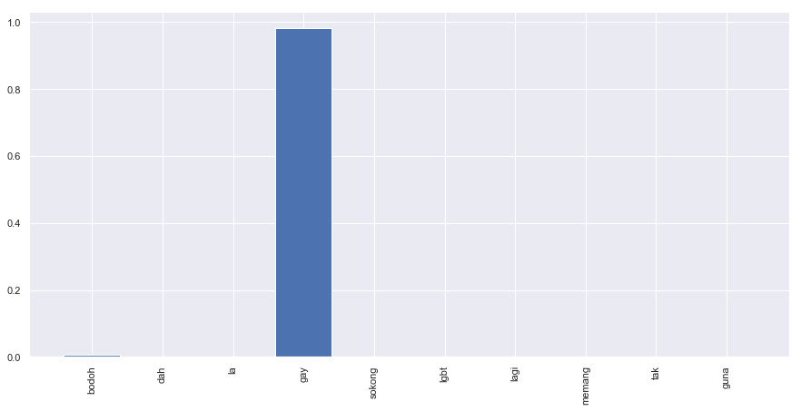

.. code:: ipython3

    %%time
    import malaya

.. parsed-literal::

    CPU times: user 6.54 s, sys: 1.51 s, total: 8.06 s
    Wall time: 12.2 s

.. code:: ipython3

    string = 'Benda yg SALAH ni, jgn lah didebatkan. Yg SALAH xkan jadi betul. Ingat tu. Mcm mana kesat sekalipun org sampaikan mesej, dan memang benda tu salah, diam je. Xyah nk tunjuk kau open sangat nk tegur cara org lain berdakwah. '
    another_string = 'bodoh, dah la gay, sokong lgbt lagi, memang tak guna'

All models got ``get_proba`` parameters. If True, it will returned
probability every classes. Else, it will return classes more than 0.5
probability. **Default is False.**

Load multinomial model
----------------------

.. code:: ipython3

    model = malaya.toxic.multinomial()

.. code:: ipython3

    model.predict(string)

.. parsed-literal::

    []

.. code:: ipython3

    model.predict(string,get_proba=True)

.. parsed-literal::

    {'toxic': 0.012484205667806636,
     'severe_toxic': 3.40611049184067e-05,
     'obscene': 0.0024767674127827524,
     'threat': 7.315819729905254e-06,
     'insult': 0.0014764693032968909,
     'identity_hate': 3.486130941396132e-05}

.. code:: ipython3

    model.predict(another_string)

.. parsed-literal::

    []

.. code:: ipython3

    model.predict(another_string,get_proba=True)

.. parsed-literal::

    {'toxic': 0.2124575765672004,
     'severe_toxic': 0.005042271594199945,
     'obscene': 0.06367370000210923,
     'threat': 0.0012906879267883594,
     'insult': 0.0578030070686466,
     'identity_hate': 0.007978673797459115}

.. code:: ipython3

    model.predict_batch([string,another_string])

.. parsed-literal::

    [[], []]

.. code:: ipython3

    model.predict_batch([string,another_string],get_proba=True)

.. parsed-literal::

    [{'toxic': 0.012484205667806636,
      'severe_toxic': 3.40611049184067e-05,
      'obscene': 0.0024767674127827524,
      'threat': 7.315819729905254e-06,
      'insult': 0.0014764693032968909,
      'identity_hate': 3.486130941396132e-05},
     {'toxic': 0.2124575765672004,
      'severe_toxic': 0.005042271594199945,
      'obscene': 0.06367370000210923,
      'threat': 0.0012906879267883594,
      'insult': 0.0578030070686466,
      'identity_hate': 0.007978673797459115}]

List available Transformer models
---------------------------------

.. code:: ipython3

    malaya.toxic.available_transformer_model()

.. parsed-literal::

    {'bert': ['base', 'small'], 'xlnet': ['base'], 'albert': ['base']}

Load BERT model
---------------

.. code:: ipython3

    model = malaya.toxic.transformer(model = 'bert', size = 'base')

.. parsed-literal::

    WARNING: Logging before flag parsing goes to stderr.
    W1018 00:50:39.522170 4377699776 deprecation_wrapper.py:119] From /Users/huseinzol/Documents/Malaya/malaya/_utils/_utils.py:68: The name tf.gfile.GFile is deprecated. Please use tf.io.gfile.GFile instead.
    
    W1018 00:50:39.528988 4377699776 deprecation_wrapper.py:119] From /Users/huseinzol/Documents/Malaya/malaya/_utils/_utils.py:69: The name tf.GraphDef is deprecated. Please use tf.compat.v1.GraphDef instead.
    
    W1018 00:50:46.064629 4377699776 deprecation_wrapper.py:119] From /Users/huseinzol/Documents/Malaya/malaya/_utils/_utils.py:64: The name tf.InteractiveSession is deprecated. Please use tf.compat.v1.InteractiveSession instead.
    

Predict single string
^^^^^^^^^^^^^^^^^^^^^

.. code:: ipython3

    model.predict(string, get_proba=True)

.. parsed-literal::

    {'toxic': 0.7668859,
     'severe_toxic': 0.005910158,
     'obscene': 0.9025006,
     'threat': 0.00033624057,
     'insult': 0.017683616,
     'identity_hate': 0.0017774565}

Predict batch of strings
^^^^^^^^^^^^^^^^^^^^^^^^

.. code:: ipython3

    model.predict_batch([string,another_string],get_proba=True)

.. parsed-literal::

    [{'toxic': 0.9515474,
      'severe_toxic': 0.005410731,
      'obscene': 0.79223156,
      'threat': 0.0001553595,
      'insult': 0.1047779,
      'identity_hate': 0.00068616867},
     {'toxic': 0.9884213,
      'severe_toxic': 0.018587202,
      'obscene': 0.69366306,
      'threat': 0.0004096204,
      'insult': 0.6053996,
      'identity_hate': 0.8920966}]

Open emotion visualization dashboard
^^^^^^^^^^^^^^^^^^^^^^^^^^^^^^^^^^^^

Default when you call ``predict_words`` it will open a browser with
visualization dashboard, you can disable by ``visualization=False``.

.. code:: ipython3

    model.predict_words(another_string)

.. code:: ipython3

    from IPython.core.display import Image, display
    
    display(Image('bert-toxic.png', width=800))

Stacking models
---------------

More information, you can read at
https://malaya.readthedocs.io/en/latest/Stack.html

.. code:: ipython3

    albert = malaya.toxic.transformer(model = 'albert', size = 'base')

.. code:: ipython3

    malaya.stack.predict_stack([model, albert], another_string)

.. parsed-literal::

    [{'toxic': 0.9786964,
      'severe_toxic': 0.12929387,
      'obscene': 0.7359074,
      'threat': 0.0023469785,
      'insult': 0.7357025,
      'identity_hate': 0.7726631}]

