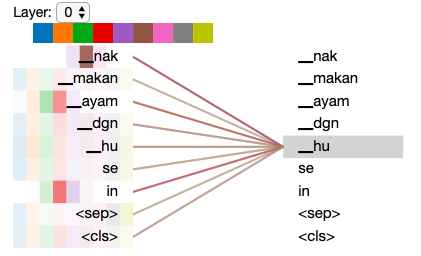

Malaya provided basic interface for XLNET, specific to Malay language,
we called it
`XLNET-Bahasa <https://github.com/huseinzol05/Malaya/tree/master/pretrained-model/xlnet>`__.
This interface not able us to use it to do custom training.

If you want to download pretrained model for
`XLNET-Bahasa <https://github.com/huseinzol05/Malaya/tree/master/pretrained-model/xlnet>`__
and use it for custom transfer-learning, you can download it here,
https://github.com/huseinzol05/Malaya/tree/master/pretrained-model/xlnet,
some notebooks to help you get started,

1. `Text
   classification <https://github.com/huseinzol05/Malaya/tree/master/pretrained-model/xlnet/finetune-subjectivity>`__.

Why XLNET
---------

1. Transformer model learn the context of a word based on all of its
   surroundings (live string), bidirectionally. So it much better
   understand left and right hand side relationships, plus permutation
   combination of the sentence to understand more about the context.
2. Because of transformer able to leverage to context during live
   string, we dont need to capture available words in this world,
   instead capture substrings and build the attention after that. XLNET
   will never have Out-Of-Vocab problem.
3. XLNET achieved new state-of-art for modern NLP and able to outperform
   BERT, you can read more about the benchmark
   `here <https://github.com/zihangdai/xlnet#results-on-reading-comprehension>`__.

.. code:: ipython3

    %%time
    import malaya

.. parsed-literal::

    CPU times: user 4.37 s, sys: 712 ms, total: 5.08 s
    Wall time: 5.16 s

list XLNET-Bahasa available
---------------------------

.. code:: ipython3

    malaya.xlnet.available_xlnet_model()

.. parsed-literal::

    ['base', 'small']

1. ``base`` is pretrained model size ``BASE`` trained on malay language,
   released by Malaya.
2. ``small`` is pretrained model size ``SMALL`` trained on malay
   language, released by Malaya.

load XLNET-Bahasa
-----------------

.. code:: ipython3

    %%time
    model = malaya.xlnet.xlnet(model = 'small')

.. parsed-literal::

    WARNING: Logging before flag parsing goes to stderr.
    W0908 23:11:15.799061 4630357440 deprecation_wrapper.py:119] From /Users/huseinzol/Documents/Malaya/malaya/_xlnet/xlnet.py:70: The name tf.gfile.Open is deprecated. Please use tf.io.gfile.GFile instead.
    
    W0908 23:11:15.802026 4630357440 deprecation_wrapper.py:119] From /Users/huseinzol/Documents/Malaya/malaya/xlnet.py:63: The name tf.placeholder is deprecated. Please use tf.compat.v1.placeholder instead.
    
    W0908 23:11:15.818391 4630357440 deprecation_wrapper.py:119] From /Users/huseinzol/Documents/Malaya/malaya/_xlnet/xlnet.py:253: The name tf.variable_scope is deprecated. Please use tf.compat.v1.variable_scope instead.
    
    W0908 23:11:15.819831 4630357440 deprecation_wrapper.py:119] From /Users/huseinzol/Documents/Malaya/malaya/_xlnet/xlnet.py:253: The name tf.AUTO_REUSE is deprecated. Please use tf.compat.v1.AUTO_REUSE instead.
    
    W0908 23:11:15.821245 4630357440 deprecation_wrapper.py:119] From /Users/huseinzol/Documents/Malaya/malaya/_xlnet/modeling.py:686: The name tf.logging.info is deprecated. Please use tf.compat.v1.logging.info instead.
    
    W0908 23:11:15.823981 4630357440 deprecation_wrapper.py:119] From /Users/huseinzol/Documents/Malaya/malaya/_xlnet/modeling.py:693: The name tf.get_variable is deprecated. Please use tf.compat.v1.get_variable instead.
    
    W0908 23:11:15.932384 4630357440 deprecation.py:323] From /Users/huseinzol/Documents/Malaya/malaya/_xlnet/modeling.py:797: dropout (from tensorflow.python.layers.core) is deprecated and will be removed in a future version.
    Instructions for updating:
    Use keras.layers.dropout instead.
    W0908 23:11:16.849392 4630357440 deprecation.py:323] From /Users/huseinzol/Documents/Malaya/malaya/_xlnet/modeling.py:99: dense (from tensorflow.python.layers.core) is deprecated and will be removed in a future version.
    Instructions for updating:
    Use keras.layers.dense instead.
    W0908 23:11:20.723573 4630357440 deprecation_wrapper.py:119] From /Users/huseinzol/Documents/Malaya/malaya/xlnet.py:76: The name tf.InteractiveSession is deprecated. Please use tf.compat.v1.InteractiveSession instead.
    
    W0908 23:11:21.121434 4630357440 deprecation_wrapper.py:119] From /Users/huseinzol/Documents/Malaya/malaya/xlnet.py:82: The name tf.train.Saver is deprecated. Please use tf.compat.v1.train.Saver instead.
    
    W0908 23:11:21.340023 4630357440 deprecation.py:323] From /usr/local/lib/python3.6/site-packages/tensorflow/python/training/saver.py:1276: checkpoint_exists (from tensorflow.python.training.checkpoint_management) is deprecated and will be removed in a future version.
    Instructions for updating:
    Use standard file APIs to check for files with this prefix.

.. parsed-literal::

    CPU times: user 5.93 s, sys: 323 ms, total: 6.26 s
    Wall time: 5.89 s

.. code:: ipython3

    strings = ['Kerajaan galakkan rakyat naik public transport tapi parking kat lrt ada 15. Reserved utk staff rapid je dah berpuluh. Park kereta tepi jalan kang kene saman dgn majlis perbandaran. Kereta pulak senang kene curi. Cctv pun tak ada. Naik grab dah 5-10 ringgit tiap hari. Gampang juga',
               'Alaa Tun lek ahhh npe muka masam cmni kn agong kata usaha kerajaan terdahulu sejak selepas merdeka',
               "Orang ramai cakap nurse kerajaan garang. So i tell u this. Most of our local ppl will treat us as hamba abdi and they don't respect us as a nurse"]

I have random sentences copied from Twitter, searched using ``kerajan``
keyword.

Vectorization
^^^^^^^^^^^^^

.. code:: ipython3

    v = model.vectorize(strings)
    v.shape

.. parsed-literal::

    (3, 256)

1. Vector size for ``base`` is 512.
2. Vector size for ``small`` is 256.

Attention
^^^^^^^^^

Attention is to get which part of the sentence give the impact. Method
available for attention,

-  ``'last'`` - attention from last layer.
-  ``'first'`` - attention from first layer.
-  ``'mean'`` - average attentions from all layers.

You can give list of strings or a string to get the attention, in this
documentation, I just want to use a string.

.. code:: ipython3

    model.attention(strings[1], method = 'last')

.. parsed-literal::

    [[('Alaa', 0.077287324),
      ('Tun', 0.0665905),
      ('lek', 0.044529967),
      ('ahhh', 0.040879223),
      ('npe', 0.035550922),
      ('muka', 0.0680149),
      ('masam', 0.03509437),
      ('cmni', 0.03123656),
      ('kn', 0.028147923),
      ('agong', 0.026431689),
      ('kata', 0.058385786),
      ('usaha', 0.096057795),
      ('kerajaan', 0.08207319),
      ('terdahulu', 0.052964784),
      ('sejak', 0.07779547),
      ('selepas', 0.08224628),
      ('merdeka', 0.096713334)]]

.. code:: ipython3

    model.attention(strings[1], method = 'first')

.. parsed-literal::

    [[('Alaa', 0.09790249),
      ('Tun', 0.058220048),
      ('lek', 0.05001517),
      ('ahhh', 0.053541776),
      ('npe', 0.0555464),
      ('muka', 0.05969282),
      ('masam', 0.050728858),
      ('cmni', 0.062063854),
      ('kn', 0.056284968),
      ('agong', 0.05986506),
      ('kata', 0.056449234),
      ('usaha', 0.05454071),
      ('kerajaan', 0.056504358),
      ('terdahulu', 0.057541814),
      ('sejak', 0.056898586),
      ('selepas', 0.05841198),
      ('merdeka', 0.055791855)]]

.. code:: ipython3

    model.attention(strings[1], method = 'mean')

.. parsed-literal::

    [[('Alaa', 0.06685554),
      ('Tun', 0.062696256),
      ('lek', 0.056500357),
      ('ahhh', 0.058129907),
      ('npe', 0.052592702),
      ('muka', 0.061767563),
      ('masam', 0.056151334),
      ('cmni', 0.071443655),
      ('kn', 0.054702092),
      ('agong', 0.06352139),
      ('kata', 0.055641796),
      ('usaha', 0.05706483),
      ('kerajaan', 0.059991475),
      ('terdahulu', 0.056703065),
      ('sejak', 0.055027008),
      ('selepas', 0.051567752),
      ('merdeka', 0.059643306)]]

Visualize Attention
^^^^^^^^^^^^^^^^^^^

Before using attention visualization, we need to load D3 into our
jupyter notebook first.

.. code:: javascript

    %%javascript
    require.config({
      paths: {
          d3: '//cdnjs.cloudflare.com/ajax/libs/d3/3.4.8/d3.min',
          jquery: '//ajax.googleapis.com/ajax/libs/jquery/2.0.0/jquery.min',
      }
    });

.. parsed-literal::

    <IPython.core.display.Javascript object>

.. code:: ipython3

    model.visualize_attention('nak makan ayam dgn husein')

.. raw:: html

    
              
                Layer: <select id="layer"></select>
              
              

            

.. parsed-literal::

    <IPython.core.display.Javascript object>

.. parsed-literal::

    <IPython.core.display.Javascript object>

.. code:: ipython3

    from IPython.core.display import Image, display
    
    display(Image('xlnet-attention.png', width=300))

