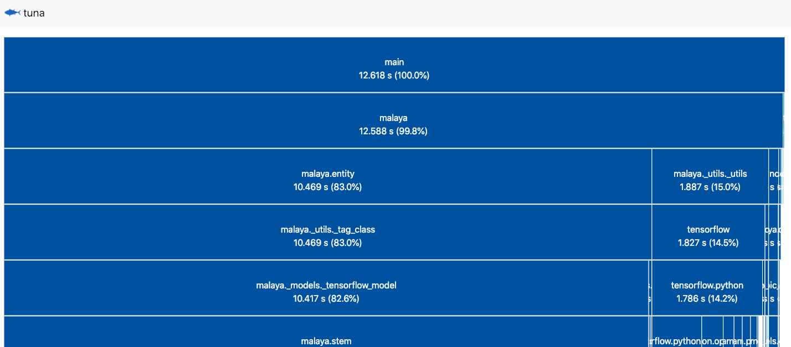
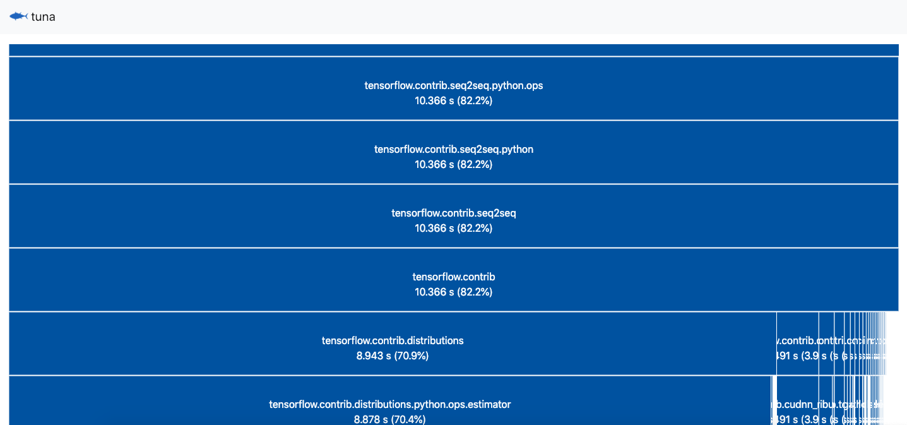

Malaya import time
------------------

I was wondering, why Malaya is so slow to import, it took me around 12
seconds for my macbook!

Below is my macbook specification. This is the laptop I use to code
Malaya.

.. code:: ipython3

    from IPython.core.display import Image, display
    
    display(Image('husein-macbook.png', width=500))

.. image:: malaya-slow-import_files/malaya-slow-import_2_0.png
   :width: 500px

I included `importtime.log <importtime.log>`__,

To reproduce same log, you need to use Python3.7 only. ``-X importtime``
only available on Python 3.7,

.. code:: bash

   python3.7 -X importtime -c "import malaya" 2> foobar.log

I found a library that can visualize `importtime <#>`__, it so cool, so
I try it out, it called `Tuna <https://github.com/nschloe/tuna>`__.

To install,

.. code:: bash

   pip install tuna

Using tuna
----------

It simple,

.. code:: bash

   tuna importtime.log

Then it will popup a browser,

.. code:: text

   Starting httpd on port 8000
   127.0.0.1 - - [06/Jan/2019 15:08:46] "GET / HTTP/1.1" 200 -
   127.0.0.1 - - [06/Jan/2019 15:08:46] "GET /static/tuna.css HTTP/1.1" 200 -
   127.0.0.1 - - [06/Jan/2019 15:08:46] "GET /static/bootstrap.min.css HTTP/1.1" 200 -
   127.0.0.1 - - [06/Jan/2019 15:08:46] "GET /static/favicon256.png HTTP/1.1" 200 -
   127.0.0.1 - - [06/Jan/2019 15:08:46] "GET /static/d3.v5.min.js HTTP/1.1" 200 -
   127.0.0.1 - - [06/Jan/2019 15:08:46] "GET /static/icicle.js HTTP/1.1" 200 -

.. code:: ipython3

    display(Image('main.png'))

Yep, 12.618 seconds. So which library give the impact to import time?

.. code:: ipython3

    display(Image('tensorflow.png'))

**Tensorflow. Took me around 11 seconds to import Tensorflow module.**

I don’t know exactly the reason, maybe I need to compare with non-mac
machine for the import time.
