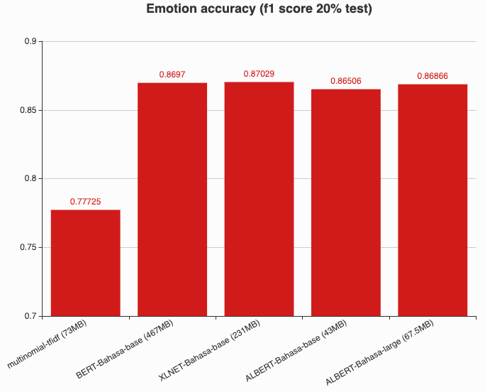
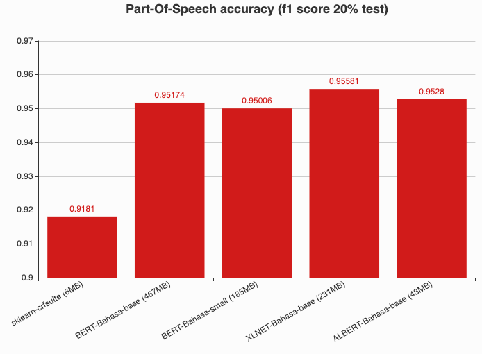

# ALBERT-brightmart-Bahasa

Thanks to brightmart for opensourcing most of the source code to develop ALBERT, https://github.com/brightmart/albert_zh. Malaya just create custom pretraining and optimizer to support multigpus.

## Table of contents
  * [Objective](#objective)
  * [Acknowledgement](#acknowledgement)
  * [How-to](#how-to)
  * [Download](#download)
  * [Comparison using Emotion Dataset](#comparison-using-emotion-dataset)
  * [Comparison using POS Dataset](#comparison-using-pos-dataset)
  * [Citation](#citation)
  * [Donation](#donation)

## Objective

1. There is no multilanguage implementation of ALBERT, and obviously no Bahasa Malaysia implemented. So we decided to train ALBERT from scratch and finetune using available dataset we have. [Dataset we use for pretraining](https://github.com/huseinzol05/Malaya-Dataset#dumping).

2. Provide **BASE** and **LARGE** ALBERT for Bahasa.

## Acknowledgement

Thanks to [Im Big](https://www.facebook.com/imbigofficial/), [LigBlou](https://www.facebook.com/ligblou), [Mesolitica](https://mesolitica.com/) and [KeyReply](https://www.keyreply.com/) for sponsoring AWS, Google and GPU clouds to train ALBERT for Bahasa.

## How-to

1. Create a folder and copy these python scripts,

```bash
mkdir albert
cd albert
cp modeling.py multigpu_pretraining.py optimization.py custom_optimization.py prepo_utils.py tokenization.py validation.py albert
```

2. Run [preprocess](../preprocess).

3. Create pretraining dataset,

```bash
python3 create-pretraining-data.py
```

4. Execute pretraining,

```bash
python3 multigpu_pretraining.py --input_file=albert-brightmart.tfrecord --output_dir=pretraining_output --do_train=True --do_eval=False --bert_config_file=albert_config/albert_config_base.json --train_batch_size=120 --max_seq_length=512 --max_predictions_per_seq=51 --masked_lm_prob=0.15 --num_train_steps=1000000 --num_warmup_steps=10 --learning_rate=2e-5 --save_checkpoints_steps=100000 --use_gpu=True --num_gpu_cores=3 --eval_batch_size=12
```

**ALBERT required multiGPUs or multiTPUs to pretrain. I never had successful pretraining on single GPU even on a small dataset.**

- `num_gpu_cores`: Number of gpus.
- `train_batch_size`: Make sure `train_batch_size` % `num_gpu_cores` is 0 and the batch will automatically distribute among gpus. If `num_gpu_cores` is 60 and `num_gpu_cores` is 2, so each gpus will get 30 batch size.

5. Execute validation,

```bash
python3 validation.py --input_file=tests_output.tfrecord --output_dir=pretraining_output --bert_config_file=albert_config_base.json --train_batch_size=60 --max_seq_length=512 --max_predictions_per_seq=51 --num_train_steps=1000000 --learning_rate=2e-5
```

```text
INFO:tensorflow:***** Eval results *****
I1007 22:35:07.644245 139954652473152 validation.py:605] ***** Eval results *****
INFO:tensorflow:  global_step = 300006
I1007 22:35:07.644339 139954652473152 validation.py:607]   global_step = 300006
INFO:tensorflow:  loss = 4.281704
I1007 22:35:07.644485 139954652473152 validation.py:607]   loss = 4.281704
INFO:tensorflow:  masked_lm_accuracy = 0.4212482
I1007 22:35:07.644579 139954652473152 validation.py:607]   masked_lm_accuracy = 0.4212482
INFO:tensorflow:  masked_lm_loss = 3.6995919
I1007 22:35:07.644659 139954652473152 validation.py:607]   masked_lm_loss = 3.6995919
INFO:tensorflow:  next_sentence_accuracy = 0.65125
I1007 22:35:07.644736 139954652473152 validation.py:607]   next_sentence_accuracy = 0.65125
INFO:tensorflow:  next_sentence_loss = 0.58434385
I1007 22:35:07.644812 139954652473152 validation.py:607]   next_sentence_loss = 0.58434385
```

## Download

1. **BASE**, last update 28th December 2019,
[albert-base-15-12-2019.tar.gz](https://huseinhouse-storage.s3-ap-southeast-1.amazonaws.com/bert-bahasa/albert-base-15-12-2019.tar.gz)

  - Vocab size 32k.
  - Trained on raw wikipedia, raw twitter, raw instagram, raw parliament, raw news.
  - 1.0M steps, 3 GPUs TESLA V100.
  - BASE size (52MB).

2. **LARGE**, last update 26th October 2019, [albert-large-28-12-2019.tar.gz](https://huseinhouse-storage.s3-ap-southeast-1.amazonaws.com/bert-bahasa/albert-large-28-12-2019.tar.gz)

  - Vocab size 32k.
  - Trained on raw wikipedia, raw twitter, raw instagram, raw parliament, raw news.
  - 1.0M steps, 3 GPUs TESLA V100.
  - LARGE size (78MB).

## Comparison using Emotion Dataset

Link to [emotion dataset](https://github.com/huseinzol05/Malaya-Dataset#emotion).

Link to [notebooks-base](transfer-learning-emotion-base.ipynb).

Link to [notebooks-large](transfer-learning-emotion-large.ipynb).



## Comparison using POS Dataset

Link to [POS dataset](https://github.com/huseinzol05/malaya-dataset#part-of-speech).



## Citation

1. Please citate the repository if use these checkpoints.

```
@misc{Malaya, Natural-Language-Toolkit library for bahasa Malaysia, powered by Deep Learning Tensorflow,
  author = {Husein, Zolkepli},
  title = {Malaya},
  year = {2018},
  publisher = {GitHub},
  journal = {GitHub repository},
  howpublished = {\url{https://github.com/huseinzol05/malaya}}
}
```

2. Please at least email us first before distributing these checkpoints. Remember all these hard workings we want to give it for free.
3. What do you see just the checkpoints, but nobody can see how much we spent our cost to make it public.

## Donation

<a href="https://www.patreon.com/bePatron?u=7291337"></a>

Or, One time donation without credit card hustle, **7053174643, CIMB Bank, Husein Zolkepli**
