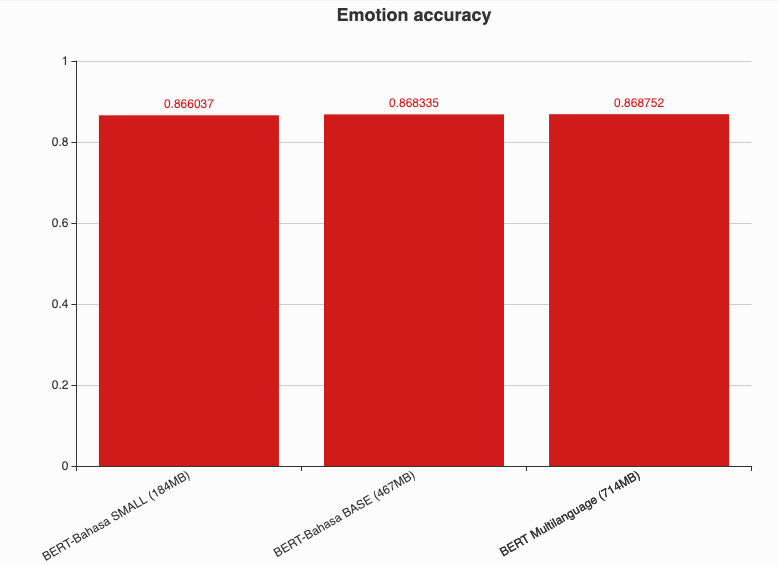

# BERT-Bahasa

Thanks to Google for opensourcing most of the source code to develop BERT, https://github.com/google-research/bert. Malaya just create custom pretraining and optimizer to support multigpus.

## Table of contents
  * [Objective](#objective)
  * [Acknowledgement](#acknowledgement)
  * [How-to](#how-to)
    * [Multigpus](#multigpus)
  * [Download](#download)
  * [Comparison using Emotion Dataset](#comparison-using-emotion-dataset)
  * [Citation](#citation)
  * [Donation](#donation)

## Objective

1. We saw tokenization process from original BERT Multilanguage is not really targeted to Malaysia language landscape, and pretrained provided only trained on Wikipedia dataset, no social media texts (bahasa pasar). So we decided to train BERT from scratch and finetune using available dataset we have. [Dataset we use for pretraining](https://github.com/huseinzol05/Malaya-Dataset#dumping).

2. Provide **SMALL** and **BASE** BERT for Bahasa.

## Acknowledgement

Thanks to [Im Big](https://www.facebook.com/imbigofficial/), [LigBlou](https://www.facebook.com/ligblou), [Mesolitica](https://mesolitica.com/) and [KeyReply](https://www.keyreply.com/) for sponsoring AWS, Google and GPU clouds to train BERT for Bahasa.

## How-to

1. Run [preprocess](../preprocess).

2. git clone https://github.com/google-research/bert, and,

```bash
git clone https://github.com/google-research/bert.git
cd bert
cp create-pretraining-data.py prepro_utils.py multigpu_pretraining.py custom_optimization.py
```

3. Create pretraining dataset,

```bash
python3 create-pretraining-data.py
```

4. Execute pretraining,

```bash
python3 multigpu_pretraining.py \
--input_file=bert-combined.tfrecord \
--output_dir=pretraining_output5 \
--do_train=True \
--do_eval=False \
--bert_config_file=BASE_config.json \
--train_batch_size=150 \
--max_seq_length=128 \
--max_predictions_per_seq=20 \
--num_train_steps=1000000 \
--num_warmup_steps=10 \
--learning_rate=2e-5 \
--save_checkpoints_steps=200000 \
--use_gpu=True \
--num_gpu_cores=3 \
--eval_batch_size=12
```

- `num_gpu_cores`: Number of gpus.
- `train_batch_size`: Make sure `train_batch_size` % `num_gpu_cores` is 0 and the batch will automatically distribute among gpus. If `num_gpu_cores` is 60 and `num_gpu_cores` is 2, so each gpus will get 30 batch size.

5. Execute validation,

```bash
python3 validation.py --input_file=tests_output.tfrecord --output_dir=pretraining_output --bert_config_file=bert_config.json --train_batch_size=50 --max_seq_length=128 --max_predictions_per_seq=20 --num_train_steps=3000000 --num_warmup_steps=10 --learning_rate=2e-5
```

```text
INFO:tensorflow:***** Eval results *****
I0910 11:20:31.561826 140220436277056 validation.py:595] ***** Eval results *****
INFO:tensorflow:  global_step = 480048
I0910 11:20:31.561924 140220436277056 validation.py:597]   global_step = 480048
INFO:tensorflow:  loss = 3.5268908
I0910 11:20:31.562081 140220436277056 validation.py:597]   loss = 3.5268908
INFO:tensorflow:  masked_lm_accuracy = 0.46958354
I0910 11:20:31.562179 140220436277056 validation.py:597]   masked_lm_accuracy = 0.46958354
INFO:tensorflow:  masked_lm_loss = 3.1709714
I0910 11:20:31.562261 140220436277056 validation.py:597]   masked_lm_loss = 3.1709714
INFO:tensorflow:  next_sentence_accuracy = 0.7625
I0910 11:20:31.562338 140220436277056 validation.py:597]   next_sentence_accuracy = 0.7625
INFO:tensorflow:  next_sentence_loss = 0.3507687
I0910 11:20:31.562414 140220436277056 validation.py:597]   next_sentence_loss = 0.3507687
```

## Download

1. **BASE**, last update 30th July 2019, [bert-bahasa-base.tar.gz](https://huseinhouse-storage.s3-ap-southeast-1.amazonaws.com/bert-bahasa/bert-bahasa-base.tar.gz) [Tensorboard data](https://huseinhouse-storage.s3-ap-southeast-1.amazonaws.com/bert-bahasa/bert-base-30-july-2019-tensorboard.instance-3)

  - Vocab size 40k.
  - Trained on cleaned wikipedia, raw twitter, raw instagram, raw parliament, raw news.
  - 1.5M steps, single GPU.
  - BASE size (467MB).

2. **SMALL**, last update 2nd August 2019,
[bert-bahasa-small.tar.gz](https://huseinhouse-storage.s3-ap-southeast-1.amazonaws.com/bert-bahasa/bert-bahasa-small.tar.gz) [Tensorboard data](https://huseinhouse-storage.s3-ap-southeast-1.amazonaws.com/bert-bahasa/events.out.tfevents.1564477991.instance-3)

  - Vocab size 40k.
  - Trained on cleaned wikipedia, raw twitter, raw instagram, raw parliament, raw news.
  - 1.5M steps, single GPU.
  - SMALL size (184MB).

3. **BASE**, last update 13th September 2019,
[bert-bahasa-base-13-9-2019.tar.gz](https://huseinhouse-storage.s3-ap-southeast-1.amazonaws.com/bert-bahasa/bert-base-13-9-2019.tar.gz)

  - Vocab size 40k.
  - Trained on raw wikipedia, raw twitter, raw instagram, raw parliament, raw news.
  - 1.0M steps, 3 GPUs TESLA V100.
  - BASE size (467MB).

```text
INFO:tensorflow:***** Eval results *****
I0913 04:02:36.334070 140621913737024 validation.py:595] ***** Eval results *****
INFO:tensorflow:  global_step = 1000002
I0913 04:02:36.334207 140621913737024 validation.py:597]   global_step = 1000002
INFO:tensorflow:  loss = 3.2660308
I0913 04:02:36.334458 140621913737024 validation.py:597]   loss = 3.2660308
INFO:tensorflow:  masked_lm_accuracy = 0.49669307
I0913 04:02:36.334600 140621913737024 validation.py:597]   masked_lm_accuracy = 0.49669307
INFO:tensorflow:  masked_lm_loss = 2.9214077
I0913 04:02:36.334724 140621913737024 validation.py:597]   masked_lm_loss = 2.9214077
INFO:tensorflow:  next_sentence_accuracy = 0.78
I0913 04:02:36.334844 140621913737024 validation.py:597]   next_sentence_accuracy = 0.78
INFO:tensorflow:  next_sentence_loss = 0.33995274
I0913 04:02:36.334962 140621913737024 validation.py:597]   next_sentence_loss = 0.33995274
```

4. **SMALL**, last update 19th September 2019,
[bert-small-19-9-2019.tar.gz](https://huseinhouse-storage.s3-ap-southeast-1.amazonaws.com/bert-bahasa/bert-small-19-9-2019.tar.gz)

  - Vocab size 40k.
  - Trained on raw wikipedia, raw twitter, raw instagram, raw parliament, raw news.
  - 1.0M steps, 3 GPUs.
  - SMALL size (184MB).

```text
INFO:tensorflow:***** Eval results *****
I0919 16:04:24.180380 139907485054784 validation.py:595] ***** Eval results *****
INFO:tensorflow:  global_step = 1000002
I0919 16:04:24.180476 139907485054784 validation.py:597]   global_step = 1000002
INFO:tensorflow:  loss = 3.6021976
I0919 16:04:24.180624 139907485054784 validation.py:597]   loss = 3.6021976
INFO:tensorflow:  masked_lm_accuracy = 0.45817283
I0919 16:04:24.180718 139907485054784 validation.py:597]   masked_lm_accuracy = 0.45817283
INFO:tensorflow:  masked_lm_loss = 3.2453835
I0919 16:04:24.180800 139907485054784 validation.py:597]   masked_lm_loss = 3.2453835
INFO:tensorflow:  next_sentence_accuracy = 0.76
I0919 16:04:24.180881 139907485054784 validation.py:597]   next_sentence_accuracy = 0.76
INFO:tensorflow:  next_sentence_loss = 0.35221446
I0919 16:04:24.180958 139907485054784 validation.py:597]   next_sentence_loss = 0.35221446
```

## Comparison using Emotion Dataset

Link to [emotion dataset](https://github.com/huseinzol05/Malaya-Dataset#emotion).

Link to [notebooks](transfer-learning-emotion-base.ipynb).



## Citation

1. Please citate the repository if use these checkpoints.

```
@misc{Malaya, Natural-Language-Toolkit library for bahasa Malaysia, powered by Deep Learning Tensorflow,
  author = {Husein, Zolkepli},
  title = {Malaya},
  year = {2018},
  publisher = {GitHub},
  journal = {GitHub repository},
  howpublished = {\url{https://github.com/huseinzol05/malaya}}
}
```

2. Please at least email us first before distributing these checkpoints. Remember all these hard workings we want to give it for free.
3. What do you see just the checkpoints, but nobody can see how much we spent our cost to make it public.

## Donation

<a href="https://www.patreon.com/bePatron?u=7291337"></a>

Or, One time donation without credit card hustle, **7053174643, CIMB Bank, Husein Zolkepli**
