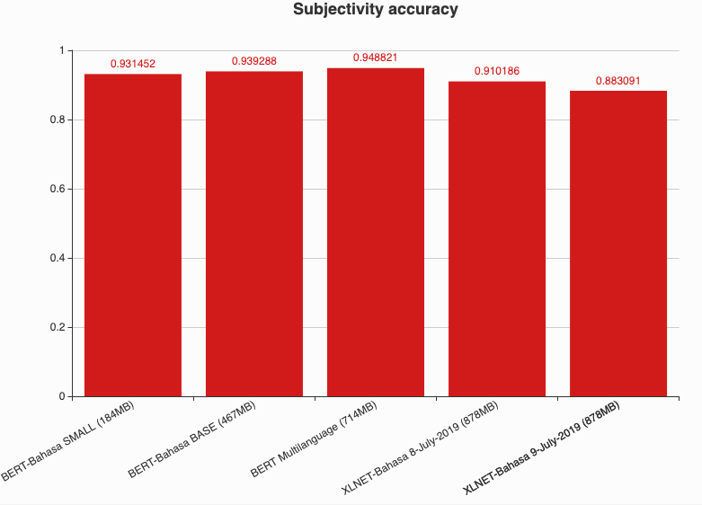
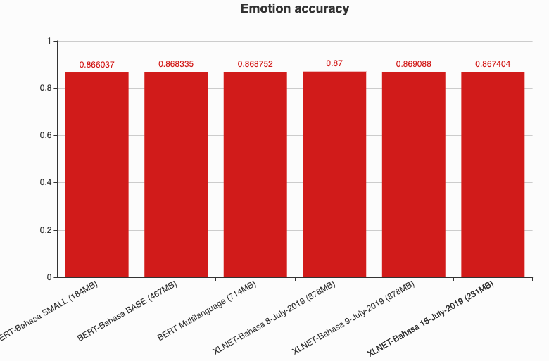

# XLNET-Bahasa

**_Last update 5-July-2019, release new pretrained checkpoint._**

Thanks to [zihangdai](https://github.com/zihangdai) for opensourcing XLNET, https://github.com/zihangdai/xlnet

## Table of contents
  * [Objective](https://github.com/huseinzol05/Malaya/tree/master/xlnet#objective)
  * [How-to](https://github.com/huseinzol05/Malaya/tree/master/xlnet#how-to)
  * [Download](https://github.com/huseinzol05/Malaya/tree/master/xlnet#download)
  * [Comparison using Subjectivity Dataset](https://github.com/huseinzol05/Malaya/tree/master/xlnet#comparison-using-subjectivity-dataset)
  * [Comparison using Emotion Dataset](https://github.com/huseinzol05/Malaya/tree/master/xlnet#comparison-using-emotion-dataset)
  * [Feedbacks](https://github.com/huseinzol05/Malaya/tree/master/xlnet#feedbacks)
  * [Citation](https://github.com/huseinzol05/Malaya/tree/master/xlnet#citation)
  * [Donation](https://github.com/huseinzol05/Malaya/tree/master/xlnet#donation)

## Objective

1. There is no multilanguage implementation of XLNET, and obviously no Bahasa Malaysia implemented. So we decided to train BERT from scratch and finetune using available dataset we have. [Dataset we use for pretraining](https://github.com/huseinzol05/Malaya-Dataset#dumping).

2. Provide **SMALL** and **BASE** XLNet for Bahasa. Sorry we cannot provide **LARGE** size, we got hardware limitation.

## How-to

1. Run [dumping.ipynb](dumping.ipynb) to create text dataset for pretraining.

2. Git clone [Sentence-Piece](https://github.com/google/sentencepiece),

```bash
git clone https://github.com/google/sentencepiece.git
```

3. Install [Sentence-Piece](https://github.com/google/sentencepiece),

On 23rd June 2019, we cannot use latest master to compile sentence-piece using bazel, after a few googled, we need to revert to some commit.

```bash
cd sentencepiece
git checkout d4dd947fe71c4fa4ee24ad8297beee32887d8828
mkdir build
cd build
cmake ..
make -j $(nproc)
sudo make install
sudo ldconfig -v
```

Make sure you tested to run `spm_train` to make sure everything is fine,

```bash
spm_train
```

```text
ERROR: --input must not be empty

sentencepiece

Usage: sentencepiece [options] files

   --accept_language (comma-separated list of languages this model can accept)  type: string  default:
   --add_dummy_prefix (Add dummy whitespace at the beginning of text)  type: bool  default: true
   --bos_id (Override BOS (<s>) id. Set -1 to disable BOS.)  type: int32  default: 1
   --bos_piece (Override BOS (<s>) piece.)  type: string  default: <s>
   --character_coverage (character coverage to determine the minimum symbols)  type: double  default: 0.9995
   --control_symbols (comma separated list of control symbols)  type: string  default:
   --eos_id (Override EOS (</s>) id. Set -1 to disable EOS.)  type: int32  default: 2
...
```

4. Create tokenizer using Sentence-Piece,

```bash
cd ../
spm_train \
--input=dumping-all.txt \
--model_prefix=sp10m.cased.v5 \
--vocab_size=32000 \
--character_coverage=0.99995 \
--model_type=unigram \
--control_symbols=\<cls\>,\<sep\>,\<pad\>,\<mask\>,\<eod\> \
--user_defined_symbols=\<eop\>,.,\(,\),\",-,–,£,€ \
--shuffle_input_sentence \
--input_sentence_size=10000000
```

5. Convert text files to tfrecord,

```bash
mkdir save-location
python3 data_utils.py \
  --bsz_per_host=4 \
  --seq_len=512 \
  --reuse_len=256 \
  --input_glob=dumping-all.txt \
  --save_dir=save-location \
  --num_passes=20 \
  --bi_data=True \
  --sp_path=sp10m.cased.v5.model \
  --mask_alpha=6 \
  --mask_beta=1 \
  --num_predict=85 \
  --num_core_per_host=1 \
  --uncased=False
```

6. Run pretained,

**BASE** size, we reduce the size of XLNET by 2 while maintain the number of attention, here is [original size](https://github.com/zihangdai/xlnet#pretraining-with-xlnet),
```bash
python3 train_gpu.py \
  --corpus_info_path=save-location/corpus_info.json \
  --record_info_dir=save-location/tfrecords \
  --train_batch_size=4 \
  --seq_len=512 \
  --reuse_len=256 \
  --mem_len=384 \
  --perm_size=256 \
  --n_layer=12 \
  --d_model=512 \
  --d_embed=512 \
  --n_head=16 \
  --d_head=64 \
  --d_inner=2048 \
  --untie_r=True \
  --mask_alpha=6 \
  --mask_beta=1 \
  --num_predict=85 \
  --model_dir=output-model \
  --uncased=False \
  --num_core_per_host=1 \
  --train_steps=700000  --iterations=10 --learning_rate=2.5e-5
```

**SMALL**,
```bash
python3 train_gpu.py \
  --corpus_info_path=save-location/corpus_info.json \
  --record_info_dir=save-location/tfrecords \
  --train_batch_size=4 \
  --seq_len=512 \
  --reuse_len=256 \
  --mem_len=384 \
  --perm_size=256 \
  --n_layer=6 \
  --d_model=256 \
  --d_embed=256 \
  --n_head=16 \
  --d_head=64 \
  --d_inner=1024 \
  --untie_r=True \
  --mask_alpha=6 \
  --mask_beta=1 \
  --num_predict=85 \
  --model_dir=output-model \
  --uncased=False \
  --num_core_per_host=1 \
  --train_steps=700000  --iterations=10 --learning_rate=2.5e-5
```

## Download

1.  8th July 2019, [xlnet-8-july-2019.tar.gz](https://huseinhouse-storage.s3-ap-southeast-1.amazonaws.com/bert-bahasa/xlnet-8-july-2019.tar.gz).

**Vocab size 32k, Case Insensitive, Train on 500MB dataset, BASE size (878MB)**.

2.  9th July 2019, [xlnet-9-july-2019.tar.gz](https://huseinhouse-storage.s3-ap-southeast-1.amazonaws.com/bert-bahasa/xlnet-9-july-2019.tar.gz).

**Vocab size 32k, Case Sensitive, Train on 1.21GB dataset, BASE size (878MB)**.


## Comparison using Subjectivity Dataset

Link to [subjectivity dataset](https://github.com/huseinzol05/Malaya-Dataset#subjectivity).

Link to [notebooks](finetune-subjectivity).



## Comparison using Emotion Dataset

Link to [emotion dataset](https://github.com/huseinzol05/Malaya-Dataset#emotion).

Link to [notebooks](finetune-emotion).



## Feedbacks

1. we will add comparison for abstractive summarization using ROUGE-2, but this may take sometime, because its a seq2seq model, encoder is XLNET, decoder is pointer generator.

2. Feel free to suggest me to add more any kind of finetune, like, QA, Neural Machine Translation and etc.

3. Some of models still on training, so you might want to keep check updates from here. Every tensorflow checkpoints will auto push to S3 and override.

## Citation

1. Please citate the repository if use these checkpoints.

```
@misc{Malaya-Dataset, We gather Bahasa Malaysia corpus! This repository to store corpus for Malaya,
  author = {Husein, Zolkepli},
  title = {Malaya-Dataset},
  year = {2018},
  publisher = {GitHub},
  journal = {GitHub repository},
  howpublished = {\url{https://github.com/huseinzol05/Malaya-Dataset}}
}
```

2. Please at least email us first before distributing these checkpoints. Remember all these hard workings we want to give it for free.
3. What do you see just the checkpoints, but nobody can see how much we spent our cost to make it public.

## Donation

<a href="https://www.patreon.com/bePatron?u=7291337"></a>

Or, One time donation without credit card hustle, **7053174643, CIMB Bank, Husein Zolkepli**
